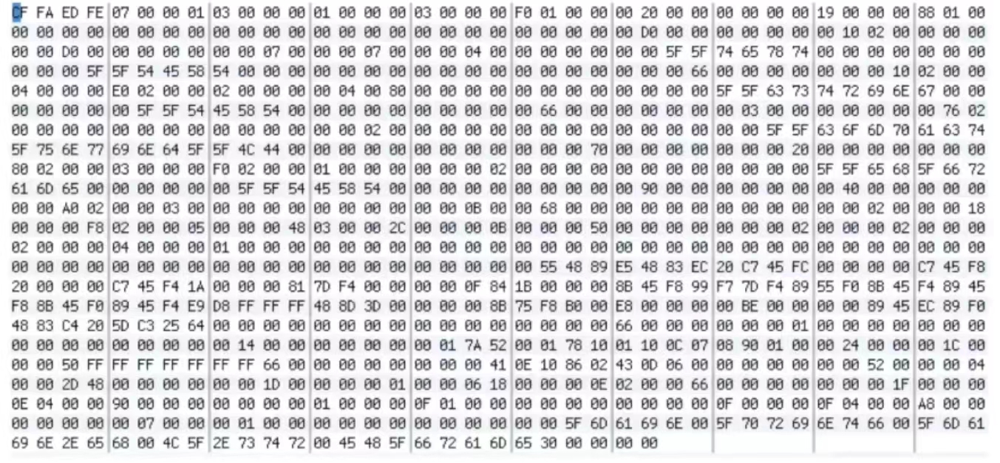
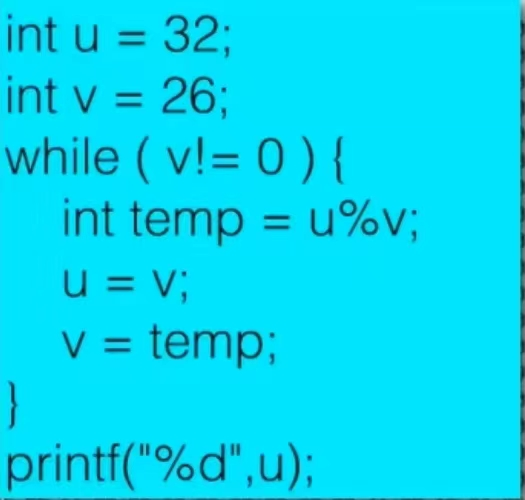
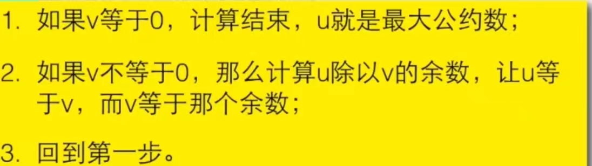
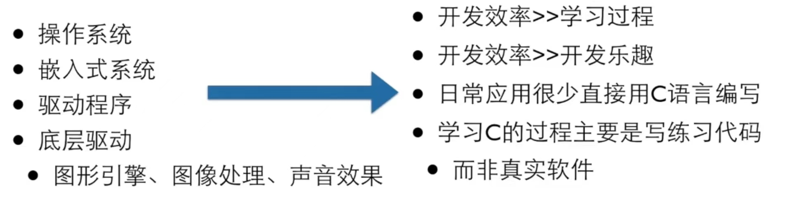

# 第零章、About

- 课程信息
  - :man_teacher: 翁凯 [浙江大学]


# 第一章

### 1 - 计算机和编程语言

**程序**

- 使用特殊的编程语言写出来表达如何解决问题的
- 编程语言不是用来和计算机交谈的，而是用来描述计算机如何做事情的过程和方法


**计算机 - 程序 - 算法**

- 计算机能懂的语言



- 程序员能懂的语言



- 大众能懂的语言




**计算&算法**

- 计算机做得所有事情都叫做 <span style="color: #e3371e; font-weight: 600">计算</span> 
- 计算的步骤就是 <span style="color: #e3371e; font-weight: 600">算法</span> 


### 2 - 计算机的思维方式

**程序的执行**

- **解释** 
  - 借助一个程序，能试图理解你，按照你的要求执行
- **编译** 
  - 借助一个程序，就像一个翻译，将你的程序翻译成计算机能懂的语言（机器语言）写得程序，然后，这个计算机写的程序就能直接执行了


**解释程序 vs 编译程序**

- 语言本无编译/解释之分
  - 一种语言 <span style="color: #0099dd">既能</span> 编译执行 <span style="color: #0099dd">也能</span> 解释执行
- 常用的执行方式而已
-  <span style="color: #49bf51; font-weight: 600">解释型语言</span> 有特殊的计算能力
-  <span style="color: #49bf51; font-weight: 600">编译型语言</span> 有确定的运算性能


### 3 - 为什么是C

**选择 C 的理由**

- 设计特性
  - 融合了计算机科学理论和实践的控制特性
  - 设计理念让用户轻松地完成自顶向下的规划、结构化编程和模块设计
  - 编写的程序更易懂、更可靠
- 高效性
  - 运行速度很快
  - 具有汇编语言才有的微调控制能力
  - 可根据具体情况微调程序以获得最大运行速度或有效地使用内存
- 可移植性
  - 在一种系统中编写的 C 程序稍作修改或不修改就能在其他系统运行
- 强大而灵活
- 面向程序员
  - 可利用 C 访问硬件、操作内存中的位
  - 利用丰富的运算符，简洁地表达自己的意图
  - 不像 Pascal 和 C++ 那样严格，具有灵活性（既是优点，亦是缺点）


**其他语言**

- 现代的编程语言在语法上的差异很小
  - 几乎都是 C-like 语言
- 语言的能力/适用领域主要是由
  - 库和
  - 传统所决定的


### 4 - C 的历史

> "it was the summer of '69'"

- C 语言是从 B 语言发展而来的
  - B语言是从 BCPL 发展而来的
  - BCPL 是从 FORTRAN 发展而来的
  - FORTRAN 是人类第一个高级程序设计语言
- BCPL 和 B 都支持指针间接方式，所以 C 也支持了
  -  <span style="color: #ab04d9; font-weight: 600">指针是C语音的灵魂</span> 
- C 语言还受到 PL/I 的影响，海河 PDP-11 的机器语言有很大的关系
- 1973年3月，第三版的 Unix 上出现了 C 语言的编译器
- 1973年11月，第四版的 Unix（System Four）发布了，这个版本完全用 C 语言重新写的


### 5 - C的语言标准

**经典C**（又称 "K&R the C"）

- 1978年，布莱恩·柯林汉（Brain Kernighan）和丹尼斯·里奇（Dennis Ritchie）合著的 *The C Programming Language* （《C 语言程序设计》）第一版是公认的 C 标准

**ANSI C**

- 1989年 ANSI （美国国家标准协会）发布了一个标准 —— ANSI C

- 1990年 ISO 接受了 ANSI 的标准 —— C89 | C90

**C99**

- 1995年和1999年两次更新 —— C95 和 C99

**C11**

- 2011年，发布了 C11 标准 —— C11


### 6 - 编程软件

**C 是一种工业语言**



**编译 -> 运行**

C 是编译型语言，需要被编译才能运行，因此，需要

- 编辑器 + 编译器
- or，IDE（集成开发环境）


**编程软件推荐**

- **Dev C++** 
  - 免费
  - 安装简单
  - 不用建工程
- **Visual Studio** 

- **Xcode** (Mac OS X)
- Eclispse-CDT
- Geany + MinGW
  - *Minimalist GNU for Windows*
- Sublime+ MinGW
- vim/emacs + MinGW


### 7 - 第一个 C 程序

```c
#include <stdio.h>

int main()
{
	/* 我的第一个 C 程序 */
	printf("Hello world! \n");
	
	return 0;
}
```


# 第二章、

### 变量


### 常量

**magic number**

- 出现在程序中莫名其妙的数字


### 函数

printf、scanf中的"f"，是"formatted"
