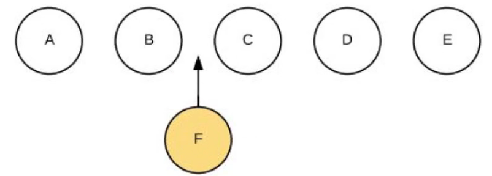
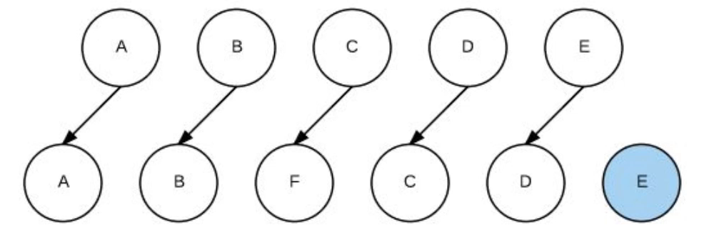

## JavaScript

### 1 - promise

## vue

***

参考

- [key的作用](https://www.bilibili.com/video/BV1m7411P7oD?spm_id_from=333.1007.top_right_bar_window_history.content.click)

### 1 - vue 中的 key 的作用

- key的作用主要是为了高效地更新虚拟dom，其原理是vue在patch过程中通过key可以精准判断两个节点是否是同一个，从而避免频繁更新不同元素，使得整个patch过程更加高效，减少dom操作量，提高性能。
- 使用 key 时，vue 会基于 key 的变化重新排列元素顺序，并且会移除 key 不存在的元素。
- 不使用 key，vue 会使用一种最大限度减少动态元素并且尽可能的尝试就地修改/复用相同类型元素的算法，但这种默认的性能优化策略，会导致更新时出错

#### 1 - 原理

##### 1.1 - 示例



- 不使用 key

    - 3 次 patch（更新），1次追加
    - 3次更新

    

- 使用 key

    - 5 次 patch（更新），1 次追加
    - 5 次更新不执行任何操作

```javascript
// 首次循环 patch A
A B C D E
A B F C D E

// 第2次循环 patch B
B C D E
B F C D E

// 第3次循环 patch E
C D E
F C D E

// 第4次循环 patch D
C D
F C D

// 第5次循环 patch C
C
F C

// oldCh 全部处理结束，newCh 中剩下的 F，创建 F 并插入到 C 前
```


***

参考

- [理解VUE2双向数据绑定原理和实现](https://www.jianshu.com/p/e7ebb1500613)

### 2 - vue是如何实现双向绑定的

- 

#### 1 - 原理

- vue 双向数据绑定是通过 数据劫持 结合 发布订阅模式的方式来实现的， 也就是说数据和视图同步，数据发生变化，视图跟着变化，视图变化，数据也随之发生改变
- 核心：关于VUE双向数据绑定，其核心是 Object.defineProperty( )方法

#### 2 - Object.defineProperty( )方法

[MDN](https://developer.mozilla.org/zh-CN/docs/Web/JavaScript/Reference/Global_Objects/Object/defineProperty)

##### 2.1 - Object.defineProperty( )方法的介绍

- 会直接在一个对象上定义一个新属性，或者修改一个对象的现有属性，并返回此对象
- 应当直接在 [`Object`](https://developer.mozilla.org/zh-CN/docs/Web/JavaScript/Reference/Global_Objects/Object) 构造器对象上调用此方法，而不是在任意一个 `Object` 类型的实例上调用

Object.defineProperty(obj, prop, descriptor) 

- 参数
    - obj （要定义属性的对象）
    - prop （要定义或修改的属性的名称或 Symbol）
    - descriptor （要定义或修改的属性描述符）
        - 设置 `enumerable: true` 表示 属性可以枚举，**默认为 false**
        - 设置 `configurable: true` 表示 属性描述符可以被改变，同时该属性也能从对应的对象上被删除，**默认为** **false**
        - `get() {}` 表示 属性的 getter 函数，如果没有 getter，则为 `undefined`
            - 当访问该属性时，会调用此函数。执行时不传入任何参数，但是会传入 `this` 对象，该函数的返回值会被用作属性的值。
        - `set() {}` 表示 属性的 setter 函数，如果没有 setter，则为 `undefined`
            - 当属性值被修改时，会调用此函数。该方法接受一个参数（也就是被赋予的新值），会传入赋值时的 `this` 对象。
- 返回值
    - 被传递给函数的对象