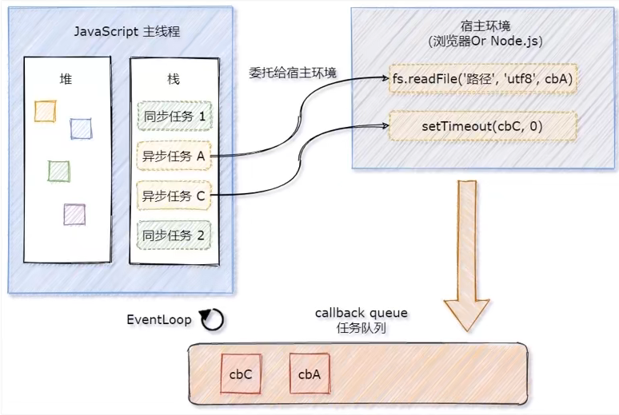

## 术语

### 实例

> 实例是某个类的对象
>

***

### 回调函数(Callback function)

函数可以作参数，如果一个函数A被当做另一个函数B的参数使用，那么函数A可以称为回调函数

```javascript
// 函数执行之后会产生一个子线程，子线程会等待 3 秒，然后执行回调函数 "print"，
function print() {
    document.getElementById("demo").innerHTML="RUNOOB!";
}
setTimeout(print, 3000);
```

作用：

- 恰当时机发通知

- 按照实际需要调整代码的功能
- 提高运行效率

#### 回调地狱

回调函数嵌套回调函数的情况

缺点：

- 维护和处理异常十分繁琐
- 缩进格式非常冗赘，可读性差

```javascript
setTimeout(function () {
    console.log("First");
    setTimeout(function () {
        console.log("Second");
        setTimeout(function () {
            console.log("Third");
        }, 3000);
    }, 4000);
}, 1000);
```

### 异步编程(Asynchronous, async)

- 异步代码总在同步之后执行

    ```javascript
    var a =10;
    setTimeout(() => {
    a++;
    },0)
    consoke.log(a)  // result:10
    ```

### 异常处理

#### 术语

##### 异常/错误

- 当 JavaScript 引擎执行 JavaScript 代码时，发生各种错误，导致程序停止运行

##### 抛出（throw）异常/错误

- 当错误发生时，JavaScript 引擎通常会停止，并生成一个错误消息。

##### 捕获（catch）异常/错误

- 有错误发生时，执行；无错误发生时，跳过

    ```javascript
            function fn() {
                try {
                    alert(str);
                } catch(e) {
                    alert(e);  // 弹出对话框：ReferenceError: str is not defined
                }
            }
            fn();
    ```

##### throw语句

- 创建一个自定义错误（给出提示）


- **try** 语句	 —— 测试代码块的错误。

    - 无异常，执行，忽略 catch 语句，跳转到 finally 语句

    - 有异常，异常处及之后的代码停止执行，跳转执行 catch 中的代码

        ```javascript
                try {
                    console.log(111);
                    console.log(222);
                    addlert('出错')
                    console.log(333);
                    console.log(444);
                } catch (e) {
                    console.log(555);
                    console.log(e);
                }
        ```

        

- **catch** 语句 —— 处理错误。

    - catch( ) 的参数是一个对象，引用 Error 对象

        ```javascript
                try {
                    console.log(111);
                    console.log(222);
                    addlert('出错')
                    console.log(333);
                    console.log(444);
                } catch (e) {
                    console.log(e);			// ReferenceError: addlert is not defined
                    console.log(e.name);	// ReferenceError
                    console.log(e.message);	// addlert is not defined
                }
        ```

    - Error 

        - 通过 `Error` 的构造器可以创建一个错误对象

        - 运行时错误产生时，`Error` 的实例对象会被抛出

        - 用户自定义异常

            ```javascript
            // 参数message：可选。可阅读的错误描述信息。
            new Error([message])
            ```

        - ECMA-262 规范了 7 种错误类型

            |      类型      |                             说明                             |
            | :------------: | :----------------------------------------------------------: |
            |     Error      | 普通异常。与 `throw` 语句和 `try/catch` 语句一起使用，属性 `name` 可以读写异常类型，`message` 属性可以读写详细错误信息。 |
            |   EvalError    |               不正确的使用 `eval()` 方法时抛出               |
            |  SyntaxError   |                      出现语法错误时抛出                      |
            |   RangeError   |                    数字超出合法范围时抛出                    |
            | ReferenceError |               读取不存在的变量时抛出，无效引用               |
            |   TypeError    |                   变量或参数不属于有效类型                   |
            |    URIError    |                   URI 编码和解码错误时抛出                   |

            

- **throw** 语句 —— 创建自定义错误。

    catch ( ) 系统内定， throw 可以自定义

    ```javascript
            var a = -5;
            if (a < 0) {
                throw 'a 不是正整数'  // Uncaught a 不是正整数
            }
    ```

- **finally** 语句 —— 在 try 和 catch 语句之后，无论是否有触发异常，该语句都会执行

    不接受任何参数

    ```javascript
            try {
                console.log(111);
                alert(str)
                console.log(222);
            } catch (e) {
                console.log(e);
            } finally {
                console.log('执行完毕');
            }
    ```

    

### 事件循环（[EventLoop](https://www.bilibili.com/video/BV1zq4y1p7ga?p=245&spm_id_from=333.1007.top_right_bar_window_history.content.click)）

#### 同步与异步

为防止某个耗时任务导致程序假死的问题，JavaScript将待执行任务分为同步任务和异步任务

- 同步任务（synchronous）
    - 又称非耗时任务，指在主线程上排队执行的任务
    - 只有前一个任务执行完毕，才能执行后一个任务
- 异步任务（asynchronous）
    - 又称耗时任务，异步任务由JavaScript委托给宿主环境（web浏览器/node.js）进行执行
    - 异步任务执行完成后，会通知JavaScript主线程执行异步任务的回调函数

#### 同步任务与异步任务的执行过程

- 同步任务由 JavaScript 主线程在执行栈中次序执行
- <span style="color: #e3371e">异步任务</span>委托给<span style="color: #e3371e">宿主环境</span>执行
- <span style="color: #e3371e">已完成</span>的<span style="color: #e3371e">异步任务</span>对应的<span style="color: #e3371e">回调函数</span>，会被加入到<span style="color: #e3371e">任务队列</span>中排队等待执行
- <span style="color: #e3371e">JavaScript 主线程</span>的<span style="color: #e3371e">执行栈被清空</span>后，会读取任务队列中的<span style="color: #e3371e">回调函数</span>，次序执行
- <span style="color: #e3371e">JavaScript 主线程</span>不断重复第 4 步



#### EventLoop 的基本概念

EventLoop : JavaScript 主线程从“任务队列”中读取异步任务的回调函数，放到执行栈中一次执行，这个<span style="color: #e3371e">过程</span>是循环不断的，整个机制又称为 <span style="color: #e3371e">EventLoop </span>（事件循环）。

#### 案例分析

```javascript
import thenFs from 'then-fs'

console.log('A')
thjenFs.readFile('./files/1.txt','utf8').then(dataStr => {
	console.log('B')
})
setTimeout(() => {
	console.log('C')
},0)
console.log('D')

// 打印
// A
// D
// C
// B

// 分析：
// A 和 D 属同步任务，次序执行
// B 和 C 属异步任务，被委托给宿主环境执行
// C 优先于 D 先输出
```

## 深入

### 1 - 函数


#### 1.1 - 匿名函数

是没有函数名的函数，在实际开发中使用的频率非常高

```javascript
function () {
//	code
}
```

- 匿名函数的自调用
    - Javascript 中，圆括号`()`是一种运算符，跟在函数名之后，表示调用该函数
    - 通常情况下，只对匿名函数使用这种“立即执行的函数表达式”，目的：
        - 一是不必为函数命名，避免了污染全局变量；
        - 二是 IIFE 内部形成了一个单独的作用域，可以封装一些外部无法读取的私有变量

```javascript
(function(){
//运行的代码
})()
```


# 第N章 - 表达式和运算符


## 1 - new 运算符 [ new ]

#### # reference

- [MDN](https://developer.mozilla.org/zh-CN/docs/Web/JavaScript/Reference/Operators/new#%E6%8F%8F%E8%BF%B0)
- [现代 JavaScript 教程](https://zh.javascript.info/constructor-new)
- [new 的实现原理](https://www.bilibili.com/video/BV1me4y1k7cK/?spm_id_from=333.880.my_history.page.click&vd_source=89e7c7520dcc682cb1b72284674fbbf4)


#### # 语法

```js
new constructor[([arguments])]

/**
*	constructor	一个指定对象实例的类型的类或函数
*	arguments	一个用于被 constructor 调用的参数列表
*/
```


#### # 描述

**`new`** 关键字会进行如下的操作：

- 创建一个空的简单 JavaScript 对象（即 **`{}`**）
- 为步骤 1 新创建的对象添加属性 **`__proto__`**，将该属性链接至构造函数的原型对象
- 将步骤 1 新创建的对象作为 **`this`** 的上下文
- 如果该函数没有返回对象，则返回 **`this`**


```js
// new Fn(...) 做的就是类似的事情

function User(name) {
  // this = {};（隐式创建）

  // 添加属性到 this
  this.name = name;
  this.isAdmin = false;

  // return this;（隐式返回）
}
```


```js
function Person(name) {
    this.name = name
}

Person.prototype.hello = function () {
    console.log('hello')
}

Person.prototype.sayNmae = function () {
    console.log(`My name is ${this.name}`)
}

let chuxiu = new Person('chuxiu')
chuxiu.hello()
// => hello
chuxiu.sayNmae()
// => My name is chuxiu
console.log(chuxiu.__proto__)
// => { bark: [Function (anonymous)], sayNmae: [Function (anonymous)] }

```


> 如果你没有使用 `new` 运算符，构造函数会像其他的常规函数一样被调用，并不会创建一个对象。在这种情况下， `this` 的指向也是不一样的


#### # 构造器模式测试：new.target

在一个函数内部，我们可以使用 `new.target` 属性来检查它是否被使用 `new` 进行调用了

对于常规调用，它为 undefined，对于使用 `new` 的调用，则等于该函数


```js
function User() {
  alert(new.target);
}

// 不带 "new"：
User(); // undefined

// 带 "new"：
new User(); // function User { ... }
```


#### # 构造器的 return

通常，构造器没有 `return` 语句。它们的任务是将所有必要的东西写入 `this`，并自动转换为结果。

但是，如果这有一个 `return` 语句:

- 如果 `return` 返回的是一个对象，则返回这个对象，而不是 `this`。
- 如果 `return` 返回的是一个原始类型，则忽略


```js
function BigUser() {

  this.name = "John";

  return { name: "Godzilla" };  // <-- 返回这个对象
}

alert( new BigUser().name );  // Godzilla，得到了那个对象
```


```js
function SmallUser() {

  this.name = "John";

  return false; // <-- 返回 this
}

alert( new SmallUser().name );  // John
```


#### # 手写new

```js
/**
*	new
*/

function Person(name) {
    this.name = name
}

Person.prototype.hello = function () {
    console.log('hello')
}

Person.prototype.sayNmae = function () {
    console.log(`My name is ${this.name}`)
}

let chuxiu = new Person('chuxiu')
chuxiu.hello()
// => hello
chuxiu.sayNmae()
// => My name is chuxiu
console.log(chuxiu.__proto__)
// => { bark: [Function (anonymous)], sayNmae: [Function (anonymous)] }

/**
* 手写
*/
function _new(Ctor, ...args) {
    // 传入的参数不是构造函数
    if (!Ctor.hasOwnProperty('prototype')) {
        throw new TypeError(`${Ctor} is not a construstor`)
    }
    // 创建一个新的空对象并将空对象的 __proto__ 属性（隐式原型）指向构造函数的 prototype 属性（显式原型）
    let obj = Object.create(Ctor.prototype)
    // 将构造函数中的 this 指向此对象
    let res = Ctor.apply(obj, args)
    // return 一个对象或函数时
    if ((res !== null && typeof res == 'object') || typeof res == 'function') {
        return res
    }
    return obj
}

chuxiu2.bark()
// bark
chuxiu2.sayNmae()
// My name is chuxiu2
console.log(chuxiu2 instanceof Person)
// true
```


## 2 - 可选链操作符 [ ?. ]

允许读取位于连接对象链深处的属性的值，而不必明确验证链中的每个引用是否有效。

- 在引用为空 ([nullish](https://developer.mozilla.org/zh-CN/docs/Glossary/Nullish) ) ([`null`](https://developer.mozilla.org/zh-CN/docs/Web/JavaScript/Reference/Operators/null) 或者 [`undefined`](https://developer.mozilla.org/zh-CN/docs/Web/JavaScript/Reference/Global_Objects/undefined)) 的情况下不会引起错误，该表达式短路返回值是 `undefined`
- 与函数调用一起使用时，如果给定的函数不存在，则返回 `undefined`。


> **Tips：**
>
> **不要过度使用可选链**
>
> - 只将 `?.` 使用在一些东西可以不存在的地方
>
> 
>
> `?.` **前的变量必须已声明**，否则会报错
>
>
> **我们可以使用** `?.` **来安全地读取或删除，但不能写入**，可选链 `?.` 不能用在赋值语句的左侧


#### # reference

- [MDN](https://developer.mozilla.org/zh-CN/docs/Web/JavaScript/Reference/Operators/Optional_chaining)
- [现代 JavaScript 教程](https://zh.javascript.info/optional-chaining)


#### # 语法

```js
obj.val?.prop
obj.val?.[expr]
obj.func?.(args)
```


#### # 描述

通过连接的对象的引用或函数可能是 `undefined` 或 `null` 时，可选链运算符提供了一种方法来简化被连接对象的值访问


#### # 可选链与函数调用

当尝试调用一个可能不存在的方法时也可以使用可选链

```
let result = someInterface.customMethod?.();
```


> - 如果存在一个属性名且不是函数，使用 `?.` 仍然会产生一个 [`TypeError`](https://developer.mozilla.org/zh-CN/docs/Web/JavaScript/Reference/Global_Objects/TypeError) 异常 (`x.y is not a function`)
> - 如果 `someInterface` 自身是 `null` 或者 `undefined` ，异常 [`TypeError`](https://developer.mozilla.org/zh-CN/docs/Web/JavaScript/Reference/Global_Objects/TypeError) 仍会被抛出 `someInterface is null`
>   - 可以写作 someInterface?.customMethod?.()


# 第N章、标准内置对象

## 1 - Symbol

symbol 是一种基本数据类型（ <span style="color: #49bf51">primitive data type</span> ）

`Symbol()` 函数会返回 **symbol** 类型的值，该类型具有静态属性和静态方法

- 静态属性会暴露几个内建的成员对象
- 静态方法会暴露全局的 symbol 注册，且类似于内建对象类
- 作为构造函数来说它并不完整，因为它不支持语法："`new Symbol()`"


每个从 `Symbol()` 返回的 symbol 值都是唯一的。一个 symbol 值能作为对象属性的标识符；这是该数据类型仅有的目的

根据规范，只有两种原始类型可以用作对象属性键：

- 字符串类型
- symbol 类型


> **symbol 不会被 <span style="color: #e3371e">自动</span> 转换为字符串**


#### # reference

- [MDN](https://developer.mozilla.org/zh-CN/docs/Web/JavaScript/Reference/Global_Objects/Symbol)
- [现代 JavaScript 教程](https://zh.javascript.info/symbol)


# 第N章、异常收集

## 1 - html 中 import js文件

```javascript
 <script type="module">
	import { Dom } from '../lib/dom.js'
	let h1 = new Dom('h1')
</script>
```

> 注意点：
>
> 1. `script` 标签 `type` 属性值为 `module`
> 2. 引入的文件路径，**必须**带文件扩展名 `.js`
