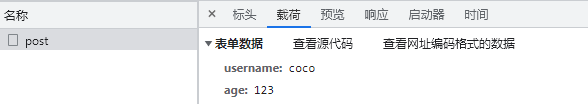
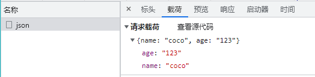

# HTTP

## 一、http 工作原理

- HTTP协议工作于客户端(B)-服务端(S)架构上
- 浏览器作为HTTP客户端 通过URL向 HTTP服务端即WEB服务器 发送所有请求。
- Web服务器根据接收到的请求后，向客户端发送响应信息。

HTTP 基于 TCP ,是面向连接的协议，建立连接要通过三次握手，断开连接要经过四次挥手

### 1- http建立连接（三次握手）

- 客户端向服务器发送接收消息请求
- 服务器向客户端返回消息
- 客户端向服务器发送确认请求

    

### 2- http断开连接（四次挥手）

- 客户端会在四次挥手后再等待两个单位时间，若此段时间没收到服务器信息再关闭


## 二、客户端请求消息

客户端发送一个HTTP请求到服务器的请求消息包括以下格式：

- 请求行（request line）
- 请求头（request header）
- 空行 ~ (存在头信息和主体信息之间，可做区分；即使没有主体信息也不不能少)
- 请求体（request body 请求数据）

下图给出了<span style = "color: red">**请求报文**</span>的一般格式


### 1- 请求报文结构

##### **请求行**

- 请求方法( method )： GET / POST / HEAD / PUT / DELETE / ...
- 请求URL : 例：/product_detail?id=2
- 请求协议版本： HTTP/1.1

##### **请求头**

- 产生请求的浏览器信息 ： user-agent
- 客户端希望接收的数据类型 ： accept
- 客户端发送的实体数据格式 ： Content-Type
- 请求的主机名 ： Host

##### **请求空行**

##### **请求体（可以没有）**

***

## 三、服务器响应消息

HTTP响应也由四个部分组成，分别是：

- 响应行（响应状态行）
- 响应头（消息报头） 格式 ~ key: value
- 空行
- 响应体（响应正文）

下图给出了<span style = "color: red">**响应报文**</span>的一般格式


### 1- 响应报文结构

##### **响应行**

- 服务器协议版本 ： HTTP/1.1
- 响应状态码 ： 200
- 响应状态文字 ： OK

##### **响应头**

- 服务器时间 ： Date

- 服务器类型 ： server

- 服务器返回的数据类型 ： Content-Type

    - Content-Type 标头告诉客户端实际返回的内容的内容类型

        ```
        // 语法格式
        Content-Type: text/html; charset=utf-8
        Content-Type: multipart/form-data; boundary=something
        ```

        

- 服务器返回的数据长度 ： Content-Length

##### **响应空行**

##### **响应体**

## 四、HTTP 请求方法

根据 HTTP 标准，HTTP 请求可以使用多种请求方法：

- HTTP1.0 定义了三种请求方法： GET, POST 和 HEAD 方法。

- HTTP1.1 新增了六种请求方法： OPTIONS、PUT、PATCH、DELETE、TRACE 和 CONNECT 方法。

    | 序号 |  方法   |                             描述                             |
    | :--: | :-----: | :----------------------------------------------------------: |
    |  1   |   GET   |             请求指定的页面信息，并返回实体主体。             |
    |  2   |  HEAD   | 类似于 GET 请求，只不过返回的响应中没有具体的内容，用于获取报头 |
    |  3   |  POST   | 向指定资源提交数据进行处理请求（例如提交表单或者上传文件）。数据被包含在请求体中。POST 请求可能会导致新的资源的建立和/或已有资源的修改。 |
    |  4   |   PUT   |       从客户端向服务器传送的数据取代指定的文档的内容。       |
    |  5   | DELETE  |                   请求服务器删除指定的页面                   |
    |  6   | CONNECT |  HTTP/1.1 协议中预留给能够将连接改为管道方式的代理服务器。   |
    |  7   | OPTIONS |                 允许客户端查看服务器的性能。                 |
    |  8   |  TRACE  |          回显服务器收到的请求，主要用于测试或诊断。          |
    |  9   |  PATCH  |      是对 PUT 方法的补充，用来对已知资源进行局部更新 。      |

## 五、http协议状态码

| 分类 |     类型     |                      描述                      |
| :--: | :----------: | :--------------------------------------------: |
| 1**  | 信息性状态码 |     服务器收到请求，需要请求者继续执行操作     |
| 2**  |  成功状态码  |              操作被成功接收并处理              |
| 3**  | 重定向状态码 |           需要进一步的操作以完成请求           |
| 4**  | 客户端状态码 |   客户端错误，请求包含语法错误或无法完成请求   |
| 5**  | 服务器状态码 | 服务器错误，服务器在处理请求的过程中发生了错误 |

**常见的 HTTP 状态码:**

- 200 - 请求成功
- 301 - 资源（网页等）被永久转移到其它URL
- 404 - 请求的资源（网页等）不存在
- 500 - 内部服务器错误

## 六、http协议请求的常用方法

http协议常用的 4 种方法，用来完成数据的 增删改查 操作：

- get() : 获取数据
- post() : 提交数据
- put() : 修改数据
- delete() : 删除数据

注意：

- http 请求本身并不完成增删改查的基本操作，真正的操作仍然是由服务器完成


***

# AJAX

[黑马Ajax](https://www.bilibili.com/video/BV1ji4y1876Y?p=1) (项目待做)  [动力节点Ajax](https://www.bilibili.com/video/BV1of4y1v7tB?spm_id_from=333.1007.top_right_bar_window_history.content.click) [尚硅谷Ajax](https://www.bilibili.com/video/BV1WC4y1b78y?spm_id_from=333.1007.top_right_bar_window_history.content.click)

## AJAX 简介

### 一、AJAX 是什么

- AJAX = 异步 JavaScript 和 XML（Asynchronous JavaScript and XML）
- 是一种用于创建快速动态网页的技术
- 通过在后台与服务器进行少量数据交换，AJAX 可以使网页实现异步更新。这意味着可以在不重新加载整个网页的情况下，对网页的某部分进行更新。

### 二、AJAX 特点

#### 1- 优点

- 不需要插件支持（一般浏览器切默认开启 JavaScript 即可）
- 用户体验极佳（不刷新页面即可获取更新的数据）
- 提升Web程序的性能（在传递数据方面做到按需发送，不必整体提交）
- 减轻服务器和带宽的负担（将服务器的一些操作转移到客户端）

#### 2- 缺点

- 前进、后退功能被破坏（因为Ajax永远在当前页，不会记录前后页面）
- 搜索引擎的支持度不够（因为搜索引擎爬虫还不能理解JS引起变化数据的内容）
- 不同版本的浏览器对 XMLHttpRequest 对象支持度不足（比如IE5之前）

#### 3- 形象类比

| restaurant | 网页 |
| :--------: | :--: |
|  customer  | 页面 |
|   waiter   | Ajax |
|    chef    | 后台 |

|                     顾客吃饭                     |                             Ajax                             |
| :----------------------------------------------: | :----------------------------------------------------------: |
|                 点餐，服务员记录                 |            准备页面请求，创建 XMLHttpRequest 对象            |
|                 服务员与后厨交流                 | 使用XMLHttpRequest 对象 open( ) 和 send ( ) 方法发送资源请求给服务器 |
|                   后厨开始工作                   |                           后台计算                           |
| 服务员监听后厨进度，后厨完成菜品，服务员端给顾客 | onreadystatechange 函数，状态改变时发送数据给客服端，使用XMLHttpRequest 对象的 resonseText 或 responseXML 属性获得服务器的响应 |


### 三、AJAX 工作原理


### 四、AJAX 运行环境

AJAX技术需要运行在网站环境中才能生效。

#### 1- 使用Node创建网站服务器

[流程参考网址](使用Node创建网站服务器)

- 下载安装 node.js

- 新建项目目录

- 命令行指令

    ```shell
    # 初始化项目,创建一个packages.json文件，用于管理项目内所需要的包
    npm init --yes
    
    # 安装 express依赖
    npm install express --save
    ```

- server项目下新建文件夹 public，并在public文件夹中新建 “index.html”文件

- 在server文件夹下，新建文件 app.js

    ```javascript
    //引入express框架
    const express=require('express')
    
    //引入路径处理模块
    const path=require('path')
    
    //创建web服务器
    const app=express();
    
    //静态资源访问服务器功能
    app.use(express.static(path.join(__dirname,'public')))
    
    //监听端口
    app.listen(3000);
    
    //控制台提示输出
    console.log('服务器启动成功')
    ```

- 终端输入：

    ```sh
    # 开启网站服务器
    node app.js
    ```

- 打开浏览器，输入网址：

    > http://localhost:3000/<html文件名>

五、AJAX 的实现步骤

- 创建 AJAX 对象

    ```javascript
    var xhr = new XMLHttpRequest();
    ```

- 告诉 AJAX 请求地址和请求方式

    ```javascript
    xhr.open('get', 'http://example.com');
    ```

- 发送请求

    ```javascript
    xhr.send();
    ```

- 获取服务器端给予客户端的响应数据

    由于请求需要一定时间完成，为xhr的onload事件添加事件处理函数

    ```javascript
    xhr.onload = function() {
    	console.log(xhr.responseText);
    }
    ```

### 五、AJAX的 实现

#### 1- 简单实例

```javascript
        // 创建 ajax 对象
        var xhr = new XMLHttpRequest();

        // 告诉 Ajax 对象以声明请求方式，向哪里发送请求
        // ** 此请求地址为服务端给客户端的，为服务器的路由地址
        xhr.open('get', 'http://localhost:3000/first');

        // 发送请求
        xhr.send();

        // 获取服务器端响应到客户端的数据
        xhr.onload = function () {
            console.log(xhr.respnseText);
        }
```

- 在 app.js 文件中创建服务器路由

    ```javascript
    //引入express框架
    const express=require('express')
    
    //引入路径处理模块
    const path=require('path')
    
    //创建web服务器
    const app=express();
    
    //静态资源访问服务器功能
    app.use(express.static(path.join(__dirname,'public')))
    
    // 创建服务器路由
    // 参数2：请求处理函数
    // 请求处理函数的两个参数; 1 - req 请求对象， 2- res 响应对象
    app.get('/first',(req, res) => {
        // 为客服端响应内容
        res.send('Hello,你好！');
    });
    
    //监听端口
    app.listen(3000);
    
    //控制台提示输出
    console.log('服务器启动成功')
    ```

- 浏览器输入

    > http://localhost:3000/.html

#### 2- 服务端响应的数据格式

- 真实项目中，服务器端大多数情况会以 JSON 对象作为响应数据的格式。
- 客户端拿到响应数据时，要将 JSON 数据和 HTML 字符串进行拼接，然后使用 DOM 操作将拼接的结果展示在页面中

```javascript
		// html中的JavaScript
        // 创建 ajax 对象
        var xhr = new XMLHttpRequest();

        // 告诉 Ajax 对象以声明请求方式，向哪里发送请求
        // ** 此请求地址为服务端给客户端的，为服务器的路由地址
        xhr.open('get', 'http://localhost:3000/responseData');

        // 发送请求
        xhr.send();

        // 获取服务器端响应到客户端的数据
        xhr.onload = function () {
            console.log(xhr.responseText);
            console.log(typeof xhr.responseText);
        }
```

```javascript
// app.js
app.get('/responseData', (req,res) => {
    res.send({
        "name": "coco"
    });
});
```

```
// 控制台
{"name":"coco"}
string
```

##### JSON 字符串转化为 JSON 对象

- 使用 JSON 对象的 .parse( ) 方法

    ```javascript
    		// html中的JavaScript
            // 获取服务器端响应到客户端的数据
            xhr.onload = function () {
                console.log(xhr.responseText);
                console.log(typeof xhr.responseText);
                var responseText = JSON.parse(xhr.responseText);
                console.log(responseText);
                console.log(typeof responseText);
            }
    ```

    ```
    // 控制台
    {"name":"coco"}
    string
    {name: 'coco'}
    object
    ```

##### 客服端操作

```javascript
        // 获取服务器端响应到客户端的数据
        xhr.onload = function () {
            console.log(xhr.responseText);
            console.log(typeof xhr.responseText);
            var responseText = JSON.parse(xhr.responseText);
            console.log(responseText);
            console.log(typeof responseText);
            // 客服端将 JSON 数据和 HTML 字符串进行拼接
            var str = '<h2>' + responseText.name + '</h2>';
            // 使用 DOM 操作将拼接的结果展示在页面中
            document.body.innerHTML = str;  // 网页页面输出：coco [h2格式展示]
        }
```


#### 3- 请求参数传递

##### 传统网站请求参数传递

通过表单传递，根据请求方式的不同，表单内容变成请求参数自动拼接到对于位置

```html
<form method="get" action="http://www.example.com">
    <input type="text" name="username">
    <input type="password" name="pasaword">
</form>
```

- get请求：被拼接到请求地址后面

    > http://www.example.com?username=zhangsan&password=123456

- post请求：被放在请求体当中

##### ajax方式

需要自己拼接请求参数，根据请求方式的不同，将请求参数放在对于的位置

###### get请求

被放在请求地址后

```
xhr.open('get', 'http://www.example.com?name=zhangsan&age=20');
```

```html
	<!--html-->
    <p>03 传递get请求参数</p>
    <form action="">
        <input type="text" name="username" id="username">
        <input type="text" name="age" id="age">
        <input type="button" value="提交" id="btn">
    </form>
```

```javascript
		//JavaScript
        // 为 button 按钮添加点击事件：用户点击按钮时，创建ajax对象，发送请求
        var btn = document.querySelector('#btn');
        var username = document.querySelector('#username');
        var age = document.querySelector('#age');

        btn.addEventListener('click', function () {
            // 创建 ajax 对象
            var xhr = new XMLHttpRequest();
            // 获取用户输入的值
            var nameValue = username.value;
            var ageValue = age.value;

            // 拼接字符串 username=123&age=456
            var params = 'username=' + nameValue + '&age=' + ageValue;

            // 配置 ajax 对象
            xhr.open('get', 'http://localhost:3000/get?' + params);

            // 发送请求
            xhr.send();

            // 获取服务器端响应到客户端的数据
            xhr.onload = function () {
                console.log(xhr.responseText);
            }
        })
```

```javascript
// app.js
app.get('/get', (req,res) => {
    res.send(req.query);
});
```

```
// console
{"username":"coco","age":"18"}
{"username":"alice","age":"18"}
```


###### post请求

放在请求体当中：只需将请求参数放在 .send( ) 中

```
xhr.setRequestHeader('Content-Type', 'application/x-www-form-urlencoded');
xhr.send('name=zhangsan&age=20')
```

get请求和post请求在传递参数时的区别

- post请求必须在请求报头中明确设置 请求参数内容类型（Content-Type）

```html
    <!--html-->
    <p>04 传递post请求参数</p>
    <form action="">
        <input type="text" name="username" id="username">
        <input type="text" name="age" id="age">
        <input type="button" value="提交" id="btn">
    </form>
```

```javascript
		//JavaScript		
		// 为 button 按钮添加点击事件：用户点击按钮时，创建ajax对象，发送请求
        var btn = document.querySelector('#btn');
        var username = document.querySelector('#username');
        var age = document.querySelector('#age');

        btn.addEventListener('click', function () {
            // 创建 ajax 对象
            var xhr = new XMLHttpRequest();
            // 获取用户输入的值
            var nameValue = username.value;
            var ageValue = age.value;

            // 拼接字符串 username=123&age=456
            var params = 'username=' + nameValue + '&age=' + ageValue;

            // 配置 ajax 对象
            xhr.open('post', 'http://localhost:3000/post');
            // 设置请求参数内容类型（post必须）
            xhr.setRequestHeader('Content-Type', 'application/x-www-form-urlencoded');

            // 发送请求
            xhr.send(params);

            // 获取服务器端响应到客户端的数据
            xhr.onload = function () {
                console.log(xhr.responseText);
            }
        })
```

```javascript
// app.js
// 引入bodyparser模块，post请求所需
const bodyParser = require('body-parser');
// 声明全局作用
app.use(bodyParser.urlencoded());

app.post('/post', (req, res) => {
    res.send(req.body);
});
```

```
// console
{"username":"coco","age":"123"}
```




#### 4- 请求参数的格式

##### aplication/x-www-form-urlencoded —— 表单默认的提交数据的格式

```
name=zhangsan&age=20&sex=男
```

##### application/json  —— JSON数据格式

```
{name：'zhangsan', age: '20', sex: '男'}
```

```javascript
xhr.setRequestHeader('Content-Type', 'application/json');
xhr.send('name=zhangsan&age=20')
```

##### JSON 对象转化为 JSON 字符串

- 使用 JSON 对象的 .stringify( ) 方法

```javascript
        // 创建 ajax 对象
        var xhr = new XMLHttpRequest();

        // 告诉 Ajax 对象以声明请求方式，向哪里发送请求
        // ** 此请求地址为服务端给客户端的，为服务器的路由地址
        xhr.open('post', 'http://localhost:3000/json');
        xhr.setRequestHeader('Content-Type', 'application/json');

        // 发送请求
        xhr.send(JSON.stringify({
            name: 'coco',
            age: '123'
        }));

        // 获取服务器端响应到客户端的数据
        xhr.onload = function () {
            console.log(xhr.responseText);
        }
```

```javascript
app.use(bodyParser.json());
app.post('/json', (req, res) => {
    res.send(req.body);
});
```

```
// console
{"name":"coco","age":"123"}
```





<span style="color: red">注意：get请求时不能提交 json 对象数据格式的，传统网站的表单提交也不支持json对象数据格式</span>

#### 5- AJAX状态码（readyState）

创建ajax对象，配置ajax对象，发送请求，以及接收完服务器端响应数据，这些过程的每一步骤都会对应一个数值，这个数值就是ajax状态码

|  值  |       状态       |                          描述                           |
| :--: | :--------------: | :-----------------------------------------------------: |
|  0   |      UNSET       |     请求为初始化，代理被创建，但未调用 open() 方法      |
|  1   |      OPENED      |             请求已建立，open() 方法已被调用             |
|  2   | HEADERS_RECEIVED | 请求已发送，send() 方法已被调用，并且头部和状态已被获得 |
|  3   |     LOADING      |       清理处理中，responseText 属性已包含部分数据       |
|  4   |       DONE       |      下载操作已完成，可以获取并使用服务器的响应了       |

- 获取服务器端的响应

onreadystatechange 事件 —— 当ajax状态码发送变化时自动触发该事件

- 获取ajax状态码

```javascript
xhr.readyState // 获取 ajax 状态码
```

```javascript
        var xhr = new XMLHttpRequest();
        // 0 已经创建了 ajax 对象，但未进行配置
        console.log(xhr.readyState);
        xhr.open('get','http://localhost:3000/readystate');
        // 1 已经配置了 ajax 对象，但未发送请求
        console.log(xhr.readyState);

        // 当 ajax 状态码发生变化时触发
        xhr.onreadystatechange = function () {
            // 2 请求已发送
            // 3 已经接收服务端的部分数据
            // 4 服务端的响应数据已经接收完成
            console.log(xhr.readyState);
            // 对ajax状态码进行判断，为 4 代表数据已接收完成
            if (xhr.readyState ==4) {
                console.log(xhr.responseText);
            }
        }
        
        xhr.send();
```

```
// app.js
app.get('/readystate', (req, res) => {
    res.send('hello');
});
```

```
// console
0
1
2
3
4
hello
```


#### 6- 两种获取浏览器响应方式的区别

|      区别描述      | onload事件 | onreadystatechange事件 |
| :----------------: | :--------: | :--------------------: |
|    兼容IE低版本    |   不兼容   |          兼容          |
| 需要判断Ajax状态码 |   不需要   |          需要          |
|     被调用次数     |    一次    |          多次          |

<span style="color: red">建议使用onload事件</span>

#### 7- AJAX错误处理

- 网络畅通，服务器端能接收到请求，服务器端返回的结果不是预期结果

    <span style="color: blue">可以判断服务器端返回的状态码，分别进行处理。xhr.status 获取http状态码</span>

    ```java
            var btn = document.querySelector('#btn');
    
            btn.addEventListener('click', function () {
                // 创建 ajax 对象
                var xhr = new XMLHttpRequest();
    
                // 告诉 Ajax 对象以声明请求方式，向哪里发送请求
                // ** 此请求地址为服务端给客户端的，为服务器的路由地址
                xhr.open('get', 'http://localhost:3000/error');
    
                // 发送请求
                xhr.send();
    
                // 获取服务器端响应到客户端的数据
                xhr.onload = function () {
                    console.log(xhr.responseText);
                    if(xhr.status == 400) {
                        console.log('请求出错');
                    }
                }
            })
    ```

    ```javascript
    // app.js
    app.get('/error',(req,res) => {
        res.status(400).send('not ok')
    })
    ```

    ```
    // console
    GET http://localhost:3000/error 400 (Bad Request)
    not ok
    请求出错
    ```

- 网络畅通，服务器端没有接收到请求，返回404状态码

    <span style="color: blue">检查请求地址是否出错</span>

    ```javascript
    xhr.open('get', 'http://localhost:3000/error123'); // 故意写错
    ```

    ```
    // console
    GET http://localhost:3000/error123 404 (Not Found)
    <!DOCTYPE html>
    <html lang="en">
    <head>
    <meta charset="utf-8">
    <title>Error</title>
    </head>
    <body>
    <pre>Cannot GET /error123</pre>
    </body>
    </html>
    ```

- 网络畅通，服务器端能收到请求，服务器端返回500状态码

    <span style="color: blue">服务器端错误，找后端程序员沟通</span>

```javascript
// app.js
app.get('/error',(req,res) => {
    console.log(abc);        // 输出一个服务器端不存在的变量abc
    res.status(400).send('not ok')
})
```

```
// console
GET http://localhost:3000/error 500 (Internal Server Error)
<html lang="en">
<head>
<meta charset="utf-8">
<title>Error</title>
</head>
<body>
<pre>ReferenceError: abc is not defined<br>……
```

- 网络中断，请求无法发送到服务器端。

    <span style="color: blue">不会触发onload事件</span>

    <span style="color: blue">会触发xhr对象的onerror事件，在onerror事件处理函数中对错误进行处理</span>

```javascript
        var btn = document.querySelector('#btn');

        btn.addEventListener('click', function () {
            // 创建 ajax 对象
            var xhr = new XMLHttpRequest();

            // 告诉 Ajax 对象以声明请求方式，向哪里发送请求
            // ** 此请求地址为服务端给客户端的，为服务器的路由地址
            xhr.open('get', 'http://localhost:3000/error');

            // 发送请求
            xhr.send();

            // 获取服务器端响应到客户端的数据
            xhr.onload = function () {
                console.log(xhr.responseText);
                if(xhr.status == 400) {
                    console.log('请求出错');
                }
            }
            // 网络中断时触发 onerror 事件
            xhr.onerror =function() {
                console.log('网络中断，无法发送ajax请求');
            }
        })
```

```
// console
网络中断，无法发送ajax请求
GET http://localhost:3000/error net::ERR_INTERNET_DISCONNECTED
```

#### 8- AJAX 状态码和 http 状态码的区别

- AJAX 状态码：表示 AJAX 请求的过程状态（当前ajax请求走到哪一步），是 ajax 对象返回的
-  http 状态码：表示请求的处理结果，是服务器端返回的

### 六、AJAX 异步编程

- 同步：代码逐行执行
- 异步：一个异步过程的执行将不再与原有的序列有顺序关系。异步不按照代码顺序执行

```javascript
console.log('before');
setTimeout(
	() => { console.log('last');	
},2000)
console.log('after');
```

#### Ajax 封装

- 问题：发送一次请求代码过多，发送多次请求代码冗余且重复
- 解决：将请求代码封装到函数中，发请求时调用函数即可

### 七、同源政策

#### 1- AJAX请求限制

ajax只能向自己的服务器发送请求

#### 2- 同源

- 拥有相同 协议 、域名 、端口 的网页

#### 3- 同源政策

##### 同源政策的目的：

- 保证用户信息的安全，防止恶意网站窃取数据
- 最初的同源政策是指 A 网站在客户端设置的 Cookie，B 网站时不能访问的

请求会发送出去，服务器拒绝响应

##### 使用 JSONP 解决同源限制问题

jsonp 是 json with padding 的缩写，它不属于 ajax 请求，但它可以模拟 ajax 请求

- 将不同源的服务器端请求地址写在script 标签的 src 属性中

    - script 标签的 src 属性不受同源政策影响

    ```javascript
    <script src="www.example.com"></script>
    ```

    ```javascript
    <script src="https://cdn.bootcss.com/jquery/3.3.1/jquery.min.js"></script>
    ```

- 服务器端响应数据必须是一个函数的调用，真正要发送给客服端的数据需要作为函数调用的参数

    ```javascript
    const data = 'fn({name: 'zhangsan', age: 18})';
    res.send(data);
    ```

- 在客户端全局作用域下定义函数 fn

    - script标签加载完服务器响应内容后，直接调用准备好的函数
    - fn 必须写在script标签前

    ```javascript
    function fn (data) {}
    ```

- 在 fn 函数内部对服务器端返回的数据进行处理

    ```javascript
    function fn (data) {console.log(data)}
    ```

### 八、jQuery中的 $.ajax( ) 方法

#### 1- $.ajax( ) 方法概述

作用：发送 Ajax 请求，调用 AJAX 方法 最原始的封装，需要填很多参数

```javascript
        $.ajax({
            type: 'get',
            url: 'http://www.example.cpm',
            data: {
                name: 'zhangsan',
                age: 18
            },
            contentType: 'application/x-www-form-urlencoded',
            beforeSend: function () {
                return false
            },
            success: function (response) {},
            error: function (xhr) {}
        })
```

参数：

- type —— 请求方式 GET / POST

- url —— 请求地址url

- data —— 向服务器发送的请求参数

    - 可传递一个对象，自动转化为 `参数名=参数值&参数名=参数值`参数字符串

    - 也可直接传递字符串参数值，`data: "name=zhangsan&age=20"`

    - 传对象或字符串，最终都以参数字符串格式发送

        ***

    - 如需传递json格式的数据

        ```javascript
        contentType: 'application/json'
        JSON.stringify(name: 'zhangsan', age: 20)
        ```

- beforeSend

- dataType —— 预期服务器返回的数据类型

- success —— 请求成功时调用此函数

- error —— 请求失败时调用此函数

##### 实例

```html
    <button id="btn">发送请求</button>
    <script>
        $(function () {
            $('#btn').on('click',function () {
                $.ajax({
                    // 请求方式
                    type: 'get',
                    // 请求地址(同源可省略协议、域名、端口)
                    url: 'http://localhost:3000/base',
                    // 请求成功后函数被调用
                    success: function (response) {
                        // response 为服务器端返回的数据
                        // 方法内部会自动将json字符串转化为json对象
                        console.log(response);
                    },
                    // 请求失败后函数被调用
                    error: function (xhr) {
                        console.log(xhr);
                    }
                })
            })
        })
    </script>
```

```javascript
// app.js
app.get('/base', (req, res) => {
    res.send({
        "name": "coco",
        "age": 18
    });
});
```

```
// console
{name: 'coco', age: 18}
```

也可改为post请求，app.js 需添加 app.post( )

##### $.ajax()方法发送JSONP请求

作用：发送jsonp请求

```javascript
$.ajax({
	url: 'http://www.example.cpm',
	// 指定当前发送 jsonp 请求
	dataType: 'jsonp',
	// 修改 callbak 参数名称
    jsonp: 'cb',
    // 指定函数名称
    jsonCallback: 'fnName'
	success: function (response) {}
})
```

#### 2- $.get()方法

作用： 发送get请求，用于从服务器获得（取回）数据。

```javascript
$.get(
	'http://www.example.com',
	{name: "zhangsan", age: 18},
	function (response) {}
)
```

参数：

- url —— 请求地址，类型：string
- data —— 类型：对象 | string （可选参数）
- callback —— 回调函数，请求成功后所执行的函数名 （可选参数）

##### 实例

```javascript
        $(function () {
            $('#btn').on('click', function () {
                $.get('/baseget',{name: "coco", age: 30}, function(response) {
                    console.log(response);
                })
            })
        })
```

```javascript
// app.js
app.get('/baseget', (req, res) => {
    res.send({
        "name": "coco",
        "age": 1919
    });
});
```


#### 3- $.post()方法

作用： 发送post请求，通过 HTTP POST 请求向服务器提交数据

```javascript
$.post(
	'http://www.example.com',
	{name: "zhangsan", age: 18},
	function (response) {}
)
```

参数：

- url —— 请求地址，类型：string
- data —— 类型：对象 | string （可选参数）
- callback —— 回调函数，请求成功后所执行的函数名 （可选参数）

##### 实例

```javascript
        $(function () {
            $('#btn').on('click', function () {
                $.post('/basepost',{name: "dodo", age: 40}, function(response) {
                    console.log(response);
                })
            })
        })
```

```javascript
// app.js
app.post('/basepost', (req, res) => {
    res.send({
        "name": "dodo!",
        "age": 4040
    });
});
```


