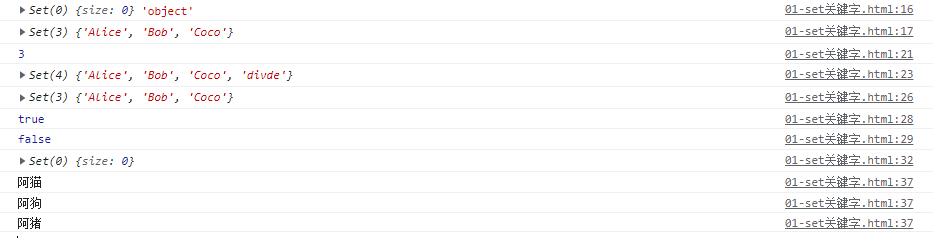
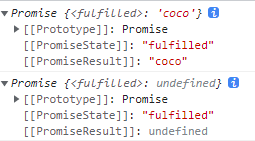
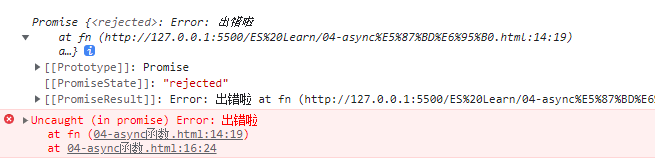
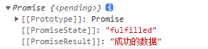
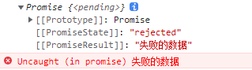
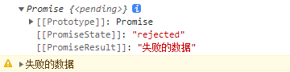
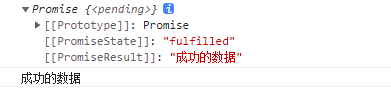

## 一、ES概述

### 1 - 什么是ECMA

- ECMA（European Computer Manufacturers Association）
- 中文名称为欧洲计算机制造商协会，这个组织的目标是评估、开发和认可电信和计算机标准。1994 年后该组织改名为 Ecma 国际；

### 2 - 什么是 ECMAScript

- ECMAScript 是由 Ecma 国际通过 ECMA-262 标准化的脚本程序设计语言；

### 3- 什么是 ECMA-262

- Ecma 国际制定了许多标准，而 ECMA-262 只是其中的一个

### 4 - ECMA-262 历史

- 从 ES6 开始，每年发布一个版本，版本号比年份最后一位大 1；

    | 版本 | 时间 |                             概述                             |
    | :--: | :--: | :----------------------------------------------------------: |
    | ES5  | 2009 |  引入严格模式、JSON，扩展对象、数组、原型、字符串、日期方法  |
    | ES6  | 2015 | 模块化、面向对象语法、Promise、箭头函数、let、const、数组解构赋值<br/>等等 |
    | ES7  | 2016 |            幂运算符、数组扩展、Async/await 关键字            |
    | ES8  | 2017 |                   Async/await、字符串扩展                    |
    | ES9  | 2018 |                    对象解构赋值、正则扩展                    |
    | ES10 | 2019 |                      扩展对象、数组方法                      |
    | ES11 | 2020 |                     链式操作、动态导入等                     |

### 5 - 维护 ECMA-262

- TC39（Technical Committee 39）是推进 ECMAScript 发展的委员会。
- 其会员都是公司（其中主要是浏览器厂商，有苹果、谷歌、微软、因特尔等）。
- TC39 定期召开会议，会议由会员公司的代表与特邀专家
    出席；

### 6 - 学习 ES6

- ES6 的版本变动内容最多，具有里程碑意义；
- ES6 加入许多新的语法特性，编程实现更简单、高效；
- ES6 是前端发展趋势，就业必备技能；

## 二、ES6新特性

### 1 - let关键字

特点：

- 不能重复声明

    ```javascript
    let a = 1;
    let a = 2;  // 报错：无法重新声明块范围变量“a”。
    ```

- 块级作用域——代码块内有效

    ```javascript
    {
        let a = 1;
    }
    console.log(a);  // 报错：a is not defined
    ```

- 不存在变量提升

- ```javascript
    console.log(a);  // 输出：undefined （未报错）
    var a = 'coco';
    
    console.log(b);  // 报错：Cannot access 'b' before initialization (报错)
    let b = 'elice';
    ```

- 不影响作用域链

    ```javascript
    {
        let star = 'coco'
    
        function fn() {
            console.log(star);
        }
        fn();     // 输出：coco
    }
    ```

#### 案例：点击div变色

```html
// html
<div class="container">
        <div class="item"></div>
        <div class="item"></div>
        <div class="item"></div>
    </div>
```

```css
// css
.container {
    display: flex;
}
.item  {
    width: 250px;
    height: 250px;
    border: 1px solid teal;
}
```

```javascript
// javascript 错误示范
// 点击 div 改变颜色
        // 获取div
        let items = document.querySelectorAll('.item');

        // 遍历绑定事件
        for (var i = 0; i < items.length; i++) {
            items[i].addEventListener('click', function () {
                items[i].style.background = 'pink';
            })
        }
		console.log(i); // 输出：3
        // 报错：Cannot read properties of undefined (reading 'style')at HTMLDivElement.<anonymous>
```

- 原因：var 定义的 i 为全局变量，循环结束后 i=3，超出 items 数组最大索引值，因此无法修改颜色
- 解决：for 循环中使用 let 定义 i

### 2 - const关键字

const 声明一个只读变量，声明之后不允许改变。意味着，一旦声明必须初始化，否则会报错。const 关键字用来声明常量

特点：

- 不允许重复声明

    ```javascript
    const STAR = 'coco';
    const STAR = 'elice'; // 报错：Cannot redeclare block-scoped variable 'star'.
    ```

- 块级作用域——代码块内有效

    ```javascript
    {
    const STAR = 'coco';
    }
    console.log(STAR); // 报错：STAR is not defined
    ```

- 声明必须赋初始值

    ```javascript
    const STAR; // 报错：const' declarations must be initialized.
    ```

- 标识符一般为大写（习惯）

- 值不允许修改

    ```javascript
    const STAR = 'coco';
    STAR = 'elice'; // 报错：Assignment to constant variable.
    ```

- 对于数组和对象里的元素修改，不算做对常量的修改，不会报错

    ```javascript
    const STARS = ['bobo', 'coco', 'divad'];
    STARS = ['bobo2', 'coco', 'divad']; // 报错：Assignment to constant variable.
    STARS[0] = 'bobo2';
    console.log(STARS); // 输出：['bobo2', 'coco', 'divad']
    ```

### 3 - 解构赋值

ES6 允许按照一定模式，从数组和对象中提取值，对变量进行赋值，这被称为解构赋值

- #### 数组模型的解构

    - ```javascript
        // 基本
        let [a, b, c] = [1, 2, 3];
        console.log(a); // 输出：1
        console.log(b); // 输出：2
        console.log(c); // 输出：3
        ```

- #### 对象模型的结构

    - ```javascript
        const star = {
            name: '刘德华',
            age: '18',
            sing: function () {
                console.log('给我一杯忘情水~');
            }
        }
        let {name, age, sing} = star;
        console.log(name);  // 输出：刘德华
        console.log(age);   // 输出：18
        sing();             // 输出：给我一杯忘情水
        
        const star2 = {
            name: '张学友',
            age: '18',
            sing2: function () {
                console.log('蓝色小船~');
            }
        }
        let {sing2} = star2;
        sing2();           // 输出：蓝色小船~
        ```

应用场景：频繁使用对象方法、数组元素，就可以使用解构赋值形式

### 4 - 模板字符串

模板字符串（template string）是增强版的字符串，用反引号（`）标识，特点：

- 字符串中可以出现换行符

    ```javascript
    let str = 
            `可以直接
            换行`;
            console.log(str);
            // 输出：可以直接
            //              换行
    ```

- 可以使用 ${xxx} 形式引用变量

    ```javascript
    let age = 18;
    let str = `我今年${age}岁`
    console.log(str);  // 输出：我今年18岁
    ```

### 5 - 对象的简化写法

ES6 允许在大括号里面，直接写入变量和函数，作为对象的属性和方法。这样的书写更加简洁

```javascript
let name = '刘德华';
let sing = function () {
    console.log('给我一杯忘情水~');
}

const star = {
    name,
    sing,
    // es6中： ： function 也可省略
    /* chat: function () {
        console.log('你好，我是刘德华');
    }, */
    chat() {
        console.log('你好，我是刘德华');
    }
}
console.log(star.name); // 输出：刘德华
sing();                 // 输出：给我一杯忘情水~
```

### 6 - 箭头函数

ES6允许使用箭头（=>）定义函数，箭头函数提供了一种更加简洁的函数书写方式，箭头函数多用于匿名函数的定义

```javascript
// 之前声明函数
let fn = function () {
    // code
}

// 箭头函数
let fn2 = () => {
    // code
}
```

箭头函数注意点：

- 简写：

    - 如果形参只有一个，则小括号可以省略
    - 函数体如果只有一条语句，则花括号可以省略，此时，ruturn 也必须省略，函数的返回值为该条语句的执行结果

- 箭头函数不能作为构造函数实例化对象

    ```javascript
    let Person = (name) => {
        this.name = name;
        this.age = age;
    }
    let me = new Person('chuxiu', 18);
    console.log(me); // 报错：Person is not a constructor
    ```

- 不能使用 arguments

    ```javascript
    let fn = () => {
        console.log(arguments);
    }
    fn(1, 2, 3);  // 报错：arguments is not defined
    
    let fn2 = function () {
        console.log(arguments);
    }
    fn2(1, 2, 3) // 输出：Arguments(3) [1, 2, 3, callee: ƒ, Symbol(Symbol.iterator): ƒ]
    ```

    

- **箭头函数 this 指向函数声明时所在作用域下 this 的值**     **(this 是静态的)**

    ```javascript
    function getName() {
        console.log(this.name);
    }
    let getName2 = () => {
        console.log(this.name);
    }
    
    // 设置 window 对象的 name 属性
    window.name = 'chuxiu';
    const person = {
        name: '出岫',
    }
    
    // 直接调用
    getName();  // chuxiu
    getName2(); // chuxiu
    // call方法调用 call() 可以改变函数内部this的值
    getName.call(person);  // 出岫
    getName2.call(person); // chuxiu
    ```

应用场景：

- 箭头函数适合与 this 无关的回调，定时器，数组的方法回调
- 箭头函数不适合 与 this 有关的回调，事件回调，对象的方法

#### 案例：点击 div 2s后变色

```html
// html
<div></div>
```

```css
// css
div {
    width: 250px;
    height: 250px;
    background-color: teal;
}
```

```javascript
// javascript  错误示范：setTimeout()中使用 this
// 点击 div 2s后变色
        let div = document.querySelector('div');
        div.addEventListener('click', function () {
            setTimeout(function () {
                this.style.background = 'pink';
            }, 2000)
        })  // 点击后报错：Cannot set properties of undefined (setting 'background')
```

- 原因： setTimeout() 指向 window 对象的方法，因此 this 指向 window对象，无.style.background，因此报错

- 解决：

    - 方法1：在外层保存 this 的值

    ```javascript
    // 点击 div 2s后变色
    let div = document.querySelector('div');
    div.addEventListener('click', function () {
        // 保存 this 的值
        let _this = this;
        setTimeout(function () {
            _this.style.background = 'pink';
        }, 2000)
    })
    ```

    - 方法2：使用箭头函数，this 时静态的，指向函数声明时所在作用域下 this 的值

        ```javascript
        // 点击 div 2s后变色
        let div = document.querySelector('div');
        div.addEventListener('click', function () {
            setTimeout(() => {
                this.style.background = 'pink';
            }, 2000)
        })
        ```

#### 案例：从数组返回偶数的元素

```javascript
// 基本方法
// 从数组返回偶数的元素
        const arr = [23, 31, 412, 523, 22, 44, 11];
        const result = arr.filter(function (item) {
            if(item % 2 == 0) {
                return true;
            } else {
                return false;
            }
        })
        console.log(result);  // 输出：[412, 22, 44]
```

```javascript
// 使用箭头函数
// 从数组返回偶数的元素
const arr = [23, 31, 412, 523, 22, 44, 11];
const result = arr.filter((item) => {
    if (item % 2 == 0) {
        return true;
    } else {
        return false;
    }
})
console.log(result);  // 输出：[412, 22, 44]
```

```javascript
// 箭头函数简化
// 从数组返回偶数的元素
const arr = [23, 31, 412, 523, 22, 44, 11];
const result = arr.filter((item) => item % 2 == 0)
console.log(result);  // 输出：[412, 22, 44]
```


### 7 - 函数参数的扩展

- 默认参数

    允许给函数参数赋值初始值

    - 基本用法

        ```javascript
        function fn(name, age=17){
         console.log(name+","+age);
        }
        fn("Amy",18);  // Amy,18
        fn("Amy","");  // Amy,
        fn("Amy");     // Amy,17
        ```
        
    - 与解构赋值结合

        ```javascript
        // 问题：options 写重
        function connect (options) {
            let host = options.host;
            let username = options.username;
            let password = options.password;
            let port = options.port;
        }
        connect({
            host: 'localhost',
            username: 'root',
            password: 'root',
            port: 3306
        })
        ```

        ```javascript
        // 使用解构赋值，
        // 传值，输出传送的值；不传值，输出默认参数值
        function connect({host = '127.0.0.1', username, password, port}) {
            console.log(host);       // 输出：localhost
            console.log(username);   // 输出：root
            console.log(password);   // 输出：root
            console.log(port);       // 输出：3306
        }
        connect({
            host: 'localhost',
            username: 'root',
            password: 'root',
            port: 3306
        })
        ******************************
        function connect({host = '127.0.0.1', username, password, port}) {
            console.log(host);       // 输出：127.0.0.1
            console.log(username);   // 输出：root
            console.log(password);   // 输出：root
            console.log(port);       // 输出：3306
        }
        connect({
            username: 'root',
            password: 'root',
            port: 3306
        })  
        ```

        

    注意点：

    - 一般默认参数位置要靠后（潜规则）

    - 使用函数默认参数时，不允许有同名参数。
    - 只有在未传递参数，或者参数为 undefined 时，才会使用默认参数，null 值被认为是有效的值传递。
    - 函数参数默认值存在暂时性死区，在函数参数默认值表达式中，还未初始化赋值的参数值无法作为其他参数的默认值。

- 不定参数

    不定参数用来表示不确定参数个数，形如，`...变量名`，由...加上一个具名参数标识符组成。具名参数只能放在参数组的最后，并且有且只有一个不定参数。

    - 基本用法

        ```javascript
        function f(...values){
            console.log(values.length);
        }
        f(1,2);      // 输出：2
        f(1,2,3,4);  // 输出：4
        ```

### 8 - rest参数

ES6 引入 rest 参数，用于获取函数的实参，用来代替 arguments

```javascript
// ES5 获取实参的方式
function data() {
    console.log(arguments);
}
data('alice', 'bob', 'coco'); 
// 输出：Arguments(3) ['alice', 'bob', 'coco', ……]

************************

// ES6 rest参数
// 得到的不是对象，是数组，可使用数组方法 filter、some、every、map
function data(...args) {
    console.log(args);
}
data('alice', 'bob', 'coco'); // 输出 ['alice', 'bob', 'coco']
```

- rest 参数必须放在参数最后

    ```javascript
    function fn(a, b, ...args) {
        console.log(a);
        console.log(b);
        console.log(args);
    }
    fn(1, 2, 3, 4, 5, 6)
    
    // 输出：
    /* 1
    2
    (4) [3, 4, 5, 6] */
    ```

### 9 - 扩展运算符

- ... 扩展运算符能将数组转换为逗号分隔的参数序列

- 扩展运算符（spread）也是三个点（...）。它好比 rest 参数的逆运算，将一个数组转为用逗号分隔的参数序列，对数组进行解包

    ```javascript
    const STAR = ['alice', 'bob', 'coco'];
    
    function party() {
        console.log(arguments);
    }
    party(...STAR); // 等同于 party('alice', 'bob', 'coco')
    ```

    应用：

    ```javascript
    //1. 数组的合并 情圣 误杀 唐探
    const kuaizi = ['王太利', '肖央'];
    const fenghuang = ['曾毅', '玲花'];
    // 传统的合并方式
    // const zuixuanxiaopingguo = kuaizi.concat(fenghuang);
    const zuixuanxiaopingguo = [...kuaizi, ...fenghuang];
    console.log(zuixuanxiaopingguo);
    //2. 数组的克隆（有引用类型数据的话，属浅拷贝）
    const sanzhihua = ['E', 'G', 'M'];
    const sanyecao = [...sanzhihua];// ['E','G','M']
    console.log(sanyecao);
    //3. 将伪数组转为真正的数组
    const divs = document.querySelectorAll('div');
    const divArr = [...divs];
    console.log(divArr); // arguments
    ```

### 10 - Symbol

ES6 引入了一种新的原始数据类型 Symbol，表示独一无二的值。它是JavaScript 语言的第七种数据类型，是一种类似于字符串的数据类型

Symbol 特点：

- Symbol 的值是唯一的，用来解决命名冲突的问题
- Symbol 值不能与其他数据进行运算
- Symbol 定义的对象属性不能使用for…in循环遍历 ，但是可以使用Reflect.ownKeys 来获取对象的所有键名

```javascript
//创建Symbol
let s = Symbol();
// console.log(s, typeof s);
let s2 = Symbol('出岫');  // 类似一个注释
let s3 = Symbol('出岫');
console.log(s2 == s3); // false
//Symbol.for 创建
let s4 = Symbol.for('出岫');
let s5 = Symbol.for('出岫');
console.log(s4 == s5); // true
//不能与其他数据进行运算
// let result = s + 100;
// let result = s > 100;
// let result = s + s;
// 数据类型总结 USONB you are so niubility
// u undefined
// s string symbol
// o object
// n null number
// b boolean
```

### 11 - 迭代器

遍历器（Iterator）就是一种机制。它是一种接口，为各种不同的数据结构提供统一的访问机制。任何数据结构只要部署 Iterator 接口（js中指对象中的一个属性，symbol.iterator），就可以完成遍历操作

特性：

- ES6 创造了一种新的遍历命令 for...of 循环，Iterator 接口主要供 for...of 消费

- 原生具备 iterator 接口的数据(可用 for of 遍历)：
    - Array
    - Arguments
    - Set
    - Map
    - String
    - TypedArray
    - NodeList

工作原理：

- 创建一个指针对象，指向当前数据结构的起始位置
- 第一次调用对象的 next 方法，指针自动指向数据结构的第一个成员
- 接下来不断调用 next 方法，指针一直往后移动，直到指向最后一个成员
- 每调用 next 方法返回一个包含 value 和 done 属性的对象

注：需要自定义遍历数据的时候，要想到迭代器

```javascript
        // 声明一个数组
        const xiyou = ['唐僧', '孙悟空', '猪八戒', '沙僧'];
        // 使用 for...of 遍历数组 [保存键值]
        for (let v of xiyou) {
            console.log(v);
        }
        // 输出：唐僧
        // 输出：孙悟空
        // 输出：猪八戒
        // 输出：沙僧

        // 使用 for...in 遍历数组 [保存键名]
        for (let v in xiyou) {
            console.log(v);
        }
        // 输出：0
        // 输出：1
        // 输出：2
        // 输出：3
        console.log(xiyou);
        let iterator = xiyou[Symbol.iterator]();
        // 调用对象的next方法
        console.log(iterator.next()); // {value: '唐僧', done: false}
        console.log(iterator.next()); // {value: '孙悟空', done: false}
        console.log(iterator.next()); // {value: '猪八戒', done: false}
        console.log(iterator.next()); // {value: '沙僧', done: false}
        console.log(iterator.next()); // {value: undefined, done: true}
        // 重新初始化对象，指针也会重新回到最前面
        let iterator1 = xiyou[Symbol.iterator]();
        console.log(iterator1.next()); // {value: '唐僧', done: false}
```

迭代器自定义遍历对象：

```javascript
        // 声明一个对象
        const banji = {
            name: "终极一班",
            stus: [
                'xiaoming',
                'xiaoning',
                'xiaotian',
                'knight'
            ],
            [Symbol.iterator]() {
                // 索引变量
                let index = 0;
                // 保存this
                let _this = this;
                return {
                    next: function () {
                        if (index < _this.stus.length) {
                            const result = {
                                value: _this.stus[index],
                                done: false
                            };
                            // 下标自增
                            index++;
                            // 返回结果
                            return result;
                        } else {
                            return {
                                value: undefined,
                                done: true
                            };
                        }
                    }
                };
            }
        }
        // 遍历这个对象
        for (let v of banji) {
            console.log(v);
        }
```

### 12 - 生成器

生成器函数是 ES6 提供的一种异步编程解决方案，语法行为与传统函数完全不同

- 生成器其实就是一个特殊的进行异步编程的函数
- 纯回调函数 node、fs、ajax、mongodb 一层套一层，形成回调域

```javascript
        // yield：函数代码的分隔符,下方3个yield产生4段代码
        function * gen() {
            console.log(111);
            yield '一只没有耳朵';
            console.log(222);
            yield '一只没有尾部';
            console.log(333);
            yield '真奇怪';
            console.log(444);
        }
        let iterator = gen();
        console.log(iterator.next());  // 执行第一段代码
        console.log(iterator.next());  // 执行第二段代码
        console.log(iterator.next());  // 执行第三段代码
        console.log(iterator.next());  // 执行第四段代码
        console.log("遍历：");
        //遍历
        for (let v of gen()) {
            console.log(v);
        }
```

生成器函数的参数传递:

#### [生成器函数实例1](https://www.bilibili.com/video/BV1uK411H7on?p=22)

```javascript
        // 异步编程 文件操作 网络操作（ajax，request） 数据库操作
        // 需求：1s后控制台输出111 再过2s后控制台输出222 再过3s后控制台输出333
        // 一种做法：回调地狱
        /* setTimeout(() => {
            console.log(111);
            setTimeout(() => {
                console.log(222);
                setTimeout(() => {
                    console.log(333);
                }, 3000)
            }, 2000)
        }, 1000) */
        // 另一种做法
        function one() {
            setTimeout(() => {
                console.log(111);
                iterator.next();
            }, 1000)
        }
        function two() {
            setTimeout(() => {
                console.log(222);
                iterator.next();
            }, 1000)
        }
        function three() {
            setTimeout(() => {
                console.log(333);
                iterator.next();
            }, 1000)
        }
        function* gen() {
            yield one();
            yield two();
            yield three();
        }
        // 调用生成器函数
        let iterator = gen();
        iterator.next();
```

### 13 - promise

- Promise 是 ES6 引入的异步编程的新解决方案。
- 语法上 Promise 是一个构造函数，用来封装异步操作并可以获取其成功或失败的结果

#### 13.1 - Promise 的使用

- Promise 构造函数只有一个参数，是一个函数，这个函数在构造之后会直接被异步运行，所以我们称之为**起始函数**。

- 当 Promise 被构造时，起始函数会被异步执行

    ```javascript
    new Promise(function (resolve, reject) {
        console.log("Run");
    });  // 直接输出： Run
    ```

- 起始函数包含两个参数 resolve 和 reject，这两个参数都是函数；其中调用 resolve 代表一切正常，reject 是出现异常时所调用的

    ```javascript
    new Promise(function (resolve, reject) {
        var a = 0;
        var b = 1;
        if (b == 0) reject("Divide zero");
        else resolve(a / b);
    }).then(function (value) {
        console.log("a / b = " + value);
    }).catch(function (err) {
        console.log(err);
    }).finally(function () {
        console.log("End");
    });
    
    // 输出结果：
    // a / b = 0
    // End
    ```

- Promise 类有 .then() .catch() 和 .finally() 三个方法，三个方法的参数都是一个函数：

    - .then()  —— 将参数中的函数添加到当前 Promise 的正常执行序列。.then() 传入的函数会按顺序依次执行，有任何异常都会直接跳到 catch 序列。
    - .catch() —— 设定 Promise 的异常处理序列
    - .finally() —— 执行的最后一定会执行的序列

- resolve() 中可以放置一个参数用于向下一个 then 传递一个值，then 中的函数也可以返回一个值传递给 then。但是，如果 then 中返回的是一个 Promise 对象，那么下一个 then 将相当于对这个返回的 Promise 进行操作

- reject() 参数中一般会传递一个异常给之后的 catch 函数用于处理异常。

注意：

- resolve 和 reject 的作用域只有起始函数，不包括 then 以及其他序列
- resolve 和 reject 并不能够使起始函数停止运行，别忘了 return

#### 13.2 - promise状态的特点

- Promise 异步操作有三种状态：pending（进行中）、fulfilled（已成功）和 rejected（已失败）。
- 除异步操作的结果，任何其他操作都无法改变这个状态。
- Promise 对象只有：从 pending 变为 fulfilled 和从 pending 变为 rejected 的状态改变。
- 只要处于 fulfilled 和 rejected ，状态就不会再变了即 resolved（已定型）。

#### 13.3 - 状态的缺点

- 无法取消 Promise ，一旦新建它就会立即执行，无法中途取消。
- 如果不设置回调函数，Promise 内部抛出的错误，不会反应到外部。
- 当处于 pending 状态时，无法得知目前进展到哪一个阶段（刚刚开始还是即将完成）。

#### 13.4 - then 方法

then 方法的特点:

- 在 JavaScript 事件队列的当前运行完成之前，回调函数永远不会被调用
- 通过 **.then** 形式添加的回调函数，不论什么时候，都会被调用。
- 通过多次调用 **.then**，，可以添加多个回调函数，它们会按照插入顺序并且独立运行
- then 方法将返回一个 resolved 或 rejected 状态的 Promise 对象用于链式调用，且 Promise 对象的值就是这个返回值。

then 方法注意点：

- 简便的 Promise 链式编程最好保持扁平化，不要嵌套 Promise。
- 注意总是返回或终止 Promise 链。

#### 13.5 - 基本使用

```javascript
        // 实例化 Promise 对象
        // Promise 对象有三种状态：进行中、成功、失败
        const p = new Promise(function (resolve, reject) {
            // 封装异步操作
            setTimeout(function() {
                /* // 成功
                let data = '数据库中的用户数据'
                // 调用 resolve 、reject函数改变 promise 对象的状态
                // 调用 resolve
                resolve(data); */

                // 失败
                // 调用 reject
                let err = '读取数据失败'
                reject(err);
            }, 1000)
        })

        // 两个参数为函数(习惯上成功的形参：value； 失败的形参： reason)
        // 成功，可调用 Promise 对象的 then 方法，
        // 失败，可调用 Promise 对象的 reason 方法，
        p.then(function(value) { // 成功
            console.log(value);
        }, function (reason) {
            console.log(reason);
        })
```

### 14 - Set 集合

Set 对象允许你存储任何类型的唯一值，无论是原始值或者是对象引用。

- ES6 提供了新的数据结构 Set（集合）
- Set 集合类似于数组，但成员的值都是唯一的
- Set 集合实现了 iterator接口，所以可以使用『扩展运算符』和『for…of…』进行遍历
- Set 集合的属性和方法
    - size 返回集合的元素个数
    - add( ) 增加一个新元素，返回当前集合
    3. delete( ) 删除元素，返回 boolean 值
    4. has( ) 检测集合中是否包含某个元素，返回 boolean 值
    5. clear( ) 清空集合，返回 undefined

#### 14.1 - 基本使用

```javascript
        // 声明一个 set
        let s = new Set();
        let s2 = new Set(['Alice', 'Bob', 'Coco'])
        console.log(s, typeof s);
        console.log(s2);

        // Set 一些属性和方法
        // ** size 返回集合的元素个数
        console.log(s2.size);
        // ** add() 添加新的元素
        console.log(s2.add('divde'));
        // ** delete() 删除元素
        s2.delete('divde');
        console.log(s2);
        // ** has 检查集合中是否存在
        console.log(s2.has('Coco'));
        console.log(s2.has('Cucu'));
        // ** clear() 清空集合
        s2.clear();
        console.log(s2);

        let s3 = new Set(['阿猫', '阿狗', '阿猪'])
        // 遍历 Set中元素
        for (let v of s3) {
            console.log(v);
        }
```



#### 14.2 - set集合的实践

- 去重

- 交集

- 并集

- 差集

    ```javascript
            let arr = [1, 2, 3, 3, 2, 4, 5, 1];
            // 数组去重
            let result = [...new Set(arr)];
            console.log(result);  // 输出：(5) [1, 2, 3, 4, 5]
    
            // 交集
            let arr2 = [2, 3, 4, 6, 8, 7];
            let result2 = [...new Set(arr)].filter(item => new Set(arr2).has(item));
            console.log(result2);  // 输出：(3) [2, 3, 4]
    
            // 并集
            let union = [...new Set([...arr, ...arr2])]
            console.log(union);  // 输出：(8) [1, 2, 3, 4, 5, 6, 8, 7]
    
            // 差集(交集的逆运算)
            let diff = [...new Set(arr)].filter(item => !(new Set(arr2).has(item)));
            console.log(diff);  // 输出：(2) [1, 5]
    ```

### 15 - Map集合

 Map 对象保存键值对。任何值(对象或者原始值) 都可以作为一个键或一个值。

- ES6 提供了新的数据结构 Map（集合）
- Map 类似于对象，也是键值对的集合。
- 但是“键”的范围不限于字符串，各种类型的值（包括对象）都可以当作键。
- Map 集合实现了 iterator接口，可以使用『扩展运算符』和『for…of…』进行遍历
- Map 集合的属性和方法
    - size 返回集合的元素个数
    - set( ) 增加一个新元素，返回当前集合
    - get 返回键名对象的键值
    - has 检测集合中是否包含某个元素，返回 boolean 值
    - clear 清空集合，返回 undefined

#### 15.1 - 基本使用

```javascript
        // 声明 Map
        let m = new Map();
        console.log(m, typeof m);  	   // 输出：Map(0) {size: 0} 'object'

        // ** set()添加元素
        m.set('name', 'coco')
        m.set('sing', function () {
            console.log('i am singsing~');
        })
        console.log(m);  			 // 输出： Map(2) {'name' => 'coco', 'sing' => ƒ}
        const star = {
            person1: '刘德华',
            person2: '张学友',
            person3: '郭富城',
        };
        const song = ['刘德华的song', '张学友的song', '郭富城的song']
        m.set(star, song);
        console.log(m);  // 输出：Map(3) {'name' => 'coco', 'sing' => ƒ, {…} => Array(3)}
        // ** size 返回集合的元素个数
        console.log(m.size); 	      // 输出：3
        // ** delete() 删除元素  参数（key）或（key, value）都可删除
        m.delete(star)
        console.log(m); 			 // 输出：Map(2) {'name' => 'coco', 'sing' => ƒ}
        // ** get()  获取元素
        console.log(m.get('name'));  // 输出：coco
        // ** clear() 清空数组
        console.log(m.clear());  	 // 输出： undefined
        
        // 遍历
        for (let v of m) {
            console.log(v);
        }
```

### 16 - 模块化

模块化是指将一个大的程序文件，拆分成许多小的文件，然后将小文件组合起来

#### 16.1- 特点

- 自动开启严格模式，不管你有没有在模块头部加上 **use strict**
- 模块中可以导入和导出各种类型的变量，如函数，对象，字符串，数字，布尔值，类等
- 每个模块都有自己的上下文，每一个模块内声明的变量都是局部变量，不会污染全局作用域
- 每一个模块只加载一次（是单例的）， 若再去加载同目录下同文件，直接从内存中读取

#### 16.2 - 优点

- 防止命名冲突
- 代码复用
- 高维护性

#### 16.3 - 模块化规范产品

AMD、CMD适用于浏览器端的 JavaScript 模块化；CommonJS 适用于服务端的 JavaScript 模块化

ES6 之前的社区模块化规范有：

- CommonJS => NodeJS、Browserify 
- AMD => requireJS
- CMD => seaJS

#### 16.4 - 项目组使用环境配置

node.js 中<span style="color: red">默认仅支持 CommonJS规范</span>，若向基于 node.js 体现 ES6 的模块化语法，可配置

- 安装 <span style="color: #0099dd">v14.15.1</span> 或更高版本的node.js

- 初始化项目

    ```sh
    npm init -y
    ```

- 在 package.json 的根节点中添加 <span style="color: #0099dd">"type": "module"</span> 属性节点

    ```json
      "type": "module",
      "name": "module",
    ```

    

#### 16.5 - ES6 模块化语法

模块功能主要由两个命令构成：export 和 import；

- 每个 js 文件都是一个独立的模块

- export 命令用于规定模块的对外接口（导出模块）
- import 命令用于输入其他模块提供的功能（导入模块）

##### 基本用法

模块导入导出各种类型的变量，如字符串，数值，函数，类。

- 导出的函数声明与类声明必须要有名称（export default 命令另外考虑）

- 不仅能导出声明还能导出引用（例如函数）

- export 命令可以出现在模块的任何位置，但必需处于模块顶层

    - 建议使用大括号指定所要输出的一组变量写在文档尾部，明确导出的接口

        ```javascript
        export { myName, myAge, myfn, myClass }
        ```

    - 函数与类都需要有对应的名称，导出文档尾部也避免了无对应名称

- import 命令会提升到整个模块的头部，首先执行

##### as的用法

不同模块导出接口名称命名重复， 使用 as 重新定义变量名

```javascript
/*-----export [test.js]-----*/
let myName = "Tom";
export { myName as exportName }
 
/*-----import [xxx.js]-----*/
import { exportName } from "./test.js";
console.log(exportName);// Tom
// 使用 as 重新定义导出的接口名称，隐藏模块内部的变量
```

##### import 命令的特点

- 只读属性

    - 不允许在加载模块的脚本里面，改写 import 变量类型为基本类型的值

        ```javascript
        import {a} from "./xxx.js"
        a = {}; // error
        ```

    - 允许改写 import 变量类型为对象的属性值

        ```javascript
        import {a} from "./xxx.js"
        a.foo = "hello"; // a = { foo : 'hello' }
        ```

- 单例模式

    - 多次重复执行同一句 import 语句，那么只会执行一次，而不会执行多次。

        ```javascript
        import { a } "./xxx.js";
        import { a } "./xxx.js";
        // 相当于 import { a } "./xxx.js";
        ```

    - import 同一模块，声明不同接口引用，会声明对应变量，但只执行一次 import 。

        ```javascript
        import { a } from "./xxx.js";
        import { b } from "./xxx.js";
        // 相当于 import { a, b } from "./xxx.js";
        ```

- 静态执行特性

    - import 是静态执行，所以不能使用表达式和变量。

        ```javascript
        import { "f" + "oo" } from "methods";
        // error
        let module = "methods";
        import { foo } from module;
        // error
        if (true) {
          import { foo } from "method1";
        } else {
          import { foo } from "method2";
        }
        // error
        ```

##### export default 命令的特点

- 在一个文件或模块中，export、import 可以有多个，export default 仅有一个。
- export default 中的 default 是对应的导出接口变量。
- 通过 export 方式导出，在导入时要加{ }，export default 则不需要。
- export default 向外暴露的成员，可以使用任意变量来接收

#### 16.6 - 简单使用(导出模块)

##### 分别暴露

```javascript
// 分别暴露（逐个导出）
export let person = 'coco';

export function sing(person) {
    console.log(person + ' love sing ~');
}
```

```html
    <script type="module">
        // 引入 m1.js 模块内容
        import * as m1 from "./js/m1.js"
        console.log(m1);                 // Module {Symbol(Symbol.toStringTag): 'Module'}
        console.log(m1.person);          // coco
        console.log(m1.sing(m1.person)); // coco love sing ~
    </script>
```

##### 统一暴露

```javascript
// 统一暴露（统一导出）
let person = 'coco';

function song(person) {
    console.log(person + '的歌很好听');
}
export {person, song};
```

```javascript
        // 引入 m2.js 模块内容
        import * as m2 from "./js/m2.js"
        console.log(m2);                // Module {Symbol(Symbol.toStringTag): 'Module'}
        console.log(m2.person);         // coco
        console.log(m2.song(m2.person));// coco的歌很好听
```

##### 默认暴露

- 使用时，必须添加`default`

```javascript
// 默认暴露（默认导出）
export default {
    person: 'coco',
    introduce: function (person) {
        console.log(`我是${person},很高兴认识你!`);
    }
}
```

```javascript
        // 引入 m3.js 模块内容
        import * as m3 from "./js/m3.js"
        console.log(m3);                // Module {Symbol(Symbol.toStringTag): 'Module'}
        console.log(m3.default.person); // coco
        console.log(m3.default.introduce(m3.default.person)); // 我是coco,很高兴认识你!
```

#### 16.7 - 简单使用(引入模块)

- ##### 通用的导入方式

    ```javascript
    // 语法
    import * as 别名 from "./xxx/xxx.js";
    ```

- ##### 结构赋值形式

    - 变量名重复，可以使用 as 重定义变量名
    - 针对默认暴露，必须对 default 对象 重定义名

    ```javascript
    // 语法
    import {变量名1 as 不重复名，变量名2} from "./xxx/xxx.js";
    
    import {default as 其它名} from "./xxx/xxx.js";
    ```

- ##### 简便形式 —— 只针对默认暴露

    - **\*** 一般代表所有内容，默认导入只有一个default对象，可以直接导入

    ```javascript
    import 其它名 from "./xxx/xxx.js";
    ```

##### 实例

```javascript
        // 1. 通用的导入方式
        // 引入 m1.js 模块内容
        import * as m1 from "./js/m1.js";
        // 引入 m2.js 模块内容
        import * as m2 from "./js/m2.js";
        // 引入 m3.js 模块内容
        import * as m3 from "./js/m3.js";

        // 2.结构赋值形式
        // m1.js 分别暴露
        import {person, sing} from "./js/m1.js";
        console.log(person);            // coco
        console.log(sing(person));      // coco love sing ~

        // m2.js 统一暴露
        // person 重复，可以使用 as 重定义变量名
        import {person as m2person, song} from "./js/m2.js";
        console.log(person);            // coco
        console.log(song(m2person));    // coco的歌很好听

        // m3.js 默认暴露
        // 必须对 default 对象 重定义名
        import {default as m3default} from "./js/m3.js";
        console.log(m3default);         // {person: 'coco', introduce: ƒ}

        // 3.简便形式 —— 只针对默认暴露
        import m3JB from "./js/m3.js";
        console.log(m3JB);              // {person: 'coco', introduce: ƒ}
```

#### 16.8 - 浏览器使用 ES6 模块化方式

- 在html中用一个script标签引入一个入口文件
- 因兼容性问题，项目中一般不使用，而采用 babel 对 ES6 模块化代码转化

```html
<!-- html -->
<script src="./js/app.js" type="module"></script>
```

```javascript
// app.js
// 入口文件

// 模块引入
import * as m1 from "./m1.js";
import * as m2 from "./m2.js";
import * as m3 from "./m3.js";

console.log(m1);	// Module {Symbol(Symbol.toStringTag): 'Module'}
console.log(m2);	// Module {Symbol(Symbol.toStringTag): 'Module'}
console.log(m3);	// Module {Symbol(Symbol.toStringTag): 'Module'}
```

#### 16.9 - 使用 babel 对 ES6 模块化代码转化

- babel 是一个 JavaScript 编译器，能将 ES 新特性语法转化为浏览器兼用的 JavaScript 代码

流程

- 将源代码通过 babel 转化
- 对代码打包，形成一个单独文件
- 页面文档进行引入

#### 16.10 - ES6 模块化导入 npm 包

- 安装目标包

    ```shell
    npm i <package name>
    ```

- import 导入目标包

    ```javascript
    import 变量名 from "<package name>";
    // 实例：
    // import $ from "jquery";
    ```

- 使用，重新打包

## 三、ES7 新特性

## 四、ES8 新特性

### 1 - async 和 await

#### 1.1 - 概述

- async 和 await 两种语法结合可以让异步代码看起来像同步代码一样
- 简化异步函数的写法

#### 1.2 - async 函数

##### 语法

```javascript
        // async函数 语法
        async function fn() {
            return new Promise((resolve, reject) => {
                // statements    
            })
        }
```

##### 特性

- ###### async 函数的返回值为 promise 对象；

- ###### promise 对象的结果由 async 函数执行的返回值决定

    - 返回结果不是 promise 类型对象，async 函数返回结果为 成功的 promise 对象

        ```javascript
                // 返回字符串
                async function fn() {
                    return 'coco';
                }
                const result = fn();
                console.log(result);  // 成功的 promise 对象， 值为 coco
        
                // 直接返回
                async function fn2() {
                    return;
                }
                const result2 = fn2();
                console.log(result2);  // 成功的 promise 对象， 值为 undefined
        ```

        

    - 抛出错误，async 函数返回结果为 失败的 promise 对象

        ```javascript
                async function fn() {
                    throw new Error('出错啦');
                }
                const result = fn();
                console.log(result);  // 失败的 promise 对象
        ```

        

    - 返回结果是 promise 类型对象，async 函数返回结果为 promise 对象

        - 若返回成功的 promise 对象，async 函数返回 promise 成功状态的值

            ```javascript
                    async function fn() {
                        return new Promise((resolve, reject) => {
                            resolve('成功的数据');
                        });
                    }
                    const result = fn();
                    console.log(result);  // 成功的 promise 对象
            ```

            

        - 若返回失败的 promise 对象，async 函数返回 promise 失败状态的值

            ```
                    async function fn() {
                        return new Promise((resolve, reject) => {
                            reject('失败的数据');
                        });
                    }
                    const result = fn();
                    console.log(result);  // 失败的 promise 对象
            ```

            

- ###### 可以使用 then 方法添加回调函数

    ```javascript
            async function fn() {
                return new Promise((resolve, reject) => {
                    // 调用 reject 方法
                    reject('失败的数据');
                });
            }
            const result = fn();
            console.log(result);  // 失败的 promise 对象
            
            // 调用 then 方法
            result.then(value => {
                console.log(value);
            },reason => {
                console.warn(reason);
            })
    ```

    

```javascript
        async function fn() {
            return new Promise((resolve, reject) => {
                // 调用 resolve 方法
                resolve('成功的数据');
            });
        }
        const result = fn();
        console.log(result);  // 失败的 promise 对象
        
        // 调用 then 方法
        result.then(value => {
            console.log(value);
        },reason => {
            console.warn(reason);
        })
```



- ###### async 函数中可能会有 await 表达式，async 函数执行时，如果遇到 await 就会先暂停执行 ，等到触发的异步操作完成后，恢复 async 函数的执行并返回解析值。

#### 1.3 - await 表达式

await 操作符用于等待一个 Promise 对象, 它只能在异步函数 async function 内部使用。

##### 语法

```javascript
// expression: 一个 Promise 对象或者任何要等待的值。
[return_value] = await expression;
```

##### 特性

- await 必须写在 async 函数中		// 单向依赖，async 函数中可以没有 await 表达式

- await 右侧的表达式一般为 promise 对象

- await 返回的是 promise 成功的值

    ```javascript
            // 创建 promise 对象
            const p = new Promise((resolve, reject) => {
                resolve('成功的值');
            })
    
            // await 要放在 async 中
            async function main() {
                let result = await p;
                console.log(result);
            }
            main();  // 用户数据
    ```

- await 的 promise 失败了, 就会抛出异常, 需要通过 try...catch 捕获处理

    ```javascript
            // 创建 promise 对象
            const p = new Promise((resolve, reject) => {
                reject('出错了');
            })
    
            // await 要放在 async 中
            async function main() {
                try {
                    let result = await p;
                    console.log(result);
                } catch (e) {
                    console.log(e);     // 出错了
                }
            }
            main();
    ```

    