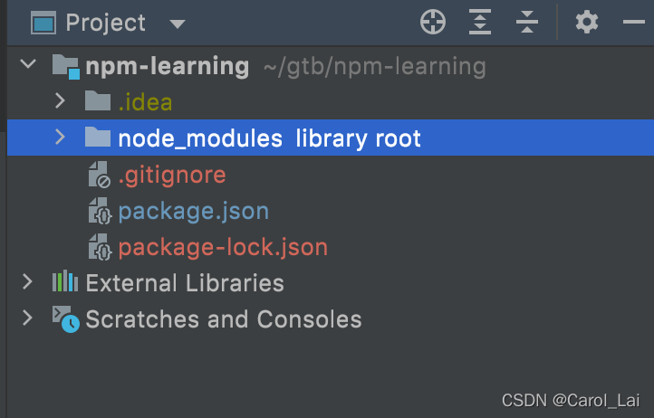

# npm学习笔记

### 前言

开发一个项目需要依赖很多的package，如果每个依赖都需要开发者从这些package的官网下载下来，将会是非常繁琐和浪费时间的。因此人们开发了**包管理器**，例如apt-get、pip、grandle、homebrew、npm等等。

## 1、npm简介

- npm，全名 node package manger
- npm 是`Node`的开放式模块登记和管理系统，是`Node.js`包的标准发布平台，用于`Node.js`包的发布、传播、依赖控制，网址：[https://www.npmjs.com/](https://links.jianshu.com/go?to=https%3A%2F%2Fwww.npmjs.com%2F) 
- npm 提供了命令行工具，可以方便地下载、安装、升级、删除包，也可以让你作为开发者发布并维护包

## 2、npm使用

- npm 是 Node.js 默认的软件包管理系统， 安装 Node.js 时会默认安装 npm。

    但有可能不是最新版本，需要 `npm install npm@latest -g` 升级到最新版本。

    > npm install npm@latest -g

### Ⅰ、基本命令

```bash
# 查看 npm 的版本
$ npm -v

# 重新安装 npm
$ npm -i   ||  npm -install
$ npm -install npm -g  全局安装最新版本

# 更新 npm 版本
$ npm -g install npm@5.9.1

# 卸载 npm
$ npm -unistall

# 查看 npm 命令列表
$ npm help 
$ npm help <command>  # 查看某条命令的详细帮助

# 查看各个命令的简单用法
$ npm -l

# 查看 npm 的配置
$ npm config list -l

# 安装 指定包 <Module Name>
$ npm install <Module Name>

# 卸载 指定包 <Module Name>
$ npm uninstall <Module Name>

# 安装 指定包 <Module Name> 的指定版本
$ npm install <Module Name>@3.0.0

# 更新 指定包 <Module Name> 为最新版本
$ npm updata <Module Name>

# -sava 在 package文件的 dependencies 节点写入依赖
$ npm -instanll <Module Name> -sava

# -sava-dev 在 package文件的 devDependencies 节点写入依赖 [默认]
$ npm -instanll <Module Name> -sava-dev

# dependencies: 运行时的依赖，发布后，即生产环境下还需要用的模块
# devDependencies: 开发时的依赖，仅开发时需要，发布后，不在需要用的模块。如 项目组使用的 gulp，压缩css、js的模块
```

##### -save 与 -save-dev

- install命令可以使用不同参数，指定所安装的模块属于哪一种性质的依赖关系，即出现在packages.json文件的哪一项中

```
–save：模块名将被添加到dependencies，可以简化为参数-S。
–save-dev: 模块名将被添加到devDependencies，可以简化为参数-D。
```

##### npm run

- npm 不仅可以用于模块管理，还可以用于执行脚本。
- package.json 文件有一个 scripts 字段，可以用于指定脚本命令，供 npm 直接调用。

##### scripts 脚本

- 可以通过 npm run script-key 来调用，使用 scripts 的目的就是为了把一些要执行的代码合并到一起，使用 npm run 来快速的运行，
- npm run 是 npm run-script 的缩写，一般都使用前者，但是后者可以更好的反应这个命令的本质。
- npm run 如果不加任何参数，直接运行，会列出 package.json 里面所有可以执行的脚本命令
- npm 内置了两个命令简写， npm test 等同于执行 npm run test ，npm start 等同于执行 npm run start。

#### 实例:使用npm安装jquery

- 在桌面新建 npmtest 文件夹
- 终端进入 npmtest 文件夹

```
cd Desktop
cd npmtest
dir   // 查看目录
// 全局安装 jquery
npm install jquery -g 
// 仅指定文件夹安装 jquery, 文件夹目录出现 node_modules、package,json、package-lock.json
npm install jquery
```

### Ⅱ、npm 镜像的设置与查看

##### 设置成淘宝镜像

> npm config set registry https://registry.npm.taobao.org -- global
>
> npm config get disturl https://npm.taobao.org/dist --global

##### 设置当前地址（设置为默认地址）

> npm config set registry https://registry.npmjs.org -- global

##### 查看镜像的配置结果

> npm config get registry
>
> npm config get disturl

##### 使用nrm工具切换淘宝源

> npm nrm use taobao

##### 之后切换回官方源

> npm nrm use npm

通常在开发工具内的终端中使用命令，管理员身份打开开发工具，提升权限

### Ⅲ、package.json 配置

#### npm init 初始化 package.json 文件

`packages.json`文件，用于管理项目内所需要的包。

```
name          // 包名
version       // 包版本号
description   // 包描述
homepage      // 包官网url
author        // 包作者
contributors  // 包的其他贡献者姓名
dependencies  // 依赖包列表
repository    // 包代码存放地方：git（github）/svn
main          // 程序主入口文件
keywords      // 关键字
```

方法1：自动生成 package.json 文件

> npm init --yes

方法2：自定义 package.json 文件

> npm init

##### npm set 设置环境变量

- 下面命令等于为`npm init`设置了默认值，以后执行`npm init`的时候，`package.json`的作者姓名、邮件、主页、许可证字段就会自动写入预设的值。这些信息会存放在用户主目录的`~/.npmrc`文件，使得用户不用每个项目都输入。

```
  $ npm set init-author-name 'Your name'
  $ npm set init-author-email 'Your email'
  $ npm set init-author-url 'http://yourdomain.com'
  $ npm set init-license 'MIT'
```

如果某个项目有不同的设置，可以针对该项目运行`npm config`。

##### 版本号含义

```
2.2.0    # 必须是2.2.0
^2.2.0   # 限定大版本，后面更新只要不超过2尽可以
~2.2.0   # 限定前两个版本，后面的版本只要比0大就可以
=2.0     # 大于这个版本
<=2.0
1.0.0 - 2.0.0
// 预发版本
alpha    # 预览版 内部测试版
beta     # 测试版 公开测试版
rc       # 最终测试版本
```


### Ⅳ、使用npm管理项目

#### 1.安装Node.js

安装Node.js时会顺带安装npm。从[Node.js官网](https://nodejs.org/en/)下载对应平台的安装程序。打开终端，输入`node -v`和`npm -v`，出现版本号表示安装成功。

#### 2.创建项目目录

```
mkdir npm-learning
cd npm-learning/
```

#### 3.创建Git本地仓库

```
git init
```

#### 4.初始化项目依赖文件

创建一个`packages.json`文件，用于管理项目内所需要的包。

```
npm init --yes
```

#### 5.将 package.json 传到本地仓库

```
git add .
git commit -m "init npm"
```

#### 6.使用npm下载依赖

使用npm下载依赖有三种模式：

```
npm install <package>
```

```
npm install <package> --save
```

```
npm install <package> --save-dev
```

第一种和其他两种区别在于其不会修改`package.json`，而后两者会将依赖添加进`package.json`。

#### 7.关于依赖包的版本记录

- 在执行完`npm install <package> (--save/--save-dev)`后，packjson.json会记录该依赖包在项目里需要的**最低版本号**；
- 其次会生成一个`packjson-lock.json`文件，该文件记录项目里下载的依赖包的**具体版本**。
- 如果`packjson.json`与`packjson-lock.json`中package的版本号有冲突时，会优先选择`packjson.json`里的版本进行下载，重新生成依赖关系。
    因此，`packjson-lock.json`**需要**被提交到git仓，以便团队使用**同一种版本依赖**。

#### 8.更新和删除版本依赖

```
npm update <package>  // 更新包
```

```
npm uninstall <package>  // 删除包
```

操作后`packjson.json`与`packjson-lock.json`会随之更改。

#### 9.忽略本地idea配置和本地依赖包



- .idea目录的文件存储本地项目的详细配置，一般**不需要**上传到团队的git仓
- node_modules目录存储着下载到本地的依赖包，体积太大，不需要上传到git仓。

##### 可以通过往.gitignore文件添加该目录名称来实现。

```
vi .gitignore
```

修改后.gitignore内容如下：

```
.idea
node_modules
```

### Ⅴ、发布项目到NPM Register的流程

#### 1.注册NPM用户

[注册](https://www.npmjs.com/signup)

#### 2.依据NPM的标准开发自己的js库

[标准](https://docs.npmjs.com/getting-started)

#### 3.确定自己的库是public/private

#### 4.命令行发布/撤销发布

```
npm publish/unpublish
```

#### 5.在NPM网站检查是否发布成功