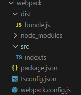
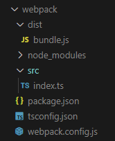

# TypeScript概述

### 1.开发环境搭建

#### 下载安装node.js

- 命令行/powershell指令

    - > 查看node.js版本			node -v

    - > 全局安装typescript        npm i -g typescript

    - > 查看typescript               tsc

#### 使用国内镜像

> ​     npm config set registry https://registry.npmmirror.com

#### 使用npm全局安装typescript

- 进入命令行

- 输入：

    > npm i -g typescript

#### 创建一个ts文件

#### 使用tsc对ts文件进行编译

- 进入命令行

- 进入ts文件所在目录

- 执行命令：

    > tsc xxx.ts

### 2.基本类型

#### 类型声明

- 类型声明是TS非常重要的一个特点

- 通过类型声明可以指定TS中变量（参数、形参）的类型

- 指定类型后，当为变量赋值时，TS编译器会自动检查是否符合类型声明，符合则赋值，否则报错

- 简而言之，类型声明给变量设置了类型，使得变量只能存储某种类型的值

- 语法：

  - ```typescript
    let 变量：类型；
    
    let 变量：类型 = 值;
    
    function fn(参数1：类型，参数2：类型)：类型 ｛
    
    ｝
    ```

#### 类型推断

- TS拥有自动的类型判断机制
- 当对变量的声明和赋值时同时进行的，TS编译器会自动判断变量的类型
- 所以如果你的变量的声明和赋值时同时进行的，可以省略掉类型声明

#### 类型：

|  类型   |        例子        |               描述               |
| :-----: | :----------------: | :------------------------------: |
| number  |    1, -33, 2.5     |             任意数字             |
| string  |      “hello”       |            任意字符串            |
| boolean |    true、false     |       布尔值 true 或 false       |
| 字面量  |       其本身       |   限制变量的值就是该字面量的值   |
|   any   |         *          |             任意类型             |
| unknow  |         *          |          类型安全的 any          |
|  void   | 空值（undefined）  |       没有值（或undefined)       |
|  never  |       没有值       |           不能是任何值           |
| object  | ｛name: ‘孙悟空’｝ |          任意的 JS 对象          |
|  array  |     [1, 2, 3]      |          任意的 JS 数组          |
|  tuple  |       [4, 5]       | 元组， TS新增类型， 固定长度数组 |
|  enum   |     enum{A, B}     |        枚举， TS新增类型         |

##### number

- ```typescript
  let decimal: number = 6;
  let hex: number = 0xf00d;
  let binary: number = 1b1010;
  let octal: number = 0o744;
  let big: bigint = 100n;
  ```


##### string

- ```typescript
    let b: "male" | "female";
    b = "male";
    ```

##### boolean

- ```typescript
    let c: boolean | string;
    c = true;
    c = 'hello';
    ```

##### any

- ```typescript
    // any 表示任意类型。一个变量设置了 any 后，相当于对该变量关闭了TS的类型检测
    // 使用 TS 时，不建议使用 any 类型
    let d: any; // 显示 any
    let e; // 隐式 any （声明变量时不指定类型）
    ```

##### unknown

- ```typescript
    // unknown 表示未知类型的值
    let f: unknown;
    f = 15;
    f = true;
    f = 'hello';
    ```

- any类型的变量可以赋值给任意变量；但unknown 类型的变量不能直接赋值给其他变量

- ```typescript
    let s: string;
    // d 的类型是any，可赋值给任意变量，不报错
    s = d;
    // f 的类型是 unknown，不可以【直接赋值】给任意变量，会报错
    // s = f; // 报错
    ```

##### 类型检查

- ```typescript
    // 类型检查后可以赋值
    if(typeof f == "string") {
        s = f;
    }
    ```

##### 类型断言（Type Assertion）

- 类型断言可以用来手动指定一个值的类型，即允许变量从一种类型更改为另一种类型。

- ```typescript
    // 类型断言 — 可以用来告诉解析器变量的实际类型
    s = f as string;
    // s = <string>f;  // 另一种表示方法
    console.log(s);
    ```

##### void

- void 用来表示空值，以函数为例，就表示没有返回值（或返回undefined）的函数

    ```typescript
    function fn2(): void{
    
    }
    123
    ```

##### never

- never 表示永远不会返回结果；没有值（比较少用，一般是用来抛出错误）

- ```typescript
    function fn3():never {
        throw new Error('报错了!')
    }
    ```

##### object

- 用来指定对象中可以包含哪些属性

- ```typescript
    // object 表示一个 JS 对象
    let a: object;
    a = {};
    a = function () {
    
    };
    
    // {} 用来指定对象中可以包含哪些属性
    // 语法： ｛属性名：属性值， 属性名： 属性值｝
    // 在属性名后加 ？ ，表示为可选属性
    let b: { name: string, age?: number };
    b = { name: 'coco', age: 18 };
    
    // 需求：除 name 外，对象后可追加多个属性 解决：[]
    // 1. propName 变量名，可随意  —— [propName: string] 表示任意字符串类型属性名
    // 2. ：any 表示任意类型
    // 3. [propName: string]: any —— 表示任意类型的属性
    let c: {name: string, [propName: string]: any};
    c = {name: 'coco', a: 1, b: 2}
    ```

##### 设置函数结构的类型声明

- ```typescript
    // 需求： 限制变量的 函数结构： 参数个数，返回值类型 解决：类似箭头函数
    /* 语法：
        (形参: 类型, 形参: 类型) => 返回值类型 */
    let d: (a: number, b: number) => number;
    d = function (n1: number, n2: number) {
        return n1 + n2;
    }
    ```

##### array

- ```typescript
    // sting[] 表示字符串数组
    let e: string[];
    e = ['1', '2', 3]; // 报错：不能将类型“number”分配给类型“string”
    // number[] / Array<number> 表示数值数组
    let f: number[];
    f = [1, 2, 'hello']; // 报错： 不能将类型“string”分配给类型“number”
    let g: Array<number>;
    g = [1, 2, 'hello2'] // 报错： 不能将类型“string”分配给类型“number”
    ```

##### tuple（ts新增类型）

- tuple(元组)：就是固定长度的数组

- ```typescript
    /* 
    语法：[类型, 类型, 类型]
     */
    let h: [string, number];
    h = ['1', 2];
    ```

##### enum（ts新增类型）

- 枚举可以把所有可能的值都列举出来

- ```typescript
    // 结果是在多个值之间选择时，适合用枚举 enum
    // 定义一个枚举类
    enum Gender {
        male = 1,
        female = 0
    }
    let i: { name: string, gender: Gender };
    i = {
        name: 'coco',
        gender:  Gender.male // 'male'
    }
    console.log(i.gender === Gender.male);
    ```

##### 补充 ( & 与 类型别名 )

- ```typescript
    // & 同时满足
    // 用以连接两个对象，需同时满足才不报错
    let j: {name: string} & {age: number};
    j = {name: 'coco', age: 18};
    ```

- ```typescript
    // 比较麻烦
    let k: 1 | 2 | 3 | 4 | 5;
    let m: 1 | 2 | 3 | 4 | 5;
    // 使用类型别名简化
    type myType = 1 | 2 | 3 | 4 | 5;
    let n: myType;
    n =6; // 报错： 不能将类型“6”分配给类型“myType”
    ```

### 3.编译选项

##### 自动编译文件

- 单文件自动编译
  
    - tsc TS文件 -w
    
- 多文件自动编译

    - 先在文件夹下新建 tsconfig.json 文件，进行编译配置
    - 然后在命令行执行`tsc -w` 可以对**所有ts文件**进行监视，若有修改则会自动重新编译。

    **tsconfig.json 是ts编译器的配置文件，ts编译器可以根据它的信息来对代码进行编译**

##### tsconfig.json文件

- ```typescript
    {
        /*
        	tsconfig.json 是ts编译器的配置文件，ts编译器可以根据它的信息来对代码进行编译
        */
        //  1. "include" 用来指定那些 TS 文件需要被编译 
        //  2. 路径: **表示任意目录, *表示任意文件
        "include": [
            "./src/**/*"
        ],
    
        // 1. "exclude" 用来表示不需要被编译的文件目录
        // 2. [“node_modules”, “bower_components”, “jspm_packages”]
        "exclude": [
            "./src/hello/**/*" // 仅 hello 下文件不被编译
        ],
    
    
        // "extends" 定义被继承的配置文件
        "extends": [
            "./configs/base"  // 当前配置文件中会自动包含configs目录下base.json中的所有配置
        ],
    
        // 指定被编译文件的列表，只有需要编译的文件少时才会用到
        "files": [           // 列表中的文件都会被 TS 编译器编译
            "core.ts",
            "core2.ts",
            "core3.ts",
            "core4.ts",
            "core5.ts",
        ],
    
        // compilerOptions有很多的子选项 , compilerOptions有很多的子选项
        "compilerOptions": {
            // target 用来指定 ts 被编译为 ES 的版本
            // "es3", "es5", "es6", "es2015", "es2016", "es2017", "es2018", "es2019", "es2020", "esnext"
            "targer": "es2016",
    
            // module 指定要使用的模块化的规范
            // "none", "commomjs", "amd", "system", "es6", "es2015", "es2020", "esnsxt"
            "module": "commonjs",
    
            // "lib" 用来指定项目使用的库
            //  ES5、ES6、ESNext、DOM、WebWorker……
            "lib": [],    // 一般情况下不需要设置（浏览器运行不用管，nodejs运行的再根据需求设置）
    
            //  "outDir" 用来指定编译后文件所在的目录，分离源码和编译后的文件
            "outDir": "./dist",
    
            //  "outFile" 将代码合并为一个文件
            //  设置 outFile 后，所有的全局作用域中的代码会合并到同一个文件中
            "outFile": "./dist/app.js",  // 将编译后的文件合并到app.js中
    
            //  是否对 js 文件进行编译。默认是 false
            "allowjs": false,
    
            // 是否检查 js 代码是否符合语法规范，默认是 false
            "checkjs": false,
    
            // 是否移除注释
            "removeComments": true,
    
            // 不生成编译后的文件
            "noEmit": false,
    
            // 报错时不生成编译文件
            "noEmitOnError": true,
    
            // 所有严格检查的总开关，包括下面 4 个（如果相同可直接用这个，下面 4 个省略）
            "strict": true,
    
            // 用来设置编译后的文件是否使用严格模式。默认时false
            "alwaysStrict": true,
    
            // 不允许隐式的any类型
            "noImplicitAny": true,
    
            // 不允许不明确类型的this
            "noImplicitThis": true,
    
            // 严格检查空值
            "strictNullChecks": true
        }
    }
    ```

### 4.webpack

*一般项目中我们不会直接编译ts代码，而是使用打包工具来进行*

##### 创建项目文件夹，生成package.json，作用：管理项目

- 初始化项目 ：

    > npm init -y

##### 安装使用webpack所用的依赖：（ 4个包 ）

- npm

- cnpm（国内镜像，速度较快）

    > cnpm i -D webpack webpack-cli typescript ts-loader

    - -D ：开发依赖，savaDev的简写
    - webpack：打包工具的核心代码
    - webpacl-cli：命令行工具，可使用命令行使用webpack
    - typescript：ts核心包
    - ts-loader：webpack的加载器，将typescript和webpack整合到一起

    [问题](http://www.voycn.com/article/cnpm-wufajiangcnpmxiangshibiewei-cmdlethanshujiaobenwenjianhuokeyunxingchengxudemingcheng)[^1]

    [^1]: 无法将“cnpm”项识别为 cmdlet、函数、脚本文件或可运行程序的名称

##### webpack目录下新建webpack.config.js文件

- ```javascript
    // 引入一个包(nodejs中一个模块，主要作用是拼接路径)
    const path = require('path');
    
    // webpack 中所有的配置信息都应该写在 module.exports 中
    module.exports = {
        // 指定入口文件
        entry: "./src/index.ts",
    
        // 指定打包文件所在目录
        output: {
            // 指定打包文件目录
            path: path.resolve(__dirname, 'dist'),
            // 打包后文件的名字
            filename: "bundle.js"
        },
    
        // 指定webpack打包时要使用的模块
        module: {
            // 指定要加载的规则
            rules: [
                {
                    // test指定的是规则生效的文件
                    test: /\.ts$/,
                    // 要使用的loader
                    use: 'ts-loader',
                    // 指定要排除的文件
                    exclude: /node-modules/
                }
            ]
        },
        mode: "development"
    }
    
    ```

##### webpack目录下新建 tsconfig.json 文件

- ```json
    {
        "compilerOptions": {
            "module": "ES2015",
            "target": "ES2015",
            "strict": true
        }
    }
    ```

##### 修改 package.json 文件

- ```json
    {
      "name": "webpack",
      "version": "1.0.0",
      "main": "index.js",
      "scripts": {
        "test": "echo \"Error: no test specified\" && exit 1",
        "build": "webpack"
      },
      "keywords": [],
      "author": "",
      "license": "ISC",
      "description": "",
      "devDependencies": {
        "ts-loader": "^9.3.0",
        "typescript": "^4.6.4",
        "webpack": "^5.72.0",
        "webpack-cli": "^4.9.2"
      }
    }
    
    ```

- 在package.json中加上build命令`"build": "webpack",`执行`npm run build`即可进行编译打包

    > npm run build

    

#### 常用插件

##### 	1.html-webpack-plugin

- html插件能帮助我们在打包时自动地生成html文件

    - > cnpm i -D html-webpack-plugin

    - 下载完成后，package.json 会更新

        ```json
        "devDependencies": {
            "html-webpack-plugin": "^5.5.0", // 更新
            "ts-loader": "^9.3.0",
            "typescript": "^4.6.4",
            "webpack": "^5.72.0",
            "webpack-cli": "^4.9.2"
        ```

    - 在 webpack.congig.js 文件中引入 html 插件

        ```javascript
        // 引入一个包(nodejs中一个模块，主要作用时拼接路径)
        const path = require('path');
        // 引入 html 插件
        const HTMLWebpackPlugin = require('html-webpack-plugin');
        
        *****
        
        	mode: "development",
        
            // 配置 webpack 插件
            plugins: [
                new HTMLWebpackPlugin({
                    // title: "出岫构建",
                    // 设置 html 模版（在src文件夹下新建 index.html文件，并设置模版样式）
                    template: "./src/index.html" 
                }),
            ]
        ```

        在src目录下新建 index.html 模版文件
        
        > npm run build

##### 	2.webpack-dev-server

 - 该插件能自动响应浏览器更新

 - 安装：

    > cnpm i -D webpack-dev-server

- 在package.json中加上start命令：

    > "start": "webpack serve --open chrome.exe"

    ```json
    "scripts": {
        "test": "echo \"Error: no test specified\" && exit 1",
        "build": "webpack",
        "start": "webpack serve --open --mode production" // 更新
      }
    ```
    
    > npm start

##### 3.clean-webpack-plugin

- 能在build前清空dist目录所有文件，避免旧文件的遗留

- 目前：在 output 写入 clean： true

    ```javascript
    output: {
            // 指定打包文件目录
            path: path.resolve(__dirname, 'dist'),
            // 打包后文件的名字
            filename: "bundle.js",
            // 在build前清空dist目录所有文件，避免旧文件的遗留
            clean: true
        },
    ```

- 安装：

    >   cnpm i -D clean-webpack-plugin

- 使用：

    ```javascript
    // 引入一个包(nodejs中一个模块，主要作用时拼接路径)
    const path = require('path');
    // 引入 html 插件
    const HTMLWebpackPlugin = require('html-webpack-plugin');
    // 引入 clean 插件
    const { cleanWebpackPlugin } = require('clean-webpack-plugin');
    
    ****
        
    // 配置 webpack 插件
        plugins: [
            new cleanWebpackPlugin(),
            new HTMLWebpackPlugin({
                // title: "出岫构建",
                // 设置 html 模版（在src文件夹下新建 index.html文件，并设置模版样式）
                template: "./src/index.html"
            }),
        ]
    ```

##### 4.babel

为了使得代码能兼容不同浏览器，我们需要使用babel工具（与webpack结合一起使用）。

- 安装依赖：（四个）

> cnpm i -D @babel/core @babel/preset-env babel-loader core-js

	- @babel/core—babel核心的工具

- @babel/preset-env—babel的预设环境
- babel-loader—babel与webpack结合的工具
- core-js—模拟js运行环境（使用时可以按需引入）

- 修改webpack配置文件

在loader加载器中加入babel（loader中的执行顺序是从下往上，所以需要将’ts-loader’放在最后）

```javascript
// 引入一个包(nodejs中一个模块，主要作用时拼接路径)
const path = require('path');
// 引入 html 插件
const HTMLWebpackPlugin = require('html-webpack-plugin');
// 引入 clean 插件
const {
    cleanWebpackPlugin
} = require('clean-webpack-plugin');

// webpack 中所有的配置信息都应该写在 module.exports 中
module.exports = {
    // 指定入口文件
    entry: "./src/index.ts",

    // 指定打包文件所在目录
    output: {
        // 指定打包文件目录
        path: path.resolve(__dirname, 'dist'),
        // 打包后文件的名字
        filename: "bundle.js",
        // 在build前清空dist目录所有文件，避免旧文件的遗留
        clean: true
    },

    // 指定webpack打包时要使用的模块
    module: {
        // 指定要loader加载的规则
        rules: [{
            // test指定的是规则生效的文件
            test: /\.ts$/, //以ts结尾的文件
            // 要使用的loader
            use: [
                // 配置babel
                {
                    //指定加载器
                    loader: "babel-loader",
                    // 设置babel
                    options: {
                        //设置预定义的环境
                        presets: [
                            [
                                //指定环境的插件
                                "@babel/preset-env",
                                // 配置信息
                                {
                                    // 要兼容的目标浏览器及版本
                                    targets: {
                                        "chrome": "58",
                                        "ie": "11"
                                    },
                                    //指定corejs的版本（根据package.json中的版本，只写整数）
                                    "corejs": "3",
                                    //使用corejs的方式 "usage"  表示按需加载
                                    "useBuiltIns": "usage"
                                }

                            ]
                        ]
                    }
                },
                // 'babel-loader',
                'ts-loader'
            ],
            // 要排除的文件
            exclude: /node-modules/
        }]
    },
    mode: "development",
    // 配置 webpack 插件
    plugins: [
        new HTMLWebpackPlugin({
            // title: "出岫构建",
            // 设置 html 模版（在src文件夹下新建 index.html文件，并设置模版样式）
            template: "./src/index.html"
        }),
    ]
}
```

#### 最基本的webpack 配置



##### tsconfig.json 配置

```json
{
    // "include": [
    //     "./src/**/*"
    // ],
/* "exclude": [
        
    ], */
    "compilerOptions": {
        "target": "es6",
        "module": "es6",
        "strict": true,
        // "outDir": "./dist"
    }
}
```

##### package.json 配置

```
{
  "name": "webpack",
  "version": "1.0.0",
  "main": "index.js",
  "scripts": {
    "test": "echo \"Error: no test specified\" && exit 1",
    "build": "webpack"
  },
  "keywords": [],
  "author": "",
  "license": "ISC",
  "description": "",
  "devDependencies": {
    "ts-loader": "^9.3.0",
    "typescript": "^4.6.4",
    "webpack": "^5.72.0",
    "webpack-cli": "^4.9.2"
  }
}
```

##### webpack.config.js 配置

```
// 引入一个包(nodejs中一个模块，主要作用时拼接路径)
const path = require('path');

// webpack 中所有的配置信息都应该写在 module.exports 中
module.exports = {
    // 指定入口文件
    entry: "./src/index.ts",

    // 指定打包文件所在目录
    output: {
        // 指定打包文件目录
        path: path.resolve(__dirname, 'dist'),
        // 打包后文件的名字
        filename: "bundle.js"
    },

    // 指定webpack打包时要使用的模块
    module: {
        // 指定要加载的规则
        rules: [
            {
                // test指定的时规则生效的文件
                test: /\.ts$/,
                // 要使用的loader
                use: 'ts-loader',
                // 指定要排除的文件
                exclude: /node-modules/
            }
        ]
    },
    mode: "development"
}
```

#### 安装插件后的配置

##### package.json

```json
{
  "name": "webpack",
  "version": "1.0.0",
  "main": "index.js",
  "scripts": {
    "test": "echo \"Error: no test specified\" && exit 1",
    "build": "webpack",
    "start": "webpack serve --open --mode production"
  },
  "keywords": [],
  "author": "",
  "license": "ISC",
  "description": "",
  "devDependencies": {
    "@babel/core": "^7.17.10",
    "@babel/preset-env": "^7.17.10",
    "babel-loader": "^8.2.5",
    "clean-webpack-plugin": "^4.0.0",
    "core-js": "^3.22.4",
    "html-webpack-plugin": "^5.5.0",
    "ts-loader": "^9.3.0",
    "typescript": "^4.6.4",
    "webpack": "^5.72.0",
    "webpack-cli": "^4.9.2",
    "webpack-dev-server": "^4.9.0"
  }
}
```

##### webpack.config.js

```javascript
// 引入一个包(nodejs中一个模块，主要作用时拼接路径)
const path = require('path');
// 引入 html 插件
const HTMLWebpackPlugin = require('html-webpack-plugin');
// 引入 clean 插件
const {
    cleanWebpackPlugin
} = require('clean-webpack-plugin');

// webpack 中所有的配置信息都应该写在 module.exports 中
module.exports = {
    // 指定入口文件
    entry: "./src/index.ts",

    // 指定打包文件所在目录
    output: {
        // 指定打包文件目录
        path: path.resolve(__dirname, 'dist'),
        // 打包后文件的名字
        filename: "bundle.js",
        // 在build前清空dist目录所有文件，避免旧文件的遗留
        clean: true
    },

    // 指定webpack打包时要使用的模块
    module: {
        // 指定要loader加载的规则
        rules: [{
            // test指定的是规则生效的文件
            test: /\.ts$/, //以ts结尾的文件
            // 要使用的loader
            use: [
                // 配置babel
                {
                    //指定加载器
                    loader: "babel-loader",
                    // 设置babel
                    options: {
                        //设置预定义的环境
                        presets: [
                            [
                                //指定环境的插件
                                "@babel/preset-env",
                                // 配置信息
                                {
                                    // 要兼容的目标浏览器及版本
                                    targets: {
                                        "chrome": "58",
                                        "ie": "11"
                                    },
                                    //指定corejs的版本（根据package.json中的版本，只写整数）
                                    "corejs": "3",
                                    //使用corejs的方式 "usage"  表示按需加载
                                    "useBuiltIns": "usage"
                                }

                            ]
                        ]
                    }
                },
                // 'babel-loader',
                'ts-loader'
            ],
            // 要排除的文件
            exclude: /node-modules/
        }]
    },
    mode: "development",
    // 配置 webpack 插件
    plugins: [
        new HTMLWebpackPlugin({
            // title: "出岫构建",
            // 设置 html 模版（在src文件夹下新建 index.html文件，并设置模版样式）
            template: "./src/index.html"
        }),
    ]
}
```

##### tsconfig.json

```json
{
    "include": [
        "./src/**/*"
    ],
    "exclude": [

    ],
    "compilerOptions": {
        "target": "es6",
        "module": "es6",
        "strict": true,
        "outDir": "./dist"，
        "noEmitOnError": true
    }
}
```

### 5.面向对象

#### 1.面向对象

面向对象是程序中一个非常重要的思想，简而言之就是程序之中所有的操作都需要通过对象来完成。对象中有属性和方法。

例子：

	操作浏览器要使用window对象
	操作网页要使用document对象
	操作控制台要使用console对象
#### 2.类

- 类描述了所创建的对象共同的属性和方法。
- TypeScript 支持面向对象的所有特性，比如 类、接口等。

##### 1.创建类

```typescript
// 使用 class 关键字 定义一个类
/* 对象中主要包含两个部分：
    属性 + 方法 */
class Person {
    // 定义实例属性
    name: string = "coco",
    readonly age: number = 18,
    // 在属性前使用 static 关键字可以定义 类属性（静态属性）
    // 类属性（静态属性）：不需要创建对象就可使用
    static eyeColor: string = "blue"

    // 定义实例方法
    sing() {
        console.log('hello~~');
    }
    // 定义类方法
    static singlala() {
        console.log('la~la~la~');
        
    }

}
const per1 = new Person();
console.log(per1);
console.log(per1.age);
console.log(Person.age);  // 报错。无法访问类的实例属性
console.log(Person.eyeColor);

// 实例属性可读写，readonly 开头的属性表示为只读属性，无法修改
per1.name = "elice";
console.log(per1.name);
per1.age = "20";  // 报错： 无法分配到 "age" ，因为它是只读属性
// 静态属性也可加 readonly 变为只读静态属性

// 调用类的实例方法
per1.sing();
// 调用类方法
Person.singlala();
```

##### 2.构造函数

```typescript
class Dog {
    name: string;
    age: number;
    // constructor: 构造函数()，会在对象创建时调用
    constructor(name: string, age: number) {
        // 在构造函数中，this 表示当前的实例对象
        // 可通过 this 向新建对象中添加属性

        // 向构造函数写入参数可创建不同的对象
        this.name = name;
        this.age = age;
    }

    bark() {
        console.log(this);
        
    }
}

const dog = new Dog("coco", 2);
const dog2 = new Dog("divde", 3);

console.log(dog);
console.log(dog2);

dog.bark();
dog2.bark();
```

##### 3.继承

- 不适用类继承所产生问题

    ```typescript
    // 避免不同文件变量名冲突，代码写在立即执行函数中，使其作用域不同
    (function () {
        // 定义一个 Dog 类
        class Dog {
            name: string;
            age: number;
    
            constructor(name: string, age: number) {
                this.name = name;
                this.age = age;
            }
    
            sayHello() {
                console.log('汪汪汪');
    
            }
        }
        const dog = new Dog("旺财", 5);
        console.log(dog);
        dog.sayHello();
    
        // 定义一个 Cat 类
        class Cat {
            name: string;
            age: number;
    
            constructor(name: string, age: number) {
                this.name = name;
                this.age = age;
            }
    
            sayHello() {
                console.log('喵喵喵');
    
            }
        }
        const cat = new Cat("kitty", 3);
        console.log(cat);
        cat.sayHello();
    
        // 问题：两个不同类有代码重复的部分
        // 解决：将相同的代码提取出来定义一个大的 Animal 类
        class Animal {
            name: string;
            age: number;
    
            constructor(name: string, age: number) {
                this.name = name;
                this.age = age;
            }
    
            sayHello() {
                console.log('动物在叫');
    
            }
        }
    })();
    ```

- 子类继承父类的属性和方法

- 子类添加属性+方法

- 子类覆盖掉父类的属性和方法 —— 方法重写

    ```typescript
    // 避免不同文件变量名冲突，代码写在立即执行函数中，使其作用域不同
    (function () {
        /* 
        *   Dog extends Animal
        *   - 此时，Animal 被称为 父类， Dog 被称为 子类
        *   - 使用继承后，子类将继承父类的所有属性和方法
        *   - 通过继承可以将多个类中共同代码写在一个父类中
        *   - 这样只需写一次代码可让所有子类同属拥有父类中的属性和方法
        *
        *   - 想添加父类没有的属性和方法，可在子类中直接写入属性和方法
        *   - 子类中添加于父类相同的方法，子类方法会覆盖父类方法
        */
    
        // 问题：两个不同类有代码重复的部分
        // 解决：将相同的代码提取出来定义一个大的 Animal 类
        class Animal {
            name: string;
            age: number;
            static gender: number;
    
            constructor(name: string, age: number, gender: number) {
                this.name = name;
                this.age = age;
                Animal.gender = gender;
            }
    
            sayHello() {
                console.log('动物在叫');
            }
        }
    
        // 定义一个 Dog 类
        // 继承 Animal 类
        class Dog extends Animal {
            // 添加父类中没有的 run() 方法
            run() {
                console.log(`${this.name}在跑~`);
            }
    
            // 
            sayHello() {
                console.log(`${this.name}在汪~汪~汪~！`);
            }
        }
        const dog = new Dog("旺财", 5, 1);
        console.log(dog);
        dog.sayHello();
        dog.run();
    
        // 定义一个 Cat 类
        // 继承 Animal 类
        class Cat extends Animal {
    
        }
        const cat = new Cat("kitty", 3, 0);
        console.log(cat);
        cat.sayHello();
    })()
    ```

##### 4.super

- 类方法中， super 表示当前类的父类

- 子类中，可通过super引用父类

    ```typescript
    (function () {
        class Animal {
            name: string;
            constructor(name: string) {
                this.name = name;
            }
    
            sayHello() {
                console.log('动物在说 hello！~');
            }
        }
    
        class Dog extends Animal {
            sayHello() {
                // 在类的方法中， super 就表示当前类的父类
                super.sayHello();
            }
        }
    
        const dog = new Dog("旺财");
        dog.sayHello();  // 输出： 动物在说 hello！~
    
    })();
    ```

- **如果在子类中写了构造函数，则在子类构造函数中必须对父类的构造函数进行调用**

    ```typescript
    (function () {
        class Animal {
            name: string;
            constructor(name: string) {
                this.name = name;
            }
    
            sayHello() {
                console.log('动物在说 hello！~');
            }
        }
    
        class Dog extends Animal {
            /* sayHello() {
                // 在类的方法中， super 就表示当前类的父类
                super.sayHello();
            } */
            age: number;
    
            constructor(name: string, age: number) {
                // 子类中写了构造函数，必须对父类的构造函数进行调用
                // 否则会出错
                // 使用 super(...父类参数名) 调用父类构造函数
                super(name);
                this.age = age;
                
            }
        }
    
        const dog = new Dog("旺财", 5);
        dog.sayHello();  // 输出： 动物在说 hello！~
    
    })();
    ```

##### 5.抽象类

- 以abstract 开头的类是抽象类

- 抽象类和其他类区别不大，只是不能用来创建对象

- 抽象类就是专门用来被继承的类

- 抽象类中可以添加抽象方法

    ```typescript
    (function () {
        /* 
        以 abstract 开头的是抽象类
            抽象类和其他类区别不大，只是不能用来创建对象
            抽象类是专门用来创建对象的类 
            
            抽象类中可以添加抽象方法
            期望： 在父类中自定义方法的解构，具体需求实现由子类完成
            定义抽象方法：在 方法 前添加 abstract,没有方法体
            抽象方法只能定义在抽象类中，子类必须对抽象方法进行重写
        */
        abstract class Animal {
            name: string;
            constructor(name: string) {
                this.name = name;
            }
    
            abstract sayHello():void;
        }
    
        class Dog extends Animal {
            sayHello(): void {
                console.log("汪汪汪汪");
                
            }    
        }
    
        class Cat extends Animal { // 报错，子类没重写父类的抽象方法
    
        }
    
        const dog = new Dog("旺财");
        dog.sayHello();
    
        const an = new Animal(); // 报错：无法创建抽象类的实例。
    
    })();
    ```


##### 6.接口（ts 新增）

接口用来定义一个类结构, 用来定义一个类中应该包含哪些属性和方法；同时接口也可以当成类型声明去使用。

- 接口可以在定义类的时候去限制类的结构
- 接口中所有的属性都不能有实际的值
- 接口只定义对象的结构，而不考虑实际值
- 在接口中所有的方法都是抽象类

```typescript
(function() {
    
    // 描述一个对象的类型
    type myType = {
        name: string;
        age: number;
        [porpName: string]: any
    }


    const obj: myType = {
        name: 'Alice',
        age: 18
    }

    // 也可用接口的形式定义一个类结构,用来定义一个类中应包含哪些属性和方法
    // 
    interface myInterface {
        name: string;
        age: number
    }

    interface myInterface {
        gender: number
    }

    const obj2: myInterface = {
        name: "bobo",
        age: 20,
        gender: 0
    }

    // 类型声明只能存在一个，接口可以多次声明，最终效果为合集

    /*
    接口可以在定义类的时候去限制类的结构，
    接口的所有属性都不能有实际值
    接口只定义对象的结构，而不考虑实际值
        接口中所有的方法都是抽象方法
    */
    interface myInter {
        name: string;
        sayHello():void;
    }

    // 定义类时，可使用类去实现一个接口
        // 实现接口就是使类满足接口的要求
    class myClass implements myInter {
        name: string;

        constructor(name: string) {
            this.name = name
        }

        sayHello(): void {
            throw new Error("Method not implemented.");
        }
        
    }
    
})()
```

接口与抽象类类似，区别在于

- 抽象类可以有抽象方法也可以有普通方法；但接口只能有抽象方法
- 抽象类使用extends继承；接口使用implements实现

##### 7.属性的封装

1.TS可以在类中的属性前添加属性的修饰符

- public 修饰的属性可以在任意位置访问（修改）**默认值**
- private 私有属性, 私有属性只能在类内部进行访问（修改）；但可以通过在类中添加方法使得私有属性可以被外部访问
- protected 受保护的属性,只能在当前类和当前类的子类中访问(修改)

2.js和ts封装属性的区别

由于属性是在对象中设置的，属性可以任意的被修改，将会导致对象中的数据变得非常不安全。因此需要对属性进行封装。

- **js封装的属性存取器使用时需要调用相应的getter和setter方法；**
- **而ts封装的属性存取器使用时可直接当作变量来用就行。**

*加getter和setter方法只是为了对属性的值做判断，如果不需做判断则没必要使用。*

***

问题：某些情况下，出于数据安全考虑，需灵活控制对象访问权

```typescript
(function () {
    // 定义一个表示人的类
    class Person {
        // TS可以在属性前添加属性的修饰符
        /*
        *   public(默认)  公共属性：修饰的属性可以在任意位置读写
        *   private      私有属性： 只能在类内部进行修改
        *        - 通过在类中添加方法使得私有属性可以在外部访问
        *        - 虽然很麻烦，但属性访问权可以控制，删除方法便不可访问
        * 
        */
        private _name: string;
        private _age: number;

        constructor(name: string, age: number) {
            this._name = name;
            this._age = age;
        }
        // 定义方法，用来获取 name 属性
        getName() {
            return this._name;
        }
        // 定义方法，用来设置 name 属性
        setName(value: string) {
            this._name = value;
        }
        // 定义方法，用来获取 age 属性
        getAge() {
            return this._age;
        }
        // 定义方法，用来修改 age 属性
        // 出于 数据安全 考虑，可通过判断后再修改
        setAge(value: number) {
            if (value > 0) {
                this._age = value
            }
        }

    }

    const per = new Person("coco", 18);
    // 现在属性是在对象中设置的，属性可以任意修改
    // - 属性可以被任意修改将会导致对象中的数据变得非常不安全
    console.log(per);
    per.setName('elice');
    console.log(per.getName()); // 输出： elice
    per.setAge(-33);
    console.log(per.getAge()); // 输出： 18   
})();
```

改进：在TS中，提供一种更加灵活的方式

应用场景：属性容易被修改错

```typescript
(function () {
    // 定义一个表示人的类
    class Person {
        // TS可以在属性前添加属性的修饰符
        /*
        *   public(默认)  公共属性：修饰的属性可以在任意位置读写
        *   private      私有属性： 只能在类内部进行修改
        *        - 通过在类中添加方法使得私有属性可以在外部访问
        *        - 虽然很麻烦，但属性访问权可以控制，删除方法便不可访问
        *  	protected	受保护的属性：只能在当前类和其子类中访问 
        */
        private _name: string;
        private _age: number;

        constructor(name: string, age: number) {
            this._name = name;
            this._age = age;
        }
        // 可直接通过 per.name 获取 name 原理是调用此方法
        get name() {
            console.log('get 被调用了'); 
            return this._name
        }
        
        set name(value: string) {
            console.log('set 被调用了');
            this._name = value;
        }

        get age() {
            return this._age;
        }

        set age(value: number) {
            if (value > 0) {
                this._age = value
            }
        }

    }

    const per = new Person("coco", 18);
    // 现在属性是在对象中设置的，属性可以任意修改
    // - 属性可以被任意修改将会导致对象中的数据变得非常不安全
    console.log(per);
    per.name = 'elice';
    console.log(per.name); 
    per.age = -33;
    console.log(per.age); // 输出： 18
})();
```

3.在定义类时可以直接将属性定义在构造函数中（简化代码），实际上是语法糖

```typescript
/* class Person {
        name: string;
        age: number;

        constructor(name: string, age: number) {
            this.name = name;
            this.age = age;
        }
    } */

    // ↑ 等价 ↓

    class Person {
        // 可以直接将属性定义在构造函数中
        constructor(public name: string, public age: number) {

        }
    }
    const per = new Person('coco', 18);
    console.log(per.name, per.age);
```

##### 8.泛型（ts新增）

泛型就是不确定的类型**（定义时不确定，执行了才确定）**。在定义函数或是类时,如果遇到类型不明确就可以使用泛型。

```typescript
/* function fn(a: any): any {
    return a;
} */

// 在定义函数或是类时,如果遇到类型不明确就可以使用泛型。
/*  优点 
    1：不用 any ，避免跳过类型检查
    2：体现出参数和返回值一致 */

function fn<K>(a: K): K {
    return a;
}

// 可以直接调用具有泛型的函数
let result = fn(10); // 不指定泛型，TS 自动对类型进行推断
let result2 = fn<string>('hello') // 指定泛型

// 泛型可以指定多个
function fn2<K, T>(a: K, b: T) {
    console.log(b);
    return a;
}

let result3 = fn2<number, string>(123, 'hello');

interface Inter {
    length: number;
}
// K extends Inter 表示泛型 K 必须是 Inter实现类（子类）
function fn3<K extends Inter>(a: K) {
    return a.length;
}

// 类中也可以使用泛型
class myClass<K> {
    name: K;
    constructor(name: K) {
        this.name = name;
    }
}
const mc = new myClass<string>('coco');
```

### 6.实战项目：贪吃蛇

#### 1.项目搭建

- 准备好之前的webpack.config.js、tsconfig.json、package.json、package-lock.json四个文件，然后执行npm i安装依赖

- 安装依赖

    > npm i

    新建src文件夹，新建 index.ts、index.html 文件 ，运行 npm run build

- 安装其他依赖

    > npm i -D less less-loader css-loader style-loader

- 修改webpack配置文件—在rules中添加

    ```javascript
    // 引入一个包(nodejs中一个模块，主要作用时拼接路径)
    const path = require('path');
    // 引入 html 插件
    const HTMLWebpackPlugin = require('html-webpack-plugin');
    // 引入 clean 插件
    const {
        cleanWebpackPlugin
    } = require('clean-webpack-plugin');
    
    // webpack 中所有的配置信息都应该写在 module.exports 中
    module.exports = {
        // 指定入口文件
        entry: "./src/index.ts",
    
        // 指定打包文件所在目录
        output: {
            // 指定打包文件目录
            path: path.resolve(__dirname, 'dist'),
            // 打包后文件的名字
            filename: "bundle.js",
            // 在build前清空dist目录所有文件，避免旧文件的遗留
            clean: true
        },
    
        // 指定webpack打包时要使用的模块
        module: {
            // 指定要loader加载的规则
            rules: [{
                    // test指定的是规则生效的文件
                    test: /\.ts$/, //以ts结尾的文件
                    // 要使用的loader
                    use: [
                        // 配置babel
                        {
                            //指定加载器
                            loader: "babel-loader",
                            // 设置babel
                            options: {
                                //设置预定义的环境
                                presets: [
                                    [
                                        //指定环境的插件
                                        "@babel/preset-env",
                                        // 配置信息
                                        {
                                            // 要兼容的目标浏览器及版本
                                            targets: {
                                                "chrome": "58",
                                                "ie": "11"
                                            },
                                            //指定corejs的版本（根据package.json中的版本，只写整数）
                                            "corejs": "3",
                                            //使用corejs的方式 "usage"  表示按需加载
                                            "useBuiltIns": "usage"
                                        }
    
                                    ]
                                ]
                            }
                        },
                        // 'babel-loader',
                        'ts-loader'
                    ],
                    // 要排除的文件
                    exclude: /node-modules/
                },
                // 设置less文件的处理
                {
                    test: /\.less$/,
                    use: [
                        "style-loader",
                        "css-loader",
                        "less-loader"
                    ]
                }
            ]
        },
        mode: "development",
        // 配置 webpack 插件
        plugins: [
            new HTMLWebpackPlugin({
                // title: "出岫构建",
                // 设置 html 模版（在src文件夹下新建 index.html文件，并设置模版样式）
                template: "./src/index.html"
            }),
        ]
    }
    ```

- src下新建文件夹 style，style下新建 index.less，设置简单样式；

    在index.ts中引入样式

    ```typescript
    // 引入 css 样式
    import './style/index.less';
    ```

    查看是否生效

    > npm run build

- 安装postcss来处理css的浏览器兼容性问题（类似babel），并在webpack中引入

    > npm i -D postcss postcss-loader postcss-preset-env

    ```javascript
    // 引入一个包(nodejs中一个模块，主要作用时拼接路径)
    const path = require('path');
    // 引入 html 插件
    const HTMLWebpackPlugin = require('html-webpack-plugin');
    // 引入 clean 插件
    const {
        cleanWebpackPlugin
    } = require('clean-webpack-plugin');
    
    // webpack 中所有的配置信息都应该写在 module.exports 中
    module.exports = {
        // 指定入口文件
        entry: "./src/index.ts",
    
        // 指定打包文件所在目录
        output: {
            // 指定打包文件目录
            path: path.resolve(__dirname, 'dist'),
            // 打包后文件的名字
            filename: "bundle.js",
            // 在build前清空dist目录所有文件，避免旧文件的遗留
            clean: true
        },
    
        // 指定webpack打包时要使用的模块
        module: {
            // 指定要loader加载的规则
            rules: [{
                    // test指定的是规则生效的文件
                    test: /\.ts$/, //以ts结尾的文件
                    // 要使用的loader
                    use: [
                        // 配置babel
                        {
                            //指定加载器
                            loader: "babel-loader",
                            // 设置babel
                            options: {
                                //设置预定义的环境
                                presets: [
                                    [
                                        //指定环境的插件
                                        "@babel/preset-env",
                                        // 配置信息
                                        {
                                            // 要兼容的目标浏览器及版本
                                            targets: {
                                                "chrome": "58",
                                                "ie": "11"
                                            },
                                            //指定corejs的版本（根据package.json中的版本，只写整数）
                                            "corejs": "3",
                                            //使用corejs的方式 "usage"  表示按需加载
                                            "useBuiltIns": "usage"
                                        }
    
                                    ]
                                ]
                            }
                        },
                        // 'babel-loader',
                        'ts-loader'
                    ],
                    // 要排除的文件
                    exclude: /node-modules/
                },
                // 设置less文件的处理
                {
                    test: /\.less$/,
                    use: [
                        "style-loader",
                        "css-loader",
                        //引入postcss
                        {
                            loader: "postcss-loader",
                            options: {
                                postcssOptions: {
                                    plugins: [
                                        [
                                            "postcss-preset-env",
                                            {
                                                browsers: 'last 2 versions'
                                            }
                                        ]
                                    ]
                                }
                            }
                        },
                        "less-loader"
                    ]
                }
            ]
        },
        mode: "development",
        // 配置 webpack 插件
        plugins: [
            new HTMLWebpackPlugin({
                // title: "出岫构建",
                // 设置 html 模版（在src文件夹下新建 index.html文件，并设置模版样式）
                template: "./src/index.html"
            }),
        ]
    }
    ```

    