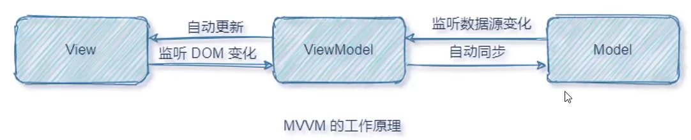
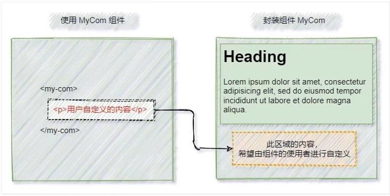
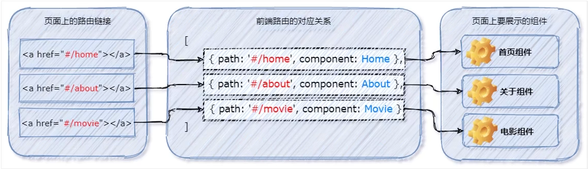

## 〇、教学视频

[黑马Vue3.0](https://www.bilibili.com/video/BV1zq4y1p7ga?p=290)

## 一、vue3安装及使用

https://24kcs.github.io/vue3_study/

### 1 - 独立版本

在 Vue.js 的官网上直接下载 vue.min.js 并用  <<span style="color: #e3371e">script</span>>  标签引入，`Vue` 会被注册为一个全局变量。

### 2 - CDN

- 对于制作原型或学习，你可以这样使用最新版本
- 对于生产环境，推荐链接到一个明确的版本号和构建文件，以避免新版本造成的不可预期的破坏

```html
<script src="https://unpkg.com/vue@next"></script>
```

### 3 - npm

- 用 Vue 构建大型应用时推荐使用 npm 安装

    ```bash
    # 最新稳定版
    $ npm install vue@next
    ```

### 4 - 使用官方配套开发工具来构建一个 vue 项目

#### 4.1 - 命令行工具（ [CLI](https://www.javascriptc.com/vue3js/guide/installation.html#cli) ）

Vue 提供了一个官方的CLI，为单页面应用 (SPA) 快速搭建繁杂的脚手架。

##### 4.1.1 - 使用 @vue/cli 创建 vue 项目

- 全局安装最新版本的 @vue/cli

```sh
# 全局安装最新版本的 @vue/cli
$ npm install -g @vue/cli
# OR
$ yarn global add @vue/cli

# 升级全局的 vue/cli包
$ npm update -g @vue/cli
# OR
yarn global upgrade --latest @vue/cli
```

- 安装完后查看版本

```sh
$ vue --version
@vue/cli 5.0.4
# 要求 @vue/cli 版本在4.5.0以上
```

- 创建项目

```sh
# 创建项目
$ vue create my-project

# 使用可视化创建工具来创建项目
$ vue ui
```

- 在 Vue 项目中运行

```sh
$ vue upgrade --next
```

***

##### 4.1.2 - 使用 CLI 创建项目的流程梳理

-  全局安装最新版本的 @vue/cli

    ```sh
    $ npm install -g @vue/cli
    ```

- 创建项目

    ```sh
    $　vue create <项目名>
    ```

- 选取一个preset

    
    - 决定手动选择特性，在操作提示的最后你可以选择将已选项保存为一个将来可复用的 preset。
    - 被保存的 preset 将会存在用户的 home 目录下一个名为 `.vuerc` 的 JSON 文件里。如果你想要修改被保存的 preset / 选项，可以编辑这个文件。

- 选择`Manually select features(手动安装)`则会进入[下一步选项](https://copyfuture.com/blogs-details/20200519144521753sqo6c6n1o1lx3jb)

    ```bash
    ? Please pick a preset: Manually select features
    ? Check the features needed for your project: (Press <space> to select, <a> to toggle all, <i> to invert selection)
    >( ) Babel // 代码编译
    ( ) TypeScript // ts
    ( ) Progressive Web App (PWA) Support // 支持渐进式网页应用程序
    ( ) Router // vue路由
    ( ) Vuex // 状态管理模式
    ( ) CSS Pre-processors // css预处理
    ( ) Linter / Formatter // 代码风格、格式校验
    ( ) Unit Testing // 单元测试
    ( ) E2E Testing // 端对端测试
    ```

    一般项目开发只需要选择`Babel`、`Router`、`Vuex`就足够了

    一路回车

- 安装成功

- 启动

    ```sh
    ＄npm run serve
    ```

##### 4.1.3 - 项目结构分析

|  目录/文件   |                   说明                   |
| :----------: | :--------------------------------------: |
| node_modules |          npm 加载的项目依赖模块          |
|    public    |             公共静态资源目录             |
|  index.html  |         当前项目唯一的 HTML 页面         |
|     src      | 项目源代码目录（程序员所写代码存放目录） |
|  .gitignore  |              Git 的忽略文件              |
|  index.html  |     SPA 单页面程序中唯一的 HTML 页面     |
| package.json |            项目包管理配置文件            |

###### src 目录

| src 目录下 |                      说明                      |
| :--------: | :--------------------------------------------: |
|   assets   | 存放项目中所有静态资源文件（css、fonts、图片） |
| components |           存放项目中所有的自定义组件           |
|  app.vue   |      项目的根目录（项目运行后所见的结构）      |
| index.css  |              项目的全局样式表文件              |
|  main.js   |             整个项目的打包入口文件             |

#### 4.2 - Vite

[Vite](https://github.com/vitejs/vite)是一个 web 开发构建工具，由于其原生 ES 模块导入方式，可以实现闪电般的冷服务器启动。

##### 4.2.1 - 创建 vite 项目

通过在终端中运行以下命令，可以使用 Vite 快速构建 Vue 项目。

- 使用 npm

    ```sh
    $ npm init vite-app <project-name>
    $ cd <project-name>
    $ npm install
    $ npm run dev
    ```

- 使用 yarn

    ```sh
    $ yarn create vite-app <project-name>
    $ cd <project-name>
    $ yarn
    $ yarn dev
    ```

##### 4.2.2 - 项目结构分析

|  目录/文件   |                   说明                   |
| :----------: | :--------------------------------------: |
| node_modules |          npm 加载的项目依赖模块          |
|    public    |             公共静态资源目录             |
|     src      | 项目源代码目录（程序员所写代码存放目录） |
|  .gitignore  |              Git 的忽略文件              |
|  index.html  |     SPA 单页面程序中唯一的 HTML 页面     |
| package.json |            项目包管理配置文件            |

###### <span style="color: #e3371e">src</span> 目录

| src 目录下 |                             说明                             |
| :--------: | :----------------------------------------------------------: |
|   assets   | 存放项目中所有<span style="color: #e3371e">静态资源文件</span>（css、fonts、图片） |
| components | 存放项目中所有的<span style="color: #e3371e">自定义组件</span> |
|  app.vue   | 项目的<span style="color: #e3371e">根目录</span>（项目运行后所见的结构） |
| index.css  |   项目的<span style="color: #e3371e">全局样式表</span>文件   |
|  main.js   |  整个项目的<span style="color: #e3371e">打包入口文件</span>  |

#### 4.2.3 - vite 项目的运行流程

在工程化项目中，vue单纯地通过 <span style="color: #e3371e">main.js</span> 把 <span style="color: #e3371e">App.vue</span> 渲染到 <span style="color: #e3371e">index.html</span> 的指定区域中

- <span style="color: #e3371e">App.vue</span> 用来编写待渲染的<span style="color: #e3371e">模版结构</span>

    - 写在 `template` 中

- <span style="color: #e3371e">index.html</span> 中需要预留一个 <span style="color: #e3371e">el 区域</span>

- <span style="color: #e3371e">main.js</span> 把 App.vue 渲染到 index.html 所预留的区域中

    ```javascript
    // main.js 文件
    // 1.从 vue 中按需导入 createApp 函数
    // ** createApp 函数的作用，创建 vue 的 "单页面应用程序实例"
    import { createApp } from 'vue'
    // 2.导入待渲染的 App组件
    import App from './App.vue'
    import './index.css'
    
    // 3.调用 createApp() 函数，返回值是 "单页面应用程序的实例"
    //   同时把 App 组件作为参数传给 createApp() 函数 ，表示要把 App 渲染到 index.html 页面上
    //   调用实例的 mount()，用来指定 vue 实际要控制的区域，把 app 组件的模版结构渲染到指定 el 区域
    createApp(App).mount('#app')
    ```

    

## 二、vue简介

### 1 - vue简介

- vue 是一套用于 <span style="color: #e3371e">**构建用户界面**</span> 的 <span style="color: #e3371e">**渐进式框架**</span> 。
    - 构建用户界面（UI，User Interface）
        - 指令：用于辅助开发者渲染页面的模版语法
        - 数据驱动视图：数据源变化，页面结构自动重新渲染
        - 美化样式：基础CSS样式
        - 事件绑定：用于处理用户和网页之间的交互行为
    - 前端框架
        - 构建用户界面的一整套处理方案(vue 全家桶): vue(核心库) + vue-router(路由方案) + vuex(状态管理方案) + vue组件库(快速搭建页面UI效果)
        - 提供了辅助项目开发的配套工具：vue/cli + vue-devtools
            - vue/cli（npm 全局包：一键生成工程化的 vue 项目- 基于 webpack、<span style="color: teal">大而全</span>）
            - vite （npm 全局包：一键生成工程化的 vue 项目 - <span style="color: teal">小而巧</span>）
            - vue-devtools（浏览器插件：辅助调试的工具）
            - vetur（vscode 插件：提供语法高亮和智能提示）

### 2 - vue特性

#### 2.1 - 数据驱动视图

vue会监听数据的变化，数据变化时，自动重新渲染页面的结构


- 好处：当页面数据变化时，页面会自动重新渲染
- 注意：数据驱动视图是单向的数据绑定

#### 2.2 - 双向数据绑定

<span style="color: #e3371e">填写表单</span>时，双向数据绑定可以辅助开发者在<span style="color: #e3371e">不操作 DOM </span>的前提下，<span style="color: #e3371e">自动</span>地把用户填写的内容<span style="color: #e3371e">同步</span>到数据源中

 

- 好处：开发者不再需要手动操作 DOM 元素，来获取表单元素最新的值

#### 2.3 MVVM

<span style="color: #e3371e">MVVM</span> 是 vue 实现<span style="color: #e3371e">数据驱动视图</span>和<span style="color: #e3371e">双向数据绑定</span>的核心原理。

它把每个 HTML 页面都拆分成如下三部分

- <span style="color: #e3371e">M</span>odel		  表示当前页面渲染时所依赖的数据源
- <span style="color: #e3371e">V</span>iew             表示当前页面所渲染的 DOM 结构
- <span style="color: #e3371e">V</span>iew<span style="color: #e3371e">M</span>odel   连接View视图和数据源，表示 vue 的实例，是 MVVM 的核心
    - Model 数据源发生变化时，自动更新页面结构
    - 页面结构表单数据项发送变化时，自动更新值至 Model 中

##### 2.3.1 - MVVM 示意图


##### 2.3.2 - MVVM 工作原理

<span style="color: #e3371e">ViewModel</span> 作为 <span style="color: #e3371e">MVVM 的核心</span>，把当前页面的<span style="color: #e3371e">数据源</span>（Model）和<span style="color: #e3371e">页面的结构</span>（View）连接到一起



### 3 - vue 的基本使用

#### 3.1 - 基本使用步骤

- 导入 vue.js 的 JavaScript 脚本文件

    ```html
    <script src="https://unpkg.com/vue@next"></script>
    ```

- 在页面中声明一个将要被 vue 所控制的 DOM 区域

    ```html
    <div id="App">
      {{ username }}
    </div>
    ```

- 调用 createApp( )传入app组件返回一个应用实例

- 调用实例的 mount( )挂载应用，将 app组件 渲染到将要被 vue 所控制的 DOM 区域

    ```vue
      <script>
        const app = {
          data() {
            return {
              username: 'coco'
            }
          }
        }
    
        Vue.createApp(app).mount('#App')
      </script>
    ```

    整体

    ```html
    <!DOCTYPE html>
    <html>
    <head>
    <meta charset="utf-8">
    <title>Vue 测试实例</title>
    <script src="https://unpkg.com/vue@next"></script>
    </head>
    <body>
    <div id="App">
      {{ username }}
    </div>
    
    <script>
    const app = {
      data() {
        return {
          username: 'coco'
        }
      }
    }
    
    Vue.createApp(app).mount('#App')
    </script>
    </body>
    </html>
    ```

#### 3.2 - 基本代码与 MVVM 的对应关系


### 4 - 安装并使用 vue-devtools

<span style="color: #0099dd">安装</span>

- 下载[igg助手](https://chrome.zzzmh.cn/info?token=ncldcbhpeplkfijdhnoepdgdnmjkckij)插件

- 开发者模式安装插件
- 搜索 vue 安装
    - bete 是 vue3

<span style="color: #0099dd">使用</span>

- F12

- 切换到 vue 选项卡

    

## 三、基础

项目中产生的数据通常都是会变化的，前端接收后端数据并进行处理即模板语法

### 1 - 指令

- <span style="color: #e3371e">指令</span>（Directives）是 vue 为开发者提供的<span style="color: #e3371e">模版语法</span>用于<span style="color: #e3371e">辅助开发者渲染页面的基本结构</span>

- 指令 (Directives) 是带有 `v-` 前缀的特殊 attribute

- 指令在 vue 开发中最基本、最常用、最简单

- 按<span style="color: #e3371e">用途</span>分为
    - <span style="color: #e3371e">内容渲染</span>指令
    
    - <span style="color: #e3371e">属性绑定</span>指令
    
    - <span style="color: #e3371e">事件绑定</span>指令
    
    - <span style="color: #e3371e">双向绑定</span>指令
    
    - <span style="color: #e3371e">条件绑定</span>指令
    
    - <span style="color: #e3371e">列表绑定</span>指令
    
        |     指令      |               语法               |                 作用                 |
        | :-----------: | :------------------------------: | :----------------------------------: |
        |    v-text     |        v-text="<变量名>"         |    渲染元素文本内容（覆盖默认值）    |
        |     {{ }}     |   <p>{{ 待渲染文本内容 }}</p>    |   渲染元素文本内容（不覆盖默认值）   |
        |    v-html     |        v-html="<变量名>"         |  渲染元素文本内容（包含 html 标签）  |
        | v-bind \|\| : |    v-bind:<属性名>="<变量名>"    |       为元素属性动态绑定属性值       |
        |  v-on \|\| @  |  v-on:<事件名>="<事件处理函数>"  |          为元素绑定事件监听          |
        |    v-model    |        v-model="<变量名>"        |        不操作DOM获取表单数据         |
        |     v-if      |          v-if=<boolean>          |         按需控制DOM显示隐藏          |
        |    v-else     |                                  |              配合 v-if               |
        |   v-else-if   |                                  |              配合 v-if               |
        |    v-show     |         v-show=<boolean>         |               <变量名>               |
        |     v-for     | v-for="(item, [index]) in items" | 基于一个数组来循环渲染相似的 UI 结构 |

#### 1.0 - 使用 JavaScript 表达式

在 vue 提供的模版渲染语法中，除了支持绑定简单的数据值之外，还支持 JavaScript 表达式的运算

```html
        <!-- 使用插值表达式期间，进行数字运算 -->
        <p>{{ number + 1 }}</p>
        <!-- 使用插值表达式期间，使用三元运算符 -->
        <p>{{ ok?'YES' : 'No' }}</p>
        <!-- 使用插值表达式期间，调用字符串的方法 -->
        <p>{{ message.split('').reverse().join('') }}</p>
        <!-- 使用 v-bind 属性绑定期间，动态进行字符串的拼接 -->
        <p :id="'list-' + id"></p>
```

#### 1.1 - 内容渲染指令

<span style="color: #e3371e">内容渲染</span>指令用于<span style="color: #e3371e">辅助开发者渲染</span><span style="color: #0099dd"> DOM 元素的文本内容</span>

##### 1.1.1 * <span style="color: #ab04d9">v-text</span>

- v-text 指令会<span style="color: teal">覆盖元素内默认的值</span>

    ```html
        <div id="App">
            <p v-text="username"></p>
            <!-- 默认文本 “性别” 会被 gender 的值覆盖掉 -->
            <p v-text="gender">性别</p>
        </div>
        <script>
            const app = {
                data() {
                    return {
                        username: 'coco',
                        gender: '女'
                    }
                }
            }
    
            Vue.createApp(app).mount('#App')
        </script>
    ```

    ```javascript
    // 页面输出
    coco
    女
    ```

##### 1.1.2 * <span style="color: #ab04d9">{{ }}</span>

- 专业名称：<span style="color: #e3371e">插值表达式（Mustache）</span>

- <span style="color: teal">不会覆盖默认文本内容</span>，开发中更常用

    ```html
        <div id="App">
            <p>姓名：{{username}}</p>
            <p>性别：{{gender}}</p>
        </div>
        <script>
            const app = {
                data() {
                    return {
                        username: 'coco',
                        gender: '女'
                    }
                }
            }
    
            Vue.createApp(app).mount('#App')
        </script>
    ```

    ```javascript
    // 页面输出
    姓名：coco
    性别：女
    ```

##### 1.1.3 * <span style="color: #ab04d9">v-html</span>

- 可以把<span style="color: teal">包含 HTML 标签的字符串渲染</span>为页面的 HTML 元素

    ```html
        <div id="App">
            <p v-text="sing"></p>
            <p>{{sing}}</p>
            <p v-html="sing"></p>
        </div>
        <script>
            const app = {
                data() {
                    return {
                        username: 'coco',
                        gender: '女',
                        sing: '<span style="color: tomato;">I can singing a song!</span>'
                    }
                }
            }
    
            Vue.createApp(app).mount('#App')
        </script>
    ```

    

    

#### 1.2 - 属性绑定指令

<span style="color: #e3371e">属性绑定</span>指令用于为<span style="color: #e3371e">元素的属性</span><span style="color: #0099dd"> 动态绑定属性值 </span>

##### 1.2.1 * <span style="color: #ab04d9">v-bind</span>

- 由于使用频率高，官方为其提供了<span style="color: #e3371e">简写形式</span>（英文的 <span style="color: #e3371e">:</span>）
- 特殊：对于布尔 attribute (只要存在就意味着值为 `true`)

```html
    <div id="App">
        <input type="text" v-bind:placeholder="imputValue">
        <input :type="imputType" :value="imputDefault">
        
    </div>
    <script>
        const app = {
            data() {
                return {
                    imputValue: '请输入内容',
                    imputType: 'password',
                    imputDefault: '123456',
                    imgSrc: 'https://www.javascriptc.com/vue3js/logo.png'
                }
            }
        }

        Vue.createApp(app).mount('#App')
    </script>
```

#### 1.3 - 事件绑定指令

<span style="color: #e3371e">事件绑定</span>指令用于为<span style="color: #e3371e"> DOM 元素</span><span style="color: #0099dd"> 绑定事件监听 </span>

##### 1.3.1 * <span style="color: #ab04d9">v-on</span>

- 语法格式 `v-on:<事件名称>="<事件处理函数>"`

- 由于使用频率高，官方为其提供了<span style="color: #e3371e">简写形式</span>（<span style="color: #e3371e">@</span><事件名称>="<事件处理函数>）

    ```html
    <button @click="addCount">+ 1</button>
    ```

- 事件处理函数仅有一条简单语句时可<span style="color: #e3371e">省略</span>在 methods 节点中进行声明，直接写在 v-on 指令中

    ```html
    <button @click="count++">+ 1</button>
    ```

- 原生 DOM 对象有 <span style="color: teal">onclick、oninput、onkeyup</span> 等原生事件，替换为 vue 的事件绑定形式后，分别为 <span style="color: #e3371e">v-on:click、v-on:input、v-on:keyup</span>

- 通过 v-on 绑定的事件处理函数，需要在 <span style="color: #e3371e">methods 节点</span>中进行声明

    ```html
        <div id="app">
            <p>{{ count }}</p>
            <button v-on:click="addCount">+ 1</button>
        </div>
    
        <script>
            const app = {
                data() {
                    return {
                        count: 0
                    }
                },
                methods: {
                   addCount() {
                       this.count += 1
                   } 
                }
            }
            Vue.createApp(app).mount('#app')
        </script>
    ```

##### 1.3.2 * 事件传参

- 在使用 v-on 指令绑定事件时，可以使用 ( ) 进行传参

    ```html
        <div id="app">
            <p>{{ count }}</p>
            <button @click="addCount(step)">+ 1</button>
        </div>
    
        <script>
            const app = {
                data() {
                    return {
                        count: 0
                    }
                },
                methods: {
                    addCount(step) {
                        this.count += e
                    }
                }
            }
            Vue.createApp(app).mount('#app')
        </script>
    ```

##### 1.3.3 * 事件对象

- 在原生的 DOM 事件绑定中，可以在事件处理函数形参处，接收事件对象 event

- 同理，在 v-on 指令中（简写为@）所绑定的事件处理函数中，同样可以接收到事件对象 event

    ```html
        <div id="app">
            <p>{{ count }}</p>
            <button @click="addCount">+ 1</button>
        </div>
    
        <script>
            const app = {
                data() {
                    return {
                        count: 0
                    }
                },
                methods: {
                    addCount(e) {
                        this.count += 1;
                        // 声明变量 nowBgColor 接收按钮背景色
                        const nowBgColor = e.target.style.background;
                        // 三元表达式判断背景色并赋值给按钮背景色样式
                    e.target.style.background = nowBgColor === ''? 'red' : '';
                    }
            }
            }
            Vue.createApp(app).mount('#app')
    	</script>
    ```

##### 1.3.4 * $event

- <span style="color: #e3371e">$event</span> 是 vue 提供的特殊变量，用来表示<span style="color: teal">原生的事件参数对象 event</span>

- $event 可以解决事件参数对象 event 被覆盖的问题

    ```html
        <div id="app">
            <p>{{ count }}</p>
            <button @click="addCount(2, $event)">+ 1</button>
        </div>
    
        <script>
            const app = {
                data() {
                    return {
                        count: 0
                    }
                },
                methods: {
                    addCount(step, e) {
                        this.count += step;
                        const bgc = e.target.style.background;
                        e.target.style.background = bgc == '' ? 'pink' : '';
                    }
                }
            }
            Vue.createApp(app).mount('#app')
        </script>
    ```

##### 1.3.5 * 事件修饰符（modifier）

- 事件处理函数中调用 <span style="color: #e3371e">preventDefault( )</span> 或 <span style="color: #e3371e">stopPropagation( )</span> 是非常常见的需求

- 因此， vue 中提供了事件修饰符的概念，<span style="color: #e3371e">方便</span>对事件的触发进行控制

- 常见的 5 个修饰符：

    |                  事件修饰符                  |                             说明                             |
    | :------------------------------------------: | :----------------------------------------------------------: |
    | <span style="color: #e3371e">.prevent</span> | <span style="color: #e3371e">阻止默认行为</span>（如：阻止 a 链接的跳转、表单提交） |
    |  <span style="color: #e3371e">.stop</span>   |       <span style="color: #e3371e">阻止事件冒泡</span>       |
    |                   .capture                   |               以捕获模式触发当前的事件处理函数               |
    |                    .once                     |                     绑定的事件只触发一次                     |
    |                    .self                     |     只有在 event.target 是当前元素自身时触发事件处理函数     |
|                   .passive                   |                 对DOM的默认事件进行性能优化                  |
    
    ```html
            <!-- 阻止链接跳转 -->
            <a href="https://www.taobao.com/" @click.prevent="onLinkClick">淘宝</a>
            <h4>.stop</h4>
            
    
            <div id="outer" @click="onOuterClick">
                <div id="middle" @click="onMiddleClick">
                    <!-- 阻止冒泡 -->
                    <div id="inner" @click.stop="onInnerClick"></div>
                </div>
            </div>
    		
    		<!-- 以捕获模式触发当前的事件处理函数 -->
            <div id="outer" @click.capture="onOuterClick">
                <div id="middle" @click="onMiddleClick">
                    <div id="inner" @click="onInnerClick"></div>
                </div>
            </div>
    
            <div id="outer" @click.capture="onOuterClick">
                <!-- 只有在 event.target 是当前元素自身时触发事件处理函数 -->
                <div id="middle" @click.self="onMiddleClick">
                    <div id="inner" @click="onInnerClick"></div>
                </div>
            </div>		
    ```

##### 1.3.6 * 按键修饰符

- 在监听<span style="color: #e3371e">键盘事件</span>时，经常需要判断详细的按键，此时，可为<span style="color: #e3371e">键盘相关事件</span>添加<span style="color: #0099dd">按键修饰符</span>

- 按键修饰符只能配合键盘事件触发

    ```html
        <div id="App">
            <input type="text" @keyup.enter="submit" @keydown.esc="clearInput">
    </div>
    
        <script>
            // 按下并松开 enter 输出文本内容；按下 esc 清空文本内容
            const app = {
                data () {
                    return {
    
                    }
                },
                methods: {
                    submit (e) {
                        console.log('你输入的内容是:' + e.target.value);
                    },
                    clearInput(e) {
                        e.target.value = ''
                    }
                }
            }
            
            Vue.createApp(app).mount("#App")
        </script>
    ```

#### 1.4 - 双向绑定指令

<span style="color: #e3371e">双向绑定</span>指令用于为<span style="color: #e3371e"> 不操作DOM 元素</span>的前提下<span style="color: #0099dd"> 快速获取表单的数据 </span>

`v-model` 在内部为不同的输入元素使用不同的 property 并抛出不同的事件

- text 和 textarea 元素使用 `value` property 和 `input` 事件；
- checkbox 和 radio 使用 `checked` property 和 `change` 事件；
- select 字段将 `value` 作为 prop 并将 `change` 作为事件。

##### 1.4.1 * <span style="color: #ab04d9">v-model</span>

- v-model <span style="color: #e3371e">只能配合表单元素</span>一起使用

    ```html
        <div id="app">
            <p>用户名：{{ username }}</p>
            <input type="text" v-model="username">
            <section>
                <p>您的省份是：{{ province }}</p>
                <select v-model="province">
                    <option value="0">请选择</option>
                    <option value="1">北京</option>
                    <option value="2">上海</option>
                    <option value="3">广东</option>
                </select>
            </section>
        </div>
    
        <script>
            const app = {
                name: 'myApp',
                data() {
                    return {
                        username: '',
                        province: '2'
                    }
                }
            }
    
            Vue.createApp(app).mount('#app')
        </script>
    ```

##### 1.4.2 * v-model指令的修饰符

- 为方便对用户输入内容处理，vue 为 v-model 提供了 3 个修饰符

    | 修饰符  |                作用                 |                    示例                     |
    | :-----: | :---------------------------------: | :-----------------------------------------: |
    | .number |    自动将用户输入值转为数值类型     | <input type="text" v-model.trim="username"> |
    |  .trim  |   自动过滤用户输入的首尾空白字符    |  <input type="text" v-model.number="age">   |
    |  .lazy  | 在“change”时更新，而非“input”时更新 | <input type="text" v-model.lazy="address">  |

#### 1.5 - 条件渲染指令

<span style="color: #e3371e">条件渲染</span>指令用于<span style="color: #0099dd"> 按需控制 DOM 的显示与隐藏</span>

##### 1.5.1 * <span style="color: #ab04d9">v-if</span>

- 语法：`v-if=<boolean>`  。为<span style="color: #e3371e"> true </span>时<span style="color: #e3371e">显示元素</span>，为<span style="color: #0099dd">false</span>时<span style="color: #0099dd">隐藏元素 </span>

##### 1.5.2 * <span style="color: #ab04d9">v-show</span>

- 效果与 v-if 一样

```html
    <div id="app">
        <!-- 点击按钮切换 flag -->
        <button @click="flag = !flag">toggle Flag</button>
        <p v-if="flag">请求成功 —— 被 v-if 控制</p>
        <p v-show="flag">请求成功 —— 被 v-show 控制</p>
    </div>

    <script>
        const app = {
            name: 'myApp',
            data() {
                return {
                    // flag 用以控制元素的显示与隐藏
                    // 为 ture 时显示元素，为 false 时隐藏元素
                    flag: true
                }
            }
        }

        Vue.createApp(app).mount('#app')
    </script>
```

##### 1.5.3 * v-if 与 v-show 的区别

- 实现原理不同：
    - <span style="color: #e3371e">v-if</span> 指令会<span style="color: #e3371e">动态地创建或移除 DOM 元素</span>，从而控制元素在页面上的显示与隐藏
    - <span style="color: #0099dd">v-show</span> 指令会<span style="color: #0099dd">动态地添加或移除 style="display:none" 样式</span>，从而控制元素的显示与隐藏
- 性能消耗不同：
    - <span style="color: #e3371e">v-if</span>有更高的<span style="color: #e3371e">切换开销</span>
    - <span style="color: #0099dd">v-show</span>有更高的<span style="color: #0099dd">初始渲染花销</span>
- 应用
    - <span style="color: #e3371e">初始值为false，运行时条件很少改变</span>，使用<span style="color: #e3371e"> v-if </span>更好
    - 需要<span style="color: #0099dd">非常频繁地切换</span>，使用<span style="color: #0099dd">v-show</span>更好

##### 1.5.4 * v-else （配合 v-if 使用）

v-if 可以单独使用，或配合 v-else 一起使用

```html
    <div id="app">
        <p v-if="num < 5">随机数 小于 5</p>
        <p v-else>随机数 大于 5</p>
    </div>

    <script>
        const app = {
            name: 'myApp',
            data() {
                return {
                    num: Math.random() * 10
                }
            }
        }

        Vue.createApp(app).mount('#app')
    </script>
```

##### 1.5.5 * v-else-if

v-else-if 指令，充当 v-if 的 “ else-if ”块，可以连续使用

```html
    <div id="app">
        <p v-if="score > 90">优秀</p>
        <p v-else-if="score > 80">良好</p>
        <p v-else-if="score > 60">及格</p>
        <p v-else>不及格！</p>
    </div>

    <script>
        const app = {
            name: 'myApp',
            data() {
                return {
                    score: Math.random() * 100
                }
            }
        }

        Vue.createApp(app).mount('#app')
    </script>
```

#### 1.6 - 列表渲染指令

<span style="color: #e3371e">列表渲染</span>指令用于<span style="color: #0099dd"> 基于一个数组来循环渲染相似的 UI 结构</span>

##### 1.6.1 * <span style="color: #ab04d9">v-for</span>

- v-for 指令需要使用 <span style="color: #e3371e">item in items</span> 的特殊语法
    - items 是 <span style="color: teal">待循环的数组</span>
    - item 是 <span style="color: teal">当前循环项</span>

```html
    <div id="app">
        <ul>
            <li v-for="user in list">姓名是：{{ user.username }}</li>
        </ul>
    </div>

    <script>
        const app = {
            name: 'myApp',
            data() {
                return {
                    list: [
                        { id: 1 , username: '阿猫'},
                        { id: 2 , username: '阿狗'},
                        { id: 3 , username: '阿猪'}
                    ]
                }
            }
        }

        Vue.createApp(app).mount('#app')
    </script>
```

- v-for 指令还支持一个<span style="color: #e3371e">可选</span>的第二个参数，为当前项的<span style="color: #e3371e">索引</span>
    - 语法格式： `(item, index) in itesm`
    - v-for 指令中的 <span style="color: #0099dd">item</span> 项 和 <span style="color: #0099dd">index</span> 索引都是<span style="color: #0099dd">形参</span>，可根据需要<span style="color: #0099dd">重命名</span>

```html
<li v-for="(user, index) in list">索引是：{{ index }} ,姓名是：{{ user.username }}</li>
```

##### 1.6.2 * 使用 key 维护列表的状态

- <span style="color: #e3371e">列表数据变化</span>时，<span style="color: #e3371e">默认情况</span>下，<span style="color: #e3371e">vue</span> 会<span style="color: #e3371e">尽可能的复用</span>已经存在的 DOM 元素，从而<span style="color: #e3371e">提升渲染的性能</span>
- 但这种默认的性能优化策略，会导致<span style="color: #0099dd">有状态的列表无法被正确更新</span>
- 为给 vue 一个提示，以便它跟踪每个节点的身份，从而保证<span style="color: #e3371e">有状态的列表被正确更新</span>的前提下，<span style="color: #e3371e">提升渲染的性能</span>。此时，需要为每项提供一个<span style="color: #ab04d9">唯一的 key 属性</span>

```vue
<!-- 用户列表区域 -->
<ul>
    <!-- 加 key 属性的好处： -->
    <!-- 1. 正确维护列表的状态 -->
    <!-- 2. 复用现有的 DOM 元素，提升渲染的性能 -->
    <li v-for="user in userlist" :key="user.id">
        <input type="checkbox">
        姓名：{{user.name}}
    </li>
</ul>
```

- key 的注意事项
    - key 的值只能是 string 或 number 类型
    - key 的值必须具有唯一性（不能重复）
    - 建议使用数据项 id 属性的值作为 key 的值 （id 属性的值具有唯一性）
    - 使用 index 的值当做 key 的值没有任何意义（index 的值不具有唯一性，会随数据变化动态更新）
    - 建议使用 v-for 指令时一定要指定 key 的值（既能提升性能，又防止列表状态紊乱）

#### 案例：品牌列表

##### 知识点

- bootstrap 4.x 相关：
    - 卡片（card）、表单相关（forms）、按钮（buttons）、表格（tables）
- vue指令与过滤器相关：
    - 插值表达式、属性绑定、事件绑定、双向数据绑定、修饰符、条件渲染、列表渲染、全局过滤器

##### 步骤

- 创建基本的 vue 实例

    - 导入 vue （js文件、cdn……）
    - 创建应用实例
    - 添加数据源 [品牌列表数据]

- 基于 vue 渲染表格数据

    - 使用 v-for 指令渲染表格数据，同时添加key动态绑定当前项的 id 值

    - 利用 bootstrap 将品牌的状态 state 渲染为 switch 开关效果

        switch开关效果：https://v4.bootcss.com/docs/components/forms/#switches

    - 用计算属性或方法代替过滤器，添加方法对日期格式化

- 实现添加品牌功能

    - 阻止表单默认提交行为
    - 为 input 输入框进行 v-model 双向数据绑定
        - 需要在 data 数据中声明 brandname 属性字段
    - 为 添加品牌 的 button 按钮绑定 click 事件处理函数
    - 在 data 中声明 nextId 属性（用来记录下一个可用的 id 值），并在 methods 表面 addNewBrand 事件处理函数
    - 监听 input 输入框的 keydown 事件，通过 .esc 按键修饰符快速清空文本框内容

- 实现删除品牌功能

    - 为删除的 a 链接绑定 click 点击事件处理函数，并阻止器默认行为
    - 

- 实现修改品牌状态的功能

##### 完整代码

```html
<!DOCTYPE html>
<html lang="en">

<head>
    <meta charset="UTF-8">
    <meta http-equiv="X-UA-Compatible" content="IE=edge">
    <meta name="viewport" content="width=device-width, initial-scale=1.0">
    <title>品牌列表案例</title>
    <link rel="stylesheet" href="https://cdn.staticfile.org/twitter-bootstrap/4.3.1/css/bootstrap.min.css">
    <script src="https://cdn.staticfile.org/twitter-bootstrap/4.3.1/js/bootstrap.min.js"></script>
    <script src="https://unpkg.com/vue@next"></script>
    <style>
        :root {
            font-size: 13px;
        }

        body {
            padding: 8px;
        }
    </style>
</head>

<body>
    <div id="app">
        <!-- 卡片区域 -->
        <div class="card">
            <h5 class="card-header">添加品牌</h5>
            <div class="card-body">
                <!-- 添加品牌的表单 -->
                <!-- 阻止表单提交行为 -->
                <form class="form-inline" @submit.prevent>
                    <div class="input-group mb-2 mr-sm-2">
                        <div class="input-group-prepend">
                            <div class="input-group-text">品牌名称</div>
                        </div>
                        <!-- 文本输入况 -->
                        <input type="text" class="form-control" placeholder="请输入品牌名称" v-model.trim="brandname" @keydown.esc="brandname = ''">
                    </div>

                    <!-- 提交表单的按钮 -->
                    <button type="submit" class="btn btn-primary mb-2" @click="addNewBrand">添加品牌</button>
                </form>
            </div>
        </div>

        <!-- 品牌列表 -->
        <table class="table table-bordered table-striped mt-2">
            <thead>
                <tr>
                    <th>序号</th>
                    <th>品牌名称</th>
                    <th>状态</th>
                    <th>创建时间</th>
                    <th>操作</th>
                </tr>
            </thead>
            <!-- 表格的主体区域 -->
            <tbody>
                <!-- TODO: 循环渲染表格的每一行数据 -->
                <tr v-for="(item, index) in brandlist" :key="item.id">
                    <td>{{ index + 1 }}</td>
                    <td>{{ item.brandname }}</td>
                    <td>
                        <div class="custom-control custom-switch">
                            <input type="checkbox" class="custom-control-input" :id="item.id" v-model="item.state">
                            <label class="custom-control-label" :for="item.id" v-if="item.state">已启用</label>
                            <label class="custom-control-label" :for="item.id" v-else>已禁用</label>
                        </div>
                    </td>
                    <td>{{ timeFormat }}</td>
                    <td><a href="#" @click.prevent="removeBrand(item.id)">删除</a></td>
                </tr>
            </tbody>
        </table>
    </div>

    <script>
        const app = {
            data() {
                return {
                    brandname: '',
                    // 下一个可用的 Id 值
                    nextId: 4,
                    brandlist: [
                        { id: 1, brandname: '宝马', state: true, addtime: new Date() },
                        { id: 2, brandname: '奥迪', state: true, addtime: new Date() },
                        { id: 3, brandname: '奔驰', state: true, addtime: new Date() }
                    ]
                }
            },
            methods: {
                // 添加新的品牌
                addNewBrand() {
                    if (!this.brandname) {
                        return alert('品牌名称不能为空')
                    } else {
                        this.brandlist.push({
                            id: this.nextId,
                            brandname: this.brandname,
                            state: true,
                            addtime: new Date()
                        })
                        this.brandname = ''
                        this.nextId++
                    }
                },
                // 删除品牌
                removeBrand(id) {
                    this.brandlist = this.brandlist.filter(x => x.id !== id)
                }
            },
            computed: {
                // 对日期格式化
                timeFormat() {
                    const dt = new Date()
                    const y = padZero(dt.getFullYear())
                    const m = padZero(dt.getMonth() + 1)
                    const d = padZero(dt.getDate())

                    const hh = padZero(dt.getHours())
                    const mm = padZero(dt.getMinutes())
                    const ss = padZero(dt.getSeconds())

                    return `${y}-${m}-${d} ${hh}:${mm}:${ss}`
                    // 补零操作
                    function padZero(n) {
                        return n > 9 ? n : '0' + n
                    }
                }
            }
        }

        Vue.createApp(app).mount('#app')
    </script>
</body>

</html>
```

### 2 - Class 与 Style 绑定

实际开发中常遇到<span style="color: #e3371e">动态操作元素 class 和 内联style </span>

因为它们都是 attribute，vue 允许开发者通过 <span style="color: #e3371e"> v-bind </span>属性绑定指令，为元素动态绑定<span style="color: #e3371e"> class 属性的值</span>和<span style="color: #e3371e">行内的 style 样式</span>

#### 2.1 - 动态绑定 HTML 的 class

##### 2.1.1 - 三元表达式

通过<span style="color: #e3371e">三元表达式，动态地为元素绑定 class 的类名</span>

```vue
<template>
	// 利用三元表达式，动态绑定 class
    <h3 class="thin" :class="isItalic ? 'italic' : ''">Style</h3>
	// 为按钮绑定点击事件，切换 isItalic 的布尔值
    <button @click="isItalic=!isItalic">Toggle Italic</button>
    <p>Lorem ipsum dolor sit.</p>
</template>

<script>
export default {
    name: 'MyStyle',
    data() {
        return {
            isItalic: false
        }
    }
}
</script>

<style lang="less" scoped>
.thin {
    font-weight: 200;
}

.italic {
    font-style: italic;
}
</style>
```

##### 2.1.2 - 以 数组语法 绑定 HTML 的 Class

如果元素需要<span style="color: #e3371e">动态绑定多个 Class </span>类名，此时可使用<span style="color: #e3371e">数组的语法格式</span>

```vue
<template>
    <h3 class="thin" :class="[isItalic ? 'italic' : '',isDelete ? 'delete' : '']">Style</h3>
    <button @click="isItalic=!isItalic">Toggle Italic</button>
    <button @click="isDelete=!isDelete">Toggle Delete</button>
    <p>Lorem ipsum dolor sit.</p>
</template>

<script>
export default {
    name: 'MyStyle',
    data() {
        return {
            isItalic: false,
            isDelete: false
        }
    }
}
</script>

<style lang="less" scoped>
.thin {
    font-weight: 200;
}

.italic {
    font-style: italic;
}

.delete {
    text-decoration: line-through;
}
</style>
```

不过，当有多个条件 class 时，这样写太繁琐。所以在<span style="color: #e3371e">数组语法中也可以使用对象语法</span>用以简化

##### 2.1.3- 以 对象语法 绑定 HTML 的 Class

```vue
  <h3
    class="thin"
    :class="classObj"
  >Style</h3>
  <button @click="classObj.italic=!classObj.italic">Toggle Italic</button>
  <button @click="classObj.delete=!classObj.delete">Toggle Delete</button>
  <p>Lorem ipsum dolor sit.</p>
  
  data() {
    return {
      classObj: {
        italic: false,
        delete: false,
      },
    };
  },
```


#### 2.2 - 动态绑定 HTML 的内联 style

##### 2.2.1 - 以 对象语法 绑定 HTML 的内联 style

- `:style` 的对象语法十分直观——看着非常像 CSS，但其实是一个 JavaScript 对象。

- CSS property 名可以用驼峰式 (camelCase) 或短横线分隔 (kebab-case，记得用引号括起来) 来命名

    ```html
    <div :style="{ color: activeColor, fontSize: fontSize + 'px'， 'background-color': bgcolor}"></div>
    <button @click="fontSize += 1">字号 + 1</button>
    ```

    ```javascript
    data() {
      return {
        activeColor: 'red',
        fontSize: 30，
        bgcolor: 'pink'
      }
    }
    ```

- 直接绑定到一个样式对象通常更好，这会让模板更清晰

    ```html
    <div :style="styleObject"></div>
    ```

    ```javascript
    data() {
      return {
        styleObject: {
          color: 'red',
          fontSize: '13px'
        }
      }
    }
    ```

##### 2.2.2 - 以 数组语法 绑定 HTML 的内联 style

- `:style` 的数组语法可以将多个样式对象应用到同一个元素上

- ```html
    <div :style="[baseStyles, overridingStyles]"></div>
    ```

### 3 - 计算属性与侦听器

#### 3.1 - 计算属性介绍

计算属性<span style="color: #e3371e">本质</span>上就是一个 <span style="color: #e3371e">function 函数</span>，它可以<span style="color: #0099dd">实时监听</span> data 中数据的变化，并 <span style="color: #e3371e">return 一个计算后的新值</span>，供组件渲染 DOM 时使用

- 对于任何包含响应式数据的复杂逻辑，你都应该使用**计算属性**

#### 3.2 - 声明计算属性

- 计算属性需要以 <span style="color: #ab04d9">function 函数</span>的形式声明到组件的 <span style="color: #ab04d9">computed 选项</span>中

- 直接调用函数名即可

- 计算属性<span style="color: #e3371e">侧重</span>于得到一个<span style="color: #e3371e">计算的结果</span>，因此属性值<span style="color: #0099dd">必须有 return 返回值</span>

    ```html
    <input type="text" v-model="count" />
    <p>{{ count }} 乘以二的值：{{ plus }}</p>
    ```

    ```javascript
        data() {
            return {
                count: 2,
            };
        },
        computed: {
            plus() {
                return this.count * 2;
            },
        },
    ```

#### 3.3 - 计算属性的使用注意点

- 计算属性<span style="color: #e3371e">必须</span><span style="color: #0099dd">定义在 computed 节点中</span>
- 计算属性<span style="color: #e3371e">必须</span><span style="color: #0099dd">是一个 function 函数</span>
- 计算属性<span style="color: #e3371e">必须</span><span style="color: #0099dd">有 return 值</span>
- 计算属性<span style="color: #e3371e">必须</span><span style="color: #0099dd">当做普通属性使用</span>

#### 3.4 - 计算属性 vs 方法

- 计算属性
    - 会<span style="color: #e3371e">缓存计算的结果</span>，只有计算属性的<span style="color: #0099dd">依赖项发生变化</span>时，才会<span style="color: #0099dd">重新进行计算</span>
    - 因此计算属性的性能更好
- 方法
    - 不会缓存计算的结果，每当触发重新渲染时，调用方法将总会再次执行函数

#### 3.5 - watch 侦听器介绍

<span style="color: #e3371e">watch 侦听器</span>允许开发者监视数据的变化，从而<span style="color: #e3371e">针对数据的变化作特定的操作</span>

#### 3.6 - watch 侦听器的基本语法

开发者需要<span style="color: #e3371e">在 watch 节点下</span>，定义自己的侦听器

- 以需要监听的数据名作为函数名

- 函数传入的参数，第一个为<span style="color: #0099dd">变化后的新值</span>，第二个为<span style="color: #0099dd">变化前的旧值</span>
```html
    <h3>Watch child 侦听器的用法</h3>
	<input type="text" v-model="name">
	<p>{{name}}</p>
```

```javascript
    	data() {
    		return {
                name: '出岫',
            };
        },
    	watch: {
            // 监听 name 的值的变化
            // 形参列表中，第一个值时“变化后的新值”，第二个值是“变化前的旧值”
            name(newval, oldval) {
                if (newVal != oldVal) {
                console.log('变了');
                }
            }
        },
```

##### 3.6.1 - 侦听器的格式

- 方法格式的侦听器

    - 缺点：无法在刚进入页面的时候，自动触发
    - 缺点：无法侦听对象数据中的属性变化

- 对象格式的侦听器

    - 好处：可通过 immediate 选项，让侦听器自动触发

    - 好处：可通过 deep 选项，让侦听器深度监听对象中每个属性的变化

    - 如果想侦听对象中某个子属性的变化，则必须包裹一层单引号

        ```js
        watch: {
            'info.username': {
                // 侦听器的处理函数
                handler(newValue, oldValue) {
                    console.log(newValue, oldValue)
                },
                immediate: true,
                deep: true
            },
        },
        ```

#### 3.7 - [异步加载中使用watch](https://www.javascriptc.com/vue3js/guide/computed.html#%E4%BE%A6%E5%90%AC%E5%99%A8)

#### 3.8 - 使用命令式的 vm.$watch

- 参数：
    - `{string | Function} source`
    - `{Function | Object} callback`
    - `{Object} [options]`
        - `{boolean} deep`
        - `{boolean} immediate`
        - `{string} flush`
- 返回：`{Function} unwatch`

##### 3.8.1 - $watch

`$watch` 返回一个取消侦听函数，用来停止触发回调

```javascript
const app = Vue.createApp({
  data() {
    return {
      a: 1
    }
  }
})

const vm = app.mount('#app')

const unwatch = vm.$watch('a', cb)
// later, teardown the watcher
unwatch()
```

##### 3.8.2 - **deep**选项

当 watch 侦听的是一个<span style="color: #e3371e">对象</span>，如果<span style="color: #e3371e">对象中的属性值发生了变化</span>，则<span style="color: #e3371e">无法被监听到</span>

为了发现对象内部值的变化，可以在选项参数中指定 `deep: true`。注意监听数组的变更不需要这么做。

```javascript
vm.$watch('someObject', callback, {
  deep: true
})
vm.someObject.nestedValue = 123
// callback is fired
```

##### 3.8.3 - **immediate**选项

在选项参数中指定 `immediate: true` 将立即以表达式的当前值触发回调

```javascript
vm.$watch('a', callback, {
  immediate: true
})
// 立即以 `a` 的当前值触发 `callback`
```

注意，在带有 `immediate` 选项时，你不能在第一次回调时取消侦听给定的 property。

#### 3.9 - 计算属性 vs 侦听器

- 计算属性
    - 侧重于监听<span style="color: #e3371e">多个值</span>的变化，最终计算并<span style="color: #0099dd">返回一个新值</span>
- 侦听器
    - 侧重监听<span style="color: #e3371e">单个数据</span>的变化，最终<span style="color: #0099dd">执行特定的业务处理，不需要有任何返回值</span>


## 四、组件基础

### 1 - 单页面应用程序

单页面应用程序（Single Page Application，简称 SPA）：一个 Web 网站中只有唯一的一个 HTML 页面，所有的功能和交互都在这唯一的一个页面内完成

#### 1.1 - 特点

- 仅在该 web 页面初始化时加载相应的资源（HTML、CSS 和 JavaScript）
- 一旦页面加载完成，SPA 不会因用户操作二进行页面的重新加载和跳转，而是利用 JavaScript 动态地变化 HTML 的内容，从而实现页面与用户的交互

#### 1.2 - 优点

- <span style="color: teal">良好的交互体验</span>
    - 单页应用的内容的改变不需要重新加载整个页面
    - 获取数据也是通过 Ajax 异步获取
    - 没有页面之间的跳转，不会出现‘白屏现象’
- <span style="color: teal">良好的前后端工作分离模式</span>
    - 后端专注于提供 API 接口，更易实现 API 接口的复用
    - 前端专注于页面的渲染，更利于前端工程化的发展
- <span style="color: teal">减轻服务器的压力</span>
    - 服务器只提供数据，不负责页面的合成与逻辑的处理，吞吐能力提高几倍

#### 1.3 - 缺点

- 首屏加载慢

    解决方案

    - 路由懒加载
    - 代码压缩
    - CDN 加速
    - 网络传输压缩

- 不利于 SEO

    解决方案

    - SSR 服务器端渲染

### 2 - 快速创建 vue 的 SPA 项目

vue官方提供了<span style="color: #e3371e">两种</span>快速创建工程化的 SPA 项目的方式

- 基于 <span style="color: #e3371e">vite</span> 创建的 SPA 项目

- 基于 <span style="color: #e3371e">vue-cli</span> 创建的 SPA 项目

    |                            |     vue-cli     |        vite        |
    | :------------------------: | :-------------: | :----------------: |
    |      支持的 vue 版本       | 支持 3.x 和 2.x |   仅支持 vue3.x    |
    |      是否基于 webpack      |       是        |         否         |
    |          运行速度          |      较慢       |         快         |
    |         功能完整度         |     大而全      | 小而巧（逐渐完善） |
    | 是否建议在企业级开发中使用 |      建议       |     目前不建议     |

### 3 - 组件化开发

#### 3.1 - 思想

组件化开发：根据<span style="color: #e3371e">封装</span>的思想，<span style="color: #e3371e">把页面上可以复用的部分封装为组件</span>，从而方便项目的开发和维护

#### 3.2 - 好处

- 提高了前端代码的<span style="color: #e3371e">复用性</span>和<span style="color: #e3371e">灵活性</span>
- 提高了<span style="color: #e3371e">开发效率</span>和<span style="color: #e3371e">可维护性</span>

#### 3.3 - vue 中的组件开发

- vue 是一个<span style="color: #e3371e">完全支持组件化开发</span>的框架
- vue 中规定<span style="color: #e3371e">组件的后缀名</span>时 <span style="color: #e3371e">.vue</span> 
- 之前接触到的 app.vue 文件本质上就是一个 vue 的组件

#### 3.4 - vue 组件的构成

组件是可复用的组件实例，且带有一个名字

每个 <span style="color: teal">.vue</span> 组件 都由 3 部分构成：

- <span style="color: #e3371e">template</span>	——>	组件的<span style="color: #e3371e">模版结构</span>
- <span style="color: #e3371e">script</span>	——>	组件的<span style="color: #e3371e">JavaScript 行为</span>
- <span style="color: #e3371e">style</span>	——>	组件的<span style="color: #e3371e">样式</span>

注意：每个组件中<span style="color: #e3371e">必须包含 template</span> 模版结构，而 <span style="color: #0099dd">JavaScript 行为</span>和 <span style="color: #0099dd">style 样式</span> 是<span style="color: #0099dd">可选</span>的组成部分

##### 3.4.1 - 组件的 【 template 】 节点

- vue规定：每个组件对应的模板结构，需要定义到<<span style="color: #e3371e">template</span>>节点中
- 注意：<<span style="color: #e3371e">template</span>> 是 vue 提供的容器标签，只起到包裹性质的作用，不会被渲染成真正的 DOM 元素

###### 在 template 中使用指令

在组件的<<span style="color: #e3371e">template</span>>节点中，支持前面所学的指令语法，来辅助开发者渲染当前组件的 DOM 结构

```vue
<template>
  <h1>这是 App 根组件</h1>
  <!-- 使用 {{ }} 插值表达式 -->
  <p>生成一个随机数字：{{ ( Math.random () * 10).toFixed(2) }}</p>
  <!-- 使用 v-bind 属性绑定 -->
  <p  :title="new Date().toLocaleTimerString()">Lorem ipsum dolor sit amet.</p>
  <!-- 属性 v-on 事件绑定 -->
  <button @click="showInfo">按钮</button>
</template>
```

###### 在 template 中定义根节点

在 vue 2.x 的版本中，<<span style="color: #e3371e">template</span>> 节点内的 DOM 结构仅支持单个根节点

```vue
<template>
  <div>
    <h1>根节点1</h1>
    <h2>根节点2</h2>
  </div>
</template>
```

在 vue 3.x 的版本中，<<span style="color: #e3371e">template</span>> 支持<span style="color: #e3371e">定义多个根节点</span>

```vue
<template>
    <h1>根节点1</h1>
    <h2>根节点2</h2>
</template>
```


##### 3.4.2 - 组件的 【 script 】 节点

- vue规定：组件内的 <<span style="color: #e3371e">script</span>> 节点是<span style="color: #e3371e">可选</span>的，开发者可以在 <<span style="color: #e3371e">script</span>> 节点中封装组件的 JavaScript 业务逻辑

-  <<span style="color: #e3371e">script</span>> 节点的基本结构如下

   
    ```vue
    <script>
    // 今后，组件相关的 data 数据、methods 方法等，
    // 都需要定义到 export default 所导出的对象中
    export default {
      
    }
    </script>
    ```

###### 在  script 节点中使用的节点

- name 节点

    - 可以通过 name 节点给当前组件定义一个名称

    - 使用 vue-devtools 进行项目调试的时候，自定义的组件名称可以<span style="color: #e3371e">清晰的区分每个组件</span>

        ```vue
        <script>
        export default {
          // name 属性指向的是当前组件的名称（建议：每个单词的首字母大写）
          name: 'MyApp',
        }
        </script>
        ```

- data 节点

    - <span style="color: #e3371e">vue 组件渲染期间</span>所需用到的<span style="color: #e3371e">数据</span>，可以定义在 data 节点中

    - 组件中声明 data数据，组件的 data 选项是一个函数，函数向外return一个对象

        ```vue
        <template>
          <p>我的名字是{{ username }}</p>
        </template>
        
        <script>
        export default {
          // 组件名称
          name: "MyApp",
          // 组件的数据（data方法中 return 出去的对象，就是当前组件渲染期间所需用到的数据对象）
          data() {
            return {
              username: 'coco',
            };
          },
        };
        </script>
        ```

        ```
        // 页面输出：我的名字是coco
        ```

- methods 节点

    - 组件中的<span style="color: #e3371e">事件处理函数</span>，必须定义到<span style="color: #e3371e"> methods 节点</span>中

    - methods 指向一个对象，在对象中声明一个事件处理函数（函数中 this 指向当前组件的实例），

        ```vue
        <template>
          <p>count 的 值是：{{ count }}</p>
          <button @click="addCount">+ 1 </button>
        </template>
        
        <script>
        export default {
          name: "MyApp",  // 组件名称
          data() {        // 组件的数据
            return {
              count: 0,
            }
          },
          methods: {
            addCount() {
              // 通过 this 访问组件 data 内的数据
              this.count++
            }
          }
        };
        </script>
        ```

##### 3.4.3 - 组件的 【 style 】 节点

- vue 规定：组件内的 <<span style="color: #e3371e">style</span>> 节点是<span style="color: #e3371e">可选</span>的，开发者可以在 <<span style="color: #e3371e">style</span>> 节点中编写样式美化当前组件的 UI 结构

- <<span style="color: #e3371e">style</span>> 节点的基本结构如下


    - 属性 `lang="css"` 是可选的，表示所使用的样式语言。默认只支持 css 语法，可选择还有 less、scss等
    
    ```vue
    <style lang="css">
    h1 {
      font-weight: normal;
    }
    </style>
    ```

- 让 style 支持 less 语法

    - 安装依赖包，从而提供 less 语法的编译支持

        ```sh
        $ npm install less -D
        ```

    - 在 <<span style="color: #e3371e">style</span>> 标签上 添加`lang="less"` 属性，即可使用 less 语法编写组件的样式

### 4 - 组件的基本使用

#### 4.1 - 组件的注册

组件之间可以进行<span style="color: #e3371e">相互的引用</span>

##### 4.1.1 - 组件使用原则

- **先注册后使用**

- 全局注册和局部注册的应用
    - 开发期间使用频率很高，全局注册
    - 只在特定情况使用，局部注册


##### 4.1.2 - 注册组件的两种方式

- <span style="color: #ab04d9">全局注册</span>

    - 被全局注册的组件，可以在全局任何一个组件内使用

    

- <span style="color: #ab04d9">局部注册</span>

    - 被局部注册的组件，只能在当前注册的范围内使用


##### 4.1.3 - 全局注册组件

###### Ⅰ - 步骤

- 在 <span style="color: #e3371e">main.js</span> 项目入口文件<span style="color: #e3371e">导入</span>需要被全局注册的组件

    ```javascript
    // main.js 项目入口文件
    import Swiper from './components/01.globalReg/Swiper.vue'
    ```

- 调用 app 实例的 component（）方法对组件全局注册

    ```javascript
    // main.js 项目入口文件
    app.component('my-swiper',Swiper)
    ```

    - component（）方法接收两个参数

        - 第一个参数：全局注册完毕后，<span style="color: #e3371e">组件的名称</span>

        - 第二个参数：<span style="color: #e3371e">要注册的组件</span>
        
            - 在 components 文件夹下新建并编辑

        ```vue
            // components/01.globalReg/Swiper.vue 文件
            <template>
            </template>
            
            <script>
            export default {
                name: 'MySwiper'
            }
            </script>
        ```
    
- 注册完毕后，在 App.vue 中<span style="color: #e3371e">直接以标签的形式进行使用</span>

    ```vue
    <template>
      <my-swiper></my-swiper>
      <my-test></my-test>
    </template>
    ```

###### Ⅱ - 完整代码

```vue
// Swiper.vue 文件
<template>
    <h3>Swiper 轮播图组件</h3>
</template>

<script>
export default {
    name: 'MySwiper' // 组件名字
}
</script>
```

```javascript
// main.js 文件
import { createApp } from 'vue';
import App from './App.vue';

// 1.导入 Swiper 组件
import Swiper from './components/01.globalReg/Swiper.vue'

const app = createApp(App);

// 2.调用 app 实例的 component()，在全局注册 my-swiper 组件
app.component('my-swiper',Swiper)

app.mount('#app');
```

```vue
// App.vue 文件
<template>
  <my-swiper></my-swiper>
  <my-test></my-test>
</template>

<script>
export default {
  name: "MyApp",  // 组件名称
  data() {        // 组件的数据
    return {
      count: 0,
    }
  },
  methods: {
    addCount() {
      // 通过 this 访问组件 data 内的数据
      this.count++
    }
  }
};
</script>
```

##### 4.1.4 - 局部注册组件

###### Ⅰ - 步骤

- 在 父组件 文件<span style="color: #e3371e">导入</span>需要被局部注册的组件

    ```vue
    // App.vue 文件
    <script>
    // 导入子组件
    import MySearch from './components/02.privateReg/Search.vue'
    
    <code>
    </script>
    ```

- 在父组件 `export default` 中，通过 <span style="color: #e3371e">components</span> 节点，为当前组件注册私有子组件

    ```vue
    <script>
    export default {
      name: "MyApp", // 组件名称
      data() {
      },
      methods: {
      },
      components: {
        // 'MySearch': MySearch  // 注册子组件
        // 键值对相同可简写
         MySearch
      }
    };
    </script>
    ```

    - 注册期间，以键值对形式为子组件指定 <span style="color: #0099dd">自定义组件的名字 </span>和 <span style="color: #0099dd">待注册子组件</span>

- 注册完毕后，在 App.vue 中<span style="color: #e3371e">直接以标签的形式进行使用</span>

    ```vue
    <template>
      <my-search></my-search>
    </template>
    ```

###### Ⅱ - 完整代码

```vue
// Search.vue 文件
<template>
    <h4>这是 Search 子组件</h4>
</template>

<script>
export default {
    name: 'MySearch'
}
</script>
```

```vue
// App.vue 文件
<template>
  <my-search></my-search>
</template>

<script>
// 导入子组件
import Search from './components/02.privateReg/Search.vue'

export default {
  name: "MyApp", // 组件名称
  data() {
    // 组件的数据
    return {
      count: 0,
    };
  },
  methods: {
    addCount() {
      // 通过 this 访问组件 data 内的数据
      this.count++;
    },
  },
  components: {
    'my-search': Search
  }
};
</script>

<style lang="less">
h1 {
  font-weight: normal;
  color: red;
  strong {
    color: teal;
  }
}
</style>
```

##### 4.1.5 - 组件注册时名称的大小写

在进行组件的注册时，定义组件注册名称的方式有两种

- Kebab-case 命名法（俗称<span style="color: #e3371e">短横线命名法</span>，例 my-search）
    - 字母全<span style="color: #ffa1d4">小写</span>，包含<span style="color: #ffa1d4">连字符</span>（多个单词与连字符符号连接）
    - 必须严格按照短横线名称使用
- PascalCase 命名法（俗称<span style="color: #e3371e">帕斯卡命名法</span>或<span style="color: #e3371e">大驼峰命名法</span>，例 MySearch） <span style="color: #ab04d9">推荐使用</span>
    - 既可严格按照帕斯卡名称使用
    - 又可以<span style="color: #0099dd">转化为短横线名称</span>使用

##### 4.1.6 - 通过 name 属性注册组件

注册组件期间

- 可以直接提供组件的注册名称
- 也可把组件的 <span style="color: #e3371e">name 属性</span>作为注册后组件的组件名称

```vue
// Swiper 组件
<template>
    <h3>Swiper 轮播图组件</h3>
</template>

<script>
export default {
    name: 'MySwiper'
}
</script>
```

```javascript
// main.js 项目入口文件
app.component(Swiper.name,Swiper)	// 相当于app.component('MySwiper',Swiper)
```

#### 4.2 - 父子组件之间的样式冲突

##### 4.2.1 - 原因

默认情况，写在 <span style="color: #e3371e">.vue  组件中的样式</span>会<span style="color: #e3371e">全局生效</span>，因此容易造成多个组件之间的样式冲突问题。

根本原因是：

- 单页面应用程序中，<span style="color: #0099dd">所有组件的 DOM 结构</span>，都是<span style="color: #0099dd">基于唯一的 index.html 页面</span>进行呈现的
- 每个组件中的样式，都会<span style="color: #0099dd">影响整个 index.html 页面</span>中的 DOM 元素

##### 4.2.2 - 解决

- 方法 1 （较麻烦）
    - 为每个组件手动分配唯一的自定义属性

        ```vue
        <h3 data-v-app>App 根组件</h3>
        ```

    - 编写组件样式时，通过属性选择器来控制样式的作用域

        ```vue
        <style lang="less">
        p[data-v-app] {
          color: red;
        }
        </style>
        ```

- 方法 2 —— <span style="color: #ab04d9">style 节点的 scoped 属性</span>

    - vue 为 style节点提供了 <span style="color: #ffa1d4">scoped 属性</span>，从而防止 组件之间的样式冲突 问题

    - 加上 scoped 属性后，vue 会<span style="color: #ab04d9">自动</span>为当前组件分配唯一的“<span style="color: #ab04d9">自定义属性</span>”

        ```html
        <h3 data-v-7bc0fb25="">App 根组件</h3>
        ```

##### 4.2.3 - :deep( ) 样式穿透

给当前组件的 style 节点添加了 scoped 属性：

- 则当<span style="color: #e3371e">前组件的样式对其子组件时不生效</span>的

- 使用<span style="color: #e3371e"> :deep( )深度选择器</span>，可使某些样式<span style="color: #e3371e">对子组件生效</span>

    ```vue
    // 父组件 App.vue 中
    <style lang="less" scoped>
    :deep(.tittle) {		// 子组件中 tittle 类的元素也会收到影响
        color: red;
    }
    </style>
    ```

**应用场景**：用到第三方组件库， <span style="color: #e3371e">需要修改默认样式时</span> ，可使用样式穿透

### 5 - 组件的 props

#### 5.1 - 组件封装时的基本原则

为提高组件的<span style="color: #e3371e">复用性</span>，封装 vue 组件时需要遵守如下的原则：

- 组件的<span style="color: #e3371e"> DOM 结构、Style 样式</span>要尽量复用
- 组件中<span style="color: #e3371e">要展示的数据</span>，尽量由组件的使用者提供

为方便<span style="color: #e3371e">使用者</span>为组件<span style="color: #0099dd">提供</span>要<span style="color: #0099dd">展示的数据</span>，vue 组件提供了 <span style="color: #0099dd">props</span> 的概念

#### 5.2 - 组件的 props 介绍

props 是组件的<span style="color: #e3371e">自定义属性</span>，组件的使用者可以<span style="color: #e3371e">通过 props 把数据传递到子组件的内部</span>，供子组件内部进行使用

- props 的<span style="color: #0099dd">作用</span>：父组件在使用子组件时，通过 props <span style="color: #0099dd">向子组件传递要展示的数据</span>
- props 的<span style="color: #0099dd">好处</span>：提高了组件的 <span style="color: #0099dd">复用性</span>

#### 5.3 - 封装组件时声明 props

- 在封装 vue 组件时，可以把<span style="color: #e3371e">动态的数据项</span>声明为 <span style="color: #e3371e">props </span>自定义属性
- 自定义属性可以在当前组件的模板结构中被直接使用

```vue
// MyArticle.vue 子组件
<template>
    <h3>标题：{{ tittle }}</h3>
    <h3>作者：{{ author }}</h3>
</template>

<script>
export default {
    name: 'MyArticle',
    // 外界可以传递指定的数据，到当前的组件中
    props: ['tittle', 'author']
}
</script>
```

```vue
// App.vue 父组件
<template>
    <h3>App root</h3>
    <my-article title="我的区长父亲" author="袁华"></my-article>
</template>

<script>
import MyArticle from './MyArticle.vue'

export default {
    name: 'MyApp',
    components: {
        MyArticle  // 注册组件时简写 'MyArticle':MyArticle
    }
}
</script>
```

#### 5.4 - 无法使用未声明的 props

```vue
<my-article title="致橡树" author="舒婷"></my-article>

<template>
    <h3>标题：{{ tittle }}</h3>
    <h3>作者：{{ author }}</h3>
</template>

<script>
export default {
    name: 'MyArticle',
    // author 属性没有声明，因此子组件无法访问到 author 值
    props: ['tittle']
}
</script>
```

#### 5.5 - 动态绑定 props 的值

可以使用 <span style="color: #e3371e">v-bind 属性绑定的形式</span>，为组件动态绑定 props 的值

```vue
// MyArticle 子组件
<template>
    <h3>标题：{{ tittle }}</h3>
    <h3>作者：{{ author }}</h3>
</template>

<script>
export default {
    name: 'MyArticle',
    props: ['tittle','author']
}
</script>

// App 父组件
<template>
    <h3>App root</h3>
    <my-article :tittle="info.title" :author="info.author + '编著'"></my-article>
</template>

<script>
import MyArticle from './MyArticle.vue'

export default {
    name: 'MyApp',
    data() {
        return {
            info: {
                title: '标题1',
                author: '作者1'
            }
        }
    },
    components: {
        MyArticle
    }
}
</script>
```

#### 5.6 - props 的大小写命名

组件中如果使用“<span style="color: #e3371e">camelCase</span>( <span style="color: #e3371e">驼峰命名法</span> )”声明了 props 属性的名称，则有两种方式为其绑定属性的值(仅传递属性值时允许，定义，引用时需保持一致)

- 直接使用“驼峰命名”形式

    ```vue
    <my-article pubTime="1989"></my-article>
    ```

- 也可使用“短横线分割命名”形式

    ```vue
    <my-article pub-time="1989"></my-article>
    ```

### 6 - props 验证

#### 6.1 - props 验证介绍

- 使用<span style="color: #e3371e">数组类型</span>的 props 节点的缺点：<span style="color: #0099dd">无法</span>为每个 props <span style="color: #0099dd">指定具体的数据类型</span>

- props验证指：在封装组件时<span style="color: #e3371e">对外界传递过来的 props 数据</span> 进行合法性的校验，从而防止数据不合法的问题

    

#### 6.2 - 对象类型的 props 节点

使用<span style="color: #e3371e">对象类型</span>的 props 节点，可以对每个 props 进行<span style="color: #0099dd">数据类型的校验</span>


#### 6.3 - props 验证

对象类型的 props 节点提供了多种数据验证方案

- 基础的类型检查

    - 支持的 8 种类型：String、Number、Boolean、Array、Object、Date、Function、Symbol

- 多个可能的类型

    - 通过“<span style="color: #0099dd">数组</span>”的形式，指定多个可能的类型

    - ```javascript
        props: {
        	// PropA 属性的值可以是 类型1 或 类型2
        	propA:[Type1, Type2]
        }
        ```

- 必填项校验

    - 通过“配置<span style="color: #0099dd">对象</span>”的形式，来定义 prop 属性的 “验证规则”
    - 类型通过 <span style="color: #e3371e">`type：value`</span> 指定，必填通过 <span style="color: #e3371e">`required：true`</span> 指定

- 属性默认值

    - 通过“配置<span style="color: #0099dd">对象</span>”的形式，来定义 prop 属性的 “验证规则”
    - 类型通过 <span style="color: #e3371e">`type：value`</span> 指定，通过 <span style="color: #e3371e">`default：value`</span> 添加默认值

- 自定义验证函数

    - 为 props 属性指定自定义验证函数，对<span style="color: #0099dd"> props 属性的值进行更加精确的控制</span>
    - <span style="color: #e3371e">`validator(value) {}`</span>

```javascript
app.component('my-component', {
  props: {
    // 基础的类型检查 (`null` 和 `undefined` 会通过任何类型验证)
    propA: Number,
    // 多个可能的类型
    propB: [String, Number],
    // 必填的字符串
    propC: {
      type: String,
      required: true
    },
    // 带有默认值的数字
    propD: {
      type: Number,
      default: 100
    },
    // 带有默认值的对象
    propE: {
      type: Object,
      // 对象或数组默认值必须从一个工厂函数获取
      default: function() {
        return { message: 'hello' }
      }
    },
    // 自定义验证函数
    propF: {
        // “属性的值”可以通过形参 value 进行接收
      validator: function(value) {
	// 这个值必须匹配下列字符串中的一个，返回值为 true 表示通过，false 表示失败
        return ['success', 'warning', 'danger'].indexOf(value) !== -1
      }
    },
    // 具有默认值的函数
    propG: {
      type: Function,
      // 与对象或数组默认值不同，这不是一个工厂函数 —— 这是一个用作默认值的函数
      default: function() {
        return 'Default function'
      }
    }
  }
})
```

### 7 - 自定义事件

#### 7.1 - 自定义事件介绍

- 在封装组件时，为了让<span style="color: #e3371e">组件的使用者</span>可以<span style="color: #e3371e">监听到组件内状态的改变</span>，此时需要用到<span style="color: #e3371e">组件的自定义事件</span>

    

#### 7.2 - 自定义事件的 3 个使用步骤

- 封装组件时

    - <span style="color: #e3371e">声明</span>自定义事件

        - 开发者为自定义组件封装的自定义事件，必须事先在 <span style="color: #e3371e">emits 节点</span>中声明

            ```html
                <!-- 子组件 template -->
            	<h3>Counter child</h3>
                <p>counter的值是：{{ counter }}</p>
                <button @click="add">+ 1</button>
            ```

            ```javascript
                // 子组件 script
            	name: 'MyCounter',
                // 1.声明自定义事件
                emits: ['countChange'],
            ```

    - <span style="color: #e3371e">触发</span>自定义事件

        - 在 emits 节点下声明的自定义事件，可通过 <span style="color: #e3371e">this.$emit('自定义事件名')</span> 方法触发

        - <span style="color: #0099dd">事件名</span>：不同于组件和 prop，事件名不存在任何自动化的大小写转换。而是触发的事件名需要<span style="color: #0099dd">完全匹配</span>监听这个事件所用的名称。推荐始终使用 **kebab-case 的事件名**

            ```javascript
            	// 子组件 script
            	methods: {
                    add() {
                        this.counter += 1;
                        // 2.找到对应函数，调用 this.$emit() 方法触发自定义事件
                        this.$emit('countChange');
                    },
                },
            ```

- 使用组件时

    - <span style="color: #e3371e">监听</span>自定义事件

        - 使用自定义组件时，可通过 <span style="color: #e3371e">v-on</span> 的形式<span style="color: #e3371e">监听自定义事件</span>

            ```html
            	<!-- 父组件 template -->
            	<h2>App Root</h2>
                <my-counter @countChange="getCounter"></my-counter>
            ```

            ```javascript
            	// 父组件 script
            	    methods: {
                        // 绑定的事件处理函数
                    getCounter() {
                        console.log('触发了 countChange 自定义事件');
                    },
                },
            ```

#### 7.3 - 自定义事件传参

在调用  <span style="color: #e3371e">this.$emit('自定义事件名')</span> 方法触发自定义事件时，可通过<span style="color: #e3371e">第 2 个参数</span>为自定义事件传参，并通过事件处理函数的形参接收变化了的数据

```javascript
    // 子组件
	methods: {
        add() {
            this.counter += 1;
            // 2.找到对应函数，调用 this.$emit() 方法触发自定义事件
            // 将变化了的数据传递出去
            this.$emit('countChange', this.counter);
        },
    },
```

```javascript
 	// 父组件
	methods: {
        // 通过事件处理函数的形参接收变化了的数据
        getCounter(val) {
            console.log('触发了 countChange 自定义事件', val);
        },
    },
```

### 8 - 组件上的 v-model 指令

v-model 是双向数据绑定指令，当<span style="color: #e3371e">需要维护组件内外数据的同步时</span>，可以在组件上使用 v-model 指令

#### 8.1 - 组件上使用 v-model 的作用

- <span style="color: #e3371e">外界数据的变化</span>会<span style="color: #e3371e">自动同步</span>到组件中
- 组件中数据的变化，也会<span style="color: #e3371e">自动同步到外界</span>


#### 8.2 - 组件上使用 v-model 的步骤

##### 8.2.1 - 父组件→子组件 同步数据


- 父组件通过 <span style="color: #e3371e">v-bind: </span>属性绑定的形式，把数据传递给子组件

    ```html
        <!-- 父组件 -->
    	<h2>App Root</h2>
        <p>count 的值是：{{ count }}</p>
        <button @click="count += 1">+ 1</button>
        <my-counter :number="count"></my-counter>
    ```

- 子组件中，通过 <span style="color: #e3371e">props</span> 接收父组件传递过来的数据

    ```html
        <!-- 子组件 -->
    	<h3>Counter child</h3>
        <p>count 的值是：{{ number }}</p>
    ```

    ```javascript
    // 子组件
    export default {
        name: 'MyCounter',
        props: ['number'],
    };
    ```

##### 8.2.1 - 子组件→父组件 同步数据


- 在 v-bind: 指令之前添加 <span style="color: #e3371e">v-model</span> 指令

    - 希望对传递的 number 进行双向数据绑定

        ```html
        	<!-- 父组件 -->
        	<h2>App Root</h2>
            <p>count 的值是：{{ count }}</p>
            <button @click="count += 1">+ 1</button>
            <my-counter v-model:number="count"></my-counter>
        ```

- 在子组件中声明 <span style="color: #e3371e">emits</span> 自定义事件，格式为 <span style="color: #e3371e">update:</span>xxx，xxx为需要更新的属性值

    ```javascript
    	// 子组件
    	name: 'MyCounter',
        props: ['number'],
        emits: ['update:number'],
    ```

- 调用 <span style="color: #e3371e">$emit()</span> 触发自定义事件，更新父组件的数据

    ```html
        <!-- 子组件 -->
    	<h3>Counter child</h3>
        <p>count 的值是：{{ number }}</p>
        <button @click="add">+ 1</button>
    ```

    ```javascript
    	// 子组件
    	name: 'MyCounter',
        props: ['number'],
        emits: ['update:number'],
        methods: {
            add() {
                this.$emit('update:number', this.number + 1);
            },
        },
    ```

## 五、组件高级

### 1 - 组件的生命周期

#### 1.1 - 组件的运行过程


<span style="color: #e3371e">组件的生命周期</span>指的是：组件从<span style="color: #0099dd">创建</span> -> <span style="color: #0099dd">运行</span>（渲染） -> <span style="color: #0099dd">销毁</span>的整个过程，强调的是一个<span style="color: #49bf51">时间段</span>

#### 1.2 - 如何监听组件的不同时刻

<span style="color: #e3371e">vue 框架</span>为组件<span style="color: #0099dd">内置了不同时刻的生命周期函数</span>，生命周期函数<span style="color: #49bf51">会伴随</span>着组件的运行而<span style="color: #49bf51">自动调用</span>

- 当<span style="color: #e3371e">组件在内存中被创建完毕</span>后，会自动调用 <span style="color: #e3371e">created</span> 函数
- 当组件被成功的<span style="color: #e3371e">渲染到页面上</span>之后，会自动调用 <span style="color: #e3371e">mounted</span> 函数
- 当组件被<span style="color: #e3371e">销毁完毕</span>之后，会自动调用 <span style="color: #e3371e">unmounted</span> 函数

#### 1.3 - 如何监听组件的更新

当组件的 <span style="color: #0099dd">data 数据更新</span>之后，vue 会<span style="color: #49bf51">自动重新渲染组件</span>的 DOM 结构，从而保证<span style="color: #49bf51"> view 视图</span>展示的数据和 <span style="color: #49bf51">model 数据源</span>保持一致

- 当组件被<span style="color: #e3371e">重新渲染完毕</span>之后，会自动调用 <span style="color: #e3371e">updated</span> 函数

#### 1.4 - 组件中主要的生命周期函数

|                 生命周期函数                  |           执行时机           |                   所属阶段                   | 执行次数  |       应用场景       |
| :-------------------------------------------: | :--------------------------: | :------------------------------------------: | :-------: | :------------------: |
|  <span style="color: #49bf51">created</span>  |    组件在内存中创建完毕后    | <span style="color: #49bf51">创建</span>阶段 | 唯一 1 次 | 发 ajax 请求初始数据 |
|  <span style="color: #49bf51">mounted</span>  |  组件初次在页面中渲染完毕后  | <span style="color: #49bf51">创建</span>阶段 | 唯一 1 次 |    操作 DOM 元素     |
|  <span style="color: #0099dd">updated</span>  | 组件在页面中被重新渲染完毕后 | <span style="color: #0099dd">运行</span>阶段 | 0 或 多次 |                      |
| <span style="color: #ff8b24">unmounted</span> |  组件被销毁后（页面和内存）  | <span style="color: #ff8b24">销毁</span>阶段 | 唯一 1 次 |                      |

注意：在实际开发中，<span style="color: #e3371e"> created </span>是<span style="color: #e3371e">最常用</span>的生命周期函数

#### 1.5 - 组件中主要的生命周期函数

|                   生命周期函数                    |           执行时机           |                   所属阶段                   | 执行次数  |       应用场景       |
| :-----------------------------------------------: | :--------------------------: | :------------------------------------------: | :-------: | :------------------: |
| <span style="color: #ab04d9">before</span>Create  |     在内存中创建组件之前     | <span style="color: #49bf51">创建</span>阶段 | 唯一 1 次 |                      |
|    <span style="color: #49bf51">created</span>    |    组件在内存中创建完毕后    | <span style="color: #49bf51">创建</span>阶段 | 唯一 1 次 | 发 ajax 请求初始数据 |
|  <span style="color: #ab04d9">before</span>Mount  |   在组件初次渲染到页面之前   | <span style="color: #49bf51">创建</span>阶段 | 唯一 1 次 |                      |
|    <span style="color: #49bf51">mounted</span>    |  组件初次在页面中渲染完毕后  | <span style="color: #49bf51">创建</span>阶段 | 唯一 1 次 |    操作 DOM 元素     |
| <span style="color: #ab04d9">before</span>Update  |     在组件被重新渲染之前     | <span style="color: #0099dd">运行</span>阶段 | 0 或 多次 |                      |
|    <span style="color: #0099dd">updated</span>    | 组件在页面中被重新渲染完毕后 | <span style="color: #0099dd">运行</span>阶段 | 0 或 多次 |                      |
| <span style="color: #ab04d9">before</span>Unmount |       在组件被销毁之前       | <span style="color: #ff8b24">销毁</span>阶段 | 唯一 1 次 |                      |
|   <span style="color: #ff8b24">unmounted</span>   |  组件被销毁后（页面和内存）  | <span style="color: #ff8b24">销毁</span>阶段 | 唯一 1 次 |                      |

##### 不在 beforeCreate 中发 ajax 请求初始数据的原因

在拿到 ajax 返回的数据后，需要将数据存储到 data 中，以便组件渲染时能访问 data 里的数据。

beforeCreate 中，无法访问 data 里的数据，因此最早只能在 created 中发 ajax 请求初始数据

##### 不在 beforeMount 中操作 DOM 的原因

在 mouted 执行时，才第一次将当前组件渲染到页面中，beforeMount 执行时，还未完成渲染

#### 1.6 - 完整的生命周期图示


### 2 - 组件之间的数据共享

#### 2.1 - 组件之间的关系

项目开发中，组件之间的关系分为 3 种

- 父子关系

- 兄弟关系

- 后代关系

    

#### 2.2 - 父子组件之间的数据共享

父子组件之间的数据共享分为：

- <span style="color: #e3371e">父 ->子</span> 共享数据	<span style="color: #0099dd">v-bind 属性绑定</span>
- <span style="color: #e3371e">父 <-子</span> 共享数据    <span style="color: #0099dd">v-on 事件绑定</span>
- <span style="color: #e3371e">父 <->子</span> 共享数据  <span style="color: #0099dd">组件上的 v-model</span>

##### 2.2.1 - 父组件向子组件共享数据


- 父组件通过 <span style="color: #e3371e">v-bind: </span>属性绑定的形式，把数据传递给子组件

    ```html
        <!-- 父组件 -->
    	<h2>App Root</h2>
        <p>count 的值是：{{ count }}</p>
        <button @click="count += 1">+ 1</button>
        <my-counter :number="count"></my-counter>
    ```

- 子组件中，通过 <span style="color: #e3371e">props</span> 接收父组件传递过来的数据

    ```html
        <!-- 子组件 -->
    	<h3>Counter child</h3>
        <p>count 的值是：{{ number }}</p>
    ```

    ```javascript
    // 子组件
    export default {
        name: 'MyCounter',
        props: ['number'],
    };
    ```

##### 2.2.2 - 子组件向父组件共享数据

- 在子组件中，通过 emits 节点声明自定义事件

    ```html
        <h3>Son Child</h3>
        <p>{{ num }}</p>
        <button @click="add">+ 1</button>
    ```

- 数据变化时，通过 $.emit() 触发自定义事件，并将变化后的数据传递出去

    ```javascript
        name: 'MySon',
        props: ['num'],
        emits: ['numChange'],
        methods: {
            add() {
                this.$emit('numChange', this.num + 1)
            },
        },
    ```

- 父组件通过 v-on 指令监听子组件的自定义事件，在父组件指定的事件处理函数中，通过形参拿到传递的数据

    ```html
        <h2>App Root —— {{ count }}</h2>
        <button @click="count += 1">+ 1</button>
    	<my-son :num="count" @numChange="getNum"></my-son>
    ```

    ```javascript
        data() {
            return {
                count: 0,
            }
        },
        methods: {
            getNum(num) {
                this.count = num
            },
        },
    ```

##### 2.2.3 - 父子组件之间数据的双向同步

使用 v-model

好处：

- 父组件中不用在监听自定义事件，也不用声明事件处理函数


- 在 v-bind: 指令之前添加 <span style="color: #e3371e">v-model</span> 指令

    - 希望对传递的 number 进行双向数据绑定

        ```html
        	<!-- 父组件 -->
        	<h2>App Root</h2>
            <p>count 的值是：{{ count }}</p>
            <button @click="count += 1">+ 1</button>
            <my-counter v-model:number="count"></my-counter>
        ```

- 在子组件中声明 <span style="color: #e3371e">emits</span> 自定义事件，格式为 <span style="color: #e3371e">update:</span>xxx，xxx为需要更新的属性值

    ```javascript
    	// 子组件
    	name: 'MyCounter',
        props: ['number'],
        emits: ['update:number'],
    ```

- 调用 <span style="color: #e3371e">$emit()</span> 触发自定义事件，更新父组件的数据

    ```html
        <!-- 子组件 -->
    	<h3>Counter child</h3>
        <p>count 的值是：{{ number }}</p>
        <button @click="add">+ 1</button>
    ```

    ```javascript
    	// 子组件
    	    name: 'MyCounter',
        props: ['number'],
        emits: ['update:number'],
        methods: {
            add() {
                this.$emit('update:number', this.number + 1);
            },
        },
    ```

#### 2.3 - 兄弟组件之间的数据共享

##### 2.3.1 - EventBus

<span style="color: #e3371e">兄弟组件之间</span>实现数据共享的方案是 EventBus 。

可以借助第三方的包 <span style="color: #e3371e">mitt</span> 来创建 <span style="color: #e3371e">eventBus 对象</span>，从而实现兄弟组件之间的数据共享


- 安装 mitt 包，导入 mitt 包，调用 mitt( )，返回值为 EventBus 对象，用 bus 常量接收，向外导出 bus对象

    - ```sh
        # 安装 mitt 包
        $ npm install mitt
        ```

    - 在项目中创建公共的 eventBus 模块

        ```javascript
        // 先创建 eventBus.js 文件
        
        // 导入 mitt 包
        import mitt from 'mitt'
        // 创建 EventBus 的实例对象
        const bus = mitt()
        
        // 将 EventBus 的实例对象共享出去
        export default bus
        ```

- 数据接收方
    - 导入并得到 EventBus 实例对象
    
        ```javascript
        // 导入 eventBus.js 模块，得到共享的 bus 对象
        import bus from './eventBus.js'
        
        export default {
        	data() { return {count:0} }
        }
        ```
    
    - 调用 EventBus 的 on( ) 方法，声明自定义事件，并通过事件回调接收数据
    
        ```javascript
        // 导入 eventBus.js 模块，得到共享的 bus 对象
        import bus from './eventBus.js'
        
        export default {
        	data() { return {count:0} }
        	created() {
        	// 调用 bus.on() 方法注册一个自定义事件，得到事件处理函数的形参接收数据
        	bus.on('countChange',(count) => {
        		this.count = count
        	})
        	}
        }
        ```
    
- 数据发送方
    - 导入并得到 EventBus 实例对象
    
        ```javascript
        // 导入 eventBus.js 模块，得到共享的 bus 对象
        import bus from './eventBus.js'
        ```
    
    - 调用 EventBus 的 emit( ) 方法，向外发送数据
    
        ```html
        <template>
            <h3>数据发送方 —— count的值是： {{ count }}</h3>
            <button @click="addCount">+ 1</button>
        </template>
        ```
    
        ```javascript
        // 导入 eventBus.js 模块，得到共享的 bus 对象
        import bus from './eventBus.js'
        
        export default {
        	data() { return {count:0} }
        	methods: {
        		addCount() {
        			this.count++
        			// 调用 bus.emit 方法触发自定义事件，并发送数据
        			bus.emit('countChange',this.count)
        		}
        	}
        }
        ```

#### 2.4 - 后代关系组件之间的数据共享

- 后代关系组件之间共享数据，指得是<span style="color: #e3371e">父节点的组件</span>向其<span style="color: #e3371e">子孙组件</span>共享数据。

    此时，可以使用 <span style="color: #e3371e">provide</span> 和<span style="color: #e3371e"> inject </span>实现后代关系组件之间的数据共享

- <span style="color: #e3371e">-注意</span>：没有直接或简介的嵌套关系，是无法使用，如：B 和 E、I


##### 2.4.1 - 实现步骤：provide 和 inject

- 父节点的组件通过<span style="color: #e3371e"> provide 方法</span>，对其<span style="color: #e3371e">子孙组件</span>共享数据

    ```javascript
    export deafult {
    	data() {
    		return {
    			color: 'red' // 1. 定义“父节点“要向”子孙节点“共享的数据
    		}
    	},
    	provide() { // 2. provide 函数 return 的对象中，包含了“要向子孙节点共享的数据”
    		return ｛
    		color: this.color
    	}
    }
    ```

- 子孙节点可以使用<span style="color: #e3371e"> inject </span>数据，接收父级节点<span style="color: #e3371e">向下共享的数据</span>

    ```html
    <template>
    	<h5>子孙节点 —— {{ color }}</h5>
    </template>
    ```

    ```javascript
    export default {
    	// 子孙节点，使用 inject 接收父节点向下共享的 color 数据，并在页面上使用
    	inject: ['color']
    }
    ```

##### 2.4.2 - 父节点对外共享响应式的数据

父节点使用 provide 向下共享数据时，可以结合 <span style="color: #e3371e">computed 函数</span>向下共享<span style="color: #e3371e">响应式的数据</span>

注意：此处为 computed 函数，不是 computed 属性

```javascript
import { computed } from 'vue' // 1. 从 vue 中按需导入 computed 函数

export default {
    data() {
        return {color: red}
    },
    provide() {
        return {
            // 2. 使用 computed 函数，可以把要共享的数据“包装为”响应式的数据
            color: computed(() => this.color)
        }
    }
}
```

##### 2.4.3 - 子孙节点使用响应式的数据

如果父节点共享的时<span style="color: #e3371e">响应式的数据</span>，则子孙节点必须以 <span style="color: #e3371e">.value</span> 的形式使用

```html
<template>
	<!-- 响应式的数据，必须以 .value 的形式进行使用 -->
    <h5>子孙节点 —— {{ color.value }}</h5>
</template>
```

```javascript
export default {
	inject: ['color']
}
```

#### 总结

- 父子关系
    - 父 ->子	<span style="color: #e3371e">v-bind 属性绑定</span>
    - 父<-子     <span style="color: #e3371e">v-on 事件绑定</span>
    - 父<->子   <span style="color: #e3371e">组件上的 v-model</span>
- 兄弟关系
    - <span style="color: #e3371e">EventBus</span>
- 后代关系
    - <span style="color: #e3371e"> provide </span>& <span style="color: #e3371e">inject</span>
- 全局数据共享
    - <span style="color: #e3371e"> vuex </span>

### 3 - ref 引用

#### 3.1 - ref 引用介绍

- ref 是用来辅助开发者在<span style="color: #e3371e">不依赖于 jQuery 的情况下</span>，获取 DOM 元素或组件的引用

- 每个 vue 的组件实例上，都包含一个 <span style="color: #e3371e">$refs 对象</span>，里面存储着对应的 DOM 元素或组件的引用。<span style="color: #0099dd">默认情况</span>下，<span style="color: #0099dd">组件的 $refs 指向一个空对象</span>

    

#### 3.2 - 使用 ref 引用 DOM 元素

- 使用 <span style="color: #e3371e">ref 属性</span>，为对应 <span style="color: #0099dd">DOM</span> 添加<span style="color: #e3371e">引用ID</span> 

    ```html
    <h3 ref="myh3"> MyRef 组件</h3>
    <button @click="getRef"> 获取 $refs 引用</button>
    ```

- 通过 <span style="color: #e3371e">this.$refs.<引用ID></span> <span style="color: #0099dd">获取到 DOM 元素</span>的引用

    ```javascript
    methods: {
    	getRef() {
    		console.log(this.$refs.myh3)
    	}
    }
    ```

- 通过 <span style="color: #e3371e">this.$refs.<引用ID></span> <span style="color: #0099dd">操作 DOM 元素</span>

    ```javascript
    methods: {
    	getRef() {
    		console.log(this.$refs.myh3)
    		this.$refs.myh3.style.color = 'red'
    	}
    }
    ```

#### 3.3 - 使用 ref 引用 组件实例

- 使用 <span style="color: #e3371e">ref 属性</span>，为对应 <span style="color: #0099dd">组件</span> 添加<span style="color: #e3371e">引用ID</span>

    ```html
    <!-- 使用 ref 属性，为对应的“组件”添加引用ID -->
    <my-counter ref="counerRef"></my-counter>
    <button @click="getRef">获取 $refs 引用</button>
    ```

- 通过 <span style="color: #e3371e">this.$refs.<引用ID></span> <span style="color: #0099dd">引用组件的实例</span>

- 通过 <span style="color: #e3371e">this.$refs.<引用ID></span> <span style="color: #0099dd">操作组件实例</span>

    ```javascript
    methods: {
    	getRef() {
    	// 通过 this.$refs.<引用ID> 引用组件的实例
    	console.log(this.$refs.counterRef)
    	// 通过 this.$refs.<引用ID> 引用组件的实例
    	this.$refs.counterRef.add()
    	}
    }
    ```

#### 3.4 - 控制文本框和按钮的按需切换

- 通过布尔值 inputVisible 来控制组件中的文本框与按钮的按需切换

    ```html
    <template>
        <h2>App Root</h2>
        <input type="text" v-if="inputVisible" ref="focusRef" />
        <button v-else @click="showInput">展示 input 输入框</button>
    </template>
    ```

- 在事件处理函数 shouwInput 中切换 布尔值，通过 v-if ，v-else 按需展示

    ```javascript
    export default {
    	data() {
    		return {
    			// 控制文本框和按钮的按需切换
    			inputVisible: false
    		}
    	},
    	methods: {
    		showInput() { // 切换布尔值，显示文本框
    			this.inputVisible = true
    		}
    	}
    	
    }
    ```

- 当文本框展示出来之后，如果希望它立即获得焦点，则可以为其添加 ref 引用，并调用原生的 DOM 对象的 .focus() 方法即可。

    由于 DOM 元素更新是异步的，导致出错，使用 <span style="color: #e3371e">this.$nextTick(cb) 方法</span> 解决

#### 3.5 - this.$nextTick(cb) 方法

组件的<span style="color: #e3371e"> this.$nextTick(cb) 方法 </span>会把 cb 回调<span style="color: #e3371e">推迟到下一个 DOM 更新周期之后执行</span>。

即 等组件的 DOM 异步地重新更新渲染完成后，再执行 cb 回调函数，从而保障 cb 回调函数可以操作到最新的 DOM 元素

```javascript
    methods: {
        showInput() {
            this.inputVisible = true
            this.$nextTick(() => {
                console.log(this.$refs.focusRef)
                this.$refs.focusRef.focus()
            })
        },
    },
```

**应用场景**：某些方法需要 <span style="color: #e3371e">等到特定数据更新 DOM 重新渲染完成后</span> 执行，即可调用$nexkTic(cb) 方法

- 写在 updated 中不合适
    - 只要 data 里任意数据更新就会触发

### 4 - 动态组件

#### 4-1 动态组件的介绍

动态组件指的是<span style="color: #e3371e">动态切换组件的显示和隐藏</span>

vue 提供了一个内置的 <<span style="color: #e3371e">component</span>> 组件，专门用来实现组件的动态渲染

- <<span style="color: #e3371e">component</span>> 是组件的<span style="color: #e3371e">占位符</span>
- 通过 <span style="color: #e3371e">is 属性</span>动态指定<span style="color: #e3371e">要渲染的组件名称</span>
- <component <span style="color: #e3371e">is</span>="要渲染的组件的名称"><<span style="color: #e3371e">/component</span>>

#### 4-2 动态组件渲染的实现

- 在 data 节点中声明当前要渲染组件的名称

    ```javascript
    data() {
    	return {
    		comName: 'my-dynamic-1'
    	}
    }
    ```

- 在 template 中，通过 is 属性动态指定要渲染的组件名称

    ```html
    <component :is="comName"></component>
    ```

- 使用时，动态切换组件的名称

    ```html
        <h2>App Root</h2>
        <button @click="comName = 'my-dynamic-1'">组件1</button>
        <button @click="comName = 'my-dynamic-2'">组件2</button>
        <component :is="comName"></component>
    ```

#### 4-3 使用 keep-alive 保持状态

默认情况下，由于组件被销毁，切换动态组件时<span style="color: #e3371e">无法保持组件的状态</span>此时可以使用 vue 内置的<<span style="color: #e3371e">keep-alive</span>> 组件包裹 <<span style="color: #e3371e">component</span>><<span style="color: #e3371e">/component</span>>保持动态组件的状态

```html
<keep-alive>
	<component :is="ComName"></component>
</keep-alive>
```

[更多](https://staging-cn.vuejs.org/guide/built-ins/keep-alive.html)

- `include` & `exclude`
    - 不能同时使用
- `max` prop
-  [`activated`](https://staging-cn.vuejs.org/api/options-lifecycle.html#activated) 和 [`deactivated`](https://staging-cn.vuejs.org/api/options-lifecycle.html#deactivated) 选项

### 5 - 插槽

#### 5.1 - 插槽介绍

插槽( Slot ) 是 vue为<span style="color: #e3371e">组件的封装者</span>提供的能力。允许开发者在封装组件时，把<span style="color: #e3371e">不确定的、希望由用户指定的部分</span>定义为插槽



可以把插槽认为是组件封装期间，为用户预留的<span style="color: #e3371e">内容的占位符</span>

#### 5.2 - 插槽的基本用法

在封装组件时，可以通过 <<span style="color: #e3371e">slot</span>> 元素<span style="color: #e3371e">定义插槽</span>，从而<span style="color: #e3371e">为用户预留内容占位符</span>

- 封装组件时，定义插槽

```html
<template>
    <h3>MyCom组件</h3>
    <p>start</p>
    <slot></slot>
    <p>end</p>
</template>
```

- 使用组件时，为插槽指定具体的内容

```html
<template>
    <h2>App Root</h2>
    <my-com>
        <p>用户自定义的具体内容</p>
    </my-com>
</template>
```

##### 5.2.1 - 没有预留插槽的内容会被丢弃

如果在封装组件时<span style="color: #e3371e">没有预留任何<<span style="color: #e3371e">slot</span>>插槽</span>，则用户提供的任何<span style="color: #e3371e">自定义内容</span>都<span style="color: #0099dd">会被丢弃</span>

##### 5.2.2 - 后备内容

封装组件时，可以为预留的 <<span style="color: #e3371e">slot</span>> 插槽提供<span style="color: #e3371e">后备内容</span>（默认内容）。

如果组件的使用者没有为插槽提供任何内容，则后备内容会生效

```html
<template>
    <h3>MyCom组件</h3>
    <p>start</p>
    <slot>这是后备内容</slot>
    <p>end</p>
</template>
```

##### 5.2.3 - 具名插槽

在封装组件时<span style="color: #e3371e">如需预留多个插槽节点</span>，则需为每个 <slot> 插槽指定<span style="color: #e3371e">具体的 name 名称</span>。

注意：没有指定 name 名称的插槽，会有隐含的名称叫做 “<span style="color: #0099dd">default</span>”

```html
<template>
    <h3>MyArticle组件</h3>
    <div>
        <header>
            <slot name="header"></slot>
        </header>
        <main>
            <slot></slot>
        </main>
        <footer>
            <slot name="footer"></slot>
        </footer>
    </div>
</template>
```

##### 5.2.4 - 为具名插槽提供内容

在一个 <<span style="color: #e3371e">template 元素</span>>上使用 <span style="color: #e3371e"> v-slot </span>指令，并以 v-slot 的参数形式提供其名称

```html
<template>
    <h2>App Root</h2>
    <my-article>
        <template v-slot:header>
            <h3>My Title</h3>
        </template>
        <template v-slot:default>
            <p>Lorem ipsum dolor sit amet, consectetur adipisicing elit.</p>
            <p>Lorem ipsum dolor sit amet, consectetur adipisicing elit.</p>
        </template>
        <template v-slot:footer>
            <h5>出岫</h5>
        </template>
    </my-article>
</template>
```

注意：只有默认插槽可以省略 template 包裹标签，具名插槽千万不能省！

##### 5.2.5 - 具名插槽的简写形式

v-slot 也有缩写，把参数之前的所有内容（<span style="color: #e3371e">v-slot:</span>）替换为字符 <span style="color: #e3371e">#</span> 。

例如： v-slot:header ——> <span style="color: #0099dd">#</span>header

#### 5.3 - 作用域插槽

在封装组件的过程中，可以为预留的 <<span style="color: #e3371e">slot</span>> 插槽绑定 props 数据，这种<span style="color: #e3371e">带有 props 数据的 <<span style="color: #e3371e">slot</span>> </span>叫做“<span style="color: #e3371e">作用域插槽</span>”

```vue
<template>
    <h3>Test组件</h3>
    <slot :info="information" :msg="message"></slot>
</template>

<script>
export default {
    name: 'MyTest',
    data() {
        return {
            information: {
                phone: '138xxxxyyyy',
                address: '荆州',
            },
            message: '出岫',
        }
    },
}
</script>
```

```html
    <my-test>
        <template #default="scope">
            <div>
                <p>{{ scope.msg }}</p>
                <p>{{ scope.info.address }}</p>
            </div>
        </template>
    </my-test>
```

##### 5.3.1 - 解构作用域的插槽

实际开发中，也可使用解构赋值方式来接收作用域插槽对外提供的数据

```html
    <my-test>
        <template #default="{ info, msg }">
            <div>
                <p>{{ msg }}</p>
                <p>{{ info.address }}</p>
            </div>
        </template>
    </my-test>
```

### 6 - 自定义指令

#### 6.1 - 自定义指令介绍

vue 官方提供了 v-for、v-model、v-if 等常用的<span style="color: #e3371e">内置属性</span>。

除此之外，vue 还允许开发者注册<span style="color: #e3371e">自定义指令</span>

按注册方式分为：

- <span style="color: #e3371e">全局</span>自定义指令

- <span style="color: #e3371e">局部</span>自定义指令

#### 6.2 - 全局自定义指令

<span style="color: #e3371e">全局共享的自定义指令</span>需要通过“单页面应用程序的实例对象”进行声明

- 参数el —— 指令绑定到的元素，可用于直接操作 DOM

```javascript
const app = createApp(App)

// 注册一个全局自定义指令 ' v-focus '
app.directive('focus', {
    // 当被绑定的元素插入到 DOM 中时，自动触发 mounted 函数
    mounted(el) {
        // focus the  element
        el.focus()
    },
})
```

#### 6.3 - 局部自定义指令

在每个 vue 组件中，可以在<span style="color: #e3371e"> directives </span>节点中声明<span style="color: #e3371e">局部自定义指令</span>

```javascript
    directives: {
        // 自定义个局部自定义指令 v-focus
        focus: {
            // 当被绑定的元素插入到 DOM 中是，自动触发 mounted 函数
            mounted(el) {
                el.focus() // 被绑定的元素自动聚焦
            },
        },
    },
```

#### 6.4 - updated 函数的执行时机

mounted 函数只在元素第一次插入 DOM 时被调用，但 DOM 更新时 mounted 函数不会被触发

<span style="color: #e3371e">updated 函数</span>会在<span style="color: #e3371e">每次 DOM 更新完成后</span>被调用

```javascript
app.directive('focus', {
    mounted(el) {   // 第一次插入 DOM 时触发这个函数
        el.focus()
    },
    updated(el) {   // 每次 DOM 更新时都会触发这个函数
        el.focus()
    },
})
```

注意：在 <span style="color: #e3371e">vue2</span> 项目中使用自定义指令时，【 mounted -> <span style="color: #0099dd">bind</span>】 【 updated -> <span style="color: #0099dd">update</span> 】

#### 6.5 - 函数简写

如果 mounted 和 updated 函数中的逻辑完全相同，则可以简写成如下格式：

```javascript
app.directive('focus', (el) => {
	// 在 mounted 和 updated 时都会触发相同的业务处理
	el.focus()
})
```

#### 6.6 - 指令的参数值

在绑定指令时，可以通过“<span style="color: #e3371e"> = </span>”的形式为指令绑定<span style="color: #e3371e">具体的参数值</span>

自定义指令时，通过第二个形参接收外界传的值，参数 binding 是一个<span style="color: #0099dd">对象</span>，<span style="color: #ab04d9">binding.value</span> 为外界传的值

```javascript
// 自定义 v-color 指令
app.directive('color', (el, binding) => {
    // binding.value 就是通过”等号“为指令绑定的值
    el.style.color = binding.value
})
```

```html
        <!-- 在使用 v-color 指令时，可以通过”等号“绑定指定的值 -->
        <p v-color="'blue'">Lorem ipsum dolor sit amet.</p>
        <input type="text" v-color="'green'" />
```

##### 6.6.1 - binding对象的属性

| binding对象的属性 |                    说明                     |
| :---------------: | :-----------------------------------------: |
|     instance      |             使用指令的组件实例              |
|       value       |               传递给指令的值                |
|     oldValue      | 先前的值，仅 beforeUpdate 和 updated 中可用 |
|        arg        |          参数传递给指令（如果有）           |
|     modifiers     |         包含修饰符（如果有）的对象          |
|        dir        |     一个对象，在注册指令时作为参数传递      |


## 六、vue-router

### 1 - 路由介绍

路由（router）就是<span style="color: #e3371e">对应关系</span>

路由分为两大类：

- 后端路由
- 前端路由

#### 1.1 - 后端路由

后端路由指的是：<span style="color: #e3371e">请求方式</span>、<span style="color: #e3371e">请求地址</span>与 <span style="color: #e3371e">function 处理函数</span><span style="color: #0099dd">对应关系</span>。

在 node.js 中，express 路由的基本用法：

```javascript
// 1. 导入 express
const express = require('express')
// 2. 调用 express 的 Router 方法，创建路由实例
const router = express.Router()

// 3. 声明路由规则
router.get('/userlist', function(req,res)) {/* 路由的处理函数 */}
router.post('/adduser', function(req,res)) {/* 路由的处理函数 */}

// 4. 将路由对象共享出去
module.exports = router
```

#### 1.2 - SPA 与前端路由

- SPA
    - 指的是一个 web 网站只有唯一的一个 HTML 页面，<span style="color: #e3371e">所有组件的展示和切换</span>都在这唯一的一个页面内完成
- 此时，<span style="color: #e3371e">不同组件之间的切换</span>需要通过<span style="color: #e3371e">前段路由</span>来实现
- 结论：在 SPA 项目中，<span style="color: #0099dd">不同功能之间的切换</span>，要<span style="color: #0099dd">依赖于前端路由</span>来完成

#### 1.3 - 前端路由

通俗易懂的概念：前端路由是 <span style="color: #e3371e"> Hash 地址</span>与<span style="color: #e3371e">组件</span>之间的<span style="color: #e3371e">对应关系</span>

<span style="color: #ab04d9">Vue 路由</span>允许我们通过<span style="color: #ab04d9">不同的 URL </span>访问<span style="color: #ab04d9">不同的内容</span>

通过 Vue 可以实现多视图的单页 Web 应用（single page web application，SPA）

#### 1.4 - 前端路由的工作方式

- 用户<span style="color: #e3371e">点击了</span>页面上的<span style="color: #e3371e">路由链接</span>

- 导致了<span style="color: #e3371e"> URL 地址栏</span>中的<span style="color: #e3371e"> Hash </span>发生了变化

- <span style="color: #e3371e">前端路由监听到 Hash 地址的变化</span>

- 前端路由把当前 <span style="color: #e3371e"> Hash 地址对应的组件渲染到浏览器中</span>

    

#### 1.5 - 简易的前端路由的实现

实际开发中使用 vue 官方的 <span style="color: #e3371e">vue -router</span> 方案

步骤：

- <span style="color: #e3371e">导入并注册</span> MyHome、MyMovie、MyAbout 三个组件

    ```javascript
    import MyHome from './MyHome.vue'
    import MyMovie from './MyMovie.vue'
    import MyAbout from './MyAbout.vue'
    
        components: {
            MyHome,
            MyMovie,
            MyAbout
        },
    ```

- 通过 <component> 标签的 <span style="color: #e3371e">is 属性</span>，动态切换要显示的组件

    ```html
    <template>
        <h2>App Root</h2>
        
        <component :is="comName"></component>
    </template>
    ```

    ```javascript
        data() {
            return {
                comName: 'MyHome',
            }
        },
    ```

- 在组件的结构中声明 3 个 <a> 连接，通过点击不同的 <a> 链接，切换浏览器地址栏的 Hash 值

    ```html
        <a href="#/home">Home</a>&nbsp;
        <a href="#/movie">movie</a>&nbsp;
        <a href="#/about">about</a>
    ```

- 在 created 生命周期函数中监听浏览器地址栏中 Hash 地址的变化，动态切换要展示的组件的名称

    ```javascript
        created() {
            window.onhashchange = () => {
                switch (location.hash) {
                    case '#/home': // 点击了”首页“的链接
                        this.comName = 'my-home'
                        break
                    case '#/movie': // 点击了”电影“的链接
                        this.comName = 'my-movie'
                        break
                    case '#/about': // 点击了”关于“的链接
                        this.comName = 'my-about'
                        break
                }
            }
        },
    ```

### 2 - vue-router 的基本用法

#### 2.1 * vue-router 的介绍

<span style="color: #e3371e">vue-router </span>是 vue.js 官方给出的<span style="color: #e3371e">路由解决方案</span>

vue-router 只能结合 vue 项目进行使用，能够轻松的管理 SPA 项目中组件的切换

#### 2.2 * vue-router 的版本

目前有 3.x 的版本和 4.x 的版本

- 3.x 只能结合 <span style="color: #e3371e"> vue2 </span>进行使用
- 4.x 只能结合 <span style="color: #e3371e"> vue3 </span>进行使用

#### 2.3 * vue-router 4.x 的基本使用步骤

- 在项目中安装 vue-router

    3 种方法

    - 直接下载/CDN

        > <https://unpkg.com/vue-router@4>

    - npm

        ```sh
        npm install vue-router@4
        # 安装 4.x 最新的路由
        npm install vue-router@next -S
        ```

    - yarn

        ```sh
        yarn add vue-router@4
        ```

- 定义路由组件

    - 在项目中定义 <span style="color: #0099dd">MyHome.vue</span>、<span style="color: #0099dd">MyMovie.vue</span>、<span style="color: #0099dd">MyAbout.vue</span> 三个组件。
    - 将来使用 vue-router 来控制它们的展示与切换

- 声明<span style="color: #e3371e">路由链接</span>和<span style="color: #e3371e">占位符</span>

    - 使用 <<span style="color: #0099dd">router-link</span>> 标签来声明<span style="color: #ffa1d4">路由链接</span>

        - 以 <span style="color: #0099dd">to 属性</span>声明 Hash 地址，且 Hash 地址不再以 # 开头

        ```html
            <!-- 声明路由链接 -->
            <router-link to="/home">首页</router-link>
            <router-link to="/movie">电影</router-link>
            <router-link to="/about">关于</router-link>
        ```

    - 使用 <<span style="color: #0099dd">router-view</span>> 标签来声明<span style="color: #ffa1d4">路由占位符</span>

        ```html
            <!-- 声明路由占位符 -->
            <router-view></router-view>
        ```

- 创建<span style="color: #e3371e">路由模块</span> 

    在 `src/router` 新建 `index.js` 路由模块

    在项目中<span style="color: #0099dd">创建 router.js </span>路由模块，在其中创建并得到路由的实例对象

    - 在 vue-router 中按需导入两个方法

        ```javascript
        // 1. 从 vue-router 中按需到导入两个方法
        //      createRouter 方法用于创建路由的实例对象
        //      cteateWebHashHistory 用于指定路由的工作模式（hash 模式）
        import { createRouter, createWebHashHistory } from 'vue-router'
        ```

    - 导入需要使用路由控制的组件

        ```javascript
        // 2.   导入需要使用路由控制的组件
        import Home from './MyHome.vue'
        import Movie from './MyMovie.vue'
        import About from './MyAbout.vue'
        ```

    - 创建路由实例对象

        ```javascript
        // 1.   从 vue-router 中按需到导入两个方法
        //      createRouter 方法用于创建路由的实例对象
        //      cteateWebHashHistory 用于指定路由的工作模式（hash 模式）
        import { createRouter, createWebHashHistory } from 'vue-router'
        
        // 3.   创建路由实例对象
        const router = createRouter({
            //  3.1 通过 history 属性指定路由的工作模式
            history: createWebHashHistory(),
            //  3.2 通过 routes 数组，指定路由规则
            routes: [
                //  path 是 hash 地址，component 是要展示的组件
                { path: '/home', component: Home },
                { path: '/movie', component: Movie },
                { path: '/about', component: About },
            ],
        })
        ```

    - 向外共享路由实例对象

        ```javascript
        //  4.  向外共享路由实例对象
        export default router
        ```

- 在 main.js 中<span style="color: #e3371e">导入并挂载</span>路由模块

    ```javascript
    import router from './components/25.start/router'
    
    const app = createApp(App)
    
    // 挂载路由模块
    app.use(router)
    
    app.mount('#app')
    ```

### 3 - vue-router 的高级用法

#### 3.1 - 路由重定向

<span style="color: #e3371e">路由重定向</span>指的是：用户在访问<span style="color: #e3371e">地址 A </span>的时候，<span style="color: #e3371e">强制用户跳转</span>到<span style="color: #e3371e">地址C</span>，从而展示特定的组件页面

- 通过路由规则的<span style="color: #0099dd"> redirect </span>属性，指定一个新的路由地址，可以很方便地设置路由的重定向

    ```javascript
    // 3.   创建路由实例对象
    const router = createRouter({
        //  3.1 通过 history 属性指定路由的工作模式
        history: createWebHashHistory(),
        //  3.2 通过 routes 数组，指定路由规则
        routes: [
            //  path 是 hash 地址，component 是要展示的组件
            { path: '/', redirect: Home },
            { path: '/home', component: Home },
            { path: '/movie', component: Movie },
            { path: '/about', component: About },
        ],
    })
    ```

#### 3.2 - 路由高亮

通过以下两种方式，将<span style="color: #e3371e">激活的路由链接</span>进行高亮显示

- 使用<span style="color: #e3371e">默认的</span>高亮 class 类
- <span style="color: #e3371e">自定义</span>路由高亮的 class 类

##### 3.2.1 - 默认的高亮 class 类

被激活的路由链接，默认会应用一个叫做 <span style="color: #e3371e"> router-link-active </span>的类名

开发者可以使用<span style="color: #0099dd">此类名选择器</span>，为<span style="color: #0099dd">激活的路由链接</span>设置高亮的样式

```css
/* 在 index.css  全局样式表中，重新 router-link-active 的样式 */
.router-link-active {
    background-color: #444;
    color: #fff;
    font-weight: bold;
}
```

##### 3.2.2 - 自定义路由高亮的 class 类

在创建路由的实例对象时，开发者可以基于 <span style="color: #e3371e"> linkActiveClass </span>属性，自定义路由链接被激活时所应用的类名

```javascript
// 3.   创建路由实例对象
const router = createRouter({
    history: createWebHashHistory(),
    //  指定被激活的路由路径，会应用 router-active 这个类名
    // 默认的 router-link-active 类名会被覆盖掉
    linkActiveClass: 'router-active',
    routes: [
        { path: '/home', component: Home },
        { path: '/movie', component: Movie },
        { path: '/about', component: About },
    ],
})
```

```css
.router-active {
    background-color: #444;
    color: #fff;
    font-weight: bold;
}
```

#### 3.3 - 嵌套路由

通过路由实现<span style="color: #e3371e">组件的嵌套展示</span>，叫做嵌套路由


##### 实现步骤

- 在相应组件中声明<span style="color: #e3371e">子路由链接</span>和<span style="color: #e3371e">子路由占位符</span>

    ```html
    <template>
        <h3>MyAbout组件</h3>
        <!-- 在关于页面中，声明两个子路由链接 -->
        <router-link to="/about/tab1">tab1</router-link>
        &nbsp;
        <router-link to="/about/tab2">tab2</router-link>
    
        <!-- 在关于页面中，声明 tab1 和 tab2 的路由占位符 -->
        <router-view></router-view>
    </template>
    ```

- 在父路由规则中，通过 <span style="color: #e3371e">children</span> 属性<span style="color: #e3371e">嵌套声明</span>子路由规则

    在 router.js 路由模块中，导入需要的组件，并使用 <span style="color: #e3371e">children 属性</span>声明子路由规则

    注意：子路由规则的 path中，<span style="color: #0099dd">不以</span> “ <span style="color: #0099dd">/</span> ”开头

    ```javascript
    // 导入需要的子组件
    import Tab1 from './tabs/MyTab1.vue'
    import Tab2 from './tabs/MyTab2.vue'
    
    // 3.   创建路由实例对象
    const router = createRouter({
        history: createWebHashHistory(),
        linkActiveClass: 'router-active',
        routes: [
            { path: '/', component: Home },
            { path: '/home', component: Home },
            { path: '/movie', component: Movie },
            {
                //  about 页面的路由规则（父级路由规则）
                path: '/about',
                component: About,
                children: [
                    // 通过 children 属性嵌套子级路由规则
                    // 子路由规则的 path中，不以 “ / ”开头
                    // 也可以写完整 hash 地址，如 '/about/tab1'
                    { path: 'tab1', component: Tab1 }, //访问  /about/tab1 时，展示 Tab1 组件
                    { path: 'tab2', component: Tab2 }, //访问  /about/tab1 时，展示 Tab1 组件
                ],
            },
        ],
    })
    ```

#### 3.4 - 嵌套路由中的路由重定向

在父级路由规则中，通过路由规则的<span style="color: #0099dd"> redirect </span>属性，指定一个新的路由地址

```javascript
    routes: [
        { path: '/', component: Home },
        { path: '/home', component: Home },
        { path: '/movie', component: Movie },
        {
            //  about 页面的路由规则（父级路由规则）
            path: '/about',
            component: About,
            // 通过路由规则的 redirect 属性，指向 tab1
            redirect: '/about/tab1',
            children: [
                { path: 'tab1', component: Tab1 }, 
                { path: 'tab2', component: Tab2 }, 
            ],
        },
    ],
```

#### 3.5 - 动态路由匹配

##### 问题

给多个路由链接匹配多个路由规则，太麻烦，<span style="color: #e3371e">复用性差</span>

```html
    <router-link to="/movie/1">电影1</router-link>
    <router-link to="/movie/2">电影2</router-link>
    <router-link to="/movie/3">电影3</router-link>
```

```javascript
        { path: '/movie/1', component: Movie },
        { path: '/movie/2', component: Movie },
        { path: '/movie/3', component: Movie },
```

##### 解决

<span style="color: #e3371e">动态路由</span>指的是：将 Hash 地址中<span style="color: #e3371e">可变的部分</span>定义为<span style="color: #e3371e">参数项</span>，从而<span style="color: #e3371e">提高路由规则的复用性</span>。

在 vue-router中，使用 <span style="color: #0099dd">英文的冒号（ : ）</span>来定义路由的参数项

```html
    <router-link to="/movie/1">电影1</router-link>
    &nbsp;
    <router-link to="/movie/2">电影2</router-link>
    &nbsp;
    <router-link to="/movie/3">电影3</router-link>
```


```javascript
        // 路由中的动态参数以   :   进行声明，冒号后面时动态参数的名称
        { path: '/movie/:id', component: Movie },

        //  将以下 3 个路由规则，合并成了一个，提高了路由规则的复用性
        { path: '/movie/1', component: Movie },
        { path: '/movie/2', component: Movie },
        { path: '/movie/3', component: Movie },
```

#### 3.6 - 获取动态路由的参数值

##### 3.6.1 - $route.params 参数对象

通过动态路由匹配的方式渲染出来的组件中，可以使用 <span style="color: #e3371e">$route.params</span> 对象访问到<span style="color: #e3371e">动态匹配的参数值</span>

注意：<span style="color: #0099dd">参数值要对应</span>

```html
<template>
    <!-- $route.params 是路由的“参数对象” -->
    <h3>MyMovie Component —— {{ $route.params.id }}</h3>
    <p>I AM MOVIE !</p>
    <p>I AM MOVIE !</p>
    <p>I AM MOVIE !</p>
</template>
```

##### 3.6.2 - 使用 porps 接收路由参数

<span style="color: #e3371e">为简化路由参数的获取形式</span>，vue-router 允许在<span style="color: #e3371e">路由规则</span>中<span style="color: #e3371e">开启 props </span>传参

- 在定义路由规则时，声明 <span style="color: #0099dd">props: true</span> 选项

    ```javascript
            // 动态路由匹配，开启动态路由传参
            { path: '/movie/:id', component: Movie, props: true },
    ```

- 在通过动态路由匹配的方式渲染出来的<span style="color: #0099dd">组件中</span>，使用 <span style="color: #0099dd">props 接收</span>路由规则中匹配到的<span style="color: #0099dd">参数项</span>

    ```javascript
    export default {
        name: 'MyMovie',
        props: ['id'],
    }
    ```

- 在通过动态路由匹配的方式渲染出来的<span style="color: #0099dd">组件中</span>，<span style="color: #0099dd">直接使用 </span>props 中接收到的<span style="color: #0099dd">路由参数</span>

    ```html
    <template>
        <h3>MyMovie Component —— {{ id }}</h3>
        <p>I AM MOVIE !</p>
        <p>I AM MOVIE !</p>
        <p>I AM MOVIE !</p>
    </template>
    ```

### 4 - 编程式导航

- 编程式导航： 通过<span style="color: #e3371e">调用 API </span>实现导航的方式
    - 普通网页中调用 <span style="color: #0099dd"> location.href </span> 跳转到新页面的方式
- 声明式导航：通过<span style="color: #e3371e">点击链接</span>实现导航的方式
    - 普通网页中点击 <a> 链接
    - vue 项目中点击 <router-link>

#### 4.1 * vue-router 中的编程式导航 API

vue-router 提供了许多编程时导航的 API ，其中最常用的两个 API 分别时：

- <span style="color: #e3371e">this.$router.push </span>('hash 地址')
    - 跳转到指定 Hash 地址，从而展示对应的组件
- <span style="color: #e3371e">this.$router.go </span>(数值n)
    - 实现导航历史的前进、后退

#### 4.2 - this.$router.push

调用 <span style="color: #e3371e">this.$router.push</span> () 方法，可以跳转到指定的 hash 地址，从而展示对应的组件页面

```vue
<template>
    <h3>MyHome Component</h3>
    <button @click="goToMovie(3)">去看电影 3 </button>
</template>

<script>
export default {
    name: 'Myhome',
    methods: {
        goToMovie(id) {
            this.$router.push('/movie/' + id)
        }
    },
}
</script>
```

#### 4.3 - this.$router.go

调用 <span style="color: #e3371e">this.$router.go</span> () 方法，实现导航历史的前进、后退

```vue
<template>
    <h3>MyHome Component</h3>
    <button @click="goBack">后退</button>
</template>

<script>
export default {
    name: 'Myhome',
    methods: {
        goBack() {
            this.$router.go(-1)
        }
    },
}
</script>
```

### 5 - 命名路由

<span style="color: #e3371e">命名路由</span> ：通过 <span style="color: #e3371e">name 属性</span> 为路由规则<span style="color: #e3371e">定义名称</span> 的方式

注意：命名路由的 <span style="color: #e3371e"> name 值不能重复，必须保证唯一性</span> 

#### 5.1 - 使用命名路由实现声明式导航

为 <router-link> 标签动态绑定 to 属性的值，并通过<span style="color: #e3371e"> name 属性</span> 指定要跳转到的路由规则

期间，还可用<span style="color: #e3371e"> params 属性</span> 指定跳转期间要携带的路由参数

```javascript
//	router.js 文件
routes: [
        { path: '/', component: Home },
        { path: '/home', component: Home },
        // 动态路由匹配，开启动态路由传参
        { name: 'mov', path: '/movie/:id', component: Movie, props: true },
        ]
```

```html
<template>
    <h3>MyHome Component</h3>
    <router-link :to="{ name: 'mov', params: {id: 3}}">go to movie</router-link>
</template>
```

#### 5.2 - 使用命名路由实现编程式导航

调用 <span style="color: #e3371e"> push 函数</span> 期间制定一个<span style="color: #e3371e">配置对象</span> ，<span style="color: #e3371e"> name </span> 是要跳转到的路由规则、<span style="color: #e3371e"> params </span> 是携带的路由参数

```vue
<template>
    <h3>MyHome Component</h3>
    <button @click="goToMovie(3)">去看电影 3</button>
</template>

<script>
export default {
    name: 'Myhome',
    methods: {
        goToMovie(id) {
            this.$router.push({ name: 'mov', params: { id: 3 } })
        },
    },
}
</script>
```

### 6 - 导航守卫

<span style="color: #e3371e">导航守卫</span> 可以<span style="color: #e3371e">控制路由的访问权限</span> 


#### 6.1 - 声明全局导航守卫

<span style="color: #e3371e">全局导航守卫</span> 会<span style="color: #e3371e">拦截每个路由规则</span> ，从而对每个路由进行<span style="color: #e3371e">访问权限</span>的控制。

```javascript
// 创建路由实例对象
const router = createRouter({ …… })

// 调用实例对象的 beforeEach 函数，声明“全局前置守卫”
// fn 必须是一个函数，每次拦截到路由的请求，都会调用 fn 进行处理
// 因此 fn 叫做“守卫方法”
router.beforeEach(fn)
```

#### 6.2 - 守卫方法的 3 个形参

router.beforeEach() 接收 3 个形参

- to	- 目标路由对象
- from	- 当前导航正要离开的路由对象
- next	- 是一个函数，表示放行

注意：

- 守卫方法中如果<span style="color: #e3371e">不声明 next 形参</span> ，则默认<span style="color: #e3371e">允许用户访问每一个路由</span>！

- 守卫方法中如果<span style="color: #e3371e">声明了 next 形参</span> ，则<span style="color: #e3371e">必须调用 next() 函数</span>，否则不允许用户访问任何一个路由！

    ```javascript
    // 全局路由导航守卫
    router.beforeEach((to, from,next) => {
        next()
    })
    ```

#### 6.3 - next 函数的 3 种调用方式

- next()	- 直接放行

- next(<span style="color: #0099dd">false</span> )	- <span style="color: #e3371e">强制其停留在当前页面</span> 

- next(<span style="color: #0099dd">'/login'</span> )	- <span style="color: #e3371e">强制其跳转到登陆页面</span> 

    ```javascript
    router.beforeEach((to, from,next) => {
        if(to.path === '/main') {
            // 证明用户要访问后台主页
            // 强制用户跳转到注册页
            next('/login')
        } else {
            //  访问的不是后台主页
            // 直接放行
            next()
        }
    })
    ```

#### 6.4 - 结合 token 控制后台主页的访问权限

```javascript
// 全局前置守卫
router.beforeEach((to, from,next) => {
    const token = localStorage.getItem('token')     // 1. 读取 token
    if(to.path === '/main' && !token) {       // 2. 想要访问“后台主页”且 token 值不存在
        // next(false)      // 3.1 不允许跳转
        next('/login')      //  3.2 强制跳转到“登录页面”
    } else {
        next() // 3.3  直接放行，允许用户访问“后台主页”
    }
})
```

## 七、vue-cli

### 1 * vue-cli介绍

<span style="color: #e3371e">vue-cli </span> （俗称：vue <span style="color: #e3371e">脚手架</span> ）是 vue 官方提供的、<span style="color: #e3371e">快速生成 vue 工程化项目</span> 的工具

#### 特点

- 开箱即用
- 基于 webpack
- 功能丰富且易于扩展
- 支持创建 vue2 和 vue3 的项目

### 2 * vue-cli 安装

#### 2.1 * vue-cli 安装流程

- 安装

    ```sh
    # 全局安装最新版本的 @vue/cli
    $ npm install -g @vue/cli
    # OR
    yarn global add @vue/cli
    ```

- 查看版本

    ```sh
    $ vue --version
    @vue/cli 5.0.4
    # 要求 @vue/cli 版本在4.5.0以上
    ```

- 升级

    ```sh
    # 升级全局的 vue/cli包
    $ npm update -g @vue/cli
    # OR
    yarn global upgrade --latest @vue/cli
    ```

- 创建一个项目

    ```sh
    # 创建项目
    $ vue create my-project
    
    # 使用可视化创建工具来创建项目
    $ vue ui
    ```

- 启动

    ```sh
    $ npm run serve
    ```

- 关闭：两次 ctrl + c

#### 2.2 * 解决 Windows PowerShell 不识别 vue 命令的问题

默认情况下，在 PowerShell 中执行 <span style="color: #e3371e">vue --version</span> 命令会提示错误消息

解决方案：

- 以<span style="color: #0099dd">管理员省份</span> 运行 PowerShell
- 执行 <span style="color: #0099dd"> set-ExecutionPolicy RemoteSigned</span> 命令
- 输入字符 <span style="color: #0099dd">Y</span>  ，<span style="color: #0099dd">回车</span> 即可

Vue 提供了一个官方的CLI，为单页面应用 (SPA) 快速搭建繁杂的脚手架。

#### 2.3 * 基于 vue ui 创建 vue 项目

- 终端运行 `vue ui` 命令，自动在浏览器中打开<span style="color: #e3371e">创建项目的可视化面板</span> 

- 点击 <span style="color: #e3371e">在此创建新项目</span> ，在<span style="color: #e3371e">详情</span> 页面<span style="color: #e3371e">填写项目名称</span> 
- 在 <span style="color: #e3371e">预设</span> 页面选择<span style="color: #e3371e">手动配置项目</span> 
- 在 <span style="color: #e3371e">功能</span>  页面<span style="color: #e3371e">勾选需要安装的功能</span> 
    - <span style="color: #0099dd">Choose Vue Version、Babel、Css 预处理器、使用配置文件</span>
- 在 <span style="color: #e3371e">配置</span>  页面勾选 <span style="color: #e3371e">vue 的版本</span>和<span style="color: #e3371e">需要的预处理器</span> 
- <span style="color: #e3371e">创建项目</span> ，将刚才的所有配置<span style="color: #e3371e">保存为预设</span> （模版），方便下沉创建项目时<span style="color: #e3371e">直接复用之前的配置</span> 
- 创建项目并自动安装依赖包

<span style="color: #ab04d9">vue ui 的本质</span>：通过可视化的面板<span style="color: #49bf51">采集</span>到用户的配置消息后，在后台<span style="color: #49bf51">基于命令行的方式</span>自动初始化项目

- 项目创建完成后，自动进入<span style="color: #e3371e">项目仪表盘</span> 

#### 2.4 * 基于 命令行 创建 vue 项目

- 终端运行 `vue create <项目名>` 命令，基于<span style="color: #e3371e">交互式的命令行</span> 创建 vue 的项目

- 选取一个preset

    

    - 决定手动选择特性，在操作提示的最后你可以选择将已选项保存为一个将来可复用的 preset。
    - 被保存的 preset 将会存在用户的 home 目录下一个名为 `.vuerc` 的 JSON 文件里。如果你想要修改被保存的 preset / 选项，可以编辑这个文件。

- 选择`Manually select features(手动安装)`则会进入[下一步选项](https://copyfuture.com/blogs-details/20200519144521753sqo6c6n1o1lx3jb)

    

    - 一般项目开发只需要选择`Babel`、`Router`、`Vuex`就足够了

- 一路回车

- 安装成功

- 启动

    > ```sh
    > ＄npm run serve
    > ```


## 八、vuex

### 1 - vuex 的介绍

vuex 是<span style="color: #e3371e">终极的</span>组件之间的数据共享方案，在企业级的 vue 项目开发中， vuex 可以让组件之间的数据共享变得<span style="color: #e3371e">高效</span>、<span style="color: #e3371e">清晰</span>、且<span style="color: #e3371e">易于维护</span>

- vuex 用与管理需要组件之间需要被共享的数据

    


#### 1.1 - 使用 vuex 统一管理状态的好处

- 能够在 vuex 中集中管理共享的数据，易于开发和后期维护
- 能够高效地实现组件之间的数据共享，提高开发效率
- 存储在 vuex 中的数据都是响应式的，能够实时保持数据与页面的同步


#### 1.2 - 适合存储到 vuex 中的数据

- 只有 <span style="color: #e3371e">组件之间共享的数据</span> ，才有必要存储到 vuex 中
- 对于组件中的私有数据，依旧存储在组件自身的 data中


### 2 - vuex 的基本使用

#### 2.1 - 安装

```bash
$ npm install vuex@next --save
```


#### 2.2 - 导入 vuex 包并创建 store 对象

**手动创建** 

在 `src -> main.js` 中导入并创建

```js
import { createApp } from 'vue'
import { createStore } from 'vuex'

import App from './App.vue'

// 创建一个新的 store 实例
const store = createStore({
  state () {
    return {
      count: 0
    }
  },
  mutations: {
    increment (state) {
      state.count++
    }
  }
})

const app = createApp(App)

// 将 store 实例作为插件安装
app.use(store)

app.mount('#app')
```


**CLI 自动创建** 

`src -> store -> index.js` 

```js
import { createStore } from 'vuex'

export default createStore({
    state: {},
    getters: {},
    mutations: {},
    actions: {},
    modules: {},
})

```

在 `src -> main.js` 中导入

```js
import { createApp } from 'vue'
import App from './App.vue'
import router from './router'
import store from './store'

createApp(App).use(store).use(router).mount('#app')

```


#### 2.3 - 使用

- 通过 `store.state` 来获取状态对象，并通过 `store.commit` 方法触发状态变更

    ```js
    store.commit('increment')
    
    console.log(store.state.count) // -> 1
    ```

    

- Vue 组件中， 可以通过 `this.$store` 访问store实例

    ```js
    methods: {
      increment() {
        this.$store.commit('increment')
        console.log(this.$store.state.count)
      }
    }
    ```

    ```html
    <template>
    	<h1 class="counter">{{ $store.state.counter }}</h1>
    </template>
    ```

    


## 九、vue 3.x 中全局配置 axios

### 1 - 全局配置 axios 的原因

在实际项目开发中，几乎每个组件都会用到 axios 发起数据请求。此时会遇到如下两个问题：

- 每个组件中都需要<span style="color: #e3371e">导入 axios </span>（代码臃肿）

- 每次发起请求都需要填写<span style="color: #e3371e">完整的请求路径</span>（不利于后期的维护）

    

### 2 - 全局配置 axios


- 在 <span style="color: #e3371e"> main.js </span>入口文件中，通过 <span style="color: #e3371e">app.config.globalProperties</span> 全局挂载 axios


## 十、组件库

### 1 - vue 组件库介绍

实际开发中，前端开发者可把<span style="color: #e3371e">自己封装的. vue 组件</span> 整理、打包、并<span style="color: #e3371e">发布为 npm 的包</span> ，从而供其他人下载和使用。

这种可直接下载并在项目中使用的现有组件，就叫做<span style="color: #e3371e"> vue 组件库</span> 。

### 2 - vue 组件库 和 bootstrap 的区别

二者之间存在本质的区别：

- bootstrap 只提供<span style="color: #e3371e">纯粹的原材料</span> （HTML 结构、css样式及 JS 特效），需要开发者做<span style="color: #e3371e">进一步的组装</span> 和<span style="color: #e3371e">改造</span> 
- vue 组件库时<span style="color: #e3371e">遵循 vue 语法、高度定制</span> 的现有组件，开箱即用

### 3 - 最常用的 vue 组件库

- <span style="color: #e3371e">PC 端</span> 
    - [Element UI](https://element-plus.org/zh-CN/#/zh-CN)
    - [View UI](https://www.iviewui.com/)
- <span style="color: #e3371e">移动端</span> 
    - [Mint UI](https://mint-ui.github.io/#!/zh-cn)
    - [Vant](https://vant-contrib.gitee.io/vant/#/zh-CN)

### 4 - Element UI

Element UI 是<span style="color: #e3371e">饿了么前端团队</span>开源的一套<span style="color: #e3371e">PC 端 vue 组件库</span> 。支持在 vue2 和 vue3 项目中使用

- vue2 的项目使用<span style="color: #0099dd">旧版的</span> [Element UI](https://element.eleme.io/#/zh-CN)
- vue3 的项目使用<span style="color: #0099dd">新版的</span> [Element Plus](https://element-plus.org/zh-CN/#/zh-CN)

#### 4.1 - 在 vue2 的项目中使用 Element UI

##### 4.1.1 - 安装

```sh
npm i element-ui -S
```

##### 4.1.2 - 引入

开发者可以<span style="color: #e3371e">一次性完整引入所有的</span> element-ui 组件

或是根据需求，只<span style="color: #e3371e">按需引入用到的</span>  element-ui 组件

###### 完整引入

操作简单，但<span style="color: #0099dd">额外引入</span> 一些用不到的组件，导致<span style="color: #0099dd">项目体积过大</span> 

- 在 <span style="color: #49bf51"> main.js </span>中写入

```javascript
// 1. 完整引入 element ui 的组件
import ElementUI from 'element-ui'
// 2. 导入 element ui 组件的样式
import 'element-ui/lib/theme-chalk/index.css'

// 3. 把 ElementUI 注册为 vue 的插件【注册后，即可在每个组件中直接使用每一个 element ui 的组件】
Vue.use(ElementUI)
```

###### 按需引入

相对复杂，但<span style="color: #0099dd">只引入用到</span>的组件，能起到<span style="color: #0099dd">优化项目体积的目的</span> 

- 借助 <span style="color: #49bf51">babel-plugin-component </span>，可以只引入需要的组件，以达到减小项目体积的目的

- 首先，安装 babel-plugin-component

    ```sh
    npm install babel-plugin-component -D
    ```

- 然后，将 .babelrc 修改为

    ```json
    {
      "presets": [["es2015", { "modules": false }]],
      "plugins": [
        [
          "component",
          {
            "libraryName": "element-ui",
            "styleLibraryName": "theme-chalk"
          }
        ]
      ]
    }
    ```

- 接下来，只希望引入部分组件，比如 Button 和 Select，那么需要在 main.js 中写入以下内容

    ```javascript
    import Vue from 'vue';
    import { Button, Select } from 'element-ui';
    import App from './App.vue';
    
    Vue.component(Button.name, Button);
    Vue.component(Select.name, Select);
    /* 或写为
     * Vue.use(Button)
     * Vue.use(Select)
     */
    
    new Vue({
      el: '#app',
      render: h => h(App)
    });
    ```

##### 4.1.3 - 把组件的导入和注册封装为独立的模块

在 src 目录下新建 <span style="color: #e3371e">element-ui/index.js</span>  模块，并声明如下代码

```javascript
// → 模块路径 /src/element-ui/index.js
import Vue from 'vue'
// 按需导入 element ui 的组件
import { Button, Input } from 'element-ui'

// 注册需要的组件
Vue.use(Button)
Vue.use(Input)

// → 在 main.js 中导入
import './element-ui'
```

#### 4.2 - 在 vue3 的项目中使用 Element Plus

##### 4.2.1 - 安装

使用包管理器安装 Element Plus

```sh
# 选择一个你喜欢的包管理器

# NPM
$ npm install element-plus --save

# Yarn
$ yarn add element-plus

# pnpm
$ pnpm install element-plus
```

##### 4.2.2 - 引入

###### 浏览器直接引入

- 直接通过浏览器的 HTML 标签导入 Element Plus，然后就可以使用全局变量 `ElementPlus`了

    ```html
    <!-- unpkg 的引入方式 -->
    <head>
      <!-- 导入样式 -->
      <link rel="stylesheet" href="//unpkg.com/element-plus/dist/index.css" />
      <!-- 导入 Vue 3 -->
      <script src="//unpkg.com/vue@next"></script>
      <!-- 导入组件库 -->
      <script src="//unpkg.com/element-plus"></script>
    </head>
    ```

###### 完整引入

- 在 <span style="color: #49bf51"> main.ts </span>中写入

    ```javascript
    // main.ts
    import { createApp } from 'vue'
    import ElementPlus from 'element-plus'
    import 'element-plus/dist/index.css'
    import App from './App.vue'
    
    const app = createApp(App)
    
    app.use(ElementPlus)
    app.mount('#app')
    ```

###### 按需引入

- 自动导入（推荐）

    - 先安装 `unplugin-vue-components` 和 `unplugin-auto-import`这两款插件

        ```sh
        npm install -D unplugin-vue-components unplugin-auto-import
        ```

    - 把下列代码插入到你的 `Vite` 或 `Webpack` 的配置文件中

        ```javascript
        // webpack.config.js | vue.config.js
        const AutoImport = require('unplugin-auto-import/webpack')
        const Components = require('unplugin-vue-components/webpack')
        const { ElementPlusResolver } = require('unplugin-vue-components/resolvers')
        
        module.exports = {
          // ...
          configureWebpack: {
          	plugins: [
            	AutoImport({
              	resolvers: [ElementPlusResolver()],
            	}),
            	Components({
              	resolvers: [ElementPlusResolver()],
            	}),
          	],
          }
        }
        ```

        ```javascript
        // vite.config.ts
        import AutoImport from 'unplugin-auto-import/vite'
        import Components from 'unplugin-vue-components/vite'
        import { ElementPlusResolver } from 'unplugin-vue-components/resolvers'
        
        export default {
          plugins: [
            // ...
            AutoImport({
              resolvers: [ElementPlusResolver()],
            }),
            Components({
              resolvers: [ElementPlusResolver()],
            }),
          ],
        }
        ```

- 手动导入

## 十一、proxy 跨域代理

### 1 - 接口的跨域问题

vue 项目运行的地址：http://localhost:8080/

API 接口运行的地址：https:www.escook.cn/api/users


由于当前的 API 接口<span style="color: #e3371e">没有开启 CORS</span>  跨域资源共享，因此默认情况下，上面的接口<span style="color: #e3371e">无法请求成功</span> 


### 2 - 通过代理解决接口的跨域问题

通过 vue-cli 创建的项目在遇到接口跨域问题时，可以用过<span style="color: #e3371e">代理</span>的方式来解决

- 把 axios 的 <span style="color: #e3371e">请求根路径</span> 设置为 <span style="color: #e3371e">vue 项目的运行地址</span> （接口请求不再跨域）

- vue 项目发现请求的接口不存在，把请求 <span style="color: #e3371e">转交给 proxy 代理</span> 

- 代理把请求根路径 <span style="color: #e3371e">替换为</span> devServer.proxy 属性的值， <span style="color: #e3371e">发起真正的数据请求</span> 

- 代理把请求到的数据， <span style="color: #e3371e">转发给 axios </span> 

    

### 3 - 在项目中配置 proxy 代理

- 在 main.js 入口文件中，把 <span style="color: #e3371e">axios 的请求根路径改造为当前 web 项目的根路径</span> 

    ```javascript
    // axios.defaults.baseURL = 'https://www.escook.cn'
    
    // 配置请求根路径
    axios.defaults.baseURL = 'http://localhost:8080'
    ```

- 在 <span style="color: #e3371e">项目根目录</span> 下创建 <span style="color: #e3371e">vue.config.js</span> 的配置文件，并声明如下的配置

    ```javascript
    module.export = {
    	devServer: {
    		// 当前项目在开发调试阶段，
    		// 会将任何位置请求（没有匹配到静态文件的请求）代理到 https://www.escook.cn
    		proxy: 'https://www.escook.cn',
    	}
    }
    ```

    需要重启项目

     <span style="color: #e3371e">注意</span> ：

    -  <span style="color: #e3371e">devServer.proxy</span> 提供的代理功能， <span style="color: #e3371e">仅在开发调试阶段生效</span> 
    - 项目上线发布后，依旧需要 API 接口服务器 <span style="color: #e3371e">开启 CORS</span> 跨域资源共享


## 风格指南

##### 1 - 组件名为多个单词

- 避免与现有及未来的 HTML 元素冲突（HTML 元素都是单个单词）

    ```javascript
    app.component('todo-item', {
      // ...
    })
    
    export default {
      name: 'TodoItem',
      // ...
    }
    ```

##### 2 - Pros 定义尽量详细，至少指定类型

```javascript
props: {
  status: String
}

// 更好的例子
props: {
  status: {
    type: String,
    required: true,

    validator: value => {
      return [
        'syncing',
        'synced',
        'version-conflict',
        'error'
      ].includes(value)
    }
  }
}
```

##### 3 - 为 v-for 设置 key 值

- 以便维护内部组件及其子树的状态，甚至在元素上维护可预测的行为

    ```html
    <ul>
      <li
        v-for="todo in todos"
        :key="todo.id"
      >
        {{ todo.text }}
      </li>
    </ul>
    ```

##### 4 - 避免 `v-if` 和 `v-for` 一起使用

- 永远不要把 v-if 和 v-for 同时用在同一个元素上。

##### 5 - 为组件样式设置作用域

##### 6 - 私有 property <!--名称--> 