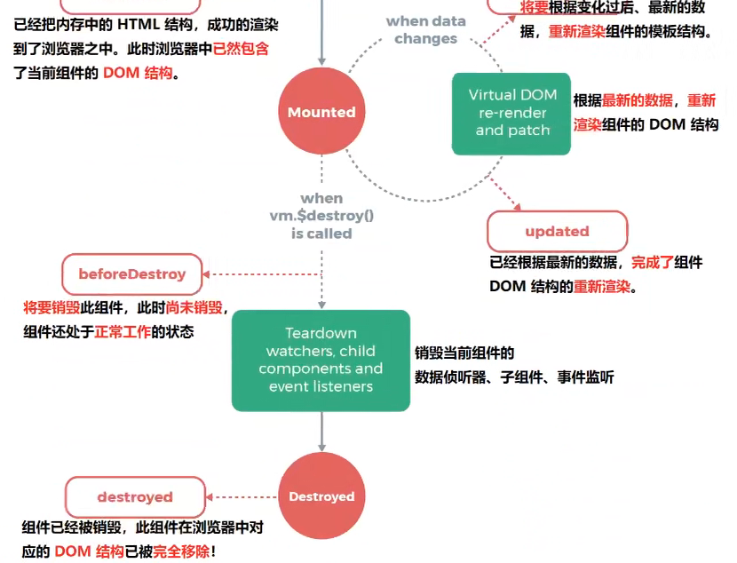

# Vue2 Learning Notes

## 〇、教学视频

[黑马Vue2](https://www.bilibili.com/video/BV1zq4y1p7ga?p=1)

## 一、vue2 安装及使用

### 1 - vue2 安装

#### 1.1 - 直接引入

在 Vue.js 的官网上直接[下载](https://cn.vuejs.org/v2/guide/installation.html) vue.min.js 并用  <<span style="color: #e3371e">script</span>>  标签引入，`Vue` 会被注册为一个全局变量。

> 在开发环境中不要使用压缩版本，不然会失去所有常见错误相关的警告

#### 1.2 - CDN

- 对于制作原型或学习，你可以这样使用最新版本

    ```html
    <!-- 开发环境版本，包含了有帮助的命令行警告 -->
    <script src="https://unpkg.com/vue@2.6.14/dist/vue.js"></script>
    ```

- 对于生产环境，推荐链接到一个明确的版本号和构建文件，以避免新版本造成的不可预期的破坏

    ```html
    <!-- 生产环境版本，优化了尺寸和速度 -->
    <script src="https://unpkg.com/vue@2.6.14/dist/vue.min.js"></script>
    ```

- 如果你使用原生 ES Modules，这里也有一个兼容 ES Module 的构建文件

    ```html
    <script type="module">
    import Vue from 'https://cdn.jsdelivr.net/npm/vue@2.6.14/dist/vue.esm.browser.js'
    </script>
    ```

#### 1.3 - npm

- 用 Vue 构建大型应用时推荐使用 npm 安装

    ```bash
    # 最新稳定版
    $ npm install vue
    ```

### 2 - 命令行工具开发单文件组件

Vue 提供了一个[官方的 CLI](https://github.com/vuejs/vue-cli)，为单页面应用 (SPA) 快速搭建繁杂的脚手架。

它为现代前端工作流提供了开箱即用的构建设置。

几分钟就能构建：

- 运行起来带有热重载
- 保存时 lint 校验
- 生产环境可用

的构建版本。

#### 2.1 - 安装

```sh
$ npm install -g vue-cli
```

#### 2.2 - 使用模版

```sh
# 使用模版
$ vue init <template-name> <project-name>

# 查看可用的官方模版
$ vue list
```

 <span style="color: #ab04d9">**示例**</span> ：

```sh
$ vue init webpack my-project
```

上面的命令从[vuejs-templates/webpack](https://github.com/vuejs-templates/webpack)中提取模板，提示输入一些信息，并在`./my-project/`处生成项目

 <span style="color: #ab04d9">**目前可用的官方模版**</span> 

- [webpack](https://github.com/vuejs-templates/webpack)
- [webpack-simple](https://github.com/vuejs-templates/webpack-simple)
- [browserify](https://github.com/vuejs-templates/browserify)
- [browserify-simple](https://github.com/vuejs-templates/browserify-simple)
- [pwa](https://github.com/vuejs-templates/pwa)
- [simple](https://github.com/vuejs-templates/simple)

## 二、vue 简介

### 1 - vue 简介

vue 是一套用于 <span style="color: #e3371e">**构建用户界面**</span> 的 <span style="color: #e3371e">**渐进式框架**</span>

### 2 - vue 特性

#### 2.1 - 数据驱动视图

#### 2.2 - 双向数据绑定

#### 2.3 - MVVM

### 3 - vue 的基本使用（CDN）

#### 3.1 - 基本使用步骤

- 导入 vue.js 的 script 脚本文件

    ```html
    <!-- 1.  引入 vue.js -->
    <script src="https://unpkg.com/vue@2.6.14/dist/vue.js"></script>
    ```

- 在页面中声明一个将要被 Vue 控制的 DOM 区域

    ```html
    <!-- 2.  在页面中声明一个将要被 vue 控制的 DOM 区域 -->
    <div id="app">
        {{ message }}
    </div>
    ```

- 创建 vm 实例对象（vue 实例对象）

    ```js
    // 3.  创建 vm 实例对象
    const vm = new Vue({
        el: '#app',
        data: {
            message: 'Hello Vue'
        }
    })
    ```

#### 3.2 - 基本代码与 MVVM 的对应关系

## 三、vue 基础

### 1 - 指令

### 2 - 过滤器

<span style="color: #e3371e">**过滤器**</span>（ <span style="color: #e3371e">Filters</span> ）是 vue 为开发者提供的功能，常用于 <span style="color: #e3371e">文本的格式化</span> ，可用于

-  <span style="color: #0099dd">插值表达式</span> 
-  <span style="color: #0099dd">v-bind 属性绑定</span> 

过滤器应被添加在 JavaScript 表达式的 <span style="color: #e3371e">尾部</span> ，由“ <span style="color: #e3371e">管道符</span> ”进行调用

- 过滤器 <span style="color: #e3371e">函数</span> 必须定义在 <span style="color: #e3371e">filters 节点</span> 下，且必须 <span style="color: #e3371e">return</span> 一个值（**本地过滤器**）
- 过滤器 <span style="color: #e3371e">函数</span> 形参中的  <span style="color: #0099dd">val</span>（第一个形参） ，永远是“管道符”前的值

```html
<!-- 在双括号中通过”管道符“调用 capitalize 过滤器，对 message 的值进行格式化 -->
<p>{{ message | captialize }}</p>

<!-- 在 v-bind 中通过”管道符“调用 formatId 过滤器，对 rawId 的值进行格式化 -->
<div :id="rawId | formatId"></div>
```

```js
filters: {
    captialize(val) {
        const first = val.charAt(0).toUpperCase()
        const after = val.slice(1)
        return first + after	// => Hello world
    }
}
```

#### 2.1 - 本地过滤器和全局过滤器

- 本地过滤器

    - 在 <span style="color: #e3371e">filters 节点</span> 下定义， <span style="color: #e3371e">只能应用于当前 vm 实例控制的 el 区域</span> 

- 全局过滤器

    - 在 <span style="color: #e3371e">创建 vue 实例之前</span> 全局定义

        ```js
        	// 全局过滤器 - 独立于每个 vm 实例之外
        	// Vue.filter() 方法接收两个参数
        	// ** 参数1 ，全局过滤器的”名字”
        	// ** 参数2 ，全局过滤器的”处理函数”
        	Vue.filter('capitalize', (str) => {
        	    return str.charAt(0).toUpperCase() + str.slice(1) + '~~'
        	})
        	
        	const vm2 = new Vue({
        	    el: '#app2',
        	    data: {
        	        message: 'bye world',	// => Bye world~~
        	    },
        	})
        ```

-  <span style="color: #e3371e">**注意：**</span> 

    - 当全局过滤器和局部过滤器重名时，会采用局部过滤器

    - 过滤器可以串联

        ```html
        {{ message | filterA | filterB }}
        ```

    - 从第二个参数开始，可以接收其他参数

### 3 - 计算属性与侦听器


## 四、组件基础

### 1 - 单页面应用程序

### 2 - 快速创建 vue 的SPA 项目

### 3 - 组件化开发

### 4 - 组件的基本使用

#### 4.1 - 组件的注册

##### 4.1.1 - 局部注册组件

##### 4.1.2 - 全局注册组件

- **vue2** 

    与 vue3 稍微不同，使用  <span style="color: #e3371e">Vue</span>.component() 注册

    ```js
    // 在main.js 项目入口文件导入被全局注册的组件
    import Count from '@/components/Count.vue'
    // 通过 Vue.component() 注册全局组件
    Vue.component('MyCount', Count)
    ```

    ```html
    <!-- 直接以标签的形式进行使用 -->
    <my-count></my-count>
    <h2>UP Branch</h2>
    ```

- **vue3** 

    使用  <span style="color: #e3371e">app</span>.component() 注册

    ```js
    // 在main.js 项目入口文件导入被全局注册的组件
    import Count from '@/components/Count.vue'
    // 通过 app 实例的 component() 注册全局组件
    app.component('MyCount', Count)
    ```

    ```html
    <!-- 直接以标签的形式进行使用 -->
    <my-count></my-count>
    <h2>UP Branch</h2>
    ```

#### 4.2 - 父子组件之间的样式冲突

##### 4.2.3 - /deep/ 样式穿透

**与 vue3 不同**

给当前组件的 style 节点添加了 scoped 属性：

- 则当<span style="color: #e3371e">前组件的样式对其子组件时不生效</span>的
- 使用<span style="color: #e3371e"> /deep/ 深度选择器</span>，可使某些样式<span style="color: #e3371e">对子组件生效</span>

```vue
// 父组件 App.vue 中
<style lang="less" scoped>
/deep/ .tittle {		// 子组件中 tittle 类的元素也会收到影响
    color: red;
}
</style>
```


### 5 - 组件的 props

#### 5.1 - 组件封装的基本原则

#### 5.2 - 组件的 props 介绍

#### 5.3 - 封装组件时声明 props

#### 5.4 - 无法使用未声明的 props

#### 5.5 - 动态绑定 props 的值

### 6 - props 验证

#### 6.1 - props 验证介绍

#### 6.2 - 对象类型的 props 节点

#### 6.3 - props 验证

## 五、组件高级

### 1 - 组件的生命周期

#### 1.1 - 组件的运行过程


#### 1.2 - 生命周期函数图解




### 2 - 组件之间的数据共享

### 3 - ref 引用

### 4 - 动态组件

### 5 - 插槽

### 6 - 自定义指令

## 六、vue-router

### 1 - 路由介绍

### 2 - vue-router的基本用法

#### 2.3 - 使用步骤

- 安装 vue-router 包

    vue2 项目中

    ```sh
    npm i vue-router -S
    ```

    

- 创建路由模块

    在 `src/router` 下新建 `index.js` 路由模块，并初始化如下代码

    ```js
    // 1.导入 Vue 和 VueRouter 的包
    import Vue from "vue";
    import VueRouter from "vue-router";
    
    // 2.调用 Vue.use() 函数，把 VueRouter 安装为 Vue 的插件
    Vue.use(VueRouter)
    
    // 3.创建路由的实例对象
    const router = new VueRouter()
    
    // 4.向外共享路由的实例对象
    export default router
    ```

    

- 导入并挂载路由模块

    在 `main.js` 文件中

    ```js
    import Vue from 'vue'
    import App from './App.vue'
    // 导入路由模块，拿到路由的实例对象
    import router from './router/index.js'
    
    Vue.config.productionTip = false
    Vue.component('MyCount', Count)
    
    const app = new Vue({
        render: h => h(App),
        // 在 Vue 项目中，挂载路由的实例对象
        router
    })
    
    app.$mount('#app')
    ```

- 导入需要使用路由控制的组件 & 声明路由规则

    在 `src/router/index.js` 文件中

    ```js
    import Vue from "vue";
    import VueRouter from "vue-router";
    
    // 导入需要使用路由控制的的组件
    import Home from '../components/local/Home.vue'
    import Movie from '../components/local/Movie.vue'
    import About from '../components/local/About.vue'
    
    Vue.use(VueRouter)
    
    const router = new VueRouter({
        // routers 是一个数组，用来定义 hash 地址与 组件之间的对应关系
        routes: [
            { path: '/', component: Home },
            { path: '/home', component: Home },
            { path: '/movie', component: Movie },
            { path: '/about', component: About }
        ]
    })
    
    export default router
    ```

    

- 声明路由链接和占位符

    在 `app.vue` 文件中

    ```html
    <router-link to="/home">Home</router-link>
    <router-link to="/movie">Movie</router-link>
    <router-link to="/about">About</router-link>
    
    <router-view></router-view>
    ```

### 3 - vue-router 的高级用法

#### 3.7 - 默认子路由

如果 children 数组中，某个路由规则的 path 值为空字符串，则这条路由规则，叫做默认子路由

```js
{path: '', component: Tab1}
```

相应地，router-link 链接也需修改

```html
<router-link to="/about/tab1">Tab 1</router-link>
<-- ↓改为↓ -->
<router-link to="/about">Tab 1</router-link>
```

