## 〇、前置

- 学习视频
    - [黑马Node.js](https://www.bilibili.com/video/BV1a34y167AZ?p=24&vd_source=89e7c7520dcc682cb1b72284674fbbf4) 

## 一、回顾

### 1 - 浏览器中的JavaScript的组成部分


### 2 - 浏览器中JavaScript可以操作DOM和BOM的原因

- 浏览器中内置了DOM、BOM这样的API函数，因此浏览器中的JS可以调用

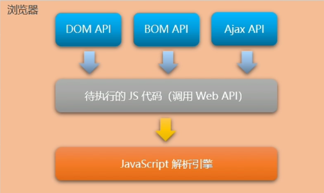


### 3 - 运行环境

运行环境是指：代码正常运行所需的必要环境

#### 浏览器中的JavaScript运行环境

- V8 引擎负责解析和执行 JavaScript 代码
- 内置 API 是由运行环境提供的特殊接口，只能在所属的运行环境中被调用

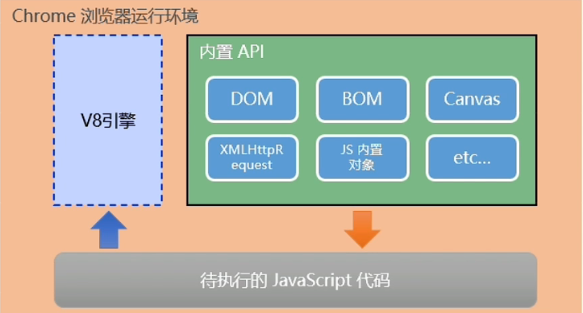


#### Node.js 中的 JavaScript 运行环境

- 浏览器是 JavaScript 的前端运行环境

- Node.js 是 JavaScript 的后端运行环境

- Node.js 中无法调用 DOM 和 BOM 等浏览器内置API

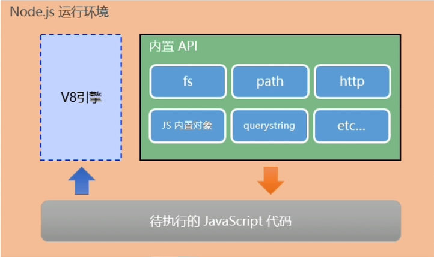


### 4 - 学习路径对比

#### 浏览器中的 JavaScript 学习路径：

-  JavaScript 基本语法
- 浏览器内置API（DOM + BOM）
- 第三方库（jQuery、art-template等）


#### Node.js 中的 JavaScript 学习路径：

-  JavaScript 基本语法
- Node.js 内置API（fs + path + http 等）
- 第三方 API 模块（express、 mysql 等）


## 二、Node.js简介

### 1 - 什么是 Node.js

Node.js 是一个基于chrome V8 引擎的 JavaScript 运行环境


### 2 - Node.js 运行环境的安装

- [下载安装 Node.js](http://nodejs.cn/download/)


### 3 - 终端（Terminal）

终端：是专门为开发人员设计，用以实现人机交互的一种方式

#### 3.1 - 打开终端

- win + R  输入 cmd
- 任意目录 shift + 鼠标右键  选择 powershell


#### 3.2 - 终端快捷键

- > ↑  键 ：快速定位上一次执行的命令

- > Tab ： 自动补全

- > Esc ： 快速清空当前输入命令

- > cls ： 清空终端


#### 3.3 - 终端常用命令

```powershell
# 切换到指定目录
cd <指定目录名>

# 进入父目录
cd .. 

# 退出文件夹，回到根目录
cd \

# 显示当前目录中的子文件夹和文件
dir

# 显示当前文件夹中的内容
dir \ls

# 列出目前工作目录所含文件及子目录
ls

# 在当前目录中创建文件夹
md

# 拷贝文件
copy <文件名> <目录名>
# 将当前目录中的key.txt文件复制到c:\doc目录下(若doc中也存在一个key.txt文件，会询问是否覆盖）
copy key.txt c:\doc
```


### 4 - Node.js常用命令

```bash
# 查看当前的 Node 版本
$ node -v

# 运行指定 JS 文件（切换到JS文件所在目录）
$ node xxx.js

# i进入 node.js
$ node

# 退出 node.js
$ crtl + C * 2 | ctrl + D

# 查看 npm 软件包全局安装位置
$ npm root -g

# 运行可执行文件软件包
$ npx <packagename>
```


### 5 - 第一个 node.js 文件

```javascript
const http = require('http')

const hostname = '127.0.0.1'
const port = 3000

const server = http.createServer((req, res) => {
    res.statusCode = 200
    res.setHeader('Content-Type', 'text/plain;charset=UTF-8')
    res.end('你好！出岫！')
})

server.listen(port, hostname, () => {
    console.log(`Server running at http://${hostname}:${port}/`)
})
```


## 三、fs 文件读取系统

文件 I/O 是对标准 POSIX 函数的简单封装。 通过 `require('fs')` 使用该模块。 所有的方法都有异步和同步的形式。

- 异步方法
    - 最后一个参数都是一个回调函数
    - 传给回调函数的参数取决于具体方法，但回调函数的第一个参数都会保留给异常
    - 如果操作成功完成，则第一个参数会是 `null` 或 `undefined`
- 同步方法
    - 任何异常都会被立即抛出
    - 可以使用 `try`/`catch` 来处理异常，或让异常向上冒泡


### 1 - fs文件系统模块介绍

<span style="color: #e3371e">fs 模块</span> 是 Node.js 官方提供的、用来操作文件的模块。

它提供了一系列的方法和属性，用来满足用户对文件的操作需求。

例如：

- <span style="color: #0099dd">fs.readFile() </span> 方法：用来<span style="color: #e3371e">读取</span>指定文件中的内容
- <span style="color: #0099dd">fs.writeFile()</span>  方法：用来向指定的文件中<span style="color: #e3371e">写入</span> 内容


### 2 - fs.readFile()

#### 2.1 - 语法格式

使用 fs.readFile() 方法，可以读取指定文件中的内容，语法格式：

```
fs.readFile(path[,options],callback)
```

 **<span style="color: #ab04d9">参数</span>** 

- `path` - 表示<span style="color: #0099dd">文件的路径</span> 

- `[options]`：
  
    - `encoding` - 表示以什么<span style="color: #0099dd">编码格式</span>来读取文件【默认为 `null`】
    - `flag` - 表示文件打开的行为
        -  默认为 `'r'` ，r 表示以读取模式打开文件。
        - 如果文件不存在抛出异常
    
- `callback`  - 文件读取完成后，通过回调函数得到读取的结果
  
    - `err` - 读取失败后的结果
    - `data`  - 读取成功后的<span style="color: #0099dd">文件内容</span> 
    
    > 1、读取成功 err 为 null，data 为文件内容
    >
    > 2、读取失败 err 为 错误对象，data 为 undefined


#### 2.2 - 示例代码

```javascript
const fs = require('fs')

fs.readFile('../etc/test.json', 'utf-8', function(err, data)  {
    console.log(err);
    console.log('-------');
    console.log(data);
})
```


#### 2.3 - 判断文件是否读取成功

可以判断 err 的对象是否为 null ，从而知晓文件读取的结果

```javascript
const fs = require('fs')

fs.readFile('../etc/test.json', 'utf-8', function(err, data)  {
    if(err) {
        console.log('文件读取失败！' + err.message);
    }
    console.log('文件读取成功，内容是' + data);
})
```


### 3 - fs.writeFile()

>  1、覆盖时写入
>
>  2、能创建文件，但不能创建目录

#### 3.1 - 语法格式

```javascript
fs.writeFile(file, data[, options], callback)
```

- `file` - 表示<span style="color: #0099dd">文件的存放路径</span>

- `data` - 表示<span style="color: #0099dd">要写入的内容</span> 

- `[options]` 
  
    - `encoding` - 表示以什么<span style="color: #0099dd">编码格式</span>来写入文件，【默认 = `'utf8'】`
    - `mode` - 设置文件模式（权限）
        - 默认 = `0o666`（可读、可写）
    - `flag` <string> # 文件打开行为
        - 默认 = `'w'` 表示以<span style="color: #0099dd">写入模式</span> 打开文件，如果文件不存在则创建，但 <span style="color: #e3371e">不能创建目录</span> 
    
- `callback` -  写入成功后的回调函数

    > 1、文件写入成功， 则 err 值为 null
    >
    > 2、文件写入失败， 则 err 值为 错误对象


#### 3.2 - 示例代码

```javascript
const fs =require('fs')

fs.writeFile('../etc/test1.json', '{"lover": "self", "username": "feng"}', function (err) {
    console.log(err)
})
```


#### 3.3 - 判断文件是否写入成功

可以判断 err 的对象是否为 null ，从而知晓文件写入的结果

```javascript
const fs =require('fs')

fs.writeFile('../etc/test1.json', '{"lover": "self", "username": "feng"}', function (err) {
    if(err) {
        return console.log('文件写入失败');
    } else {
        console.log('文件写入成功')
    }
})
```


### 4 - 路径动态拼接

**问题：**在使用 fs 模块操作文件时，如果提供的操作路径是以  <span style="color: #e3371e">./</span> 或 <span style="color: #e3371e">../</span> 开头的 <span style="color: #e3371e">相对路径</span> 时，很容易出现路径动态拼接错误的问题

**原因：**代码运行时， <span style="color: #e3371e">会以执行 node 命令时所处的目录</span> ，动态拼接处被操作文件的完整路径

**解决方案：** 

-  <span style="color: #e3371e">__dirname</span> 表示 <span style="color: #0099dd">当前文件所处目录</span> ，不会随执行命令时所处目录变化而变化
- ~~使用绝对路径，代码移植性差，不利于维护~~


## 四、path 路径模块

### 1 - path路径模块介绍

 <span style="color: #e3371e">path 模块</span> 是官方提供的，用来 <span style="color: #e3371e">处理路径</span> 的模块。它提供了一些列的方法和属性，用来满足用户对路径的处理要求

例如：

-  <span style="color: #0099dd">path.join()</span> 方法，用来 <span style="color: #e3371e">将多个路径片段拼接成一个完整的路径字符串</span> 
-  <span style="color: #0099dd">path.basename()</span> 方法，用来从路径字符串中，将文件名解析出来

 **<span style="color: #ab04d9">引入方式：</span>** 

```js
const path = require('node:path')
```


### 2 - path.join()

使用特定于平台的分隔符作为定界符将所有给定的 `path` 片段连接在一起，然后规范化生成的路径

 <span style="color: #e3371e">凡涉及路径拼接的操作，都使用 `path.join()` 处理，不直接使用 + 进行字符串拼接</span> 

#### 2.1 - 语法格式

```js
path.join([...paths])
```

 <span style="color: #ab04d9">**参数**</span>

- `...paths` - 路径片段的序列
- `返回` : `String`

> 1、零长度的 `path` 片段被忽略
>
> 2、如果连接的路径字符串是零长度字符串，则将返回 `'.'`，表示当前工作目录
>
> 3、拼接字符串中出现“../”，将向上返回一层路径（即向上抵消一层路径）
>
> 4、如果任何路径片段不是字符串，则抛出 `TypeError` 


#### 2.2 - 示例代码

```js
path.join('/foo', 'bar', 'baz/asdf', 'quux', '..');
// 返回: '/foo/bar/baz/asdf'

path.join('foo', {}, 'bar');
// 抛出 'TypeError: Path must be a string. Received {}'

const path = require('path')

pathStr = path.join(__dirname, './0-data.json')
console.log(pathStr); // => D:\Web Front End\code practice\总录\12-node\0-data.json
// 终端目录：D:\Web Front End\code practice\总录 运行 js
```


### 3 - path.basename()

返回 `path` 的最后一部分，常用于获取路径中的文件名

#### 3.1 - 语法格式

```js
path.basename(path[, ext])
```

 <span style="color: #ab04d9">**参数**</span> 

- `path` 
- `ext` - 可选的文件扩展名, 尾随的目录分隔符被忽略
- `返回`：`String`

> 如果 `path` 不是字符串，或者如果给定 `ext` 并且不是字符串，则抛出 TypeError


#### 3.2 - 示例代码

```js
path.basename('/foo/bar/baz/asdf/quux.html');
// 返回: 'quux.html'

path.basename('/foo/bar/baz/asdf/quux.html', '.html');
// 返回: 'quux'
```


### 4 - path.extname()

返回 `path` 的扩展名，即 `path` 的最后一部分中从 <span style="color: #e3371e">最后一次出现</span> 的 `.`（句点）字符到字符串的结尾

#### 4.1 - 语法格式

```js
path.extname(path)
```

 <span style="color: #ab04d9">**参数**</span> 

- `path` - 文件路径名
- `返回` : `String`

> 如果 `path` 不是字符串，则抛出 TypeError


#### 4.2 - 示例代码

```js
path.extname('index.html');
// 返回: '.html'

path.extname('index.coffee.md');
// 返回: '.md'

path.extname('index.');
// 返回: '.'

path.extname('index');
// 返回: ''

path.extname('.index');
// 返回: ''
```


## 五、http 模块

### 1 - http 模块介绍

[http 模块](http://nodejs.cn/learn/the-nodejs-http-module)是 Node.js 官方提供的、用来 <span style="color: #e3371e">创建 web 服务器</span> 的模块

通过 http 模块提供的  <span style="color: #0099dd">http.creatServer()</span> 方法，可使本地电脑变成一台 Web 服务器，从而对外提供 Web 资源服务

 **<span style="color: #ab04d9">引入方式：</span>** 

```js
const http = require('http')
```


### 2 - 创建 web 服务器的基本步骤

- **导入 http 模块** 

    ```js
    const http = require('http')
    ```

- **创建 web 服务器实例** 

    ```js
    const server = http.createServer()
    ```

- **为服务器实例绑定 <span style="color: #e3371e">request</span> 事件， <span style="color: #0099dd">监听客户端的请求</span>** 

    ```js
    // 使用服务器实例的 .on() 方法，为服务器绑定一个 request 事件
    server.on('request', (req,res) => {
    	// 只要有客户端来请求我们自己的服务器，就会触发 request 事件，从而触发这个事件处理函数
    	console.log('Someon visit our web server.')
    })
    ```

- **启动服务器**

    调用服务器实例的  <span style="color: #e3371e">.listen()</span> 方法，即可启动当前的 web 服务器实例

    ```js
    // 调用 server.listen('port', callback) 方法，即可启动 web 服务器
    server.listen(80, () => {
    	console.log('http server running at http://127.0.0.1')
    })
    ```


### 3 - http.IncomingMessage 类

- [IncomingMessage](http://nodejs.cn/api/http.html#class-httpincomingmessage) 对象由 [`http.Server`](http://nodejs.cn/api/http.html#class-httpserver) 或 [`http.ClientRequest`](http://nodejs.cn/api/http.html#class-httpclientrequest) 创建，并分别作为第一个参数传给 [`'request'`](http://nodejs.cn/api/http.html#event-request) 和 [`'response'`](http://nodejs.cn/api/http.html#event-response) 事件
    - 'request' 事件对应参数
        - request - <http.IncomingMessage>
        - response - <http.ServerResponse>
    - 'response' 事件对应参数
        - response - <http.IncomingMessage>
- 它可用于访问响应状态、标头和数据

**一些属性或方法** 

|        属性或方法         |                             说明                             |
| :-----------------------: | :----------------------------------------------------------: |
|      `'close'` 事件       |                       当请求完成时触发                       |
|    `message.complete`     | 已接收并成功解析完整的 HTTP 消息，则 `message.complete` 属性将为 `true` |
|     `message.headers`     | 请求/响应头对象。<br />标头名称和值的键值对。 标头名称是小写的 |
| `message.headersDistinct` | 类似于 message.headers，但没有连接逻辑，并且值始终是字符串数组 |
|   `message.httpVersion`   |          服务器请求的情况下，客户端发送的 HTTP 版本          |
|     `message.method`      |              仅适用于从 http.Server 获得的请求               |
|   `message.rawHeaders`    | 原始请求/响应头完全按照收到的方式列出<br />键和值在同一个列表中 |
|   `message.statusCode`    | 仅对从 http.ClientRequest 获得的响应有效<br />3 位 HTTP 响应状态码 |
|       `message.url`       |   仅适用于从 http.Server 获得的请求<br />请求的网址字符串    |

只要服务器收到了客户端的请求，就会调用通过  <span style="color: #e3371e">server.on()</span>  为服务器绑定的 <span style="color: #0099dd">request 事件处理函数</span> 

在事件处理函数中，可通过它（一般为 <span style="color: #ff8b24">req</span> ） <span style="color: #0099dd">访问与客户端相关的 <span style="color: #e3371e">数据</span> 或 <span style="color: #e3371e">属性</span> </span> 

```js
server.on('requser', (req) => {
	// req 是请求对象，包含了 与客户端相关的数据和属性，如：
	// req.url 是客户端请求的 URL 地址
	// req.method 是客户端的 method 请求类型
	const str = `Your request url is ${req.url}, and request method is ${req.method}`
	console.log(str)
})
```


#### 3.1 - 根据不同的 url 响应不同的 html 内容

- **获取请求的  <span style="color: #e3371e">url</span>  地址 **
- **设置 <span style="color: #e3371e">默认的响应内容</span> 为 404 Not Found** 
- **判断用户请求的是否为 <span style="color: #e3371e">/</span> 或 <span style="color: #e3371e">/index.html</span> 首页** 
- **判断用户请求的是否为 <span style="color: #e3371e">/about.html</span> 首页** 
- **设置 <span style="color: #e3371e">Content-Type 响应头</span> ，防止中文乱码** 
- **使用  <span style="color: #e3371e">res.end()</span> 把内容响应给客户端** 

##### 3.1.1 - 示例代码

```js
const http = require('http')

const server = http.createServer()

server.on('request', (req, res) => {
    // 默认响应内容
    let content = `<h1>404 Not Fount</h1>`
    // 获取请求 url
    const url = req.url
    // 判断用户请求 url，并设置对应内容
    if (url === '/' || url === '/index.html') {
        console.log('ok')
        content = `<h1>首页</h1>`
    } else if (url === '/about.html') {
        console.log('ok2')
        content = `<h1>关于</h1>`
    }
    // 设置内容编码格式
    res.setHeader('Content-Type', 'text/html; charset=utf-8')
    res.end(content)
})

server.listen(8080, () => {
    console.log('服务器正在运行 127.0.0.1:8080')

    if (server.listening) return console.log('正在监听')
    console.log('停止监听')
})

```


#### 3.2 - 实现本地文件的 web 服务器

**核心思路**：把文件的 <span style="color: #0099dd">实际存放路径</span> ， <span style="color: #e3371e">作为</span> 每个资源的 <span style="color: #0099dd">请求 url 地址</span> 

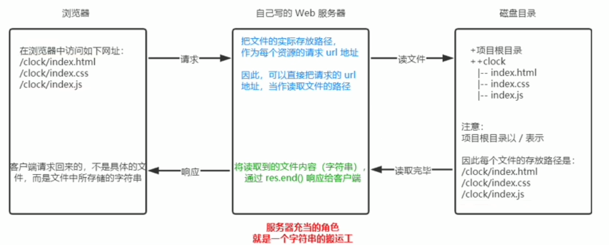

##### 3.2.1 - 实现步骤

- **导入需要的模块** 

    ```js
    const http = require('http')
    const fs = require('fs')
    const path = require('path')
    ```

- **创建基本的 web 服务器** 

    ```js
    const server = http.createServer()
    
    server.on('request', (req, res) => {
    	// code something
    })
    
    server.listen(80, () => {
        console.log(`Server listen at localhost:80`)
    })
    ```

- **将资源的请求 url 地址映射为文件的存放地址** 

    ```js
    server.on('request', (req, res) => {
        // 3.1 获取到客户端请求的 url 地址
        //          /clock/index.html
        //          /clock/index.css
        //          /clock/index.js
        const url = req.url
        // 3.2 把请求的 url 地址映射为具体文件的存放地址
        const fpath = path.join(__dirname, 'www', url)
    
    })
    ```

- **读取文件内容并响应给客户端** 

    ```js
    server.on('request', (req, res) => {
        const url = req.url
        const fpath = path.join(__dirname, 'www', url)
    
        // 4.1 根据“映射”过来的文件路径读取文件的内容
        fs.readFile(fpath, 'utf-8' , (err, data) => {
            if (err) return res.end(' 404 Not Found ')
            res.end(data)
        })
    })
    ```

- **优化资源的请求路径** 

    - 访问 localhost/ 能访问首页
    - 访问路径省略 clock

    ```js
    server.on('request', (req, res) => {
        const url = req.url
        // const fpath = path.join(__dirname, 'www', url)
    
        // 5 预定义 空白的文件存放路径
        let fpath = ''
        if (url ==='/') {
            // 5.1 如果请求的路径为 '/' ，则手动指定文件的存放路径
            fpath = path.join(__dirname, './www/clock/index.html')
        } else {
            // 5.2 如果请求的路径不为 '/'，则动态拼接文件的存放路径
            fpath = path.join(__dirname, '/www/clock', url)
        }
    
        // 4.1 根据“映射”过来的文件路径读取文件的内容
        fs.readFile(fpath, 'utf-8' , (err, data) => {
            if (err) return res.end(' 404 Not Found ')
            res.end(data)
        })
    })
    ```


### 4 - http.ServerResponse 类

此对象由 HTTP 服务器内部创建，而不是由用户创建。 它作为第二个参数传给 [`'request'`](http://nodejs.cn/api/http.html#event-request) 事件

在 request 事件处理函数中，可通过它（一般为 <span style="color: #ff8b24">res</span> ） <span style="color: #0099dd">访问与服务器相关的 <span style="color: #e3371e">数据</span> 或 <span style="color: #e3371e">属性</span> </span> 

```js
server.on('requser', (req,res) => {
	const str = `Your request url is ${req.url}, and request method is ${req.method}`
	// res 是响应对象，包含了 与服务器相关的数据和属性，如：
	// res.end() 可想客户端发送指定的内容，并结束至此请求的处理过程
	res.end(str)
})
```

[http.ServerResponse 类 **查询**](http://nodejs.cn/api/http.html#class-httpserverresponse)

#### 4.1 - 解决中文乱码问题

当调用 res.edn() 方法，向客户端发送中文内容时，会出现乱码问题

```js
server.on('requser', (req,res) => {
    res.end('你好') // => 浣犲ソ
})
```

此时，需手动 <span style="color: #e3371e">设置内容的编码格式</span> 

```js
server.on('requser', (req,res) => {
	res.setHeader('Content-Type','text/html; charset=utf-8')
    res.end('你好') // => 你好
})
```


### 5 - http.createServer()

#### 5.1 - 语法格式

```js
http.createServer([options][, requestListener])
```

 <span style="color: #ab04d9">**参数**</span> 

- `options` - 一系列参数（都有默认值）
- `requestListener` - 自动添加到 [request](http://nodejs.cn/api/http.html#event-request) 事件的函数
- `返回` : [http.Server](http://nodejs.cn/api/http.html#class-httpserver) 的新实例


## 六、模块化

### 1 - 模块化介绍

<span style="color: #e3371e">模块化</span> 是指解决一个 <span style="color: #0099dd">复杂问题</span> 时，自顶向下逐层 <span style="color: #e3371e">把系统分为若干模块的过程</span> 。

对于整个系统来说， <span style="color: #0099dd">模块时可组合、分解和更换的单元</span> 

#### 1.1 - 编程领域中的模块化

编程领域的模块化，就是 <span style="color: #e3371e">遵守固定的规则</span> ，把一个 <span style="color: #e3371e">大文件</span> 拆成 <span style="color: #0099dd">独立并相互依赖</span> 的 <span style="color: #e3371e">多个小模块</span> 

**模块化拆分的优点**

- 提高代码的 <span style="color: #e3371e">复用性</span> 
- 提高代码的 <span style="color: #e3371e">可维护性</span> 
- 可以实现 <span style="color: #e3371e">按需加载</span> 


#### 1.2 - 模块化规范

<span style="color: #e3371e">模块化规范</span> 是对代码进行模块化的拆分和组合时，需要遵守的规则

例如： <span style="color: #0099dd">引用模块</span> 的语法格式， <span style="color: #0099dd">向外暴露成员</span> 的语法格式

**遵守模块化规范的优点**

- 降低沟通成本
- 极大方便各模块间的相互调用


### 2 - Node.js中的模块化

#### 2.1 - 模块分类

Node.js 中根据 <span style="color: #e3371e">模块来源</span> 不同，将模块分为 <span style="color: #e3371e">3</span> 大类：

-  <span style="color: #ff8b24">内置模块</span> - 由 Node.js 官方提供，如 fs、path、http等
-  <span style="color: #ff8b24">自定义模块</span>  - 用户创建的每个 .js 文件
-  <span style="color: #ff8b24">第三方模块</span>  - 由 <span style="color: #0099dd">第三方开发</span> 出来的模块，使用前需要 <span style="color: #0099dd">先下载</span> 


#### 2.2 - 模块加载

使用强大的 <span style="color: #e3371e">require()</span> 方法，可以加载需要的 <span style="color: #0099dd">内置模块、用户自定义模块、第三方模块</span> 进行使用

```js
// 1. 加载内置的 fs 模块
const fs = require('fs')

// 2. 加载用户的自定义模块
// const custom = require('./custom')
const custom = require('./custom.js')

// 3. 加载第三方模块
const moment = require('moment')
```

> 使用 require() 方法，加载其他模块时，会使用被加载模块中的代码
>
> 自定义模块路径可省略 js 文件后缀名


#### 2.3 - 模块作用域

与函数作用域类似，在自定义模块中定义的 <span style="color: #0099dd">变量、方法</span> 等成员， <span style="color: #e3371e">只能在当前模块内被访问</span> ，这种 <span style="color: #e3371e">模块级别的访问限制</span> ，叫做 <span style="color: #e3371e; font-weight: bold">模块作用域</span> 


#### 2.4 - 向外共享模块作用域中的成员

##### 2.4.1 - module 对象

每个 .js 自定义模块中都有一个  <span style="color: #e3371e">module 对象</span> ，它里面 <span style="color: #0099dd">存储了和当前模块有关的信息</span> 

```js
// m2.js

const username = 'coco'

function sayHello() {
    console.log('Hello')
}
console.log('');
console.log(module) => ↓↓↓↓
```

**终端输出**

```powershell
PS D:\Web Front End\code practice\总录\12-node\myModules> node .\m2.js

Module {
  id: '.',
  path: 'D:\\Web Front End\\code practice\\总录\\12-node\\myModules',
  exports: {},
  filename: 'D:\\Web Front End\\code practice\\总录\\12-node\\myModules\\m2.js',
  loaded: false,
  children: [],
  paths: [
    'D:\\Web Front End\\code practice\\总录\\12-node\\myModules\\node_modules',
    'D:\\Web Front End\\code practice\\总录\\12-node\\node_modules',
    'D:\\Web Front End\\code practice\\总录\\node_modules',
    'D:\\Web Front End\\code practice\\node_modules',
    'D:\\Web Front End\\node_modules',
    'D:\\node_modules'
  ]
}
PS D:\Web Front End\code practice\总录\12-node\myModules>
```


##### 2.4.2 - module.exports 对象

在自定义模块中，可以使用 <span style="color: #e3371e">module.exports 对象</span> ，将模块内的成员共享出去，供外界使用

外界，使用 <span style="color: #e3371e">require() 方法</span> ，导入自定义模块时，得到的就是 module.exports 所指向的对象

```js
// 自定义模块文件   m1.js
module.exports.username = 'zs'

module.exports.sayHello = function () {
    console.log('Hello~');
}

let hostname = 'chuxiu'
const singSong = function () {
    console.log('Sing~');
}

module.exports.hostname = hostname
module.exports.singSong = singSong
```

```js
// 导入模块的文件  6-module.js
const m1 = require('./myModules/m1')

console.log(m1)				// => { /* …… */ }
console.log(m1.username)	// => zs
console.log(m1.sayHello)	// => [Function (anonymous)]
console.log(m1.hostname)	// => chuxiu
console.log(m1.singSong)	// => [Function: singSong]

m1.sayHello()				// => Hello~
m1.singSong()				// => Sing~
```


##### 2.4.3 - 共享成员的注意点

使用 require() 方法导入模块时，导入的结果， <span style="color: #e3371e">永远以 module.exports 指向的对象为准</span> 

```js
// 自定义模块
// 1. 向 module.exports 对象上挂载属性 username
module.exports.username = 'zs'
// 2. 向 module.exports 对象上挂载属性 sayHello
module.exports.sayHello = function() {
    console.log('hello!')
}

// 3. 让 module.exports 指向一个全新的对象
module.exports = {
    nickname: 'coco',
    sayHi() {
        console.log('Hi!')
    }
}
```

```js
// 导入模块的文件
const m2 = require('./myModules/m2')

console.log(m2)		// => { nickname: 'coco', sayHi: [Function: sayHi] }
```


##### 2.4.4 - exports 对象

为简化向外共享成员的代码，Node 提供了 <span style="color: #0099dd">exports 对象</span> 

默认情况下，exports 和 module.exports 指向同一个对象

最终共享结果，以 module.exports 指向的对象为准


##### 2.4.5 - exports 和 module.exports 的使用误区

时刻谨记，require() 模块时，得到的永远是 <span style="color: #e3371e">module.exports</span> 指向的对象

**4 个案例分析**

> 为防止混乱，不要在同一个模块中同时使用 exports 和 module.exports

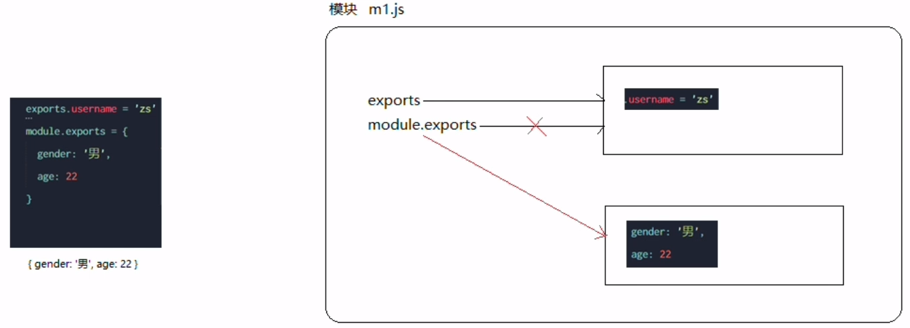

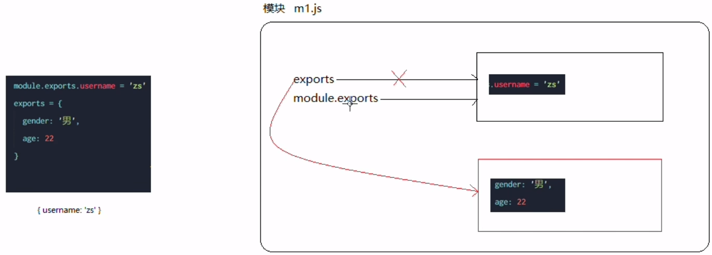

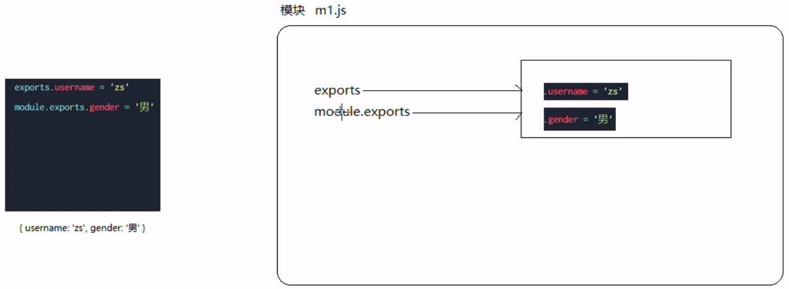

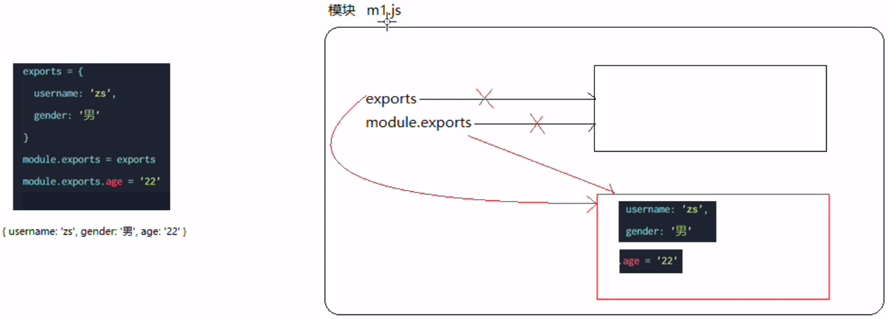


#### 2.5 - Node.js 中的模块化规范

Node.js 遵循了 <span style="color: #e3371e">CommoenJS</span> 模块化规范，CommonJS 规定了 <span style="color: #0099dd">模块的特性</span> 和 <span style="color: #0099dd">各模块之间如何相互依赖</span> 

**CommonJS规定：**

- 每个模块内部， <span style="color: #e3371e">module 变量</span> 代表当前模块
- module 变量时一个对象，它的 exports 属性（即 <span style="color: #e3371e">module.exports</span> ）是 <span style="color: #e3371e">对外的接口</span> 
- 加载某个模块，其实是加载该模块的 module.exports 属性。 <span style="color: #e3371e">require() 方法用于加载模块</span> 


### 3 - 模块的加载机制

#### 3.1 - 优先从缓存中加载

 <span style="color: #e3371e">模块在第一次加载后会被缓存</span> 。因此，多次调用 require() 不会导致模块的代码被执行多次

> 无论时内置模块、自定义模块，还是第三方模块，它们都会优先从缓存中加载，从而 <span style="color: #49bf51">提高模块的加载效率</span> 


#### 3.2 - 内置模块的加载机制

内置模块由 Node.js 官方提供， <span style="color: #e3371e">内置模块的加载优先级最高</span> 

例如，require('fs') 始终返回内置的 fs 模块，即时在 node_modules 目录下由相同的包也叫做 fs


#### 3.3 - 自定义模块的加载机制

使用 require() 加载 <span style="color: #e3371e">自定义模块</span> 时，必须指定 <span style="color: #0099dd">./</span> 或 <span style="color: #0099dd">../</span> 开头的 <span style="color: #e3371e">路径标识符</span> 

- 未指定路径标识符的情况下，node 会将它当做 <span style="color: #0099dd">内置模块</span> 或 <span style="color: #0099dd">第三方模块</span> 进行加载
- 如果省略了文件扩展名，node 会  <span style="color: #0099dd">按顺序</span> 分别尝试加载以下文件：
    - 按照 <span style="color: #49bf51">确切文件名</span> 进行加载
    -  <span style="color: #49bf51">补全 .js</span> 扩展名进行加载
    -  <span style="color: #49bf51">补全 .json</span> 扩展名进行加载
    -  <span style="color: #49bf51">补全 .node</span> 扩展名进行加载
    - 加载失败，终端报错


#### 3.4 - 第三方模块的加载机制

如果传递给 require() 的模块标识符不是一个内置模块，也没有以 './' 或 '../' 开头， Node.js 会 <span style="color: #e3371e">从其当前模块的父目录</span> 开始，尝试从 <span style="color: #e3371e">/node_modules</span> 文件夹中加载 <span style="color: #0099dd">第三方模块</span> 

如果 <span style="color: #e3371e">没有找到</span> 对应的第三方模块，则会 <span style="color: #e3371e">移动到再上一层父目录</span> 中，进行加载， <span style="color: #ab04d9">直到</span>  <span style="color: #e3371e">文件系统的根目录</span> 。

***

例如，假设在 `C:\Users\chuxiu\project\foo.js` 文件中调用了 <span style="color: #0099dd">require('tools')</span> ，则 Node.js 会按以下顺序查找：

- C:\Users\chuxiu\project\ <span style="color: #ab04d9">node_modules</span>\tools
- C:\Users\chuxiu\ <span style="color: #ab04d9">node_modules</span>\tools
- C:\Users\ <span style="color: #ab04d9">node_modules</span>\tools
- C:\ <span style="color: #ab04d9">node_modules</span>\tools
- 加载失败，终端报错


#### 3.5 - 目录作为模块

当把目录作为模块标识符，传递给 require() 进行加载的时候，有三种加载机制：

- 在被加载的目录下查找一个叫 package.json 的文件，并寻找 main 属性，作为 require() 加载的入口
- 如果目录中无 package.json 文件，或者 main 入口不存在或无法解析，则 Node.js 会试图加载目录下的 <span style="color: #e3371e">index.js</span> 文件

- 如果上两步失败，则终端报错：`Error: Cannot find module 'xxx'` 


## 七、npm 与 包

### 1 - 包

Node.js 中的 <span style="color: #e3371e">第三方模块</span> 又叫做 <span style="color: #e3371e">包</span> 

#### 1.1 - 包的来源

不同于 Node.js 中的内置模块与自定义模块，包是由 <span style="color: #e3371e">第三方个人或团队开发出来的</span> ，免费供所有人使用

> Node.js 中的包都是免费开源的，无需付费即可免费下载使用


#### 1.2 - 需要包的原因

由于 Node.js 的内置模块仅提供一些底层的 API ，导致在基于内置模块的项目开发时，效率很低

 <span style="color: #e3371e">包</span> 是基于内置模块 <span style="color: #e3371e">封装</span> 出来的，提供了更高级、方便的 API ， <span style="color: #e3371e">极大地提高了开发效率</span> 

>  <span style="color: #e3371e">包</span> 与 <span style="color: #0099dd">内置模块</span> 的关系，类似于 <span style="color: #e3371e">jQuery</span> 和 <span style="color: #0099dd">浏览器内置 API </span> 之间的关系


#### 1.3 - 包的下载

<span style="color: #e3371e">全球最大的包共享平台</span>  [**npm**](https://www.npmjs.com/)

 <span style="color: #e3371e">npm.inc.公司</span> 提供了一个地址为 <span style="color: #0099dd">**https://registry.npmjs.org**</span> （服务器地址）的服务器，对外共享所有的包

***

使用 <span style="color: #e3371e; font-weight: bold">npm 包管理工具</span> （ <span style="color: #0099dd">Node Package Manager</span> ）从 **https://registry.npmjs.org** 下载包到本地使用

 <span style="color: #0099dd; font-weight: bold">初次安装</span> 包完成后，项目文件夹下会 <span style="color: #e3371e; font-weight: bold">node_modules</span> 的文件夹和 <span style="color: #e3371e; font-weight: bold">package-lock.json</span> 的配置文件

- **node_modules** 
    -  <span style="color: #e3371e">存放所有已安装到项目中的包</span> 
    - requre() 导入第三方包时，从此目录中查找并加载文件
- **package-lock.json** 
    -  <span style="color: #e3371e">记录 node_modules 目录下每一个包的下载信息</span> ，如包的名字、版本号、下载地址

> 无需手动修改其中任何代码，npm 会自动维护它们


#### 1.4 - 包的使用

**示例** - 格式化时间

- 使用 npm 包管理工具，在项目中安装格式化时间的包 moment

    ```bash
    $ npm install moment
    # or
    $ npm i moment
    ```

- 使用 require() 导入 moment

    ```js
    const moment require('moment')
    ```

- 参考 moment 官方 API 文档对事件进行格式化

    ```js
    const moment require('moment')
    
    // 参考 moment 官方 API 文档
    // 1、调用 moment() 方法得到当前事件
    // 2、调用 format() 方法，按指定格式对时间格式化
    const dt = moment().format('YYYY-MM-DD HH:mm:ss')
    console.log(dt)
    ```


#### 1.5 - 指定版本

默认情况下，使用 `npm install <packagename>` ，会自动安装 <span style="color: #e3371e">最新版本</span> 的包

如需指定版本，可在包名后添加 <span style="color: #e3371e; font-weight: bold">@x.xx.xx</span> 

```bash
# 安装版本号为 2.22.2 的 moment
$ npm i moment@2.22.2
```


#### 1.6 - 包的卸载

运行 `npm uninstall <packagename>` 命令，卸载指定的包

> 命令执行成功后，会把卸载的包，自动从 package.json 的 dependencies 中移除


#### 1.7 - 包的分类

##### 1.7.1 - 项目包

**项目包**：被安装到 <span style="color: #e3371e">项目</span> 的 <span style="color: #0099dd">node_modules 目录</span> 中的包

项目包分为两类，分别是：

-  <span style="color: #e3371e; font-weight: bold">开发依赖包</span> - 被记录到 <span style="color: #0099dd">devDependencies</span> 节点中的包，只在 <span style="color: #49bf51">开发期间</span> 用到
-  <span style="color: #e3371e; font-weight: bold">核心依赖包</span> - 被记录到 <span style="color: #0099dd">dependencies</span> 节点中的包，在 <span style="color: #49bf51">开发期间</span> 和 <span style="color: #49bf51">项目上线</span> 后都会用到

```bash
# 开发依赖包，会被记录到 devDependencies 节点中
$ npm i <packagename> -D

# 核心依赖包，会被记录到 dependencies 节点中
$ npm i <packagename>
```


##### 1.7.2 - 全局包

**全局包**：执行 npm install 命令时，如果提供了 <span style="color: #e3371e">-g</span> 参数，会将包安装为 <span style="color: #e3371e">全局包</span> 

全局包安装位置：`c\Users\用户目录\AppData\Roaming|npm\node_modules`

**卸载全局包**

```bash
# 全局安装指定的包
$ npm i <packagename> -g

# 卸载全局安装的包
$ npm uninstall <packagename> -g
```

> 1、只有 <span style="color: #49bf51; font-weight: bold">工具性质的包</span> ，才有全局安装的必要性，因为它们提供了好用的终端命令
>
> 2、是否需要全局安装后才可使用，可 <span style="color: #49bf51; font-weight: bold">参考官方提供的使用说明</span> 


### 2 - 包管理配置文件

#### 2.1 - 多人协作问题

 <span style="color: #e3371e">第三方包体积过大</span> ，不方便团队成员之间共享项目源代码

**解决方案**

- 在 <span style="color: #0099dd">项目根目录</span> 中，创建  <span style="color: #e3371e">package.json</span> 的配置文件，记录第三方包的安装

- 共享时 <span style="color: #0099dd">剔除 node_modules</span> 

> 项目开发中，一定要将 node_modules 文件夹，添加到  <span style="color: #e3371e; font-weight: bold">.gitignore</span> 忽略文件中


#### 2.2 - 快速创建 package.json

在 <span style="color: #e3371e">执行命令所处目录中</span> ，运行 `npm init -y` 快捷命令，快速创建 package.json 包管理配置文件

```bash
# 在执行命令所处目录，快速创建 package.json 包管理配置文件
$ npm init -y
```

> 1、上述命令只能在 <span style="color: #49bf51; font-weight: bold">英文目录</span> 下成功运行，且 <span style="color: #49bf51; font-weight: bold">不能出现空格</span> 
>
> 2、运行 npm install 命令安装包时，npm 会自动在 package.json 中记录 <span style="color: #49bf51; font-weight: bold">包的名称</span> 和 <span style="color: #49bf51">版本号</span> 


#### 2.3 - dependencies 节点

<span style="color: #e3371e">dependencies 节点</span> ，专门记录使用 npm install 命令安装的包

在 <span style="color: #e3371e">项目开发后上线后</span> 都需要用到


#### 2.4 - devDependencies 节点

用以记录 <span style="color: #e3371e">只在项目开发阶段用到</span> ， <span style="color: #e3371e">项目上线后不会用到</span> 的依赖包

```bash
# 安装指定的包，并记录到到 devDependencies 节点中
$ npm install <packagename> --save-dev
# or
$ npm i <packagename> -D
```


#### 2.5 - 安装所有依赖包

运行 `npm install` 命令（ <span style="color: #0099dd">或</span> `npm i` ）一次性安装所有依赖包

- 执行 `npm install` 命令时，npm 会先读取 package.json 中的 dependencies 节点
- 读取到记录的所有依赖包名称和版本号后，npm 会将这些包一次性下载到项目中


#### 2.6 - 下包速度

在使用 npm 下包时，默认从国外服务器 <span style="color: #0099dd">https://registry.npmjs.org</span> 下载，网络数据传输需经过漫长的海底光缆，因此速度会很慢

##### 2.6.1 - 淘宝 NPM 镜像服务器

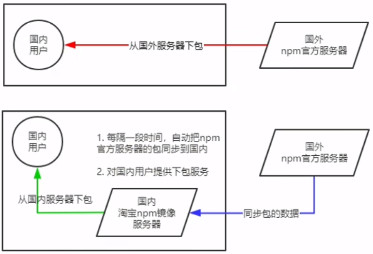

> 镜像（Mirroring）：
>
> ​	一种文件存储形式，一个磁盘上的数据在另一个磁盘上存在一个完全相同的副本即为镜像


##### 2.6.2 - 切换 npm 下包镜像源

下包镜像源，指得就是 <span style="color: #e3371e">下包的服务器地址</span> 

```bash
# 查看当前下包镜像源
$ npm config get registry

# 将下包的镜像源切换为淘宝镜像源
$ npm config set registry=https://registry.npmmirror.com/

# 将下包的镜像源切换为官方镜像源
$ npm config set registry=https://registry.npmjs.org/

# 检查镜像源是否下载成功
$ npm config get registry
```


##### 2.6.3 - nrm

为更方便切换下包镜像源，可安装 <span style="color: #e3371e; font-weight: bold">nrm</span> ，利用 nrm 提供的终端命令， <span style="color: #e3371e">快速查看和切换下包的镜像源</span> 

```bash
# 通过 npm 包管理工具，将 nrm 安装为全局可用的工具
$ npm i nrm -g

# 查看所有可用的镜像源
$ nrm ls

# 将下包的镜像源切换为 taobao 镜像
$ nrm use taobao
```


### 3 - 包结构规范

规范的包组成结构：

- 包必须以 <span style="color: #e3371e">单独的目录</span> 存在
- 包的顶级目录下必须包含 <span style="color: #e3371e">package.json</span> 这个包管理配置文件
- package.json 中必须包含 <span style="color: #e3371e">name，version，main</span> 三个属性，分别代表 <span style="color: #0099dd">包的名字，版本号，包的入口</span> 


### 4 - 开发属于自己的包

**需要实现的功能** 

- 格式化时间
- 转义 HTML 中的特殊字符
- 还原 HTML 中的特殊字符


#### 4.1 - 开发包

##### 4.1.0 - 初始化包的基本结构

- 新建一个文件夹，作为 <span style="color: #e3371e">包的根目录</span> 
- 在文件夹中，新建如下三个文件
    - package.json - 包管理配置文件
    - index.js - 包的入口文件
    - README.md - 包的说明文档


##### 4.1.1 - 初始化 package.json 

```json
{
    "name": "chuxiu",
    "version": "1.0.0",
    "main": "index.js",
    "description": "提供了格式化时间, HTML Escape的功能",
    "keywords": ["chuxiu", "dateFormat", "escape"],
    "license": "MIT"
}
```


##### 4.1.2 - 在 index.js 中定义方法


##### 4.1.3 - 将不同功能进行模块化拆分

- 将格式化时间的功能，拆分到 `src -> dateFormat.js` 中
- 将处理 HTML 字符串的功能，拆分到 `src ->htmlEscape.js` 中
- 在 index.js 中，导入模块，得到需要向外分享的方法
- 在 index.js 中，向外共享模块


##### 4.1.4 - 编写包的说明文档

包根目录中的 <span style="color: #e3371e">README.md</span> 文件，是包的使用说明文档。通过它，我们可以事先把包的使用说明，以 markdown 的格式写出来，方便用户参考

文件内容无强制性要求，只需清晰地说明包的作用、用法、注意事项等相关信息即可


#### 4.2 - 发布包

##### 4.2.1 - 注册 npm 账号


##### 4.2.2 - 终端登陆 npm 账号

```bash
$ npm login
```

依次输入用户名、密码、邮箱后，即可登陆成功

> 运行 npm login 命令之前，必须将 <span style="color: #49bf51">下包的服务器地址</span> 切换为 <span style="color: #49bf51">npm 的官方服务器</span> 。否则会导致发包失败。


##### 4.2.3 - 把包发布到 npm 上

将终端切换到包的根目录后，运行 `npm publish` 命令，即可将包发布到 npm 上。

```bash
$ npm publish
```

> 包名不能已存在


#### 4.3 - 删除包

运行 `npm unpublish <package-name> -- force` 命令，即可从 npm 删除已发布的包

```bash
$ npm unpublish <package-name> -- force
```

> 1、npm unpublish 命令只能删除 <span style="color: #49bf51">72小时以内</span> 发布的包
>
> 2、npm unpublish 删除的包，在 <span style="color: #49bf51">24小时以内</span> 不允许重复发布
>
> 3、发布包时要慎重， <span style="color: #49bf51">尽量不要网 npm 上发布没有意义的包</span> 


## 八、Express 框架

### 1 - Express 简介

**官方概念**：Express 是 <span style="color: #e3371e">基于 Node.js 平台</span> ， <span style="color: #0099dd">快速、开放、极简</span> 的 <span style="color: #e3371e">Web 开发框架</span> 

> 1、Express 的作用和 Node.js 内置的 http 模块类似， <span style="color: #49bf51">是专门用来创建 Web 服务器的</span> 
>
> 2、http 内置模块用起来复杂，开发效率低；Express 是基于内置的 http 模块进一步封装出来的，能极大地提高开发效率
>
> 3、http 内置模块与 Express 的关系类似于浏览器中 Web API 和 jQuery 的关系。 <span style="color: #49bf51">后者是基于前者进一步封装出来的</span> 

 <span style="color: #e3371e; font-weight: bold">Express 本质</span> ：就是 npm 上的第三方包，提供了快速创建 Web 服务器的便捷方法

[**Express 中文官网**](https://www.expressjs.com.cn/) 


#### 1.1 - Express 作用

对 <span style="color: #0099dd">前端程序员</span> 来说，最常见的 <span style="color: #0099dd">两种服务器</span> ，分别是：

-  <span style="color: #e3371e">Web 网站服务器</span> - 专门对外提供 <span style="color: #49bf51">Web网页资源</span> 的服务器
-  <span style="color: #e3371e">API 接口服务器</span>  - 专门对外提供 <span style="color: #49bf51">API 接口</span> 的服务器

使用 Express，可以方便、快速地创建 <span style="color: #ab04d9; font-weight: bold">Web 网站</span> 的服务器或 <span style="color: #ab04d9; font-weight: bold">API 接口</span> 的服务器


### 2 - Express 基本使用

#### 2.1 - 安装

- 通过 `npm init` 命令为你的应用创建一个 `package.json` 文件

    ```bash
    $ npm init -y
    ```

    

- 在项目所处目录，运行如下终端命令，即可将 Express 安装到项目中使用

    ```bash
    $ npm install express --save
    
    # 查看 express 使用的版本号
    $ npm list express
    ```
    - 如果只是临时安装 Express，不想将它添加到依赖列表中，可执行如下命令

        ```bash
        $ npm install express --no-save
        ```


#### 2.2 - 创建基本的 Web 服务器

```js
// 1. 导入 express
const express = require('express')
// 2. 创建 Web 服务器
const app = express()
const port = 3000

app.get('/', (req, res) => {
  res.send('Hello World!')
})

// 3. 调用 app.listen(port,callback) 启动服务器
app.listen(port, () => {
  console.log(`Express server listening on port ${port}`)
})
```


#### 2.3 - 监听 GET 请求

通过 <span style="color: #e3371e">app.get()</span> 方法，可以监听客户端的 <span style="color: #0099dd">GET 请求</span> ，具体语法如下

```js
// 参数1：客户端请求的 URL 地址
// 参数2：请求对应的处理函数
//		req：请求对象（包含了与请求相关的属性与方法）
//		res：响应对象（包含了与响应相关的属性与方法）
app.get('/',(req, res) => { /* 处理函数 */})
```


#### 2.4 - 监听 POST 请求

通过 <span style="color: #e3371e">app.post()</span> 方法，可以监听客户端的 <span style="color: #0099dd">POST 请求</span> ，具体语法如下

```js
// 参数1：客户端请求的 URL 地址
// 参数2：请求对应的处理函数
//		req：请求对象（包含了与请求相关的属性与方法）
//		res：响应对象（包含了与响应相关的属性与方法）
app.post('/', (req, res) => { /* 处理函数 */})
```


#### 2.5 - 把内容响应给客户端

通过 <span style="color: #e3371e">res.send()</span> 方法，可以把处理好的内容，发送给客户端

```js
app.get('/user', (req, res) => {
	// 向客户端发送 JSON 对象
	res.send({name: 'coco', age: 18, gender: '女'})
})

app.post('/user', (req, res) => {
    // 向客户端发送文本内容
    res.send('请求成功')
})
```


#### 2.6 - 获取 URL 中携带的查询参数

通过 <span style="color: #e3371e">req.query</span> 对象，可以访问到客户端通过查询字符串形式，发送到服务器的参数

```js
app.get('/', (req, res) => {
	console.log(req.query)
    res.send(req.query)
})
```

> req.query 默认是一个空对象


#### 2.7 - 获取 URL 中的动态参数

通过 <span style="color: #e3371e">req.params</span> 对象，可以访问到 URL 中，通过 <span style="color: #e3371e">:</span> 匹配到的 <span style="color: #e3371e">动态参数</span> 

```js
// URL 地址中，可通过 :参数名 的形式，匹配动态参数值
app.get('/user', (req, res) => {
	console.log(req.params)
})
```

> req.params 默认是一个空对象，里面存放着通过动态匹配到的参数值


### 3 - 托管静态资源

#### 3.1 - express.static()

通过 <span style="color: #e3371e">express.static()</span> ，可以非常 <span style="color: #0099dd">方便地创建</span> 一个 <span style="color: #0099dd">静态资源服务器</span> 

例如，通过以下代码可将 public 目录下的图片、CSS 文件、 JavaScript 文件对外开发访问：

```js
app.user(express.static('public'))
```

现在，可访问 public 目录中所有文件

http://localhost:3000/images/bg.jpg

http://localhost:3000/css/style.css

http://localhost:3000/js.login.js

> Express 在 <span style="color: #49bf51">指定的</span> 静态目录中查找文件，并对外提供资源的访问路径。因此， <span style="color: #49bf51">存放静态文件的目录名不会出现在 URL 中</span> 


#### 3.2 - 托管多个静态资源目录

托管多个静态资源目录，请多次调用 express.static() 函数

```js
app.use(express.static('public'))
app.use(express.static('files'))
```

> 访问静态资源文件时，express.static() 函数会根据目录的添加顺序查找所需的文件


#### 3.3 - 挂载路径前缀

如果希望在托管的 <span style="color: #e3371e">静态资源访问路径</span>  <span style="color: #0099dd">之前</span> ， <span style="color: #49bf51">挂载路径前缀</span> ，可在 app.use() 第一个形参处传入

```js
app.user('/public', express.static('public'))
```

>  <span style="color: #49bf51">/</span> 不能掉

现在，可通过带有 <span style="color: #0099dd">/public 前缀地址</span> 访问 public 目录中所有文件

http://localhost:3000/public/images/bg.jpg

http://localhost:3000/public/css/style.css

http://localhost:3000/public/js.login.js


### 4 - nodemon

使用 nodemon 工具，能够 <span style="color: #e3371e">监听项目文件的变动</span> ，当代码被修改后，nodemon会 <span style="color: #e3371e">自动重启项目</span> ，极大地方便了开发和调试

#### 4.1 - 安装

终端运行命令，将 nodemon 安装位全局可用的工具

```bash
$ npm install -g nodemon
```


#### 4.2 - 使用

将 nodemon 命令替换 node 命令，使用 <span style="color: #e3371e">nodemon</span> <span style="color: #0099dd">app.js</span> 来启动项目

如此，代码修改后，会被 nodemon 监听到，从而实现自动重启项目的效果

```bash
$ node app.js

# 可实现自动重启项目
$ nodemon app.js
```


### 5 - 路由

#### 5.1 - 路由概念

广义上：路由就是 <span style="color: #e3371e">映射关系</span> 

##### 5.1.1 - Express 中的路由

在 Express 中，路由是指 <span style="color: #e3371e">客户端的请求</span> 与 <span style="color: #e3371e">服务器处理函数</span> 之间的 <span style="color: #0099dd">映射关系</span> 


Express 中，路由由 3 部分组成，分别是 <span style="color: #e3371e">请求的类型</span> 、 <span style="color: #e3371e">请求的 URL 地址</span> 、 <span style="color: #e3371e">处理函数</span> 

```js
app.METHOD(PATH, HANDLER)
```

**示例**

```js
// 匹配 GET 请求，且请求 URL 为 /
app.get('/', (req, res) => {
	res.send('Hello World!')
})

// 匹配 POST 请求，且请求 URL 为 /
app.post('/', (req, res) => {
	res.send('Get a POST request')
})
```


##### 5.1.2 - 路由的匹配规则

每当一个请求到达服务器之后， <span style="color: #e3371e">需要经过路由的匹配</span> ，只有匹配成功之后，才会调用对应的处理函数

在匹配时，会按照路由的顺序进行匹配，如果 <span style="color: #e3371e">请求类型</span> 和 <span style="color: #e3371e">请求的 URL</span> 同时匹配成功，Express 会将这次请求，转交给对应的 function 函数进行处理

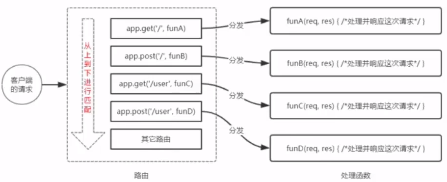

> 1、按照定义的 <span style="color: #49bf51">先后顺序</span> 进行匹配
>
> 2、 <span style="color: #49bf51">请求类型</span> 和 <span style="color: #49bf51">请求的 URl</span> 同时匹配成功，才会调用对应的处理函数


#### 5.2 - 路由的使用

##### 5.2.1 - 最简单的用法

在 Express 中使用路由最简单的方式，就是把路由挂载到 app 上

```js
const express = require('express')
// 创建 Web 服务器，命名为 app
const app = express
const port = 3000

// 挂载路由
app.get('/', (req, res) => {
	res.send('Hello World.')
})
app.post('/', (req, res) => {
	res.send('Post Request.')
})

// 启动 Web 服务器
app.listen(port, () => {
	console.log(`Server running at http:127.0.0.1:${port}`)
})
```

> 问题：随着挂载的路由增多，代码体积变大


##### 5.2.2 - 模块化路由

为 <span style="color: #0099dd">方便对路由进行模块化管理</span> ，Express <span style="color: #e3371e">不建议</span> 将路由直接挂载到 app 上，而是 <span style="color: #e3371e">推荐将路由抽离为单独的模块</span> 

将路由抽离为单独模块的步骤如下：

- 创建路由模块对应的 .js 文件
- 调用 <span style="color: #e3371e">express.Router()</span> 函数创建路由对象
- 向路由对象上挂载具体的路由
- 使用 <span style="color: #e3371e">module.exports</span> 向外共享路由对象
- 使用 <span style="color: #e3371e">app.use()</span> 函数注册路由模块

```js
/* - router.js 文件 - */
// 1. 导入 express
var express = require('express')
// 2. 创建路由对象
var router = express.Router()

// 3. 定义获取用户列表路由
router.get('/user/list', function (req, res) {
  res.send('Get User list')
})

// 4. 定义添加用户路由
router.post('/user/add', function (req, res) {
  res.send('Add new user')
})

// 5. 向外导出路由对象
module.exports = router
```

```js
/* - app.js 文件 - */
const express = require('express')
const app = express()
const port = 3000

// 挂载路由
// 1. 导入路由模块
const router = require('./router')
// 2. 注册路由模块
app.use(router)

app.listen(port, () => {
    console.log(`Express server running at http://127.0.0.1:${port}`)
})

```


##### 5.2.3 - app.use() 的作用

>  <span style="color: #49bf51">app.use()</span> 的作用：用以 <span style="color: #49bf51">注册全局中间件</span> 


##### 5.2.4 - 为路由模块添加前缀

如果希望为 <span style="color: #e3371e">路由模块</span> 添加 <span style="color: #0099dd">前缀</span> ，可在 app.use() 第一个形参处传入

```js
// 1. 导入路由模块
const router = require('./router/user.js')

// 2. 使用 app.use() 注册路由模块，并添加统一前缀 /api
app.use('/api', userRouter)
```


### 6 - 中间件

 <span style="color: #e3371e">中间件</span> （Middleware），特指 <span style="color: #0099dd">业务流程</span> 的 <span style="color: #e3371e">中间处理环节</span> 

 <span style="color: #e3371e">中间件函数</span> 是具有对请求对象( <span style="color: #0099dd">req</span> )、响应对象( <span style="color: #0099dd">res</span> )和应用程序请求-响应周期中的 <span style="color: #0099dd">下一个中间件函数</span> 的 <span style="color: #49bf51">访问权限</span> 的函数

> 下一个中间件函数通常由名为 next 的变量表示

#### 6.1 - 中间件的概念

##### 6.1.1 - Express 中间件的调用流程

当一个请求到达 Express 的服务器之后，可以连续调用多个中间件，从而对这次请求进行 <span style="color: #e3371e">预处理</span> 

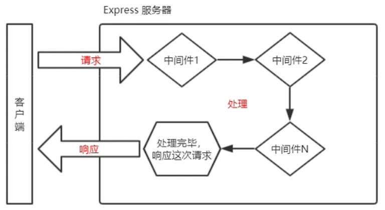

> 上一个中间件的输出，会作为下一个中间件的输入


##### 6.1.2 - Express 中间件的格式

Express 的中间件， <span style="color: #e3371e">本质上</span> 就是一个 <span style="color: #e3371e; font-weight: bold">function 处理函数</span> ，Express 中间件格式如下

 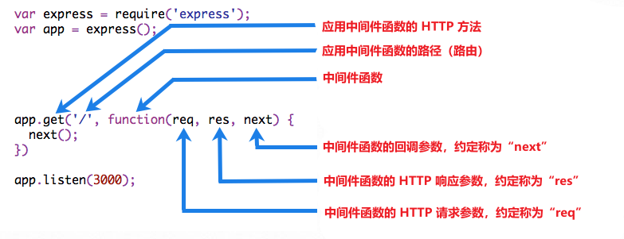

> 中间件函数的形参列表中， <span style="color: #49bf51">必须包含 next 参数</span> ；而路由处理函数中只包含 req 和 res

 

##### 6.1.3 - next 函数的作用

> 下一个中间件函数通常由名为 next 的变量表示

 <span style="color: #e3371e; font-weight: bold">next 函数</span> 是实现 <span style="color: #e3371e">多个中间件连续调用</span>  <span style="color: #ab04d9">关键</span> ，它表示把流转关系 <span style="color: #e3371e">转交</span> 给下一个 <span style="color: #0099dd">中间件</span> 或 <span style="color: #0099dd">路由</span> 

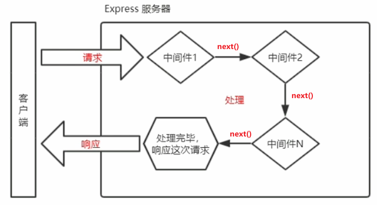


#### 6.2 - 中间件的使用

##### 6.2.1 - 定义中间件函数

定义一个最简单的中间件函数

```js
// 常量 mw 所指向的，就是一个中间件函数
const mw = function(req, res, next) {
	console.log(`这是一个最简单的中间件函数`)
	// 在当前中间件的业务处理完毕后，必须调用 next() 函数
	// 表示把流转关系转交给下一个中间件或路由
	next()
}
```


> 如果当前中间件函数没有结束 <span style="color: #49bf51">请求-响应周期</span> ，它 <span style="color: #49bf51">必须调用 next ()</span> 将控制传递给下一个中间件函数。否则，请求将被挂起


##### 6.2.2 - 全局生效的中间件

客户端发起的 <span style="color: #e3371e">任何请求</span> ，到达服务器之后， <span style="color: #e3371e">都能触发的中间件</span> ，叫做全局生效的中间件


通过调用 <span style="color: #e3371e">app.use( <span style="color: #0099dd">中间件函数</span> )</span> ，即可定义一个 <span style="color: #e3371e">全局生效</span> 的中间件

```js
// 常量 mw 所指向的，就是一个中间件函数
const mw = function(req, res, next) {
	console.log(`这是一个最简单的中间件函数`)
	next()
}

// 全局生效的中间件
app.use(mw)
```


##### 6.2.3 - 全局生效的中间件的简化形式

```js
// 全局生效的中间件
app.use(function(req, res, next) {
	console.log(`这是一个最简单的中间件函数`)
	next()
})
```


##### 6.2.4 - 中间件的作用

多个中间件之间， <span style="color: #e3371e">共享同一份</span>  <span style="color: #0099dd">req</span> 和 <span style="color: #0099dd">res</span> 

基于这样的特性，可在 <span style="color: #e3371e">上游</span> 的中间件中， <span style="color: #e3371e">统一</span> 为 req 或 res 对象添加 <span style="color: #0099dd">自定义</span> 的 <span style="color: #0099dd">属性</span> 或 <span style="color: #0099dd">方法</span> ，供 <span style="color: #e3371e">下游</span> 的中间件或路由进行使用

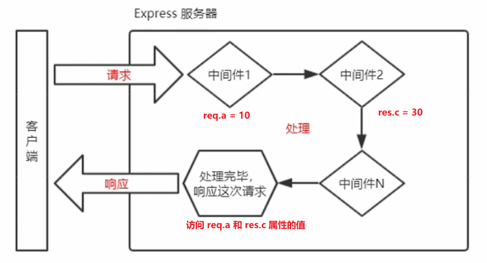

**中间件函数的作用**：

-  <span style="color: #e3371e">执行</span> 任何代码
-  <span style="color: #e3371e">更改</span> <span style="color: #0099dd">req 对象</span> 或 <span style="color: #0099dd">res 对象</span> 
-  <span style="color: #e3371e">结束</span>  <span style="color: #0099dd">请求-响应周期</span> 
-  <span style="color: #e3371e">调用</span> 堆栈中的 <span style="color: #0099dd">下一个中间件函数</span> 


##### 6.2.5 - 定义多个全局中间件

可以使用 app.use()  <span style="color: #e3371e">连续定义多个</span> 全局中间件。

客户端请求到达服务器之后，会按照中间件 <span style="color: #e3371e">定义的先后顺序</span> 依次进行调用

```js
app.use((req, res, next) => {	// 第 1 个全局中间件
    console.log(`第1个全局中间件`);
    next()
})

app.use((req, res, next) => {	// 第 2 个全局中间件
    console.log(`第2个全局中间件`)
    next()
})

app.get('/', (req, res) => {	// 请求这个路由，会依次触发上述两个全局中间件
    res.send(`Home page.`)
})
```


##### 6.2.6 - 局部生效的中间件

 <span style="color: #e3371e">不使用</span>  <span style="color: #0099dd">app.use()</span> 定义的中间件，叫做 <span style="color: #e3371e">局部生效的中间件</span> 

```js
// 定义中间件函数 mw1
const mw1 = function(req, res, next) {
	console.log('这是中间件函数')
    next()
}

// mw1 只在“当前路由中生效”，属于“局部生效的中间件”
app.get('/', mw1, function(req, res) {
    res.send('Home page.')
})

// mw1 中间件不会影响下面这个路由 ↓↓↓
app.get('/user', function(req, res) {
    res.send('User page.')
})
```


##### 6.2.7 - 定义多个局部中间件

可以在路由中，通过如下两种 <span style="color: #e3371e">等价</span> 的方式， <span style="color: #e3371e">使用多个局部中间件</span> 

```js
// 以下两种写法时“完全等价”的
app.get('/', mw1, mw2, (req, res) { res.send('Home page.') })
app.get('/', [mw1, mw2], (req, res) { res.send('Home page.') })
```


##### 6.2.8 - 中间件的使用注意事项

- 一定要在 <span style="color: #e3371e">路由之前</span> 注册中间件
- 客户端发送过来的请求， <span style="color: #e3371e">可以连续调用多个中间件进行处理</span> 
- 执行完中间件的业务代码后， <span style="color: #e3371e">不要忘记调用 next()</span> 函数
- 为 <span style="color: #e3371e">防止代码逻辑混乱</span> ，调用 next() 函数后不要再写额外的代码
- 连续调用多个中间件时，多个中间件之间， <span style="color: #e3371e">共享</span> req 和 res 对象


#### 6.3 - 中间件的分类

Express 官方将 <span style="color: #e3371e">常用的中间件用法</span> ，分成了 <span style="color: #e3371e">5 大类</span> ：

-  <span style="color: #0099dd">应用级别</span> 的中间件
-  <span style="color: #0099dd">路由级别</span> 的中间件
-  <span style="color: #0099dd">错误处理</span> 的中间件
-  <span style="color: #0099dd">Express 内置</span> 的中间件
-  <span style="color: #0099dd">第三方</span> 的中间件

可以使用可选的挂载路径加载应用程序级和路由器级中间件


##### 6.3.1 - 应用级别的中间件

通过 <span style="color: #0099dd">app.use()</span> 或 <span style="color: #0099dd">app.METHDO()</span> ， <span style="color: #e3371e">绑定到 app 实例上的中间件</span> ，叫做应用级别的中间件，示例代码如下：

###### 1 - 全局中间件

**无挂载路径**的中间件函数，在app 每次调用时执行

```js
var express = require('express')
var app = express()

app.use(function (req, res, next) {
  console.log('Time:', Date.now())
  next()
})
```


###### 2 - 局部中间件（含 next('route')）

**有挂载路径**的中间件函数

**2.1 - 在挂载路径收到任何 HTTP 请求时执行** 

```js
app.use('/user/:id', function (req, res, next) {
  console.log('Request Type:', req.method)
  next()
})
```


**2.2 - 处理挂载路径上的 GET 请求** 

```js
app.get('/user/:id', function (req, res, next) {
  res.send('USER')
})
```


**2.3 - 一个挂载路径加载一系列中间件函数** 

这一些列中间件函数处理挂载路径上的任何 HTTP 请求

```js
app.use('/user/:id', function (req, res, next) {
  console.log('Request URL:', req.originalUrl)
  next()
}, function (req, res, next) {
  console.log('Request Type:', req.method)
  next()
})
```


**2.4- next('route')**

> 仅在使用 <span style="color: #49bf51">app.METHOD()</span> 或 <span style="color: #49bf51">router.METHOD()</span> 挂载一些列中间件函数时，可使用 <span style="color: #49bf51"> next('route')</span> 跳过剩余的中间件函数，将控制传递给下一个路由

```js
app.get('/user/:id', function (req, res, next) {
  // 如果 用户ID 为 0 ，直接跳转到下一个路由
  if (req.params.id === '0') next('route')
  // 否则，将控制传递给该堆栈中的下一个中间件函数
  else next()
}, function (req, res, next) {
  // 发送定期响应
  res.send('regular')
})

// handler for the /user/:id path, which sends a special response
app.get('/user/:id', function (req, res, next) {
  res.send('special')
})
```


##### 6.3.2 - 路由级别的中间件

通过 <span style="color: #0099dd">router.use()</span> 或 <span style="color: #0099dd">router.METHOD()</span> ，绑定到 <span style="color: #e3371e">express.Router()</span> 实例上的中间件

```js
var router = express.Router()
```

用法和 <span style="color: #0099dd">应用级别中间件</span> 没任何区别

> 路由级别的中间件 - 绑定到 <span style="color: #49bf51">router 实例</span> 上
>
> 应用级别的中间件 - 绑定到 <span style="color: #49bf51">app 实例</span> 上

**示例代码** （基本复制应用级别中间件的代码，只不过使用 <span style="color: #49bf51">路由级别中间件</span> ）

```js
var express = require('express')
var app = express()
var router = express.Router()

// 没有挂载路径的中间件函数。对路由器的每个请求执行
router.use(function (req, res, next) {
  console.log('Time:', Date.now())
  next()
})

// 在挂载路径收到任何 HTTP 请求时执行
router.use('/user/:id', function (req, res, next) {
  console.log('Request URL:', req.originalUrl)
  next()
}, function (req, res, next) {
  console.log('Request Type:', req.method)
  next()
})

// 处理挂载路径上的 GET 请求
router.get('/user/:id', function (req, res, next) {
  // 如果 用户ID 为 0 ，直接跳转到下一个路由
  if (req.params.id === '0') next('route')
  // 否则，将控制传递给该堆栈中的下一个中间件函数
  else next()
}, function (req, res, next) {
  // render a regular page
  res.render('regular')
})

// 在 app 上挂载路由器
app.use('/', router)
```


##### 6.3.3 - 错误处理的中间件

**错误处理的中间件**的 <span style="color: #e3371e">作用</span> ：专门用来捕获整个项目中发生的异常错误，从而防止项目异常崩溃的问题

**错误处理的中间件**的 <span style="color: #e3371e; font-weight: bold">格式</span> ：错误处理中间件的 function 处理函数中， <span style="color: #e3371e">必须有 4 个形参</span> ，从前到后分别为：( <span style="color: #0099dd">err</span>, req, res, next)

```js
app.get('/', function(req, res) {			// 1. 路由
    throw new Error('服务器内部发生了错误')	 // 1.1 抛出一个自定义的错误
    res.send('Home Page')
})

app.use(function (err, req, res, next) {	// 2. 错误处理的中间件
  console.error('发生了错误' + err.message)	// 2.1 在服务器打印错误消息
  res.send('Error!' + err.message)		   // 2.2 在客户端响应错误相关的内容
})
```

> 错误级别的中间件，必须注册在 <span style="color: #49bf51">所有路由之后</span> 


##### 6.3.4 - Express 内置的中间件

自 Express 4.16.0 版本开始，Express 内置了 <span style="color: #e3371e">3 个</span> 常用的中间件，极大地提高了 Express 项目的开发效率和体验

-  <span style="color: #e3371e">express.static</span> - 快速托托管静态资源的内置中间件 （无兼容性，4.16.0 之前也可使用）
-  <span style="color: #e3371e">express.json</span> - 解析 JSON 格式的请求体数据 （ <span style="color: #0099dd">有兼容性</span>，仅 4.16.0+ 版本可用 ）
-  <span style="color: #e3371e">express.urlencoded</span>  - 解析 URL-encoded 格式的请求体数据 （ <span style="color: #0099dd">有兼容性</span>，仅 4.16.0+ 版本可用 ）

```js
// 配置解析 application/json 格式数据的内置中间件（注册为全局中间件）
app.use(express.json())

// 配置解析 application/x-www-form-urlencoded 格式数据的内置中间件（注册为全局中间件）
app.use(express.urlencoded({extended: false}))
```

***

**示例代码** 

未配置 express.json 中间件

```js
app.post('/user', (req, res) => {
    // 在服务器，可使用 req.body 接收客户端发送过来的 请求体数据
    // 默认情况下，如果不配置解析表单数据的中间件，则 req.body 默认等于 undefined
    console.log(req.body)       // => undefined
    res.send('ok')
})
```


配置 express.json 中间件

```js
// 除 错误处理的中间件，其余中间件，必须在路由之前配置
// 通过 express.json() 中间件，解析表单中的 JSON 格式的数据
app.use(express.json())

app.post('/user', (req, res) => {
    // 在服务器，可使用 req.body 接收客户端发送过来的 请求体数据
    // 默认情况下，如果不配置解析表单数据的中间件，则 req.body 默认等于 undefined
    console.log(req.body) // => { name: 'coco', age: 18 }
    res.send('ok')
})
```


***

未配置 express.urlencoded 中间件

```js
app.post('/book', (req, res) => {
    console.log(req.body)  // => undefined / {} （如果配置过 express.json 中间件）
    res.send('ok')
})
```


配置 express.urlencoded 中间件

```js
// 通过 express.urlencoded()中间件，解析 URL-encoded 格式的请求体数据
app.use(express.urlencoded())

app.post('/book', (req, res) => {
    console.log(req.body) // => { bookname: '《coco 的奇妙冒险》', author: 'coco' }
    res.send('ok')
})
```


##### 6.3.5 - 第三方中间件

非 Express 官方内置，由第三方开发出来的中间件，叫第三方中间件

项目中，可 <span style="color: #e3371e">按需下载</span> 并 <span style="color: #e3371e">配置</span> 第三方中间件，提高项目的开发效率

***

例如：在 express@4.16.0 之前的版本中，常使用 body-parser 第三方中间件，解析请求体数据

**使用步骤**：

- 运行 `npm install body-parser` 安装中间件
- 使用 <span style="color: #e3371e">require()</span> 导入中间件
- 调用 <span style="color: #e3371e">app.use()</span> 注册并使用中间件

> Express 内置的 express.urlencoded 中间件，就是 基于 body-parser 这个第三方中间件进一步封装出来的


#### 6.4 - 自定义中间件

##### 6.4.0 - 需求描述与实现步骤

 <span style="color: #e3371e">手动模拟</span> 一个类似于 express.urlencoded 这样的中间件，来 <span style="color: #0099dd">解析 POST 提交到服务器的表单数据</span> 

**实现步骤**

- 定义中间件
- 监听 req 的 data 事件
- 监听 req 的 end 事件

- 使用 quertstring 模块解析请求体数据
- 将解析出来的数据对象挂载为 req.body
- 将自定义中间件封装为模块


##### 6.4.1 - 定义中间件

使用 app.use() 定义全局生效的中间件

```js
// 解析表单数据的中间件
app.use((req, res, next) {
	// 中间件的业务逻辑
})
```


##### 6.4.2 - 监听 req 的 data 事件

在中间件中，需监听 req 对象的 data 事件，来获取客户端发送到服务器的数据

数据量较大，无法一次性发送完毕时，客户端会 <span style="color: #e3371e">把数据企鹅吼，分批发送到服务器</span> 。因此，data 事件可能会触发多次，每一次触发 data 事件时， <span style="color: #0099dd">获取的数据只是完整数据的一部分</span> ，需手动对接收到的数据进行拼接

```js
// 定义变量，用来储存客服端发送过来的请求体数据
let str = ''

// 监听 req 对象的 data 事件（客户端发送过来的新的请求体数据）
req.on('data', chunk => {
    // 拼接请求体数据，隐式转换为字符串
    str += chunk
})
```


##### 6.4.3 - 监听 req 的 end 事件

当请求体数据 <span style="color: #e3371e">接受完毕</span> 之后，会自动触发 req 的 end 事件

因此，我们可以在 req 的 end 事件中， <span style="color: #e3371e">拿到并处理完整的请求体数据</span> 

```js
// 监听 req 对象的 end 事件（请求体发送完毕后自动触发）
req.on('end', () => {
    // 打印完整的请求体数据
    console.log(str)
    // TODO: 把字符串格式的请求体数据，解析称对象格式
})
```


##### 6.4.4 - 使用 querystring 模块解析请求体数据

Node.js 内置了一个 <span style="color: #e3371e">querystring</span> 模块， <span style="color: #e3371e">专门用来处理查询字符串</span> 

通过这个模块提供的 <span style="color: #e3371e">parse()</span> 函数，可以轻松把查询字符串，解析成对象的格式

```js
// 导入处理 querystring 的 Node.js 内置模块
const qs = require('node:querystring')

// 调用 qs.parse() 方法，把查询字符串解析为对象
const body = qs.parse(str)
console.log(body)
// console.log(str)
```


##### 6.4.5 - 将解析出来的数据对象挂载为 req.body

 <span style="color: #e3371e">上游</span> 的 <span style="color: #0099dd">中间件</span> 和<span style="color: #e3371e">下游</span> 的 <span style="color: #0099dd">中间件及路由</span> 之间， <span style="color: #e3371e">共享同一份 req 和 res</span> 

因此，可以将解析出来的数据，挂载为 req 的自定义属性，命名为 <span style="color: #e3371e">req.body</span> ，供下游使用

```js
app.use((req, res, next) => {
    let str = ''
    req.on('data', chunk => {
        str += chunk
    })
    
    req.on('end', () => {
        const body = qs.parse(str)
        req.body = body
        next()
    })
})

app.post('/user', (req, res) => {
    console.log(req.body)
    res.send(req.body)
})
```


##### 6.4.6 - 将自定义中间件封装为模块

为优化代码结构，可将自定义的中间件函数， <span style="color: #e3371e">封装为独立的模块</span> 

```js
// custom-body-parser.js 模块中的代码
const qs = require('node:querystring')
function bodyParser(req, res, next) { /* 省略其他代码 */}
module.exports = bodyParser

// -----------------------------------------------

// 导入 自定义中间件 的模块
const myBodyParser = require('custom-body-parser')
// 注册自定义的中间件
app.use(myBodyParser)
```


### 7 - 使用 Express 写接口

#### 7.1 - 创建基本的服务器

```js
const express = require('express')
const app = express()
const port = 80

// write your code here

app.listen(port, () => {
    console.log(`Express server running at http://127.0.0.1:${port}`)
})

```


#### 7.2 - 创建 API 路由模块

```js
// aoiRouter.js (路由模块)
const express = require('express')
const router = express.Router()

// bind you router here

module.exports = router

// ----------------------------------

// app.js (导入并注册路由模块)
const router = require('/apiRouter')
app.use('/api', router)
```


#### 7.3 - 编写 GET 接口

```js
router.get('/get', (req, res) => {
	// 1. 获取到客户端通过查询字符串，发送到服务器的数据
	const query = req.query
	// 2. 调用 res.send() 方法，把数据响应给客户端
	res.send({
		status: 0,				// 状态，0 表示成功， 1 表示失败
        msg: 'GET success!',	// 状态描述 
        data: query,			// 需要响应给客户端的具体数据
	})
})
```

> 接口地址： <span style="color: #49bf51">http://127.0.0.1/api/get</span> 


#### 7.4 - 编写 POST 请求

```js
router.post('/post', (req, res) => {
	// 1. 获取客户端通过请求体，发送到服务器的 URL-encoded 数据
	const body = req.body
	//2. 调用 res.send() 方法，把数据响应给客户端
	res.send({
		status: 0,				// 状态，0 表示成功， 1 表示失败
        msg: 'POST success!',	// 状态描述 
        data: query,			// 需要响应给客户端的具体数据
	})
})
```

> 接口地址：http://127.0.0.1/api/post


> 要获取 URL-encoded 格式的请求体数据，必须配置中间件 app.use( <span style="color: #0099dd">express</span>.<span style="color: #e3371e">urlencoded</span>({ extended: false }) )

```js
// app.js

// 配置解析表单数据的中间件
app.use(express.urlencoded({ extended: false }))
```


#### 7.5 - CORS 跨域资源共享

刚刚编写的 GET 和 POST 接口， <span style="color: #e3371e">不支持跨域请求</span> 

**解决接口跨域**问题的方案主要有两种：

-  <span style="color: #e3371e">CORS</span>  - 主流的解决方案， <span style="color: #0099dd">推荐使用</span> 
-  <span style="color: #e3371e">JSONP</span>  - 有缺陷的解决方案，仅支持 GET 请求


###### 使用 cors 中间件解决跨域问题

 <span style="color: #e3371e">cors</span> 是 Express 的一个第三方中间件。通过安装和配置 cors 中间件，可以很方便地解决跨域问题

**使用步骤**：

- 运行 `npm install cors` 安装中间件
- 使用 `const cors = require('cors')` 导入中间件
- 在路由之前 <span style="color: #0099dd">调用 app.use(cors())</span> 配置中间件

```js
// 导入并配置 cors 中间件，解决接口跨域问题
const cors = require('cors')
app.use(cors())
```


### 8 - CORS

#### 8.1 - 什么是 CORS

CORS（Cross-Origin Resource Sharing，跨域资源共享）由一些列 <span style="color: #e3371e">HTTP 响应头</span> 组成，这些 HTTP 响应头 <span style="color: #e3371e">决定浏览器是否阻止前端 JS 代码跨域获取资源</span> 


浏览器的 <span style="color: #0099dd">同源安全策略</span> 默认会阻止网页“跨域”获取资源。但如果接口服务器 <span style="color: #e3371e">配置了 CORS 相关的 HTTP 响应头</span> ，就可以 <span style="color: #e3371e">接触浏览器端的跨域访问限制</span> 

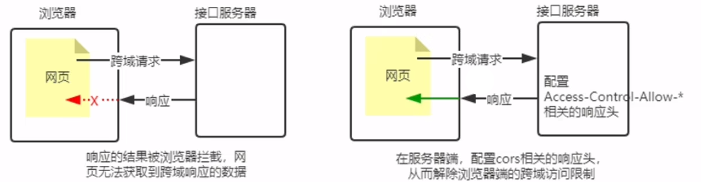


##### 8.1.1 - CORS 的注意事项

- CORS 主要在 <span style="color: #e3371e">服务器端</span> 进行配置。客户端浏览器 <span style="color: #e3371e">无需作任何额外的配置</span> ，即可请求开启了 CORS 接口
- CORS 在浏览器中由 <span style="color: #e3371e">兼容性</span> ，只有支持 XMLHttpRequest Level2 的浏览器，才能正常访问开启了 CORS 的服务器端口（例如 IE10+、Chorme4+、FireFox3.5+）


#### 8.2 - CORS 响应头

与 CORS 相关的都以 Access-Control-Allow 开头

##### 8.2.1 - Access-Control-Allow-<span style="color: #e3371e">Origin</span> 

响应头部可携带 Access-Control-Allow-<span style="color: #e3371e">Origin</span> 字段，语法格式如下：

```js
Access-Control-Allow-Origin: <origin> | *
```

> 其中，origin 参数的值指定了 <span style="color: #0099dd">允许访问该资源的外域 URL</span> 

```js
// 只允许来自 http://itacst.cn 的请求
res.setHeader('Access-Control-Allow-Origin', 'http://itacst.cn')

// 允许来自任何域的请求
res.setHeader('Access-Control-Allow-Origin', '*')
```


##### 8.2.2 - Access-Control-Allow-<span style="color: #e3371e">Headers</span> 

默认情况下，CORS  <span style="color: #e3371e">仅</span> 支持 <span style="color: #0099dd">客户端向服务器</span> 发送如下的 9 个 <span style="color: #e3371e">请求体</span> ：

- Accept

- Accept-Language

- Content-Language

- DPR

- Downlink

- Save-Data

- Viewport-width

- width

- Content-Type

      值仅限于：

    - text/plain
    - multipart/form-data
    - application/x-www-form-urlencoded

如果客户端向服务器 <span style="color: #e3371e">发送了额外的请求头信息</span> ，则需在 <span style="color: #e3371e">服务器端</span> ，通过 Access-Control-Allow-<span style="color: #e3371e">Headers</span>  <span style="color: #0099dd">对额外的请求头进行声明</span> ，否则这次请求会失败！

```js
// 允许客户端额外向服务器发送 Content-Type 请求头和 X-Custom-Header 请求头
// 注意：多个请求头之间用英文的逗号进行分隔
res.setHeader('Access-Control-Allow-Headers', 'Conten-Type, X-Custom-Header')
```


##### 8.2.3 - Access-Control-Allow-<span style="color: #e3371e">Methods</span> 

默认情况下，CORS <span style="color: #e3371e">仅</span> 支持客户端发起 <span style="color: #e3371e">GET、POST、HEAD</span> 请求


如果客户端希望通过 <span style="color: #e3371e">PUT、DELETE</span> 等方式请求服务器的资源，则需要在 <span style="color: #e3371e">服务器端</span> ，通过 Access-Control-Allow-<span style="color: #e3371e">Methods</span> 来 <span style="color: #0099dd">指明实际请求所允许使用的 HTTP方法</span> 

```js
// 只允许 GET、POST、DELETE、HEAD 请求方法
res.setHeader('Access-Control-Allow-Methods', 'GET, POST, DELETE, HEAD')
// 允许所有的 HTTP 请求方法
res.setHeader('Access-Control-Allow-Methods', '*')

```


#### 8.3 - CORS 请求的分类

客户端子请求 CORS 接口时，根据 <span style="color: #e3371e">请求方式</span> 和 <span style="color: #e3371e">请求头</span> 的不同，可以将 CORS 的请求分为 <span style="color: #e3371e">两大类</span> ：

##### 8.3.1 - 简单请求

同时满足以下两大条件的请求，属于简单请求：

-  <span style="color: #e3371e">请求方式</span> - GET、POST、HEAD 三者之一

-  <span style="color: #e3371e">请求头</span>  -  <span style="color: #e3371e">HTTP 头部信息</span> 不超过以下几种字段

    -  <span style="color: #0099dd">无自定义头部字段</span> 

    - Accept

    - Accept-Language

    - Content-Language

    - DPR

    - Downlink

    - Save-Data

    - Viewport-width

    - width

    - Content-Type

        值仅限于：

        - text/plain
        - multipart/form-data
        - application/x-www-form-urlencoded


##### 8.3.2 - 预检请求

只要符合以下任何一个条件的请求，都需要进行预检请求（**preflight**）：

-  <span style="color: #e3371e">请求方式</span>  - GET、POST、HEAD 之外的请求
-  <span style="color: #e3371e">请求头</span>  -  <span style="color: #0099dd">包含自定义头部字段</span> 
-  向服务器发送了 <span style="color: #0099dd">application/json</span> 格式的请求


在浏览器与服务器正式通信之前，浏览器会 <span style="color: #e3371e">先发送 OPTION 请求进行预检，以获知服务器是否允许该实际请求</span> ，这一次的 <span style="color: #0099dd">OPTIONS 请求</span> 称为 <span style="color: #0099dd">预检请求</span> 

 <span style="color: #e3371e">服务器成功响应预检请求后，才会发送真正的请求，并且携带真实数据</span> 


##### 8.3.3 - 简单请求 和 预检请求 的区别

 <span style="color: #e3371e">简单请求的特点</span>  - 客户端与服务器之间 <span style="color: #0099dd">只会发生一次请求</span> 

 <span style="color: #e3371e">预检请求的特点</span>  - 客户端与服务器之间 <span style="color: #0099dd">发生两次请求</span> ， <span style="color: #ab04d9">OPTIONS 预检请求成功</span> 之后，才会发起 <span style="color: #0099dd">真正的请求</span> 


#### 8.4 - JSONP 接口

##### 8.4.1 - JSONP 的概念与特点

 <span style="color: #e3371e; font-weight: bold">概念</span> ：浏览器端通过 `<script> 标签` 的 `src 属性` ，请求服务器上的数据，同时，服务器返回一个函数的调用。这种请求数据的方式叫做 JSONP

 <span style="color: #e3371e; font-weight: bold">特点</span> ：

- JSONP 不属于真正的 Ajax 请求，因为它没有使用 XMLHttpRequest 这个对象
- JSONP 仅支持 GET请求，不支持 POST、PUT、DELETE 等请求


##### 8.4.2 - 创建 JSONP 接口的注意事项

如果项目中 <span style="color: #e3371e; font-weight: bold">已配置 CORS</span> 跨域资源共享，为 <span style="color: #e3371e">防止冲突</span> ，必须 <span style="color: #0099dd">在配置 CORS 中间件之前声明 JSONP 的接口</span> ，否则，JSONP 的接口会被处理成开启了 CORS 的接口

```js
// 优先创建 JSONP 接口（这个接口不会被处理成 CORS 接口）
app.get('/api/jsonp', (req, res) => {})

// 再配置 CORS 中间件（后续的所有接口，都会被处理成 CORS 接口）
app.use(cors())

// 这是一个开启了 CORS 的接口
app.get('/api/get', (req, res) => {})
```


##### 8.4.3 - 实现JSONP 接口的步骤

-  <span style="color: #e3371e">获取</span> 客户端发送过来的 <span style="color: #e3371e">回调函数的名字</span> 
-  <span style="color: #e3371e">得到</span> 要通过 JSONP 形式 <span style="color: #e3371e">发送给客户端的数据</span> 
- 根据前两步得到的数据， <span style="color: #e3371e">拼接出一个函数调用的字符串</span> 
- 把上一步拼接得到的字符串，响应给客户端的 `<script> 标签`进行解析执行

```js
app.get('/api/jsonp', (req, res) => {
	// 1. 获取客户端发送过来的回调函数的名字
    const funcName = req.query.callback
	// 2. 得到要通过 JSONP 形式发送给客户端的数据
    const data = { name: 'zs', age: 22}
	// 3. 根据前两步得到的数据，拼接出一个函数调用的字符串
    const scriptStr = `${funcName}(${JSON.stringify(data)})`
	// 4. 把上一步拼接得到的字符串，响应给客户端的 <script> 标签进行解析执行
    res.send(scriptStr)
})
```


##### 8.4.4 - 在网页中使用 jQuery 发起 JSONP 请求

调用 $.ajax() 函数， <span style="color: #e3371e">提供 JSONP 的配置选项</span> ，从而发起 JSONP 请求

```js
$('#btnJSONP').on('click', function () {
    $.ajax({
        method: 'GET',
        url: 'http://127.0.0.1/api/jsonp',
        dataType: 'jsonp', // 表示要发起的 JSONP 的请求
        success: function(res) {
            console.log(res)
        }
    })
})
```


## 9、数据库与身份认证

### 9.1 - 数据的基本概念

数据库（database）是按数据结构来 <span style="color: #e3371e">组织</span> 、 <span style="color: #e3371e">存储</span> 和 <span style="color: #e3371e">管理</span> 数据的仓库

为方便管理互联网中的数据，就有了 <span style="color: #e3371e">数据库管理系统</span> 的概念（简称：数据库）。用户可对数据库中的数据进行 <span style="color: #0099dd">新增</span>  、<span style="color: #0099dd">查询</span> 、 <span style="color: #0099dd">更新</span> 、 <span style="color: #0099dd">删除</span> 等操作


#### 9.1.1 - 常见的数据库及分类

最常见的数据库有：

-  <span style="color: #e3371e">MySQL</span> 数据库（目前 <span style="color: #0099dd">使用最广泛</span> 、 <span style="color: #0099dd">流行度最高</span> 的开源免费数据库；Community【免费版】 + Enterprise【收费版】）
- Oracle 数据库（收费）
- SQL Server 数据库（收费）
- Mongodb 数据库（Community【免费版】 + Enterprise【收费版】）

其中，MySQL、Oracle、SQL Server 属于 <span style="color: #e3371e">传统型数据库</span> （又叫做： <span style="color: #0099dd">关系型数据库</span> 或 <span style="color: #0099dd">SQL 数据库</span> ），三者设计理念相同，用法比较类似

而 Mongodb 属于 <span style="color: #e3371e">新型数据库</span> （又叫做： <span style="color: #0099dd">非关系型数据库</span> 或 <span style="color: #0099dd">NoSQL 数据库</span> ），它在一定程度上弥补了传统型数据库的缺陷


#### 9.1.2 - 传统型数据库的数据组织结构

数据的组织结构：指的就是数据以什么样的结构进行存储

传统数据库的 <span style="color: #e3371e">数据组织结构</span> ，与 Excel 中数据结构的组织结构比较类似，分为 <span style="color: #0099dd">数据库（database）</span> 、 <span style="color: #0099dd">数据表（table）</span> 、 <span style="color: #0099dd">数据行（row）</span> 、 <span style="color: #0099dd">字段（field）</span> 这 4 大部分组成


#### 9.1.3 - 实际开发中 库、表、行、字段 的关系

- 一般情况下，每个项目都对应 <span style="color: #e3371e">独立的数据库</span> 
- 不同数据，存储到数据库的不同表中
- 每个表中，具体存储信息，由字段决定（例如，为 users 表设计 id、username、password 3个字段）

- 表中的每一行，代表具体的数据


### 9.2 - 安装并配置 MySQL

[**下载地址**](https://dev.mysql.com/downloads/mysql/) 

> 安装过程我们需要通过开启管理员权限来安装，否则会由于权限不足导致无法安装

对于开发人员来说，只需安装 <span style="color: #e3371e">MySQL Server</span> 和 <span style="color: #e3371e">MySQL Workbench</span> 这两个软件，即可满足开发需要

- MySQL Server -  <span style="color: #e3371e">专门用来提供数据存储和服务的软件</span> 
- MySQL Workbench -  <span style="color: #e3371e">可视化 MySQL 管理工具</span> ，方便操作存储在 MySQL Server 中的数据


#### 9.2.1 - Windows 环境下安装配置 MySQL

只需运行 <span style="color: #e3371e">mysql-installer-community-8.0.29.msi</span> 这个安装包，即可一次性将 <span style="color: #e3371e">MySQL Server</span> 和 <span style="color: #e3371e">MySQL Workbench</span> 安装

[**安装视频**](https://www.bilibili.com/video/BV1a34y167AZ?p=59&vd_source=89e7c7520dcc682cb1b72284674fbbf4)

> ```bash
> # 公司mysql初始密码
> root@localhost: :IT;a_d/v4V!
> 
> # 设置 mysql 账号密码
> $ root / admin
> ```


### 9.3 - MySQL 的基本使用

#### 9.3.1 - 使用流程

```bash
# 管理员运行 cmd，并进入相关目录
$ D:\Web Backend\mysql-8.0.29-winx64\bin

# 启动 mysql
$ net start mysql

# 登陆 mysql 【本机】
$ mysql -u root -p

# 输入密码
$ :IT;a_d/v4V!

# 退出登陆
$ exit
# or
$ quit 
```


### 9.4 - 在 Express 中操作 MySQL

### 9.5 - 前后端的身份证认证