- **学习视频** 
    - [**黑马2021微信小程序开发教程**](https://www.bilibili.com/video/BV1834y1676P?p=1) 
- [**官方文档**](https://developers.weixin.qq.com/miniprogram/dev/framework/) 

# 第一章 起步

## 一、小程序简介与开始

### 1 - 小程序与普通网页开发的区别

- 运行环境不同
    -  <span style="color: #e3371e">网页</span>  -  <span style="color: #0099dd">浏览器环境</span> 
    -  <span style="color: #e3371e">小程序</span>  -  <span style="color: #0099dd">微信环境</span> 
- API 不同
    - 由于运行环境的不同， <span style="color: #e3371e">小程序</span> 无法调用 <span style="color: #0099dd">DOM</span> 和 <span style="color: #0099dd">BOM</span> 的 API
    -  <span style="color: #e3371e">小程序</span> 可以调用 <span style="color: #e3371e">微信环境</span> 提供的各种 API
        - 地理定位
        - 扫码
        - 支付
- 开发模式不同
    -  <span style="color: #e3371e">网页</span>  -  <span style="color: #0099dd">浏览器 + 代码编辑器</span> 
    -  <span style="color: #e3371e">小程序</span> 
        -  <span style="color: #0099dd">申请小程序开发账号</span> 
        -  <span style="color: #0099dd">安装小程序开发工具</span> 
        -  <span style="color: #0099dd">创建和配置小程序项目</span> 


### 2 - 注册小程序开发账号

[小程序注册页](https://mp.weixin.qq.com/wxopen/waregister?action=step1)

- 注册小程序开发账号
- 登陆  <span style="color: #e3371e">小程序后台</span>  ，获取小程序的 <span style="color: #e3371e">AppID</span> 
    - 开发管理 -> 开发设置 -> AppID(小程序ID)


### 3 - 安装微信开发者工具

 <span style="color: #e3371e">微信开发者工具</span> 是官方推荐使用的小程序开发工具，提供的主要功能：

-  <span style="color: #0099dd">快速创建</span> 小程序项目
-  <span style="color: #0099dd">查看和编辑</span> 代码
-  <span style="color: #0099dd">调试</span> 小程序功能
-  <span style="color: #0099dd">预览和发布</span> 小程序


下载安装 <span style="color: #e3371e">最新的稳定版</span> 的微信开发者工具

[**下载地址**](https://developers.weixin.qq.com/miniprogram/dev/devtools/download.html) 


### 4 - 创建小程序项目

- 新建项目选择小程序项目
- 选择代码存放的硬盘路径，填入刚刚申请到的小程序的 AppID
- 给你项目起名，勾选 "不使用云服务" （注意: 你要选择一个空的目录才可以创建项目）
- 点击新建，你就得到了你的第一个小程序了
- 点击顶部菜单编译就可以在微信开发者工具中预览你的第一个小程序。


### 5 - 编译预览

- 点击工具上的编译按钮，可以在工具的左侧模拟器界面看到这个小程序的表现
- 也可以点击预览按钮，通过微信的扫一扫在手机上体验你的第一个小程序


## 二、小程序代码构成

### 1 - 项目的基本组成结构

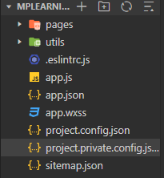

-  <span style="color: #e3371e">pages</span>  - 用来存放 <span style="color: #0099dd">所有小程序的页面</span> 
-  <span style="color: #e3371e">utils</span>  - 用来存放 <span style="color: #0099dd">工具性质的模块</span> （如：格式化时间的自定义模块）
-  <span style="color: #e3371e">app.js</span>  - 小程序项目的 <span style="color: #0099dd">入口文件</span> 
-  <span style="color: #e3371e">app.json</span>  - 小程序项目的 <span style="color: #0099dd">全局配置文件</span> 
    - 包括了小程序的所有页面路径、界面表现、网络超时时间、底部 tab 等
    - 各配置项的含义：
        -  <span style="color: #49bf51">pages 字段</span>  - 描述当前小程序所有页面路径
        -  <span style="color: #49bf51">window 字段</span>  - 定义小程序所有页面的顶部背景颜色，文字颜色定义等
-  <span style="color: #e3371e">app.wxss</span>  - 小程序项目的 <span style="color: #0099dd">全局样式文件</span> 
-  <span style="color: #e3371e">project.config.json</span>  - 小程序项目的 <span style="color: #0099dd">配置文件</span> 
    - 当前开发项目的个性化配置，其中会包括编辑器的颜色、代码上传时自动压缩等等
    - 重新安装工具或者换电脑工作时，只要载入同一个项目的代码包，开发者工具就自动会帮你恢复

-  <span style="color: #e3371e">sitemap.json</span>  - 配置 <span style="color: #0099dd">小程序及其页面</span> 是否允许 <span style="color: #0099dd">被微信索引</span> 


### 2 - 小程序页面的组成部分

小程序官网建议把所有小程序页面，都存放在 <span style="color: #e3371e">pages 目录</span> 中，以 <span style="color: #e3371e">单独的文件夹存在</span> 

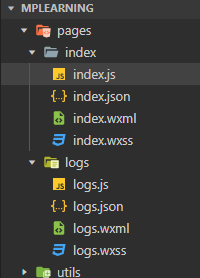

每个页面 <span style="color: #e3371e; font-weight: bold">由 4 个基本文件</span> 组成：

-  <span style="color: #e3371e">.js</span> 文件 - 页面的 <span style="color: #0099dd">脚本文件</span> ，存放页面的数据、事件处理函数等
-  <span style="color: #e3371e">.json</span> 文件 - 页面的 <span style="color: #0099dd">配置文件</span> ，配置窗口的外观、表现等
-  <span style="color: #e3371e">.wxml</span> 文件 - 页面的 <span style="color: #0099dd">模版结构文件</span> 
-  <span style="color: #e3371e">.wxss</span> 文件 - 页面的 <span style="color: #0099dd">样式表文件</span> 


#### 2.1 - JSON 配置文件的作用

JSON 是一种数据格式，并不是编程语言，在小程序中，JSON扮演的静态配置的角色

通过 .json 配置文件，可对小程序项目进行不同级别的配置


小程序项目中有 <span style="color: #e3371e">4</span> 种 json 配置文件：

- 项目根目录中的 <span style="color: #0099dd">app.json</span> 配置文件
- 项目根目录中的 <span style="color: #0099dd">project.json</span> 配置文件
- 项目根目录中的 <span style="color: #0099dd">sitemap.json</span> 配置文件
-  <span style="color: #e3371e">每个页面文件夹</span> 中的 <span style="color: #e3371e">.json</span> 配置文件


##### 2.1.1 - app.json

`app.json` 文件用来对微信小程序进行 <span style="color: #e3371e">全局配置</span> ，决定 <span style="color: #0099dd">页面文件的路径</span> 、 <span style="color: #0099dd">窗口表现</span> 、 <span style="color: #0099dd">设置网络超时时间</span> 、 <span style="color: #0099dd">设置多 tab</span>  等

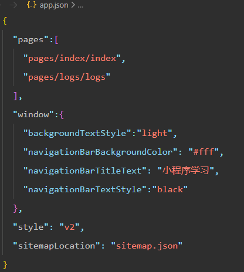

-  <span style="color: #e3371e">pages</span>  - 记录当前小程序 <span style="color: #0099dd">所有页面的路径</span> 
    - 文件名不需要写文件后缀，框架会自动去寻找对应位置的 `.json`, `.js`, `.wxml`, `.wxss` 四个文件进行处理
    - 未指定 `entryPagePath` 时，数组的第一项代表小程序的初始页面（首页）
    - **小程序中新增/减少页面，都需要对 pages 数组进行修改**
-  <span style="color: #e3371e">window</span>  - 设置小程序 <span style="color: #0099dd">状态栏、导航条、标题、窗口背景色</span> 
-  <span style="color: #e3371e">style</span>  - 全局定义小程序 <span style="color: #0099dd">组件使用的样式版本</span> 
    - app.json 中配置 `"style": "v2"`可表明启用新版的组件样式
-  <span style="color: #e3371e">sitemapLocation</span>  - 指明 sitemap.json 的位置
    - 默认为 app.json 同级目录下名字的 `sitemap.json` 文件


##### 2.1.2 - project.config.json

小程序项目的 <span style="color: #0099dd">配置文件</span> 

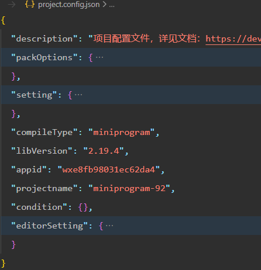

-  <span style="color: #e3371e">setting</span>  - 保存了 <span style="color: #0099dd">编译相关的配置</span> 
-  <span style="color: #e3371e">projectname</span>  - 保存了 <span style="color: #0099dd">项目名称</span> 
    - 小程序名称 != 项目名称 （这里 MPlearing != miniprogram-92）
-  <span style="color: #e3371e">appid</span>  - 保存了 <span style="color: #0099dd">小程序的账号 ID </span> 


##### 2.1.3 - sitemap.json

微信现已开发 <span style="color: #e3371e">小程序内搜索</span> ，效果类似于 PC 网页的 SEO

sitemap.json 文件用来 <span style="color: #e3371e">配置小程序页面是否允许微信索引</span> 


##### 2.1.4 - 页面的 .json 配置文件

小程序的每个页面。可使用 .json 文件对 <span style="color: #e3371e">当前页面的窗口外观进行配置</span> 

> 页面中的配置项会 <span style="color: #49bf51">覆盖</span>  app.json 的 window 中相同的配置项


#### 2.2 - 新建小程序页面

只需在 `app.json` -> `pages` 中新增页面的存放路径，小程序开发者工具会 <span style="color: #0099dd">自动创建对应的页面文件</span> 


#### 2.3 - 修改项目首页

只需调整 `app.json` -> `pages` 数组中页面路径的前后顺序，即可修改首页

小程序会把排在第一位的页面，当做项目首页进行渲染


### 3 - WXML 模版

WXML（WeiXin Markup Language）是小程序框架设计中的一套 <span style="color: #e3371e">标签语言</span> ， <span style="color: #e3371e">用来构建小程序页面的结构</span> ，其作用类似于网页开发中的 HTML，结合[基础组件](https://developers.weixin.qq.com/miniprogram/dev/component/index.html)、[事件系统](https://developers.weixin.qq.com/miniprogram/dev/framework/view/wxml/event.html)，可以构建出页面的结构

#### 3.1 - WXML 和 HTML 区别

-  <span style="color: #e3371e">标签名字不同</span> 
    - WXML - view、text、image、navigator
    - HTML - div、span、img、a
-  <span style="color: #e3371e">属性节点不同</span> 
    - WXML - `<navigator url="/pages/home/home"></navigator>` 
    - HTML - `<a href="#">超链接</a>`
-  <span style="color: #e3371e">提供了类似于 Vue  中的模版语法</span> 
    - 数据绑定
    - 列表渲染
    - 条件渲染


### 4 - WXSS

WXSS（WeiXin Style Sheets）是小程序框架设计中的一套 <span style="color: #e3371e">样式语言</span> ，用于描述 WXML 的组件样式，类似于网页开发中的 CSS

#### 4.1 - WXSS 和 CSS 的区别

-  <span style="color: #e3371e">新增了 rpx 尺寸单位</span> 

    - `WXSS` 在底层支持新的尺寸单位 `rpx`，可以根据屏幕宽度进行自适应

        - 规定屏幕宽为750rpx

        - 如在 iPhone6 上，屏幕宽度为375px，共有750个物理像素，则750rpx = 375px = 750物理像素，1rpx = 0.5px = 1物理像素

        - > **建议：** 开发微信小程序时设计师可以用 iPhone6 作为视觉稿的标准

    - `CSS` 中需手动进行像素单位的换算，例如 rem

-  <span style="color: #e3371e">提供了全局的样式和局部样式</span> 

    - 项目根目录中的 app.wxss 会作用于所有小程序页面
    - 局部页面的 .wxss 样式仅对当前页面生效，并会覆盖 app.wxss 中相同的选择器。

-  <span style="color: #e3371e">`WXSS` 仅支持部分 `CSS` 选择器</span> 

    - .class
    - #id
    - element
    - element, element
    - ::after
    - ::before

### 5 - JS 逻辑交互

在小程序里边，可通过编写 `JS` 脚本文件来处理用户的操作。例如：响应用户的点击、获取用户的位置


小程序中的 JS 文件分为 <span style="color: #e3371e">3</span> 大类：

-  <span style="color: #e3371e">app.js</span>  -  <span style="color: #0099dd">整个小程序项目的入口文件</span> ，通过调用 <span style="color: #e3371e">APP()</span> 函数来 <span style="color: #49bf51">启动</span> 整个小程序
- <span style="color: #e3371e">页面的的 .js</span> 文件 -  <span style="color: #0099dd">页面的入口文件</span> ，通过调用 <span style="color: #e3371e">Page()</span> 函数来 <span style="color: #49bf51">创建并运行</span> 页面
- <span style="color: #e3371e">普通的 .js</span> 文件 -  <span style="color: #0099dd">普通的功能模块文件</span> ，用来 <span style="color: #49bf51">封装</span>  <span style="color: #e3371e">公共的函数或属性</span> 供页面使用


## 三、小程序的宿主环境

  <span style="color: #e3371e; font-weight: bold">宿主环境</span>  （host environment）指 <span style="color: #e3371e">程序运行所必须的依赖环境</span> 

-  <span style="color: #e3371e">Android 系统</span> 和 <span style="color: #e3371e">iOS 系统</span> 是两个不同的宿主环境
- 安卓版的 微信App 不能在 iOS 环境下运行，Android 是安卓软件的宿主环境
-  <span style="color: #e3371e">脱离宿主环境的软件是没有任何意义的</span> 

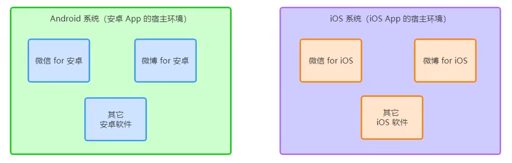


### 1 - 小程序的宿主环境

 <span style="color: #e3371e; font-weight: bold">手机微信</span> 是 <span style="color: #e3371e">小程序的宿主环境</span> 

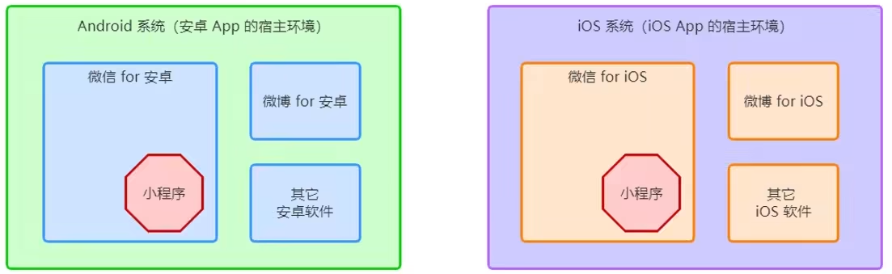

小程序 <span style="color: #e3371e">借助宿主环境提供的能力</span> ，可以完成许多普通网页无法完成的功能

如：微信登陆、微信扫码、微信支付、地理定位、etc……


### 2 - 小程序宿主环境包含的内容

-  <span style="color: #e3371e; font-weight: bold">通信模型</span> 
-  <span style="color: #e3371e; font-weight: bold">程序与页面</span> 
-  <span style="color: #e3371e; font-weight: bold">组件</span> 
-  <span style="color: #e3371e; font-weight: bold">API</span> 

#### 2.1 - 通信模型

##### 2.1.1 - 通信主体

小程序中通信的主体是 <span style="color: #e3371e">渲染层</span> 和 <span style="color: #e3371e">逻辑层</span> ：

-  <span style="color: #49bf51">WXML 模版</span> 和 <span style="color: #49bf51">WXSS 样式</span> 工作在 <span style="color: #0099dd">渲染层</span> 
    - 渲染层的界面使用了WebView 进行渲染
-  <span style="color: #49bf51">JS 脚本</span> 工作在 <span style="color: #0099dd">逻辑层</span> 
    - 逻辑层采用 JsCore 线程运行 JS 脚本


##### 2.1.2 - 通信模型

小程序中的通信模型分为两部分

-  <span style="color: #e3371e">渲染层</span> 和 <span style="color: #e3371e">逻辑层</span> 之间的通信
    - 经由微信客户端做中转
-  <span style="color: #e3371e">逻辑层</span> 和 <span style="color: #e3371e">第三方服务器</span> 之间的通信
    - 经由微信客户端做中转


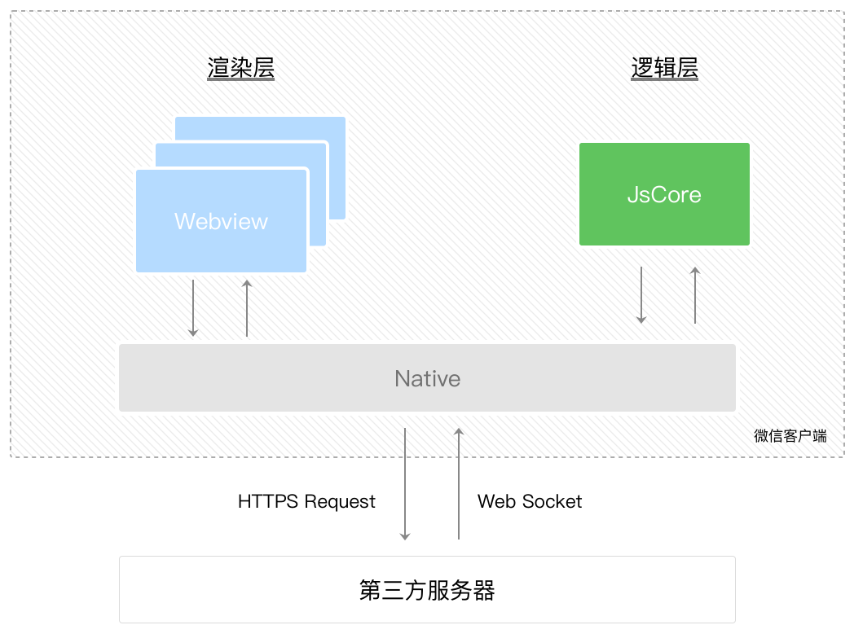


#### 2.2 - 程序与页面

##### 2.2.1 - 小程序启动的过程

- 把小程序的代码包下载到本地
- 解析 app.json 全局配置文件
- 执行 app.js 小程序入口文件， <span style="color: #e3371e">调用 App() 创建小程序实例</span> 
- 渲染小程序首页
- 小程序启动完成（可调用 `onLaunch` 回调）


##### 2.2.2 - 小程序渲染的过程

- 加载解析页面的 .json 配置文件
- 加载页面的 .wxml 模版和 .wxss 样式
- 执行页面的 .js 文件， <span style="color: #e3371e">调用 Page() 创建页面实例</span> 
- 页面渲染完成（可调用 `onLoad` 回调）


#### 2.3 - 组件

 <span style="color: #e3371e">小程序中的组件</span> 也是 <span style="color: #e3371e">由宿主环境提供</span> ，开发者可基于组件快速搭建除漂亮的页面结构

- 只需要在 `WXML` 写上对应的组件标签名字就可以把该组件显示在界面上

    ```html
    <!-- 在界面上显示地图 -->
    <map></map>
    ```

- 使用组件的时候，还可以通过属性传递值给组件，让组件可以以不同的状态去展现

    ```html
    <!-- 设置地图一开始的中心的经纬度是广州 -->
    <map longitude="广州经度" latitude="广州纬度"></map>
    ```

- 组件的内部行为也会通过事件的形式让开发者可以感知

    ```html
    <!-- 用户点击了地图上的某个标记，在 js 编写 markertap 函数来处理 -->
    <map bindmarkertap="markertap" longitude="广州经度" latitude="广州纬度"></map>
    ```

官方把小程序的组件氛围了 <span style="color: #e3371e">9</span> 大类：

-  <span style="color: #e3371e">视图容器</span> 
-  <span style="color: #e3371e">基础组件</span> 
-  <span style="color: #e3371e">表单组件</span> 
-  <span style="color: #e3371e">导航组件</span> 
-  <span style="color: #e3371e">媒体组件</span> 
-  map 地图组件
-  canvas 画布组件
-  开放能力
-  无障碍访问


#### 2.4 - API

 <span style="color: #e3371e">小程序中的 API 是由宿主环境提供的</span> ，通过这些丰富的小程序 API，开发者可以方便地调用微信提供的能力

例如：获取用户信息、本地存储、支付功能等

官方把 API 分为了 <span style="color: #e3371e">3</span> 大类：

-  <span style="color: #e3371e">事件监听 API</span> 

    - **特点**：以 <span style="color: #0099dd">on</span> 开头，用来 <span style="color: #0099dd">监听某些事件的触发</span> 

    - **示例**：

        ```js
        wx.onCompassChange(function (res) {
          console.log(res.direction)
        })
        ```

-  <span style="color: #e3371e">同步 API</span> 

    - **特点**：以 <span style="color: #0099dd">sync</span> 结尾

    - **特点**：同步 API 的执行结果，可以通过函数返回值直接获取，如果执行出错会抛出异常

    - **示例**：

        ```js
        try {
          wx.setStorageSync('key', 'value')
        } catch (e) {
          console.error(e)
        }
        ```

-  <span style="color: #e3371e">异步 API</span> 

    - **特点**：大多数 API 都是异步 API，这类 API 接口通常都接受一个 `Object` 类型的参数，需要通过 success、fall、complate 接收调用的结果

    - **示例**：

        ```js
        wx.login({
          success(res) {
            console.log(res.code)
          }
        })
        ```

        

## 四、小程序协同工作和发布

中大型的公司里，人员的分工非常仔细：同一小程序项目。一般会有不同岗位，不同角色的员工同时参与设计与开发

此时出于管理需要， <span style="color: #e3371e">迫切需要</span> 对不同岗位、不同角色的 <span style="color: #e3371e">员工的权限进行边界的划分</span> ，使他们能够高效地进行协同工作

### 1 - 协同工作

#### 1.1 - 项目成员组织结构

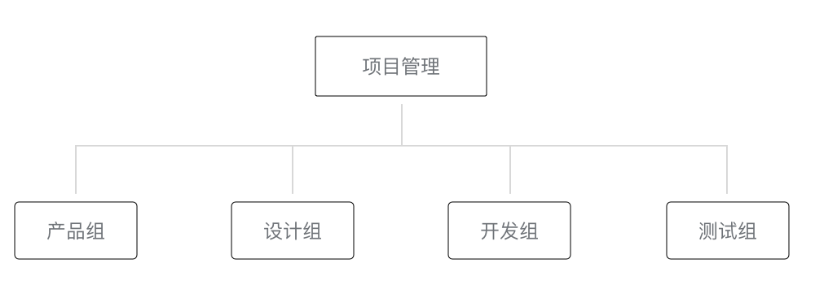

-  <span style="color: #e3371e">项目管理成员</span>  - 负责统筹整个项目的进展和风险、把控小程序对外发布的节奏
-  <span style="color: #e3371e">产品组</span>  - 提出需求
-  <span style="color: #e3371e">设计组与产品组</span>  - 讨论并对需求进行抽象，设计出可视化流程与图形，输出设计方案
-  <span style="color: #e3371e">开发组</span>  - 依据设计方案，进行程序代码的编写
-  <span style="color: #e3371e">设计组与产品组</span> -  <span style="color: #49bf51">代码编写完成后</span> ，产品组与设计组体验小程序的整体流程
-  <span style="color: #e3371e">测试组</span>  - 编写测试用例并对小程序进行各种边界测试


#### 1.2 - 项目工作流程

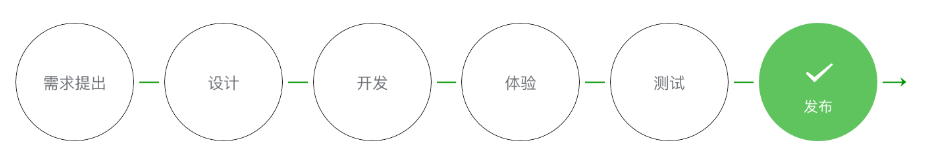

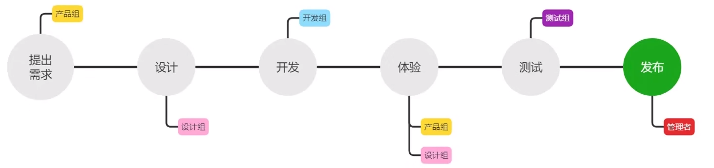


#### 1.3 - 小程序成员管理

小程序成员管理包括对小程序项目成员及体验成员的管理

- <span style="color: #e3371e">项目成员</span>  - 参与小程序开发、运营的成员，可登录小程序管理后台，包括运营者、开发者及数据分析者
    -  <span style="color: #ab04d9">管理员</span> 可在“成员管理”中添加、删除项目成员，并设置项目成员的角色
- <span style="color: #e3371e">体验成员</span>  - 参与小程序内测体验的成员，可使用体验版小程序，但不属于项目成员
    -  <span style="color: #ab04d9">管理员</span> 及 <span style="color: #ab04d9">项目成员</span> 均可添加、删除体验成员

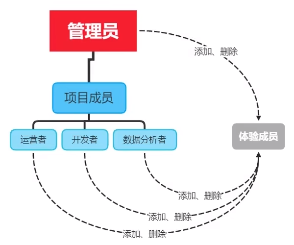


#### 1.4 - 不同项目成员对应的权限

不同项目成员拥有不同的权限，从而保证小程序开发安全有序

|      权限      | 运营者 |                开发者                 | 数据分析者 |
| :------------: | :----: | :-----------------------------------: | :--------: |
|   开发者权限   |        | <span style="color: #e3371e">√</span> |            |
|   体验者权限   |   √    | <span style="color: #e3371e">√</span> |     √      |
|      登录      |   √    | <span style="color: #e3371e">√</span> |     √      |
|    数据分析    |        |                                       |     √      |
|    微信支付    |   √    |                                       |            |
|      推广      |   √    |                                       |            |
|    开发管理    |   √    |                                       |            |
|    开发设置    |        | <span style="color: #e3371e">√</span> |            |
|    暂停服务    |   √    |                                       |            |
| 解除关联公众号 |   √    |                                       |            |
|   腾讯云管理   |        | <span style="color: #e3371e">√</span> |            |
|   小程序插件   |   √    |                                       |            |
|  游戏运营管理  |   √    |                                       |            |

-  <span style="color: #e3371e">开发者权限</span>  - 可使用小程序开发者工具及开发版小程序进行开发
-  <span style="color: #e3371e">体验者权限</span>  - 可使用体验版小程序
-  <span style="color: #e3371e">登陆权限</span>  - 可登录小程序管理后台，无需管理员确认
-  <span style="color: #e3371e">开发设置</span>  - 设置小程序服务器域名、消息推送及扫描普通链接二维码打开小程序
-  <span style="color: #e3371e">腾讯云管理</span>  - 云开发相关设置


#### 1.5 - 添加项目成员和体验成员

`登陆微信小程序后台` -> `管理` -> `成员管理`


### 2 - 小程序的版本

#### 2.1 - 软件开发过程中的版本

在软件开发过程中，根据时间节点的不同，会产出不同的软件版本

-  <span style="color: #e3371e">开发版本</span>  - 开发者编写代码的同时，对项目代码进行 <span style="color: #0099dd">自测</span> 
-  <span style="color: #e3371e">体验版本</span>  - 程序达到稳定可体验的状态，开发者把体验版本给到产品经理和测试人员进行 <span style="color: #0099dd">体验测试</span> 
-  <span style="color: #e3371e">正式版本</span>  - 修复完程序 bug 后，发布正式版供外部用户使用


#### 2.2 - 小程序的版本

小程序的版本根据这个流程设计了小程序版本的概念

|  **权限**  |                           **说明**                           |
| :--------: | :----------------------------------------------------------: |
|  开发版本  | 使用开发者工具，可将代码上传到开发版本中<br />开发版本只保留每人最新的一份上传的代码<br />点击提交审核，可将代码提交审核<br />开发版本可删除，不影响线上版本和审核中版本的代码 |
|  体验版本  |      可以选择某个开发版本作为体验版，并且选取一份体验版      |
| 审核中版本 | 只能有一份代码处于审核中<br />有审核结果后可以发布到线上，也可直接重新提交审核，覆盖原审核版本 |
|  线上版本  | 线上所有用户使用的代码版本，该版本代码在新版本代码发布后被覆盖更新 |


### 3 - 发布上线

一个小程序从开发完到上线一般要经过 预览-> 上传代码 -> 提交审核 -> 发布等步骤

#### 3.1 - 预览

使用开发者工具可以预览小程序，帮助开发者检查小程序在移动客户端上的真实表现


#### 3.2 - 上传代码

上传代码是用于提交体验或者审核使用

- 点击开发者工具顶部操作栏的`上传`按钮
- 填写 <span style="color: #e3371e">版本号</span> 以及 <span style="color: #e3371e">项目备注</span> 
    - 此处版本号以及项目备注是为了方便管理员检查版本使用的
    - 开发者可以根据自己的实际要求来填写这两个字段

##### 3.2.1 - 后台查看上传结果

上传成功之后，登录[小程序管理后台](https://mp.weixin.qq.com/) - `版本管理` - `开发版本` ，就可以找到刚提交上传的版本了

可以将这个版本设置 体验版 或者是 提交审核


#### 3.3 - 提交审核

为保证小程序的质量，以及符合相关的规范，小程序的发布，是需要经过腾讯官方审核的

**提交审核的方式**：

- 开发者工具中上传了小程序代码之后
- 登录 [小程序管理后台](https://mp.weixin.qq.com/) - 版本管理 - 开发版本
- 找到提交上传的版本，在开发版本的列表中，点击 **提交审核** 
- 按照页面提示，填写相关的信息，即可以将小程序提交审核

> **开发者严格测试了版本之后，再提交审核**， 过多的审核不通过，可能会影响后续的时间


#### 3.4 - 发布

- 审核通过之后，管理员的微信中会收到小程序通过审核的通知
- 登录 [小程序管理后台](https://mp.weixin.qq.com/) - 开发管理 - 审核版本中，可以看到通过审核的版本
- 点击发布后，即可发布小程序


##### 3.4.1 - 发布模式

小程序提供了两种发布模式

-  <span style="color: #e3371e">全量发布</span>  - 当点击发布之后，所有用户访问小程序时都会使用当前最新的发布版本
-  <span style="color: #e3371e">分阶段发布（ <span style="color: #0099dd">灰度发布</span> ）</span> - 分不同时间段来控制部分用户使用最新的发布版本


#### 4 - 基于小程序码进行推广

在小程序设计的初期，小程序平台提供的二维码的形式，用户并不知道当前这次扫码会出现什么样的服务

因此微信设计了小程序码，让用户在扫码之前就有一个明确的预期


相比普通二维码， <span style="color: #e3371e">小程序码</span> 的优势：

- 在样式上更具 <span style="color: #e3371e">辨识度</span> 和 <span style="color: #e3371e">视觉冲击力</span> 
- 能够更加清晰地树立小程序的 <span style="color: #e3371e">品牌形象</span> 
- 可以帮助开发者 <span style="color: #e3371e">更好地推广小程序</span> 


**获取**小程序码的 <span style="color: #e3371e">5</span> 个步骤：

 <span style="color: #e3371e">登陆小程序管理后台</span> -> <span style="color: #e3371e">设置</span>  -> <span style="color: #e3371e">基本设置</span> -> <span style="color: #e3371e">基本信息</span> -> <span style="color: #e3371e">小程序码及线下物料下载</span> 


### 4 - 运营数据

查看小程序运营数据的 <span style="color: #e3371e">两种</span> 方式：

- 在 <span style="color: #e3371e">小程序后台</span> 查看
    - 登录 [小程序管理后台](https://mp.weixin.qq.com/) 
    - 统计
    - 点击相应的 tab 可以看到相关的数据
- 使用 <span style="color: #e3371e">小程序数据助手</span> 查看
    - 打开微信
    - 搜索“小程序数据助手”
    - 查看已发布的小程序相关的数据


# 第二章、模版与配置

## 一、WXML 模版语法

### 1 - 数据绑定

WXML 中的动态数据均来自对应 Page 的 data

```js
Page({
	data: {
		info: 'init data',
		msgList: [{msg: 'hello'}, {msg: 'world'}]
	}
})
```


#### 1.1 - 简单绑定

数据绑定使用 Mustache 语法（双大括号）将变量包起来，可作用于:

##### 1.1.1 - 内容

```html
<view> {{ message }} </view>
```

```js
Page({
  data: {
    message: 'Hello MINA!'
  }
})
```


##### 1.1.2 - 组件属性

需要在双引号之内

```html
<view id="item-{{id}}"> </view>
```

```js
Page({
  data: {
    id: 0
  }
})
```


##### 1.1.3 - 控制属性

需要在双引号之内

```html
<view wx:if="{{condition}}"> </view>
```

```js
Page({
  data: {
    condition: true
  }
})
```


##### 1.1.4 - 关键字

需要在双引号之内

```html
<checkbox checked="{{false}}"> </checkbox>
```

> 不要直接写 `checked="false"`，其计算结果是一个字符串，转成 boolean 类型后代表真值


#### 1.2 - 运算

可以在 `{{}}` 内进行简单的运算，支持的有如下几种方式

##### 1.2.1 - 三元运算

```html
<view hidden="{{flag ? true : false}}"> Hidden </view>
```


##### 1.2.2 - 算术运算

```html
<!-- view中的内容为 3 + 3 + d -->
<view> {{a + b}} + {{c}} + d </view>
```

```js
Page({
  data: {
    a: 1,
    b: 2,
    c: 3
  }
})
```


##### 1.2.3 - 逻辑判断

```html
<view wx:if="{{length > 5}}"> </view>
```


##### 1.2.4 - 字符串运算

```html
<view>{{"hello" + name}}</view>
```

```javascript
Page({
  data:{
    name: 'MINA'
  }
})
```


##### 1.2.5 - 数据路径运算

```html
<view>{{object.key}} {{array[0]}}</view>
```

```js
Page({
  data: {
    object: {
      key: 'Hello '
    },
    array: ['MINA']
  }
})
```


#### 1.3 - 组合

也可以在 Mustache 内直接进行组合，构成新的对象或者数组

##### 1.3.1 - 数组

```html
<!-- 最终组合成数组[0, 1, 2, 3, 4] -->
<view wx:for="{{[zero, 1, 2, 3, 4]}}"> {{item}} </view>
```

```js
Page({
  data: {
    zero: 0
  }
})
```


##### 1.3.2 - 对象

```html
<!-- 最终组合成的对象是 {for: 1, bar: 2} -->
<template is="objectCombine" data="{{for: a, bar: b}}"></template>
```

```js
Page({
  data: {
    a: 1,
    b: 2
  }
})
```

> 1、也可以用扩展运算符 `...` 来将一个对象展开
>
> 2、如果对象的 key 和 value 相同，也可以间接地表达
>
> 3、方式可以随意组合，但是如有存在变量名相同的情况，后边的会覆盖前面
>
> 4、花括号和引号之间如果有空格，将最终被解析成为字符串


### 2 - 事件系统

#### 2.1 - 事件介绍

 <span style="color: #e3371e">事件</span> 是 <span style="color: #0099dd">渲染层到逻辑层的通信方式</span> 。通过事件可以将用户在渲染层产生的行为，反馈到逻辑层进行处理

- 事件是视图层到逻辑层的通讯方式
- 事件可以将用户的行为反馈到逻辑层进行处理
- 事件可以绑定在组件上，当达到触发事件，就会执行逻辑层中对应的事件处理函数
- 事件对象可以携带额外信息，如 id, dataset, touches

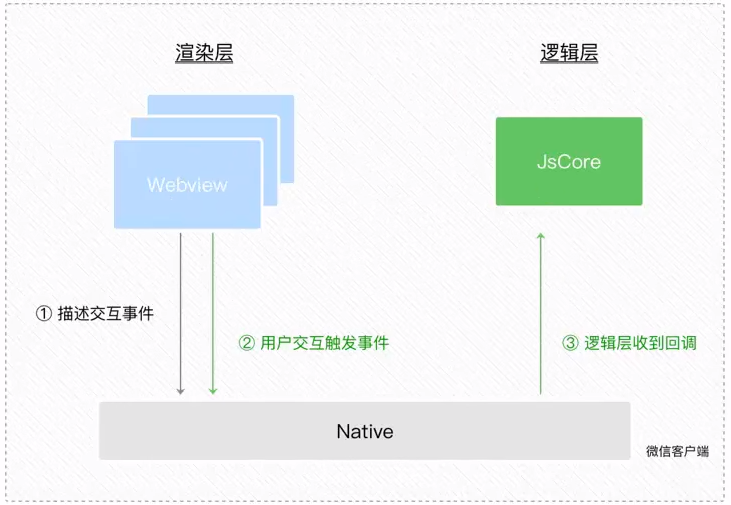


- 事件是视图层到逻辑层的通讯方式
- 事件可以将用户的行为反馈到逻辑层进行处理
- 事件可以绑定在组件上，当达到触发事件，就会执行逻辑层中对应的事件处理函数
- 事件对象可以携带额外信息，如 id, dataset, touches


#### 2.2 - 小程序中常用事件

|  类型  |         绑定方式          |                    事件描述                     |
| :----: | :-----------------------: | :---------------------------------------------: |
|  tap   |    bindtap 或 bind:tap    | 手指触摸后马上离开，类似于 HTML 中的 click 事件 |
| input  |   bindput 或 bind:input   |                文本框的输入事件                 |
| change | bindchange 或 bind:change |                 状态改变时触发                  |


#### 2.3 - 事件对象的属性列表

当事件回调触发时，会收到一个事件对象 event ，它的详细属性如下表所示

**BaseEvent 基础事件对象属性列表** 

|                    属性                    |                    类型                    |                             说明                             |
| :----------------------------------------: | :----------------------------------------: | :----------------------------------------------------------: |
|                    type                    |                   String                   |                           事件类型                           |
|                 timeStamp                  |                  Integer                   |                      事件生成时的时间戳                      |
| <span style="color: #e3371e">target</span> | <span style="color: #e3371e">Object</span> | <span style="color: #e3371e">触发事件的组件的一些属性值集合</span> |
|               currentTarget                |                   Object                   |                   当前组件的一些属性值集合                   |
|                    mark                    |                   Object                   |                         事件标记数据                         |

**CustomEvent 自定义事件对象属性列表（继承 BaseEvent）** 

|                    属性                    |                    类型                    |                      说明                      |
| :----------------------------------------: | :----------------------------------------: | :--------------------------------------------: |
| <span style="color: #e3371e">detail</span> | <span style="color: #e3371e">Object</span> | <span style="color: #e3371e">额外的信息</span> |

**TouchEvent 触摸事件对象属性列表（继承 BaseEvent）** 

|      属性      | 类型  |                     说明                     |
| :------------: | :---: | :------------------------------------------: |
|    touches     | Array | 触摸事件，当前停留在屏幕中的触摸点信息的数组 |
| changedTouches | Array |     触摸事件，当前变化的触摸点信息的数组     |


#### 2.4 - target 和 currentTarget 的区别

- <span style="color: #e3371e">target</span>  -  <span style="color: #0099dd">触发该事件的源头组件</span> 
- <span style="color: #e3371e">currentTarget</span>  -  <span style="color: #0099dd">当前事件所绑定的组件</span> 


**示例** 

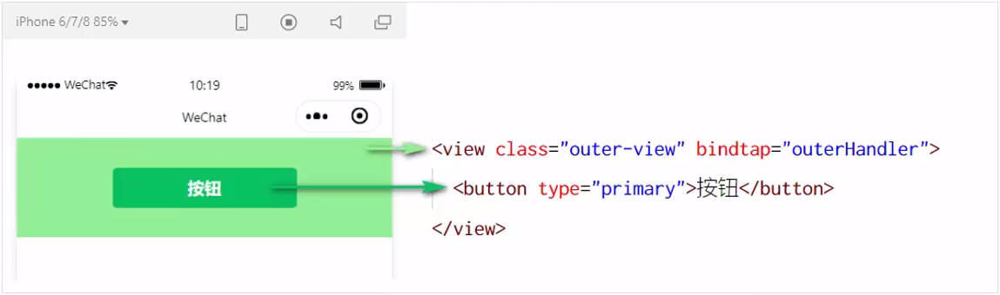

点击内部按钮时，点击事件以 <span style="color: #e3371e">冒泡</span> 的方式向外扩散，也会触发外层 view 的 tap 事件处理函数

此时，对于外层的 view 来说

- e.target 是内部的按钮组件
- e.currentTarget 是外部的 view 组件


#### 2.5 - 普通事件绑定

```html
<view bindtap="handleTap">
    Click here!
</view>
```

```js
page({
	handleTap(e) {
		console.log(e)
	}
})
```

> 1、以字符串指定事件处理函数名
>
> 2、如果它是个空字符串，则这个绑定会失效（可以利用这个特性来暂时禁用一些事件）


#### 2.6 - 在事件处理函数中为 data 中的数据赋值

通过调用 <span style="color: #e3371e">this.setData(dataObject)</span> 方法，可给页面 data 中的数据重新赋值

```js
// 页面的 .js 文件
page({
	data: {
		count: 0
	},
	
	// 修改 count 的值
	changeCount({
		this.setData({
			count: this.data.count + 1
		})
	})
})
```


#### 2.7 - 事件传参

小程序中， <span style="color: #e3371e">不能在绑定事件的同时为事件处理函数传递参数</span> 

```html
<!-- 在小程序中，不起作用 ↓↓↓ -->
<button type="primary" bindtap="btnHandler(123)">事件传参</button>
```

小程序会将 bindtap 的属性值，统一当做 <span style="color: #0099dd">事件名称来处理</span> ，此处相当于调用一个名称为 <span style="color: #49bf51">btnHandler(123)</span> 的实践处理函数


##### 2.7.1 - 小程序中的事件传参

可以为组件提供 <span style="color: #e3371e">data-*</span> 自定义属性传参，其中 <span style="color: #0099dd"> * 代表的是参数的名字</span> 

```html
<button type="primary" bindtap="btnHandler" data-info="{{2}}">事件传参</button>
```

最终：

-  <span style="color: #e3371e">info</span> - 解析为参数的名字
-  <span style="color: #e3371e">数值2</span> - 解析为参数的值


在事件处理函数中，通过 <span style="color: #e3371e; font-weight: bold">event.target.dataset.参数名</span> 即可获取 <span style="color: #0099dd">具体参数的值</span> 

```js
btnHandler (event) {
	console.log(event.target.dataset.info)
}
```

>  <span style="color: #49bf51">dataset</span> 是一个 <span style="color: #49bf51">对象</span> ，包含了所有通过 data-* 传递过来的参数项
>
> 通过 dataset，可以访问到具体参数的值


#### 2.8 - input 文本框和 data 之间的数据同步

在 WXML 中，普通的属性的绑定是 <span style="color: #e3371e">单向</span> 的

```html
<input value="{{value}}" />
```

- 如果使用 `this.setData({ value: 'leaf' })` 来更新 `value` ，`this.data.value` 和输入框的中显示的值都会被更新为 `leaf` 
- 但如果用户修改了输入框里的值，却不会同时改变 `this.data.value`

**如果需要在用户输入的同时改变 `this.data.value` ，需要借助简易双向绑定机制** 

此时，可以在对应项目之前加入 `model:` 前缀

```html
<input model:value="{{value}}" />
```

这样，如果输入框的值被改变了， `this.data.value` 也会同时改变

***

也可以使用 `e.detail.value` 

```html
<input value="{{msg}}" bindinput="inputHandler"/>
```

```js
data: {
	msg: 123
}

inputHandler(e) {
  this.setData({
    msg: e.detail.value
  })
}
```

***


### 3 - 列表渲染

#### 3.1 - wx:for

在组件上使用 `wx:for` 控制属性绑定一个数组，即可使用数组中各项的数据重复渲染该组件

数组当前项的变量名默认为 `item` ，数组的当前项的下标变量名默认为 `index` 

```html
<view wx:for="{{array}}">
  {{index}}: {{item.message}}
</view>
```

```js
Page({
  data: {
    array: [{
      message: 'foo',
    }, {
      message: 'bar'
    }]
  }
})
```


#### 3.2 - 手动指定当前项的变量名和索引

- 使用 `wx:for-item` 可以指定数组当前元素的变量名

- 使用 `wx:for-index` 可以指定数组当前下标的变量名

```html
<view wx:for="{{array}}" wx:for-index="idx" wx:for-item="itemName">
  {{idx}}: {{itemName.message}}
</view>
```

> 可用于嵌套

```html
<view wx:for="{{[1, 2, 3, 4, 5, 6, 7, 8, 9]}}" wx:for-item="i">
  <view wx:for="{{[1, 2, 3, 4, 5, 6, 7, 8, 9]}}" wx:for-item="j">
    <view wx:if="{{i <= j}}">
      {{i}} * {{j}} = {{i * j}}
    </view>
  </view>
</view>
```


#### 3.3 - wx:key

类似于 Vue 列表渲染中的 <span style="color: #e3371e">:key</span> ，小程序在实现列表渲染时，也建议为渲染出来的列表项指定唯一的 key 值，从而 <span style="color: #e3371e">提高渲染的效率</span> 

```js
// data 数据
data: {
    userList: [
        { id: 1, name: 'Alice' },
        { id: 2, name: 'bob' },
        { id: 3, name: 'coco'}
    ]
}
```

```html
<!-- wxml 结构 -->
<view wx:for="{{ userList}}" wx:key="id">{{ item.name }}</view>
```

> 绑定 key 值时，不用插值表达式


### 4 - 条件渲染

#### 4.1 - wx:if

在框架中，使用 `wx:if=""` 来判断是否需要渲染该代码块：

```html
<view wx:if="{{condition}}"> True </view>
```

也可以用 `wx:elif` 和 `wx:else` 来添加一个 else 块：

```html
<view wx:if="{{length > 5}}"> 1 </view>
<view wx:elif="{{length > 2}}"> 2 </view>
<view wx:else> 3 </view>
```


#### 4.2 - block wx:if

因为 `wx:if` 是一个控制属性，需要将它添加到一个标签上。如果要一次性判断多个组件标签，可以使用一个 `<block/>` 标签将多个组件包装起来，并在上边使用 `wx:if` 控制属性。

```html
<block wx:if="{{true}}">
  <view> view1 </view>
  <view> view2 </view>
</block>
```

> `<block/>` 并不是一个组件，它仅仅是一个 <span style="color: #49bf51">包装元素</span> ，不会在页面中做任何渲染，只接受控制属性


#### 4.3 - hidden

在小程序中，直接使用 `hidden="{{ condition }}"` 也能控制元素的显示和隐藏

- 条件为 <span style="color: #e3371e">true</span> 时 <span style="color: #0099dd">隐藏</span> 元素
- 条件为 <span style="color: #e3371e">false</span> 时 <span style="color: #0099dd">显示</span> 元素


#### 4.4 - wx:if 对比 hidden

- **运行方式** 
    -  <span style="color: #e3371e">wx:if</span>  - 以 <span style="color: #0099dd">动态创建和移除元素</span> 的方式，控制元素的展示和隐藏
    -  <span style="color: #e3371e">hidden</span>  - 以 <span style="color: #0099dd">切换样式</span> 的方式（ <span style="color: #49bf51">display: none/block;</span> ）控制元素的显示和隐藏

- **使用建议** 
    -  <span style="color: #e3371e">频繁切换</span> 时 -  <span style="color: #0099dd">hidden</span> 
    -  <span style="color: #e3371e">控制条件复杂</span> 时 -  <span style="color: #0099dd">wx:if</span> 搭配 wx:elif 、wx:else 进行展示与隐藏的切换


## 二、WXSS 模版样式

WXSS (WeiXin Style Sheets)是一套样式语言，用于描述 WXML 的组件样式。

WXSS 用来决定 WXML 的组件应该怎么显示。

为了适应广大的前端开发者，WXSS 具有 CSS 大部分特性。同时为了更适合开发微信小程序，WXSS 对 CSS 进行了扩充以及修改。

与 CSS 相比，WXSS 扩展的特性有：

- 尺寸单位
- 样式导入

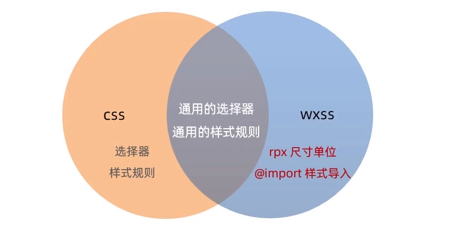

### 1 - rpx 尺寸单位

 <span style="color: #e3371e">rpx</span> （responsive pixel）是微信小程序独有的，用来 <span style="color: #e3371e">解决屏适配的尺寸单位</span> 

#### 1.1 - rpx 实现原理

 <span style="color: #e3371e">rpx</span> 把所有设备的屏幕，在**宽度**上 <span style="color: #e3371e">等分 750 份</span> （即： <span style="color: #0099dd">当前屏幕的总宽度为 750 rpx</span> ）

- 在 <span style="color: #e3371e">较小</span> 的设备上， <span style="color: #0099dd">1 rpx 所代表的宽度较小</span> 
- 在 <span style="color: #e3371e">较大</span> 的设备上， <span style="color: #0099dd">1 rpx 所代表的宽度较大</span> 

小程序在不同设备上运行时，自动把 rpx 的样式单位换算成对应的像素单位来渲染，从而实现屏幕适配

> **建议：** 开发微信小程序时设计师可以用 iPhone6 作为视觉稿的标准


### 2 - 样式导入

使用`@import`语句可以导入外联样式表，`@import`后跟需要导入的外联样式表的 <span style="color: #e3371e">相对路径</span> ，用`;`表示语句结束                                                                                                                                                                                                                                                                                                                          

```less
/** common.wxss **/
.small-p {
  padding:5px;
}

```

```less
/** app.wxss **/
@import "common.wxss";
.middle-p {
  padding:15px;
}
```


### 3 - 全局样式和局部样式

-  <span style="color: #e3371e">全局样式</span>  - 定义在 <span style="color: #0099dd">app.wxss</span> 中的样式为全局样式， <span style="color: #0099dd">作用于每一个页面</span> 

-  <span style="color: #e3371e">局部样式</span>  -  定义在 <span style="color: #0099dd">page 的 wxss</span> 文件中的样式为局部样式，只 <span style="color: #0099dd">作用在对应的页面</span> ，并会 <span style="color: #0099dd">覆盖</span> app.wxss 中相同的选择器

    > 当局部样式的 <span style="color: #49bf51">权重大于或等于</span> 全局样式的权重时，才会覆盖全局的样式


## 三、全局配置和页面配置

### 1 - 全局配置文件及常用的配置项

小程序目录下的 <span style="color: #e3371e">app.json</span> 文件时小程序的 <span style="color: #0099dd">全局配置文件</span> 

常用的配置项如下：

- pages
    - 记录当前小程序所有页面的存放路径
-  <span style="color: #e3371e">window</span> 
    - 全局设置小程序窗口的外观
-  <span style="color: #e3371e">tabBar</span> 
    - 设置小程序底部的 tabBar 效果
- style
    - 是否启用新版的组件样式


#### 1.1 - window

##### 1.1.1 - 小程序窗口的组成部分

 <span style="color: #0099dd">导航栏区域</span> 和 <span style="color: #0099dd">背景区域</span> 可通过 <span style="color: #e3371e">window 节点</span> 进行全局配置

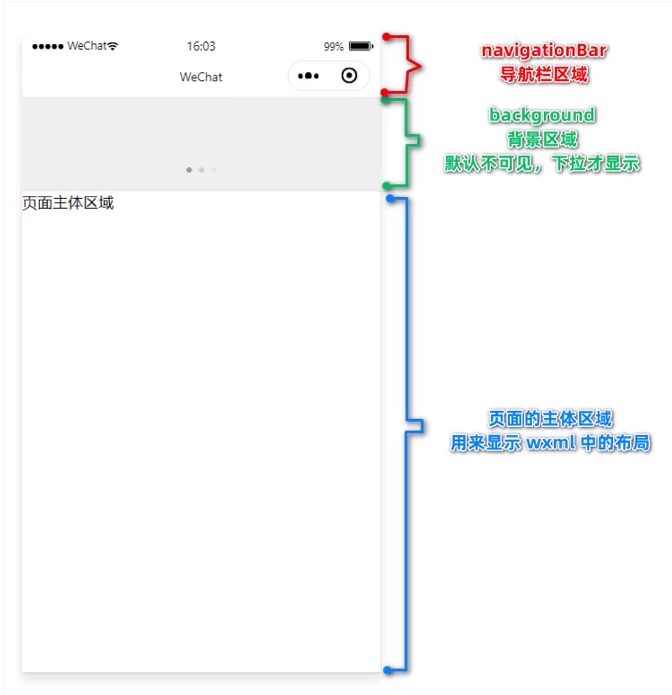


##### 1.1.2 - window 节点常用的配置项

|            属性名            |   类型   | 默认值  |                      说明                       |
| :--------------------------: | :------: | :-----: | :---------------------------------------------: |
|    navigationBarTitleText    |  string  |         |               导航栏标题文字内容                |
| navigationBarBackgroundColor | HexColor | #000000 |          导航栏背景颜色，如 `#000000`           |
|    navigationBarTextStyle    |  string  |  white  |    导航栏标题颜色，仅支持 `black` / `white`     |
|       backgroundColor        | HexColor | #ffffff |                  窗口的背景色                   |
|     backgroundTextStyle      |  string  |  dark   |  下拉 loading 的样式，仅支持 `dark` / `light`   |
|    enablePullDownRefresh     | boolean  |  false  |            是否开启全局的下拉刷新。             |
|    onReachBottomDistance     |  number  |   50    | 页面上拉触底事件触发时距页面底部距离，单位为 px |


#### 1.2 - tabBar

 <span style="color: #e3371e">tabBar</span> 是移动端应用常见的页面效果， <span style="color: #e3371e">用于实现多页面的快速切换</span> 

小程序中通常将其分为

- 底部 tabBar
- 顶部 tabBar

> 1、tabBar 中只能配置 <span style="color: #49bf51">最少 2 个、最多 5 个</span> tab 页签
>
> 2、当渲染 <span style="color: #49bf51">顶部 tabBar</span> 时， <span style="color: #49bf51">不显示 icon</span> ，只显示文本


##### 1.2.1 - tabBar 的组成部分

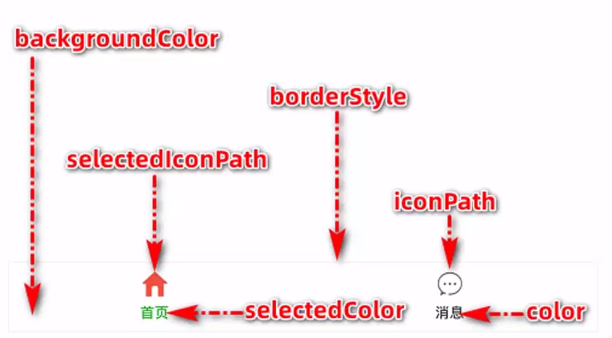

|      属性名      |   类型   | 默认值 |                      说明                      |
| :--------------: | :------: | :----: | :--------------------------------------------: |
| backgroundColor  | HexColor |        |        tab 的背景色，仅支持十六进制颜色        |
| selectedIconPath |  string  |        |                选中时的图片路径                |
|  selectedColor   | HexColor |        |  tab 上的文字选中时的颜色，仅支持十六进制颜色  |
|     iconPath     |  string  |        |                    图片路径                    |
|      color       | HexColor |        |    tab 上的文字默认颜色，仅支持十六进制颜色    |
|   borderStyle    |  string  | black  | tabbar 上边框的颜色， 仅支持 `black` / `white` |


##### 1.2.2 - tabBar 节点的配置项

|                  属性名                  |   类型   |                  必填                  | 默认值 |                      说明                      |
| :--------------------------------------: | :------: | :------------------------------------: | :----: | :--------------------------------------------: |
|                 position                 |  string  |                   否                   | bottom |     tabBar 的位置，仅支持 `bottom` / `top`     |
|               borderStyle                |  string  |                   否                   | black  | tabbar 上边框的颜色， 仅支持 `black` / `white` |
|                  color                   | HexColor | <span style="color: #e3371e">是</span> |        |    tab 上的文字默认颜色，仅支持十六进制颜色    |
|              selectedColor               | HexColor | <span style="color: #e3371e">是</span> |        |  tab 上的文字选中时的颜色，仅支持十六进制颜色  |
|             backgroundColor              | HexColor | <span style="color: #e3371e">是</span> |        |        tab 的背景色，仅支持十六进制颜色        |
| <span style="color: #e3371e">list</span> |  Array   | <span style="color: #e3371e">是</span> |        |      tab 的列表，最少 2 个、最多 5 个 tab      |

**`list` 属性说明** 

list 接受一个 <span style="color: #e3371e">数组</span> ，**只能配置最少 2 个、最多 5 个 tab**。tab 按数组的顺序排序，每个项都是一个对象

|                     属性                     |  类型  |                  必填                  |                           说明                           |
| :------------------------------------------: | :----: | :------------------------------------: | :------------------------------------------------------: |
| <span style="color: #e3371e">pagePath</span> | string | <span style="color: #e3371e">是</span> |             页面路径，必须在 pages 中先定义              |
|   <span style="color: #e3371e">text</span>   | string | <span style="color: #e3371e">是</span> |                      tab 上按钮文字                      |
|                   iconPath                   | string |                   否                   |     图片路径，**当 position 为 top 时，不显示 icon**     |
|               selectedIconPath               | string |                   否                   | 选中时的图片路径，**当 position 为 top 时，不显示 icon** |


### 2 - 页面配置

小程序中，每个页面都由自己的 .json 配置文件，用来对 <span style="color: #e3371e">当前页面</span> 的窗口外观、页面效果等进行配置

#### 2.1 - 页面配置和全局配置的关系

小程序中

- app.json 中的window 节点 -  <span style="color: #e3371e">全局配置</span>  <span style="color: #0099dd">每个页面的窗口表现</span> 
- 页面的 .json 配置文件 - 为指定页面 <span style="color: #e3371e">配置</span>  <span style="color: #0099dd">特殊的窗口表现</span> 

> 当页面配置与全局配置 <span style="color: #49bf51">冲突</span> 时，根据 <span style="color: #49bf51">就近原则</span> ，最终效果 <span style="color: #49bf51">以页面配置为准</span> 


#### 2.2 - 页面配置中常用的配置项

|                           属性                            |   类型   | 默认值  |                      说明                      |
| :-------------------------------------------------------: | :------: | :-----: | :--------------------------------------------: |
|               navigationBarBackgroundColor                | HexColor | #000000 |          导航栏背景颜色，如 `#000000`          |
|                  navigationBarTextStyle                   |  string  |  white  |    导航栏标题颜色，仅支持 `black` / `white`    |
|                  navigationBarTitleText                   |  string  |         |               导航栏标题文字内容               |
|                      backgroundColor                      | HexColor | #ffffff |                  窗口的背景色                  |
|                    backgroundTextStyle                    |  string  |  dark   |  下拉 loading 的样式，仅支持 `dark` / `light`  |
| <span style="color: #e3371e">enablePullDownRefresh</span> | boolean  |  false  |            是否开启当前页面下拉刷新            |
|                   onReachBottomDistance                   |  number  |   50    | 页面上拉触底事件触发时距页面底部距离，单位为px |


## 四、网络数据请求

### 1 - 小程序中网络数据请求的限制

出于 <span style="color: #e3371e">安全性</span> 方面的考虑，小程序官方对 <span style="color: #e3371e">数据接口的请求</span> 做出了如两个限制

- 只能请求 <span style="color: #e3371e">HTTPS</span> 类型的接口
- 必须将 <span style="color: #e3371e">接口的域名</span> 添加到 <span style="color: #e3371e">信任列表</span> 中

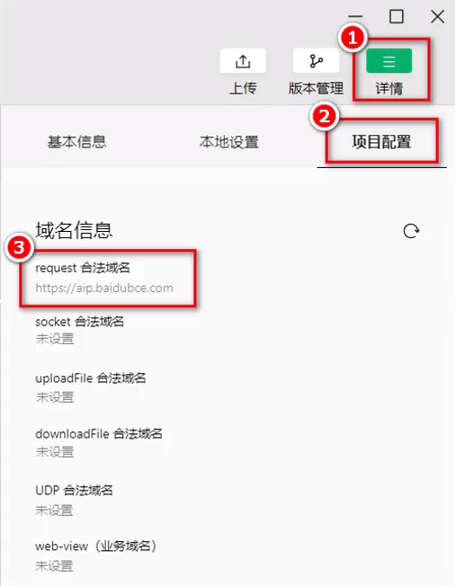


### 2 - 服务器域名配置流程

- 登陆微信小程序管理后台
- 开发 -> 开发设置 -> 服务器域名
- 开始配置

#### 2.1 - 配置注意事项

- 域名只支持 `https` 协议
- 域名不能使用 IP 地址（小程序的局域网IP 除外）或 localhost
- 端口配置可选
    - 配置端口 - 配置后只能向 <span style="color: #e3371e">指定端口</span> 发起请求
    - 不配置端口 - 请求的 URL 中不能包含端口
- 域名必须经过 ICP 备案
- **出于安全考虑，api.weixin.qq.com 不能被配置为服务器域名，相关 API 也不能在小程序内调用**
- 不支持配置父域名，使用子域名
- 服务器域名一个月内最多可申请 5 次修改


#### 2.2 - 发起 GET 请求

调用微信小程序提供的 <span style="color: #e3371e; font-weight: bold">wx.request()</span> 方法，可以发起 <span style="color: #0099dd">GET</span> 数据请求

```js
wx.request({
	// 请求的接口地址，必须基于 https 协议
	url: 'https://www.chuxiu.cpm/api/get',
	// 请求的方式
	method: 'GET',
	// 发送到服务器的数据
	data: {
		name: 'coco',
		age: 18
	},
	// 请求成功之后的回调函数
	success: (res) => {
		console.log(res)
	}
})
```


#### 2.3 - 发起 POST 请求

调用微信小程序提供的 <span style="color: #e3371e; font-weight: bold">wx.request()</span> 方法，可以发起 <span style="color: #0099dd">GET</span> 数据请求

```js
wx.request({
	// 请求的接口地址，必须基于 https 协议
	url: 'https://www.chuxiu.cpm/api/post',
	// 请求的方式
	method: 'POST',
	// 发送到服务器的数据
	data: {
		name: 'coco',
		age: 18
	},
	// 请求成功之后的回调函数
	success: (res) => {
		console.log(res.data)
	}
})
```


#### 2.4 - 在页面刚加载时请求数据

在页面的 <span style="color: #e3371e">onLoad</span> 事件中调用获取数据的函数

```js
  /**
   * 生命周期函数--监听页面加载
   */
  onLoad(options) {
    this.getRequest()
    this.postRequest()
  },
```


#### 2.5 - 跳过 request 合法域名校验

若 <span style="color: #e3371e">后端</span> 仅 <span style="color: #0099dd">提供了 http 协议的接口、暂时没提供 https 协议的接口</span> 

可在微信开发者工具，临时开启 <span style="color: #e3371e; font-weight: bold">开发环境不校验请求域名、TLS版本及 HTTPS 证书</span> 选项，跳过 request 合法域名的校验

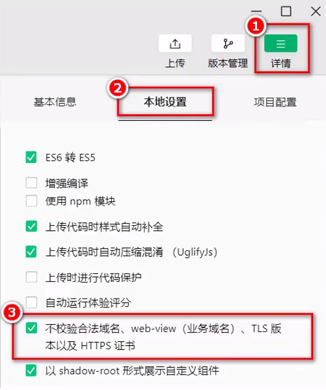

>  <span style="color: #49bf51">仅限</span> 在 <span style="color: #49bf51">开发与调试阶段</span> 使用


#### 2.6 - 关于跨域和 Ajax 的说明

**跨域** 

跨域问题 <span style="color: #e3371e">只存在于</span> 基于浏览器的 Web 开发中

由于 <span style="color: #e3371e">小程序的宿主环境</span> 不是浏览器，而是微信客户端，所以 <span style="color: #e3371e">小程序中不存在跨域的问题</span> 


**Ajax** 

Ajax 技术的核心是依赖于浏览器中的 XMLHttpRequest 对象，由于 <span style="color: #e3371e">小程序的宿主环境是微信客户端</span> ，所以小程序中 <span style="color: #e3371e">不能叫做</span> “发起 Ajax 请求”，而是叫做“ <span style="color: #e3371e">发起网络数据请求</span> ”


## 五、WXS 脚本

 <span style="color: #e3371e">WXS</span> （WeiXin Script）是 <span style="color: #0099dd">小程序的一套脚本语言</span> ，结合 `WXML`，可以构建出页面的结构


**应用场景** ： <span style="color: #e3371e">WXML 中无法调用在页面的 .js 中定义的函数</span> ，但 <span style="color: #0099dd; font-weight: bold">WXML 中可以调用 WXS 中定义的函数</span> ，因此，小程序中 WXS 的 <span style="color: #e3371e">典型应用场景</span> 就是 <span style="color: #e3371e">“过滤器”</span> 


### 1 - WXS 和 JavaScript 的关系

虽然 WXS 的语法类似于 JavaScript ，但 WXS 和 JavaScript 时完全不同的两种语言：

-  <span style="color: #e3371e">WXS 有自己的数据类型</span> 
    -  <span style="color: #0099dd">Number</span> 、 <span style="color: #0099dd">String</span> 、 <span style="color: #0099dd">Boolean</span> 、 <span style="color: #0099dd">Object</span> 
    -  <span style="color: #0099dd">Function</span> 、 <span style="color: #0099dd">Array</span> 、 <span style="color: #0099dd">Date</span> 、 <span style="color: #0099dd">Regexp</span> 
-  <span style="color: #e3371e">WXS 不支持类似于 ES6 及以上的语法形式</span> 
    -  <span style="color: #0099dd">支持</span>  - var 定义变量、普通 function 函数等类似于 ES5 的语法
    -  <span style="color: #0099dd">不支持</span>  - let、const、结构赋值、展开运算符、箭头函数、对象属性简写、etc
-  <span style="color: #e3371e">WXS 遵循 CommonJs 规范</span> 
    -  <span style="color: #0099dd">module</span> 对象
    -  <span style="color: #0099dd">require()</span> 函数
    -  <span style="color: #0099dd">module.exports</span> 对象


### 2 - WXS 的特点

为降低 WXS （ <span style="color: #e3371e">WeiXin Script</span> ）的学习成本，WXS 语言在设计时借鉴了大量  JavaScript 的语法

#### 2.1 - WXS 中的方法不能作为组件的事件回调

下面的用法是 <span style="color: #e3371e">错误</span> 的

```html
<button bindtap="m2.toLower">按钮</button>
```


#### 2.2 - 隔离性

 <span style="color: #e3371e">隔离性</span> 指 WXS 的运行环境和其他 JavaScript 代码是隔离的

- WXS 不能调用 JavaScript 中定义的函数
- WXS 不能调用 小程序 提供的 API


#### 2.3 - 性能好

- 在 <span style="color: #e3371e">iOS 设备</span> 上，小程序内的 <span style="color: #e3371e">WXS</span> 比 JavaScript  <span style="color: #0099dd">块 2~20 倍</span> 
- 在 <span style="color: #e3371e">Android 设备</span> 上，二者的运行效率 <span style="color: #0099dd">无差异</span> 


### 3 - 使用 WXS

#### 3.1 - 内嵌 WXS 脚本

WXS 代码可编写在 WXML 文件中的 `<wxs>` 标签内，与 JavaScript 类似


WXML 文件中的每个 `<wxs></wsx>` 标签， <span style="color: #e3371e">必须提供 module 属性</span> ，用来指定 <span style="color: #e3371e">当前 wxs 的模块名称</span> ，方便在 wxml 中访问模块中的成员

```html
<view>{{m1.toUpper(username)}}</view>

<wxs module="m1">
    module.exports.toUpper = function(str) {
    	return str.toUpperCase()
    }
</wxs>
```


#### 3.2 - 外联 WXS 脚本

WXS 代码还可编写在 <span style="color: #e3371e">以 .wxs 为后缀名的文件内</span> ，与 JavaScript 类似

```js
// tols.wxs
function toLower(str) {
    return str.toLowerCase()
}

module.exports = {
    // 小程序内不支持对象简写形式
    toLower: toLower
}
```


**使用外联 WXS 脚本** 

在 WXML 中引入外联的 WXS 脚本时， <span style="color: #e3371e">必须</span> 为 `<wxs>` 标签添加 <span style="color: #e3371e">module</span> 和 <span style="color: #e3371e">src</span> 属性

-  <span style="color: #e3371e">module</span>  - 用来指定 <span style="color: #0099dd">模块的名称</span> 
-  <span style="color: #e3371e">src</span>  - 用来指定要引入的 <span style="color: #0099dd">脚本的路径</span> ，且 <span style="color: #e3371e">必须是绝对路径</span> 

```html
<!-- 调用 m2 模块中的方法 -->
<view>{{m2.toLower(country)}}</view>
<!-- 引用外联的 WXS 脚本，并命名为 m2 -->
<wxs src="/utils/tools.wxs" module="m2"></wxs>
```


# 第三章、视图与逻辑

## 一、页面导航

 <span style="color: #e3371e; font-weight: bold">页面导航</span> 指 <span style="color: #e3371e">页面之间的相互跳转</span> 

例如，浏览器中实现页面导航的方式有如下两张

- `<a>` 链接
- `location.href` 


### 1 - 小程序中实现页面导航的两种方式

- **声明式导航** 
    - 在页面上 <span style="color: #0099dd">声明</span> 一个 `<navigator>` 导航组件
    - 通过 <span style="color: #0099dd">点击</span>  `<navigator>` 导航组件实现页面跳转
- **编程式导航** 
    -  <span style="color: #0099dd">调用</span> 小程序的 <span style="color: #e3371e">导航 API</span> ，实现页面的跳转

### 2 - 声明式导航

#### 2.1 - 导航到 tabBar 页面

使用 `<navigator>` 组件跳转到指定的  <span style="color: #ab04d9; font-weight: bold">tabBar 页面</span> ，需要指定 <span style="color: #e3371e">url</span> 属性和 <span style="color: #e3371e">open-type</span> 属性

-  <span style="color: #49bf51; font-weight: bold">url</span>  表示要跳转的 <span style="color: #e3371e">页面的地址</span> ，必须以  <span style="color: #0099dd">/</span>  开头
-  <span style="color: #49bf51; font-weight: bold">open-type</span>  表示 <span style="color: #e3371e">跳转的方式</span> ，必须为  <span style="color: #0099dd">switchTab</span> 

```html
<navigator url="/pages/index/index" open-type="switchTab">跳转到首页</navigator>
```


#### 2.2 - 导航到非 tabBar 页面

使用 `<navigator>` 组件跳转到指定的 <span style="color: #ab04d9; font-weight: bold">非 tabBar 页面</span> ，需要指定 <span style="color: #e3371e">url</span> 属性和 <span style="color: #e3371e">open-type</span> 属性

-  <span style="color: #49bf51; font-weight: bold">url</span>  表示要跳转的 <span style="color: #e3371e">页面的地址</span> ，必须以  <span style="color: #0099dd">/</span>  开头

-  <span style="color: #49bf51; font-weight: bold">open-type</span>  表示 <span style="color: #e3371e">跳转的方式</span> ，为  <span style="color: #0099dd">navigate</span> 

    > navigate <span style="color: #49bf51">可省略不写</span> ，因为 open-type 默认值为 <span style="color: #49bf51">navigate</span> 

```html
<navigator url="/pages/info/info" open-type="navigate"></navigator>
```


#### 2.3 - 后退导航

使用 `<navigator>` 组件 <span style="color: #e3371e">后退</span> 到 <span style="color: #ab04d9; font-weight: bold">上一页面或多级页面</span> ，，则需指定 <span style="color: #e3371e">open-type</span> 属性和 <span style="color: #e3371e">delta</span> 属性

-  <span style="color: #49bf51; font-weight: bold">delta</span>  表示 <span style="color: #e3371e">回退的层数</span> ， 默认为 1 ， <span style="color: #0099dd">Number</span> 类型

    > delta <span style="color: #49bf51">可省略不写</span> 

-  <span style="color: #49bf51; font-weight: bold">open-type</span>  表示 <span style="color: #e3371e">跳转的方式</span> ，为  <span style="color: #0099dd">navigateBack</span> 

> 只能在 <span style="color: #49bf51">非tabBar页面</span> 后退

```html
<navigator open-type="navigateBack">后退 1 页</navigator>
```


### 3 - 编程式导航

#### 3.1 - 导航到 tabBar 页面

调用 <span style="color: #e3371e">wx.switchTab( <span style="color: #000">Object object</span> )</span> 方法，可以跳转到  <span style="color: #ab04d9; font-weight: bold">tabBar 页面</span> 

其中 Object object 参数对象的属性列表如下

|                  属性                   |   类型   |                  必填                  |                        说明                        |
| :-------------------------------------: | :------: | :------------------------------------: | :------------------------------------------------: |
| <span style="color: #e3371e">url</span> |  string  | <span style="color: #e3371e">是</span> | 需要跳转的 tabBar 页面的路径<br />路径后不能带参数 |
|                 success                 | function |                   否                   |               接口调用成功的回调函数               |
|                  fail                   | function |                   否                   |               接口调用失败的回调函数               |
|                complete                 | function |                   否                   |  接口调用结束的回调函数（调用成功、失败都会执行）  |


```html
<button bindtap="navigateToIndex">跳转至首页 - 编程式</button>
```

```js
navigateToIndex() {
  wx.switchTab({
    url: '/pages/index/index',
  })
}
```


#### 3.2 - 导航到非 tabBar 页面

调用 <span style="color: #e3371e">wx.navigateTo( <span style="color: #000">Object object</span> )</span> 方法，可以跳转到  <span style="color: #ab04d9; font-weight: bold">非 tabBar 页面</span> 

其中 Object object 参数对象的属性列表如下（ <span style="color: #e3371e">与 wx.switchTab() 同</span> ）

|   属性   |   类型   | 必填 |                       说明                       |
| :------: | :------: | :--: | :----------------------------------------------: |
|   url    |  string  |  是  | 需要跳转的 非 tabBar 页面的路径 路径后不能带参数 |
| success  | function |  否  |              接口调用成功的回调函数              |
|   fail   | function |  否  |              接口调用失败的回调函数              |
| complete | function |  否  | 接口调用结束的回调函数（调用成功、失败都会执行） |


```html
<button bindtap="navigateToInfo">跳转到非 tabBar 页 - info</button>
```

```js
navigateToInfo() {
  wx.navigateTo({
    url: '/pages/info/info',
  })
}
```


#### 3.3 - 后退导航

调用 <span style="color: #e3371e">wx.navigateBack( <span style="color: #000">Object object</span> )</span> 方法，可以 <span style="color: #e3371e">返回</span> 到  <span style="color: #ab04d9; font-weight: bold">上一页面 或 多级页面</span> 

其中 Object object 参数对象的属性列表如下

|                   属性                    |   类型   |                默认值                 |                  必填                  |                       说明                       |
| :---------------------------------------: | :------: | :-----------------------------------: | :------------------------------------: | :----------------------------------------------: |
| <span style="color: #e3371e">delta</span> |  number  | <span style="color: #e3371e">1</span> | <span style="color: #e3371e">是</span> |  需要跳转的 tabBar 页面的路径 路径后不能带参数   |
|                  success                  | function |                                       |                   否                   |              接口调用成功的回调函数              |
|                   fail                    | function |                                       |                   否                   |              接口调用失败的回调函数              |
|                 complete                  | function |                                       |                   否                   | 接口调用结束的回调函数（调用成功、失败都会执行） |


```html
<button bindtap="navigateBackTo">后退 - 编程式</button>
```

```js
navigateBackTo() {
  wx.navigateBack()
}
```


## 二、导航传参

### 1 - 声明式导航传参

 <span style="color: #e3371e">navigator 组件</span> 的 <span style="color: #e3371e">url</span> 属性用来指定将要跳转到的页面路径。

同时， <span style="color: #e3371e; font-weight: bold">路径的后面还可携带参数</span> 

-  <span style="color: #e3371e">参数</span> 和 <span style="color: #e3371e">路径</span> 之间使用 <span style="color: #0099dd"> ? </span> 分隔
-  <span style="color: #e3371e">参数键</span> 与 <span style="color: #e3371e">参数值</span> 用 <span style="color: #0099dd"> = </span> 相连
-  <span style="color: #e3371e">不同参数</span> 用 <span style="color: #0099dd"> & </span> 分隔

```
<navigator url="/pages/info/info?name=coco&age=18">跳转到 info 页面</navigator>
```


### 2 - 编程时导航传参

调用 <span style="color: #e3371e">wx.navigateTo()</span> 方法跳转到页面时， <span style="color: #e3371e; font-weight: bold">路径的后面也可携带参数</span> 

-  <span style="color: #e3371e">参数</span> 和 <span style="color: #e3371e">路径</span> 之间使用 <span style="color: #0099dd"> ? </span> 分隔
-  <span style="color: #e3371e">参数键</span> 与 <span style="color: #e3371e">参数值</span> 用 <span style="color: #0099dd"> = </span> 相连
-  <span style="color: #e3371e">不同参数</span> 用 <span style="color: #0099dd"> & </span> 分隔

```js
gotoInfo() {
	wx.navigateTo({
		url: '/pages/info/info?name=coco%age=19'
	})
}
```


### 3 - 参数获取

调用页面路由带的参数可以在目标页面的`onLoad`中通过 <span style="color: #e3371e; font-weight: bold">形参</span> 获取

```js
data: {
  // 导航传来的参数对象
  query: {}
},

onLoad(options) {
  console.log(options)
  this.setData({
    query: options
  })
}
```


## 三、页面事件

### 1 - 下拉刷新事件

 <span style="color: #e3371e; font-weight: bold">下拉刷新</span> 是移动端的专有名词，指得是通过手指在屏幕上的下拉的滑动操作，从而 <span style="color: #e3371e">重新加载页面数据</span> 的行为

#### 1.1 - 启动下拉刷新事件

- 全局开启下拉刷新
    - 在 app.json 的 window 节点，将 enablePullDownRefresh 设置为 true
- **局部开启下拉刷新** 
    - 在页面的 .json 配置文件中，将 enablePullDownRefresh 设置为 true

> 实际开发中，推荐为 <span style="color: #49bf51">需要的页面单独开启下拉刷新的效果</span> 
>


#### 1.2 - 配置下拉刷新窗口的样式

|        属性         |   类型   | 默认值  |                     说明                     |
| :-----------------: | :------: | :-----: | :------------------------------------------: |
|   backgroundColor   | HexColor | #ffffff |             下拉刷新窗口的背景色             |
| backgroundTextStyle |  string  |  dark   | 下拉 loading 的样式，仅支持 `dark` / `light` |


#### 1.3 - 监听页面的下拉刷新事件

在页面的 .js 文件中，通过 <span style="color: #e3371e">onPullDownRefresh()</span> 函数即可监听当前页面的下拉刷新事件


#### 1.4 - 停止下拉刷新效果

当处理完下拉刷新后，下拉刷新的 loading 效果 <span style="color: #e3371e">不会主动消失</span> 

可调用 <span style="color: #e3371e">wx.stopPullDownRefresh()</span> 停止当前页面的下拉刷新

```js
onPullDownRefresh() {
  this.setData({
    count: 0
  })
  wx.stopPullDownRefresh()
}
```


### 2 - 上拉触底事件

 <span style="color: #e3371e; font-weight: bold">上拉触底</span> 是移动端的专有名词，通过手指在屏幕上的上拉滑动操作，从而 <span style="color: #e3371e">加载更多数据</span> 的行为


#### 2.1 - 配置上拉触底距离

 <span style="color: #e3371e">上拉触底距离</span> 指 <span style="color: #0099dd">触发上拉触底事件时，滚动条距离页面底部的距离</span> 

可在全局或页面的 .json 配置文件中，通过 <span style="color: #e3371e">onReachBottomDistance</span> 属性配置上拉触底的距离

小程序默认的触底距离是 50 px，实际开发中，可根据需求修改这个默认值


#### 2.1 - 监听页面的上拉触底事件

在页面的 .js 文件中，通过 <span style="color: #e3371e">onReachBottom()</span> 函数即可监听当前页面的上拉触底事件


## 四、生命周期

### 1 - 生命周期

 <span style="color: #e3371e; font-weight: bold">生命周期</span> （Life Cycle）指一个对象从 <span style="color: #e3371e">创建</span>  ->  <span style="color: #e3371e">运行</span>  ->  <span style="color: #e3371e">销毁</span> 的整个阶段， <span style="color: #0099dd">强调的是一个时间段</span> 


小程序中， <span style="color: teal; font-weight: bold">生命周期</span> 分为两类

-  <span style="color: #e3371e; font-weight: bold">应用生命周期</span> 
    - 特指 <span style="color: #49bf51; font-weight: bold">小程序</span> 从 <span style="color: #0099dd">启动</span>  ->  <span style="color: #0099dd">运行</span>  ->  <span style="color: #0099dd">销毁</span> 的过程
-  <span style="color: #e3371e; font-weight: bold">页面生命周期</span> 
    - 特指小程序中，每个 <span style="color: #49bf51; font-weight: bold">页面</span> 从 <span style="color: #0099dd">加载</span>  ->  <span style="color: #0099dd">渲染</span>  ->  <span style="color: #0099dd">销毁</span> 的过程

其中， <span style="color: #49bf51">页面</span> 的生命周期 <span style="color: #e3371e">范围较小</span> ， <span style="color: #49bf51">应用程序</span> 的生命周期 <span style="color: #e3371e">范围较大</span> 

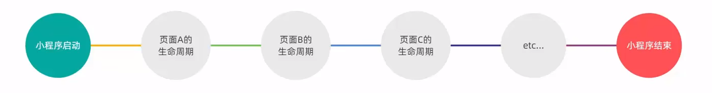


### 2 - 生命周期函数

 <span style="color: #e3371e; font-weight: bold">生命周期函数</span> 是由小程序框架提供的 <span style="color: #e3371e">内置函数</span> ，会伴随着生命周期， <span style="color: #e3371e">自动按次序执行</span> 


 <span style="color: #e3371e">生命周期函数的作用</span> ：允许程序员 <span style="color: #0099dd">在特定的时间点，执行某些特定的操作</span> 

>  <span style="color: #49bf51">生命周期</span> 强调的是 <span style="color: #49bf51">时间段</span> ； <span style="color: #49bf51">生命周期函数</span> 强调的是 <span style="color: #49bf51">时间点</span> 


小程序中， <span style="color: teal; font-weight: bold">生命周期函数</span> 分为两类

- <span style="color: #e3371e; font-weight: bold">应用生命周期</span> 
    - 特指 <span style="color: #49bf51; font-weight: bold">小程序</span> 从 <span style="color: #0099dd">启动</span>  ->  <span style="color: #0099dd">运行</span>  ->  <span style="color: #0099dd">销毁</span> 期间依次调用的那些 <span style="color: #ab04d9">函数</span> 
- <span style="color: #e3371e; font-weight: bold">页面生命周期</span> 
    - 特指小程序中，每个 <span style="color: #49bf51; font-weight: bold">页面</span> 从 <span style="color: #0099dd">加载</span>  ->  <span style="color: #0099dd">渲染</span>  ->  <span style="color: #0099dd">销毁</span> 期间依次调用的那些 <span style="color: #ab04d9">函数</span> 


### 3 - 应用的生命周期函数

小程序的 <span style="color: #49bf51; font-weight: bold">应用生命周期函数</span> 需要在 <span style="color: #e3371e">app.js</span> 中进行声明

```js
// app.js
App({
	// 小程序初始化完成时，执行此函数，全局只触发一次，可以做些初始化的工作
	onLaunch() {
	
	},
	// 小程序启动，或从后台进入前台显示时触发
	onShow() {
	
	},
	// 小程序从前台进入后台时触发
	onHide() {
	
	}
})
```


### 4 - 页面的生命周期函数

小程序的 <span style="color: #49bf51; font-weight: bold">页面生命周期函数</span> 需要在页面的 <span style="color: #e3371e">.js文件</span> 中进行声明

```js
// 页面的 .js 文件
Page({
    // 监听页面加载，一个页面只调用 1 次
    onLoad(options) {
        
    },
    // 监听页面显示
    onShow() {
        
    },
    // 监听页面初次渲染完成，一个页面只调用 1 次
    onReady() {
        
    },
    // 监听页面隐藏
    onHide() {
        
    },
    // 监听页面卸载，一个页面只调用 1 次
    onUnload() {
        
    }
})
```


### 5 - 组件的生命周期函数

 <span style="color: #49bf51; font-weight: bold">组件的生命周期</span> ，指的是组件自身的一些函数，这些函数在特殊的时间点或遇到一些特殊的框架事件时被自动触发

#### 5.1 - 组件全部的生命周期函数

小程序组件可用的全部生命周期函数

| 生命周期                                     | 参数           | 描述                                                         |
| :------------------------------------------- | :------------- | :----------------------------------------------------------- |
| <span style="color: #e3371e">created</span>  | 无             | 在 <span style="color: #0099dd">组件实例刚刚被创建时</span> 执行 |
| <span style="color: #e3371e">attached</span> | 无             | 在 <span style="color: #0099dd">组件实例进入页面节点树时</span> 执行 |
| ready                                        | 无             | 在组件在视图层布局完成后执行                                 |
| moved                                        | 无             | 在组件实例被移动到节点树另一个位置时执行                     |
| <span style="color: #e3371e">detached</span> | 无             | 在 <span style="color: #0099dd">组件实例被从页面节点树移除时</span> 执行 |
| error                                        | `Object Error` | 每当组件方法抛出错误时执行                                   |

#### 5.2 - 组件主要的生命周期函数

其中，最重要的生命周期是 `created` `attached` `detached` ，包含一个组件实例生命流程的最主要时间点

-  <span style="color: #0099dd">created</span>  - 组件实例刚刚被创建好时， `created` 生命周期被触发
    - 此时，组件数据 `this.data` 就是在 `Component` 构造器中定义的数据 `data` 
    - **此时还不能调用 setData **
    - 通常情况下，这个生命周期只应该用于给组件 `this` 添加一些自定义属性字段
-  <span style="color: #0099dd">attached</span>  - 在组件完全初始化完毕、进入页面节点树后， `attached` 生命周期被触发
    - 此时， `this.data` 已被初始化为组件的当前值
    - 这个生命周期很有用，绝大多数初始化工作可以在这个时机进行
-  <span style="color: #0099dd">detached</span>  - 在组件离开页面节点树后， `detached` 生命周期被触发
    - 退出一个页面时，如果组件还在页面节点树中，则 `detached` 会被触发
    - 此时，适合做些清理性质的工作


#### 5.3 - 定义组件生命周期函数

小程序中，组件的的生命周期也可以在 `lifetimes` 字段内进行声明（这是 <span style="color: #0099dd">推荐的方式</span> ，其 <span style="color: #0099dd">优先级最高</span> ）

也可以直接定义在 `Component` 构造器的第一级参数中（旧的定义方式）

```js
Component({
  lifetimes: {
    attached: function() {
      // 在组件实例进入页面节点树时执行
    },
    detached: function() {
      // 在组件实例被从页面节点树移除时执行
    },
  },
  // 以下是旧式的定义方式，可以保持对 <2.2.3 版本基础库的兼容
  attached: function() {
    // 在组件实例进入页面节点树时执行
  },
  detached: function() {
    // 在组件实例被从页面节点树移除时执行
  },
  // ...
})
```

> 在 <span style="color: #49bf51">behaviors</span> 中也可以编写生命周期方法，同时不会与其他 behaviors 中的同名生命周期相互覆盖


### 6 - 组件所在页面的生命周期

有时， <span style="color: #e3371e">自定义组件的行为依赖于页面状态的变化</span> ，此时，就需用到 <span style="color: #e3371e">组件所在页面的生命周期</span> 

在 **`pageLifetimes`** 定义段中定义

其中可用的生命周期包括

| 生命周期 | 参数          | 描述                                                         |
| :------- | :------------ | :----------------------------------------------------------- |
| show     | 无            | 组件所在的页面 <span style="color: #49bf51">被展示</span> 时执行 |
| hide     | 无            | 组件所在的页面 <span style="color: #49bf51">被隐藏</span> 时执行 |
| resize   | `Object Size` | 组件所在的页面 <span style="color: #49bf51">尺寸变化</span> 时执行 |


**示例代码**：

```js
Component({
  pageLifetimes: {
    show: function() {
      // 页面被展示
    },
    hide: function() {
      // 页面被隐藏
    },
    resize: function(size) {
      // 页面尺寸变化
    }
  }
})
```


# 第四章、自定义组件

## 一、组件的创建与引用

### 1 - 创建组件

- 在项目的根目录中，创建 <span style="color: #e3371e">components</span> -> <span style="color: #e3371e">test</span> 文件夹
- 在 <span style="color: #e3371e">test</span> 文件夹，点击“ <span style="color: #e3371e">新建 Component</span> ”
- 输入组件名回车，会 <span style="color: #e3371e">自动生成</span> 组件对应的 4 个文件，一个自定义组件由 `json` `wxml` `wxss` `js` 4个文件组成

> 为保证目录结构的清晰，可把不同的组件，存放到单独的目录中

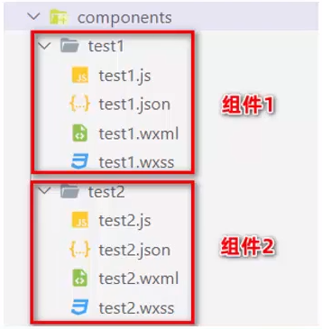


### 2 - 编写组件

- 要编写一个自定义组件，首先需要在 `json` 文件中进行自定义组件声明（将 `component` 字段设为 `true` 可将这一组文件设为自定义组件）

    - 自动生成组件时，默认为 true 

    ```json
    {
      "component": true
    }
    ```

- 同时，还要在 `wxml` 文件中编写组件模板，在 `wxss` 文件中加入组件样式

    - > **在组件 wxss 中不应使用 ID 选择器、属性选择器和标签名选择器**

- 在自定义组件的 `js` 文件中，需要使用 `Component()` 来注册组件，并提供组件的属性定义、内部数据和自定义方法

    - 组件的属性值和内部数据将被用于组件 `wxml` 的渲染，其中，属性值是可由组件外部传入的

        ```js
        Component({
          properties: {
            // 这里定义了 innerText 属性，属性值可以在组件使用时指定
            innerText: {
              type: String,
              value: 'default value',
            }
          },
          data: {
            // 这里是一些组件内部数据
            someData: {}
          },
          methods: {
            // 这里是一个自定义方法
            customMethod: function(){}
          }
        })
        ```

        

### 3 - 引用组件

组件的引用方式分为“ <span style="color: #e3371e">局部引用</span> ”和“ <span style="color: #e3371e">全局引用</span> ”

-  <span style="color: #e3371e">局部引用</span>  - 组件只能在当前被引用的页面内使用
-  <span style="color: #e3371e">局部引用</span>  - 组件可以在每个小程序页面中使用


#### 3.1 - 局部引用

在页面的 .json 配置文件中引用组件的方式

```js
// 页面的 .json 文件中
{
    "usingComponents": {
        "my-test": "/components/test/test"
    }
}
```

```html
<!-- 页面的 .wxml 文件中 -->
<my-test></my-test>
```


#### 3.2 - 全局引用

在 app.json 全局配置文件中引用组件的方式

```js
// 页面的 .json 文件中
{
    "pages": [],
	"window": {}
    "usingComponents": {
        "my-test2": "/components/test2/test2"
    }
}
```

```html
<!-- 页面的 .wxml 文件中 -->
<my-test2></my-test2>
```


#### 3.3 - 全局引用 vs 局部引用

根据组件的 <span style="color: #e3371e">使用频率</span> 和 <span style="color: #e3371e">范围</span> ，选择合适的使用方式

- 某组件在 <span style="color: #e3371e">多个页面中经常被用到</span> ，建议进行” <span style="color: #0099dd">全局引用</span> “
- 某组件 <span style="color: #e3371e">只</span> 在 <span style="color: #e3371e">特定的页面中被用到</span> ，建议进行” <span style="color: #0099dd">局部引用</span> “


### 4 - 组件和页面的区别

组件和页面的 <span style="color: #0099dd">.js</span> 与 <span style="color: #0099dd">.json</span> 文件有明显的不同：

- 组件的 <span style="color: #0099dd">.json</span> 文件需要声明 <span style="color: #e3371e">"component": true</span> 属性
- 组件的 <span style="color: #0099dd">.js</span> 文件中调用的是 <span style="color: #e3371e">Component()</span> 函数
- 组件的事件处理函数需要定义到 <span style="color: #e3371e">methods</span> 节点中


## 二、组件的样式

### 1 - 组件样式隔离

默认情况下，自定义组件的样式只对当前组件生效，不会影响到组件之外的 UI 结构

- 组件 A 的样式 <span style="color: #e3371e">不会影响</span> 组件 C 的样式
- 组件 A 的样式 <span style="color: #e3371e">不会影响</span> 小程序页面 的样式
- 小程序页面 的样式 <span style="color: #e3371e">不会影响</span> 组件 A 和 C 的样式

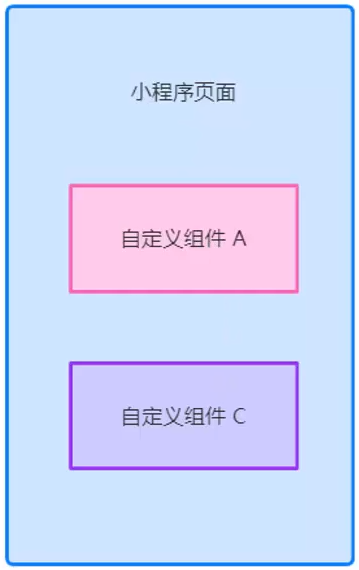


> 防止外界样式影响组件内部的样式
>
> 防止组件的样式影响外界的样式

#### 1.1 - 组件样式隔离的注意点

-  <span style="color: #0099dd">app.wxss</span> 中的全局样式对组件 <span style="color: #e3371e">无效</span> 
    - 除非
        - `app.wxss` 或页面的 `wxss` 中使用了 <span style="color: #0099dd">标签名选择器</span> （或一些其他特殊选择器）来直接指定样式
        - 指定特殊的样式隔离选项 `styleIsolation`
- 只有 <span style="color: #0099dd">class 选择器</span> 会有样式隔离效果，id 选择器、属性选择器、标签选择器不受样式隔离的影响


#### 1.2 - 修改组件的样式隔离选项

默认情况下，自定义组件的 <span style="color: #e3371e">样式隔离特性</span> 能够 <span style="color: #e3371e">防止组件内外样式互相干扰的问题</span> 

但有时，希望外界能够控制组件内部的样式，此时，可通过 <span style="color: #0099dd">styleIsolation</span> 修改组件的样式隔离选项

```js
// 在组件的 .js 文件中新增如下配置
Component({
  options: {
    styleIsolation: 'isolated'
  }
})

// 或在组件的 .json 文件中新增如下配置
{
    "styleIsolation": "isolated"
}
```


**styleIsolation 的可选值** 

|                   可选值                   |                 默认值                 |                             说明                             |
| :----------------------------------------: | :------------------------------------: | :----------------------------------------------------------: |
|                  isolated                  | <span style="color: #e3371e">是</span> | 表示 <span style="color: #e3371e">启用样式隔离</span>，在自定义组件内外，使用 class 指定的样式将 <span style="color: #e3371e">不会相互影响</span> |
|                apply-shared                |                   否                   | 表示 <span style="color: #e3371e">页面 wxss 样式将影响到自定义组件</span> ，但自定义组件 wxss 中<br />指定的样式不会影响到页面 |
| <span style="color: #e3371e">shared</span> |                   否                   | 表示 <span style="color: #e3371e">页面 wxss 样式将影响到自定义组件</span> ，自定义组件wxss 中<br />指定的样式会影响到页面和其他设置了 apply-shared 或 shared 的自定义组件 |

> apply-shared - 单向影响
>
> shared - 双向影响


## 三、组件的数据、方法和属性

### 1 - data 数据

自定义组件中， <span style="color: #e3371e">用于组件模版渲染</span> 的 <span style="color: #e3371e">私有数据</span> ，需要定义到 <span style="color: #e3371e">data 节点</span> 中

```js
Component({
    // 组件的初始数据
    data: {
        count: 0
    }
})
```


### 2 - methods 方法

自定义组件中， <span style="color: #e3371e">事件处理函数</span> 和 <span style="color: #e3371e">自定义方法</span> ，需要定义到 <span style="color: #e3371e">methods 节点</span> 中

```js
Component({
	// 组件的方法列表 【包含事件处理函数和自定义方法】
	methods:{
        // 事件处理函数
		addCount() {
			this.setData({
				count: this.data.count + 1
			})
            // 通过 this 直接调用自定义方法
			this._showCount()
		},
        // 自定义方法以 _ 开头
		_showCount() {
			wx.showToast({
				title: `count 的值为 ${this.data.count}`,
				icon: 'none'
			})
		}
	}
})
```

> 自定义方法可通过 <span style="color: #49bf51"> _标识符</span> 与事件处理函数区分


### 3 - properties 属性

自定义组件中， properties 是组件的对外属性， <span style="color: #e3371e">用来接受外界传递到组件的数据</span> 

```js
Component({
	// 属性定义
    properties: {
        // 完整定义属性的方式【当需要指定属性默认值时，建议使用此方式】
        max: {
            type: Number,
            value: 10
        },
        // 简化定义属性的方式【不需指定属性默认值时，可以使用简化方式】
        max: Number
    }
})
```

```html
<my-test></my-test>
```


### 4 - data 和 properties 的区别

小程序中，properties 属性 和 data 数据 的用法相同，它们都是 <span style="color: #e3371e">可读可写</span> 的

- data 更倾向于 <span style="color: #0099dd">存储组件的私有数据</span> 
- properties 更倾向于 <span style="color: #0099dd">存储外界传递到组件中的数据</span> 

```js
properties: {max: Number},

data: {
    count: 0
},
  
methods: {
	showInfo() {
      console.log(this.data)			// => {count: 0, max: 9}
      console.log(this.properties)		// => {count: 0, max: 9}
	  console.log(this.data === this.properties)	// => true
    }
}  
```

>  <span style="color: #49bf51">Vue</span> 中 <span style="color: #49bf51">props</span>  <span style="color: #ab04d9">仅可读</span> 


### 5 - 使用 setData() 修改 properties 的值

由于 data 数据 properties 属性 在本质上无任何区别，因此 properties 属性的值也可用于页面渲染

或使用 setData() 修改 properties 的值

```html
<view>max 的值是 {{max}}</view>
<button bindtap="addMax">add max</button>
```

```js
Component({
	properties: {
		max: Number
	},
	methods: {
		addMax() {
  			this.setData({
		    	max: this.properties.max + 1
		  })
		},
	}
})
```


## 四、数据监听器

 <span style="color: #e3371e; font-weight: bold">数据监听器</span> 可以用于 <span style="color: #e3371e">监听</span> 和 <span style="color: #e3371e">响应</span> 任何 <span style="color: #0099dd">属性和数据字段的变化</span> ， <span style="color: #e3371e">从而执行特定的操作</span> 

作用类似于 vue 中的 watch 侦听器

**语法格式**：

```js
Component({
	observers: {
		'字段A, 字段B': function(字段A的新值, 字段B的新值) {
			// do something
		}
	}
})
```

### 1 - 数据监听器的基本用法

```html
<view>{{num1}} + {{num2}} = {{sum}}</view>
<button type="primary" size="mini" bindtap="addNum1">num1 + 1</button>
<button type="primary" size="mini" bindtap="addNum2">num2 + 2</button>
```

```js
Component({
    data: { num1: 0, num2: 0, sum: 0},
    
    methods: {
  	  addNum1() {
  	    this.setData({
  	      num1: this.data.num1 + 1
  	    })
  	  },
	
  	  addNum2() {
  	    this.setData({
  	      num2: this.data.num2 + 1
  	    })
  	  }
  	},
    
    observers: {
		'num1, num2': function(num1, num2) {
			this.setData({
      			sum: num1 + num2
    		})
  		}
	}
})
```


### 2 - 监听对象属性的变化

数据监听器支持监听 <span style="color: #e3371e">对象</span> 中 <span style="color: #e3371e">单个</span> 或 <span style="color: #e3371e">多个属性</span> 的变化

**语法格式**：

```js
Component({
	observer: {
		'对象.属性A, 对象.属性B': function(属性A的新值, 属性B的新值) {
			// do something
		}
	}
})
```

触发情况

- 为 属性A 赋值 - 使用 setData() 设置 this.data.对象.属性A 时触发
- 为 属性B 赋值 - 使用 setData() 设置 this.data.对象.属性B 时触发
- 为 对象 赋值 - 使用 setData() 设置 this.data.对象 时触发


### 3 - 监听对象中所有属性的变化

如果需要监听 <span style="color: #e3371e">所有子数据字段的变化</span> ，可以使用通配符 `**`

**语法格式**：

```js
Component({
	observer: {
		'对象.***': function(对象) {
			// do something
		}
	}
})
```


特别地，仅使用通配符 `**` 可以监听全部 setData

```js
Component({
  observers: {
    '**': function() {
      // 每次 setData 都触发
    },
  },
})
```


## 五、纯数据字段

 <span style="color: #e3371e; font-weight: bold">纯数据字段</span> 是一些 <span style="color: #e3371e">不用于界面渲染的 data 字段</span> ，可以用于提升页面更新性能

**应用场景** - 既不会展示在界面上，也不会传递给其他组件，仅仅在当前组件内部使用，此时，可以指定这样的数据字段为“纯数据字段”

> 仅仅被记录在 `this.data` 中，而不参与任何界面渲染过程，这样有助于提升页面更新性能


### 1 - 指定“纯数据字段”的方法

在 `Component` 构造器的 `options` 定义段中指定 `pureDataPattern` 为一个正则表达式，字段名符合这个正则表达式的字段将成为纯数据字段

```js
Component({
	options: {
        // 指定所有 _ 开头的数据字段为纯数据字段
        pureDataPattern: /^_/
    }
    data: {
    	a: true,	// 普通数据字段
    	_b: true,	// 纯数据字段
	}
	methods: {
    	myMethod() {
    	  this.data._b // 纯数据字段可以在 this.data 中获取
    	  this.setData({
    	    c: true, // 普通数据字段
    	    _d: true, // 纯数据字段
    	  })
    	}
  }
})
```


## 六、插槽

在自定义组件的 wxml 结构中，可以提供一个 `<slot>` 节点（插槽）， <span style="color: #e3371e">用来承载组件使用者提供的 wxml 结构</span> 

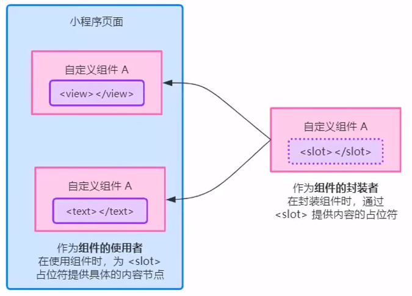

### 1 - 单个插槽

小程序中，默认每个自定义组件只允许使用一个 `<slot>` 进行占位

默认情况下，一个组件的 wxml 中只能有一个 slot 。需要使用多个 slot 时，可以在组件 js 中声明启用

```html
<!-- 组件的封装者 -->
<view class="wrapper">
  <view>这是组件的内部节点</view>
  <!-- 对于不确定的内容，可使用 <slot> 占位 -->
  <slot></slot>
</view>

<!-- 组件的使用者 -->
<component-tag-name>
  <!-- 这部分内容将被放置在组件 <slot> 的位置上 -->
  <view>这是插入到组件 slot 中的内容</view>
</component-tag-name>
```


### 2 - 多个插槽

小程序中，需要使用多个 slot 时，可以在组件 js 中声明启用

在 `options` 节点，通过 `multipleSlots： true` 启用多 slot 支持  

```js
Component({
  options: {
    multipleSlots: true // 在组件定义时的选项中启用多 slot 支持
  },
  properties: { /* ... */ },
  methods: { /* ... */ }
})
```

#### 2.1 - 多个插槽的使用

**定义多插槽**：

此时，可以在这个组件的 wxml 中使用多个 slot ，以不同的 `name` 来区分

```html
<!-- 组件模板 -->
<view class="wrapper">
  <slot name="before"></slot>
  <view>这里是组件的内部细节</view>
  <slot name="after"></slot>
</view>
```


**使用多插槽**：

使用时，用 `slot` 属性来将节点插入到不同的 slot 上

```html
<!-- 引用组件的页面模板 -->
<view>
  <component-tag-name>
    <!-- 这部分内容将被放置在组件 <slot name="before"> 的位置上 -->
    <view slot="before">这里是插入到组件slot name="before"中的内容</view>
    <!-- 这部分内容将被放置在组件 <slot name="after"> 的位置上 -->
    <view slot="after">这里是插入到组件slot name="after"中的内容</view>
  </component-tag-name>
</view>
```


## 七、组件间通信

### 1 - 父子组件之间通信的 3 种方式

- 属性绑定
    - 父 -> 子，仅能设置 JSON 兼容的数据
- 事件绑定
    - 子 -> 父，可以传递任意数据
- 获取组件实例
    - 父组件可通过  <span style="color: #e3371e">this.selectComponent()</span>  获取子组件实例对象
    - 这样就可以直接访问子组件的任意数据和方法


### 2 - 属性绑定

 <span style="color: #e3371e">属性绑定</span> 用于实现 <span style="color: #e3371e">父向子传值</span> ，而且 <span style="color: #e3371e">只能传递普通类型的数据</span> ，无法将方法传递给子组件


**父组件**在 <span style="color: #e3371e">子组件标签</span> 通过 <span style="color: #0099dd">属性绑定</span> ，向子组件的属性传递动态数据

```vue
// 父组件的 wxml 结构
<my-test count="{{count}}"></my-test>
<view> ~~~~~~ </view>
<view>父组件中，count的值为: {{count}}</view>

// 父组件的 data 节点
data: {
	count: 0
}

```


**子组件**在 <span style="color: #e3371e">properties</span> 节点中 <span style="color: #0099dd">声明对应的属性并使用</span> 

```vue
// 子组件的 wxml 结构
<text>子组件中，count值为：{{count}}</text>

// 子组件的 properties 节点
properties: {
	count: Number
}
```


### 3 - 事件绑定

 <span style="color: #e3371e">事件绑定</span> 用于实现 <span style="color: #e3371e">子 -> 父</span> 传值，可以传递 <span style="color: #e3371e">任何类型的数据</span>

**实现步骤**：

- 在 <span style="color: #e3371e; font-weight: bold">父组件</span> 的 .js 中 - 定义一个函数，这个函数 <span style="color: #e3371e">即将</span> 通过自定义事件的形式，传递给子组件

    ```js
    // 父组件.js
    // 将来，这个方法会被传递给子组件，供子组件进行调用
    syncCount(e) {
      e.detail // 自定义组件触发事件时提供的 detail 对象
    },
    ```

- 在 <span style="color: #e3371e; font-weight: bold">父组件</span> 的 wxml 中 - 通过 <span style="color: #e3371e">自定义事件</span> 的形式，将步骤 1 定义的函数引用，传递给子组件

    ```html
    <!-- 使用 bind:自定义事件名称（推荐，结构清晰） -->
    <my-test count="{{count}}" bind:sync="syncCount"></my-test>
    <!-- 使用 bind自定义事件名称-->
    <my-test count="{{count}}" bindsync="syncCount"></my-test>
    ```

- 在 <span style="color: #0099dd; font-weight: bold">子组件</span> 的 .js 中 - 通过调用 <span style="color: #e3371e">this.triggerEvent('<span style="color: #0099dd">自定义事件名称</span>', {/* <span style="color: #0099dd">参数对象</span> */})</span> ，将数据发送到父组件

    ```html
    <!-- 子组件的 wxml 结构 -->
    <view>子组件中，count的值为：{{count}}</view>
    <button type="primary" bindtap="addCount">+ 1</button>
    ```

    ```js
    // 子组件的 js 代码
    methods: {
      addCount() {
        this.setData({
          count: this.properties.count + 1
        })
        this.triggerEvent('sync', {value: this.properties.count})
      },
    }
    ```

- 在 <span style="color: #e3371e; font-weight: bold">父组件</span> 的 .js 中 - 通过 <span style="color: #e3371e">e.detail</span> 获取到子组件传递过来的数据

    ```js
    syncCount(e) {
      // console.log('syncCount')
      this.setData({
        count: e.detail.value
      })
    },
    ```

    

### 4 - 获取组件实例

可在父组件里调用 <span style="color: #e3371e">this.selectComponent(' <span style="color: #0099dd">选择器（id或class)</span> ')</span> ，获取子组件的实例对象，从而直接访问子组件的任意数据和方法

```html
<!-- 父组件 wxml 结构 -->
<my-test count="{{count}}" bind:sync="syncCount" class="customA" id="cA"></my-test>
<button bindtap="getChild">获取子组件实例</button>
```

```js
// 父组件的 js 文件
getChild() {
    const child = this.selectComponent('.customA')
    // 调用子组件的 setData()
    child.setData({
        count: child.properties.count + 1
    })
    // 调用子组件的 addCount()
    child.addCount()
}
```


## 八、behaviors

 <span style="color: #e3371e; font-weight: bold">behaviors</span> 是小程序中， <span style="color: #e3371e">用于实现组件间代码共享</span> 的特性，类似于 Vue.js 中的“mixins”

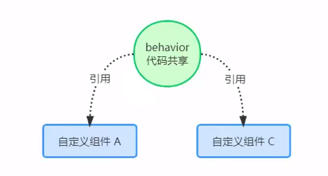

### 1 - behaviors 的工作方式

每个 `behavio` 可以包含一组 <span style="color: #0099dd">属性、数据、生命周期函数和方法</span> 

**组件 <span style="color: #49bf51">引用</span>  `behavior` 时，它的属性、数据和方法 <span style="color: #e3371e">会被合并到组件中</span> ，生命周期函数也会在对应时机被调用** 

- 每个组件可以引用多个 behavior
- behavior 也可相互引用


### 2 - 创建 behavior

调用 <span style="color: #e3371e">Behavior( <span style="color: #000">Object object</span> )</span> 方法，即可创建一个 <span style="color: #e3371e">共享的 behavior 实例对象</span> ，供所有的组件使用 

**示例代码**：

在 <span style="color: #e3371e">项目根目录</span> 新建  <span style="color: #e3371e">behaviors 文件夹</span> ，新建  <span style="color: #e3371e">my-behavior.js 文件</span> 

```js
// my-behavior.js

module.exports = Behavior({
    // 属性节点
    properties: {},
    // data 节点
    data: {
    	username: 'coco'
	},
    // methods 节点
    methods: {},
    // lifetime 节点
    lifetime: {}
})
```


### 3 - 导入并使用 behavior

在组件中，使用 <span style="color: #e3371e">require()</span> 方法导入需要的 behavior， <span style="color: #e3371e">挂载后即可访问 behavior 中的数据与方法</span> 

```js
// my-component.js

// 使用 require() 导入需要的自定义 behavior 模块
const myBehavior = require('../../behaviors/my-behavior')

Component({
    // 将导入的 behavior 实例对象，挂载到 behaviors 数据节点中，即可生效
    behaviors: [myBehavior],
    // 组件其他节点……
})
```

**组件中使用**：

```html
<!-- my-component.wxml -->

<!-- 输出 coco -->
<view>在 behavior 中定义的 username 是：{{username}}</view>
```


### 4 - behavior 中可用的节点

| 定义段                                         | 类型         | 是否必填 | 描述                  |
| :--------------------------------------------- | :----------- | :------- | :-------------------- |
| <span style="color: #e3371e">properties</span> | Object Map   | 否       | 同组件的属性          |
| <span style="color: #e3371e">data</span>       | Object       | 否       | 同组件的数据          |
| <span style="color: #e3371e">methods</span>    | Object       | 否       | 同自定义组件的方法    |
| <span style="color: #e3371e">behaviors</span>  | String Array | 否       | 引入其它的 `behavior` |
| created                                        | Function     | 否       | 生命周期函数          |
| attached                                       | Function     | 否       | 生命周期函数          |
| ready                                          | Function     | 否       | 生命周期函数          |
| moved                                          | Function     | 否       | 生命周期函数          |
| detached                                       | Function     | 否       | 生命周期函数          |


### 5 - 同名字段的覆盖和组合规则

组件和它引用的 `behavior` 中 <span style="color: #0099dd">可以包含同名的字段</span> ，对这些字段的处理方法如下

- 同名的 <span style="color: #e3371e">数据字段</span> （ <span style="color: #0099dd">data</span> ）
    - 若同名的数据字段都是对象类型，会进行对象合并
    - 其余情况会进行按 <span style="color: #49bf51">优先级</span> 数据覆盖
        - `组件` > `引用者 behavior` > `被引用的 behavior` 、 `靠后的 behavior` > `靠前的 behavior`
- 同名的 <span style="color: #e3371e">属性和方法</span> （ <span style="color: #0099dd">properties</span> 和 <span style="color: #0099dd">methods</span> ）
    - 组件本身有，则覆盖 `behavior` 中的同名属性或方法
    - 组件本身无，则在组件的 `behaviors` 字段中定义靠后的 `behavior` 的属性或方法会覆盖靠前的同名属性或方法
    - 在 2 的基础上，若存在嵌套引用 `behavior` 的情况，则规则为：`引用者 behavior` 覆盖 `被引用的 behavior` 中的同名属性或方法
- 同名的 <span style="color: #e3371e">生命周期函数</span> 
    - `behavior` 优先于组件执行
    - `被引用的 behavior` 优先于 `引用者 behavior` 执行
    - `靠前的 behavior` 优先于 `靠后的 behavior` 执行


# 第五章、npm 包

## 一、使用 npm 包

### 1 - 小程序对 npm的支持和限制

目前，小程序中已经支持使用 npm 安装第三方包，从而提高小程序的开发效率

但是，小程序中使用 npm 包有如下 <span style="color: #e3371e">3 个限制</span> ：

- 不支持依赖于 <span style="color: #e3371e">Node.js 内置库</span> 的包
- 不支持依赖于 <span style="color: #e3371e">浏览器 内置对象</span> 的包
- 不支持依赖于 <span style="color: #e3371e">C++ 插件</span> 的包

> 能供小程序使用的包 <span style="color: #49bf51">为数不多</span> 


## 二、Vant Weapp UI组件库

Vant Weapp 是有赞前端团队开源的一套 <span style="color: #e3371e">小程序 UI 组件库</span> ，助力开发者快速搭建小程序应用

使用 <span style="color: #e3371e">MIT 开源许可协议</span> ，对商业使用比较友好


[**官方文档地址**](https://vant-contrib.gitee.io/vant-weapp/)


### 1 - 安装 vant 组件库

- 初始化

    ```bash
    $ npn init -y
    ```

- 通过 npm 安装

    ```bash
    # 在小程序 package.json 所在的目录中执行命令
    $ npm i @vant/weapp -S --production
    ```

- 修改 app.json

    - 将 app.json 中的 `"style": "v2"` 去除

- 修改 project.config.json

    ```json
    {
      ...
      "setting": {
        ...
        "packNpmManually": true,
        "packNpmRelationList": [
          {
            "packageJsonPath": "./package.json",
            "miniprogramNpmDistDir": "./"
          }
        ]
      }
    }
    ```

- 构建 npm 包

    - 点击开发者工具中的菜单栏：工具 --> 构建 npm


### 2 - 使用 Vant 组件

安装完 Vant 组件库之后，可在 <span style="color: #e3371e">app.json</span> 的 <span style="color: #e3371e">usingComponents</span> 节点中引入需要的组件，即可在 wxml 中直接使用组件

**示例代码**：

```json
// app.json

"usingComponents": {
    "van-button": "@vant/weapp/button/index"
}
```

```html
<!-- 页面的 wxml 结构 -->
<van-button type="primary">按钮</van-button>
```


### 3 - 定制全局主题样式

Vant Weapp 使用 <span style="color: #e3371e">[**CSS 变量**](https://developer.mozilla.org/zh-CN/docs/web/CSS/Using_CSS_custom_properties)</span> 来实现定制主题样式

#### 3.1 - CSS 变量

**基本用法**：

- 声明一个自定义属性，属性名需要以两个减号（`--`）开始

```css
element {
  --main-bg-color: brown;
}

/* 定义在根伪类 :root 下 ，全局访问 */

:root {
  --main-bg-color: brown;
}

html {
  --main-bg-color: brown;
}
```

- 使用一个局部变量时用 [`var()`](https://developer.mozilla.org/zh-CN/docs/Web/CSS/var) 函数包裹以表示一个合法的属性值
    - 用 [`var()`](https://developer.mozilla.org/zh-CN/docs/Web/CSS/var) 函数可以定义多个**备用值**(fallback value)
        - 第一个参数是[自定义属性](https://www.w3.org/TR/css-variables/#custom-property)的名称
        - 如果提供了第二个参数，则表示备用值

```css
element {
	background-color: var(--main-bg-color);
}

/* 定义备用值 */
.two {
  color: var(--my-var, red); /* Red if --my-var is not defined */
}
```


#### 3.2 - 定制 Vant 的全局主题样式

在 <span style="color: #e3371e">app.wxss</span> 中，写入 CSS 变量，即可对全局生效

[**所有可用的颜色变量**](https://github.com/youzan/vant-weapp/blob/dev/packages/common/style/var.less) 

**示例代码**：

```css
/* app.wxss */
page {
	/* 定制警告按钮的背景色和边框色 */
	--button-danger-background-color: #C00000;
	--button-danger-border-color: #D60000;
}
```


## 三、API Promise 化

### 1 - 基于回调函数的异步 API 的缺点

默认情况下，小程序官方提供的 <span style="color: #e3371e">异步 API</span> 都是 <span style="color: #e3371e">基于回调函数</span> 实现的

```js
wx.request({
	method: '',
    url: '',
    data: {},
    success: () => {},
    fail: () => {},
    complete: () =< {}
})
```

**缺点**：容易造成 <span style="color: #0099dd">回调地狱</span> 的问题，代码的 <span style="color: #0099dd">可读性、维护性</span> 差！


### 2 - 什么是 API Promise 化

 <span style="color: #e3371e; font-weight: bold">API Promise 化</span> ，值 <span style="color: #e3371e">通过额外的配置</span> ，将官方提供的、基于回调函数的异步 API， <span style="color: #e3371e">升级改造为</span>  <span style="color: #0099dd">基于 Promise </span> 的异步 API，从而提高代码的 <span style="color: #49bf51">可读性、维护性</span> ， <span style="color: #49bf51">避免回调地狱</span> 的问题


### 3 - 实现 API Promise 化

小程序中，实现 API Promise 化主要依赖于 <span style="color: #e3371e">miniprogram-api-promise</span> 这个第三方得到 npm 包

**安装使用步骤**：

- 安装

    ```bash
    $ npm install --save miniprogram-api-promise
    ```

- 构建 npm

- 在小程序入口文件 <span style="color: #e3371e">app.js</span> 中，只需调用一次 <span style="color: #e3371e">promisifyAll()</span> 方法，即可实现异步 API 的 Promise 化

    ```js
    // app.js
    
    import { promisifyAll } from 'miniprogram-api-promise'
    
    const wxp = wx.p = {}
    // promisify all wx's apo
    promisifyAll(wx, wxp)
    ```


### 4 - 调用 Promise 化之后的异步 API

**示例代码**：

```html
<!-- 页面的 wxml 结构 -->
<vant-button type="danger" bindtap="getInfo">vant 按钮</vant-button>
```

```js
// 页面的 js 文件，定义对应的 tap 事件处理函数
async getInfo() {
    const { data: res } = await wx.p.request({
        method: 'GET',
        url: 'https://www.escook.cn/api/get',
        data: { name: 'coco', age: 20}
    })
    
    console.log(res)
}
```


# 第六章、全局数据共享

## 一、全局数据共享

 <span style="color: #e3371e; font-weight: bold">全局数据共享</span> （又称：状态管理）是为了解决 <span style="color: #e3371e">组件之间数据共享</span> 的问题

开发者常用的全局数据共享方案有：Vuex、Redux、Mobx 等

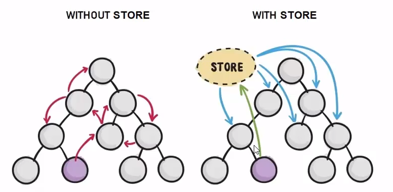

### 1 - 小程序中的全局数据共享方案

小程序中，可使用 <span style="color: #e3371e">mobx-miniprogram</span> 配合 <span style="color: #e3371e">mobx-miniprogram-bindings</span> 实现全局数据共享

-  <span style="color: #0099dd">mobx-miniprogram</span>  - 用来 <span style="color: #49bf51">创建 Store 实例对象</span> 
-  <span style="color: #0099dd">mobx-miniprogram-bindings</span>  - 用来 <span style="color: #49bf51">把 Store 中的共享数据或方法，绑定到组件或页面中使用</span> 

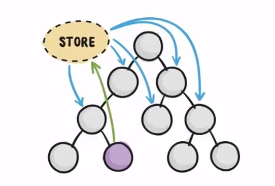


### 2 - MobX

#### 2.1 - 安装 Mobx 相关的包

- 在项目中运行如下命令，安装 MobX 相关的包

```bash
$ npm i --save mobx-miniprogram mobx-miniprogram-bindings
```

- 构建 npm


#### 2.2 - 创建 MobX 的 Store 实例

在 <span style="color: #e3371e">项目根目录</span> 新建 <span style="color: #e3371e">store 文件夹</span> ，并在文件夹中新建 <span style="color: #e3371e">store.js 文件</span> 

在 store.js 中专门创建 Store 的实例对象

```js
import { action, observable } from "mobx-miniprogram";

export const store = observable({
  // 挂载需要共享的数据字段
  // 数据字段
  numA: 1,
  numB: 2,
  // 计算属性 * get 指明只读 *
  get sum() {
    return this.numA + this.numB;
  },
  // actions 方法，用来修改 store 中的数据
  updateNum1: action(function (step) {
    this.numA += step;
  }),
  updateNum2: action(function (step) {
    this.numB += step;
  }),
});

```


#### 2.3 - 将 Store 中的成员绑定到页面中

- 在页面 js 中导入需要的成员

- 在 onLoad() 中进行绑定

- 在 onUnload 中进行清理

```js
import { createStoreBindings } from 'mobx-miniprogram-bindings'
import { store } from '../../store/store'

Page({
  onLoad: function () {
    this.storeBindings = createStoreBindings(this, {
      store,
      fields: ['numA', 'numB', 'sum'],
      actions: ['updateNum']
    })
  },
  onUnload: function () {
    this.storeBindings.destroyStoreBindings()
  }
})

```


#### 2.4 - 在页面上使用 Store 中的成员

```html
<!-- 页面的 wxml 结构 -->
<view>{{numA}} + {{numB}} = {{sum}}</view>
<van-button type="primary" bindtap="btnHandler1" data-step="{{1}}">numA + 1</van-button>
<van-button type="warning" bindtap="btnHandler1" data-step="{{-1}}">numA - 1</van-button>
```

```js
// button tap事件的处理函数
btnHandler1(e) {
  this.updateNum1(e.target.dataset.step)
},
```


#### 2.5 -将 Store 中的成员绑定到组件中

- 在组件 js 文件中按需导入需要的成员
- 在 behaviors 数组通过 <span style="color: #e3371e">storeBindingsBehavior</span> 实现自动绑定
- 在 <span style="color: #e3371e">storeBindings</span> 节点声明对象

```js
// 组件的 js 文件

import { storeBindingsBehavior } from 'mobx-miniprogram-bindings'
import { store } from '../../store/store'

Component({
    behaviors: [storeBindingsBehavior],
	storeBindings: {
	  store,  // 指定要绑定的 Store
	  fields: { // 指定要绑定的数据字段
	    numA: () => store.numA,  // 绑定字段的第 1 种方式
	    numB: (store) => store.numB,  // 绑定字段的第 2 种方式
	    sum: 'sum'  // 绑定字段的第 3 种方式
	  },
	  actions: {  // 指定要绑定的方法
	    updateNum2: 'updateNum2'
	  }
	},
})
```


#### 2.6 - 在组件中使用 Store 中的成员

```html
<!-- 组件的 wxml 结构 -->

<view>{{numA}} + {{numB}} = {{sum}}</view>
<van-button type="primary" bindtap="btnHandler2" data-step="{{1}}">numA + 1</van-button>
<van-button type="warning" bindtap="btnHandler2" data-step="{{-1}}">numA - 1</van-button>
```

```js
// 组件的方法列表

methods: {
  btnHandler2(e) {
    this.updateNum2(e.target.dataset.step)
  }
}
```


# 第七章、分包

 <span style="color: #e3371e; font-weight: bold">分包</span> 是一个 <span style="color: #e3371e">完整的小程序项目</span> ，按照需求 <span style="color: #e3371e">划分为不同的子包</span> ，在构建时打包成                                                                                                                                                                                                                                                                                                                                                                                                                                                                                                                                                                                                                                                                                                                                                                                                                                                                                                                                                                                                                                                                                                                                                                                                                                                                                                                                                                                                                                                                                                                                                                                                                                                                                                                                                                                                                                                                                                                                                                                                                                                                                                                                                                                                                                                                                                                                                                                                                                                                                                                                                                                                                                                                                                                                                                                                                                                                                                                                                                                                                                                                                       不同的分包，用户在使用时 <span style="color: #e3371e">按需进行加载</span>                                                                                  

## 一、分包

### 1 - 分包介绍

#### 1.1 - 分包的好处

- 可以 <span style="color: #e3371e">优化小程序首次启动的下载时间</span> 
- 在 <span style="color: #e3371e">多团队共同开发</span> 时可以更好地 <span style="color: #e3371e">解耦协同</span> 


#### 1.2 - 分包前的项目构成

分包前，小程序项目中 <span style="color: #e3371e">所有的页面</span> 和 <span style="color: #e3371e">资源</span> 都被打包到一起，导致整个 <span style="color: #e3371e">项目体积过大</span> ，影响小程序 <span style="color: #e3371e">首次启动的下载时间</span> 

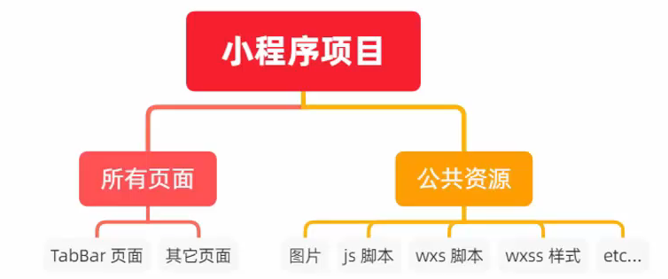


#### 1.3 - 分包后的项目构成

分包后，小程序项目由 <span style="color: #e3371e">一个主包 + 多个分包</span> 组成

-  <span style="color: #e3371e">主包</span>  - 一般包含项目的 <span style="color: #0099dd">启动页面</span> 或 <span style="color: #0099dd">Tabbar 页面</span> ，以及所有分包都需要用到的一些 <span style="color: #e3371e">公共资源</span> 
-  <span style="color: #e3371e">分包</span>  - 只包含当前分包有关的页面和私有资源

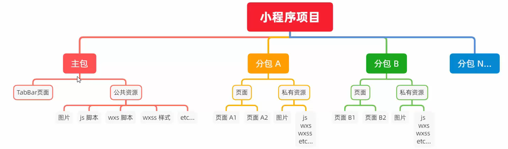

#### 1.4 - 分包的加载规则

- 小程序启动时，默认会 <span style="color: #e3371e">下载主包</span> 并 <span style="color: #e3371e">启动主包内页面</span> 
    - tabBar 页面需要放到主包中
- 当用户进入分包内某个页面时， <span style="color: #e3371e">客户端会把对应分包下载下来</span> ，下载后再进行展示
    - 非 tabBar 页面可以按照功能的不同，划分为不同的分包之后，进行按需下载


#### 1.5 - 分包的体积限制

目前，小程序分包的大小有限制

- 整个小程序所有分包大小不超过 <span style="color: #e3371e">20M</span> （主包 + 所有分包）
- 单个分包、主包大小不能超过 <span style="color: #e3371e">2M</span> 


### 2 - 使用分包

#### 2.1 - 配置方法

假设支持分包的小程序目录结构如下

```text
├── app.js
├── app.json
├── app.wxss
├── packageA		// 第一个分包
│   └── pages		// 第一个分包的所有页面
│       ├── cat
│       └── dog
├── packageB		// 第二个分包
│   └── pages		// 第二个分包的所有页面
│       ├── apple
│       └── banana
├── pages			// 主包的所有页面
│   ├── index
│   └── logs
└── utils
```

开发者通过在 app.json `subpackages` 字段声明项目分包结构

```json
{
  "pages":[
    "pages/index",
    "pages/logs"
  ],
  "subpackages": [			// 声明项目分包结构
    {
      "root": "packageA",	// 分包根目录
      "pages": [			// 当前分包下，所有页面的相对存放路径
        "pages/cat/cat",
        "pages/dog/dog"
      ]
    }, {
      "root": "packageB",
      "name": "pack2",		// 分包别名
      "pages": [
        "pages/apple/apple",
        "pages/banana/banana"
      ]
    }
  ]
}
```


#### 2.2 - 打包原则

- 声明 `subpackages` 后，将按 `subpackages` 配置路径进行打包，`subpackages` 配置路径外的目录将被打包到主包中
- 主包也可以有自己的 pages，即最外层的 pages 字段。
- `subpackage` 的根目录不能是另外一个 `subpackage` 内的子目录
- `tabBar` 页面必须在主包内


#### 2.3 - 引用原则

- 主包 <span style="color: #e3371e">无法引用</span> 分包内的私有资源
- 分包之间 <span style="color: #e3371e">不能相互引用</span> 私有资源
- 分包 <span style="color: #e3371e">可以 引用</span> 主包内的公共资源


### 3 - 独立分包

 <span style="color: #e3371e">独立分包</span> 是小程序中一种特殊类型的分包， <span style="color: #e3371e">可以独立于主包和其他分包运行</span> 

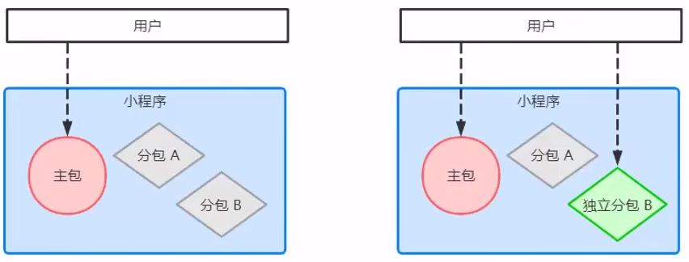

> 从独立分包中页面进入小程序时，不需要下载主包
>
> 独立分包不依赖主包即可运行，可以很大程度上提升分包页面的启动速度
>
> 一个小程序中可以有多个独立分包

#### 3.1 - 独立分包和普通分包的区别

最主要的区别： <span style="color: #e3371e">是否依赖于主包才能运行</span> 

- 普通分包必须依赖于主包才能运行
- 独立分包可以在不下载主包的情况下，独立运行


#### 3.2 - 独立分包的应用场景

可按需将 <span style="color: #e3371e">具有某些功能独立性的页面</span> 配置到 <span style="color: #0099dd">独立分包</span> 中

- 当小程序从普通的分包页面启动时，需首先下载主包
- 而独立分包 <span style="color: #e3371e">不依赖主包</span> 即可运行，可以 <span style="color: #e3371e">很大程度上提升分包页面的启动速度</span> 


#### 3.3 - 独立分包的配置方法

假设小程序目录结构如下

```text
├── app.js
├── app.json
├── app.wxss
├── moduleA				// 普通分包
│   └── pages
│       ├── rabbit
│       └── squirrel
├── moduleB				// 独立分包
│   └── pages
│       ├── pear
│       └── pineapple
├── pages				// 主包所有页面
│   ├── index
│   └── logs
└── utils
```

开发者通过在`app.json`的`subpackages`字段中对应的分包配置项中定义`independent`字段声明对应分包为独立分包

```json
{
  "pages": [
    "pages/index",
    "pages/logs"
  ],
  "subpackages": [
    {
      "root": "moduleA",
      "pages": [
        "pages/rabbit",
        "pages/squirrel"
      ]
    }, {
      "root": "moduleB",
      "pages": [
        "pages/pear",
        "pages/pineapple"
      ],
      "independent": true
    }
  ]
}
```


#### 3.4 - 独立分包的引用原则

独立分包和普通分包及主包之间，是 <span style="color: #e3371e">相互隔绝</span> 的， <span style="color: #e3371e">不能相互引用彼此的资源</span> 

- 主包 <span style="color: #e3371e">无法引用</span> 独立分包内的私有资源
- 独立分包之间， <span style="color: #e3371e">不能相互引用</span> 私有资源
- 独立分包和普通分包之间， <span style="color: #e3371e">不能相互引用</span> 私有资源
-  <span style="color: #e3371e; font-weight: bold">独立分包中也不能引用主包内的公共资源</span> 


### 4 - 分包预下载

 <span style="color: #e3371e">分包预下载</span> 指在进入小程序某个页面时， <span style="color: #e3371e">由框架自动预下载可能需要的分包</span> ，提升进入后续分包页面时的启动速度


#### 4.1 - 配置分包的预下载

预下载分包行为在进入某个页面时触发，通过在 `app.json` 增加 `preloadRule` 配置来控制

```json
{
  "pages": ["pages/index"],
  "subpackages": [
    {
      "root": "important",
      "pages": ["index"],
    },
    {
      "root": "sub1",
      "pages": ["index"],
    },
    {
      "name": "hello",
      "root": "path/to",
      "pages": ["index"]
    },
    {
      "root": "sub3",
      "pages": ["index"]
    },
    {
      "root": "indep",
      "pages": ["index"],
      "independent": true
    }
  ],
  "preloadRule": {				// 分包预下载规则
    "pages/index": {			// 触发分包预下载的页面路径
      "network": "all",			// 在指定网络模式下进行预下载，默认为 wifi
      "packages": ["important"]	// 设置预下载的分包，可通过 root 或 name 指定
    },
    "sub1/index": {
      "packages": ["hello", "sub3"]
    },
    "sub3/index": {
      "packages": ["path/to"]
    },
    "indep/index": {
      "packages": ["__APP__"]
    }
  }
}
```


#### 4.2 - 分包预下载的限制

同一个分包中的页面享有 <span style="color: #e3371e">共同的预下载大小限额 2M</span> ，限额会在工具中打包时校验

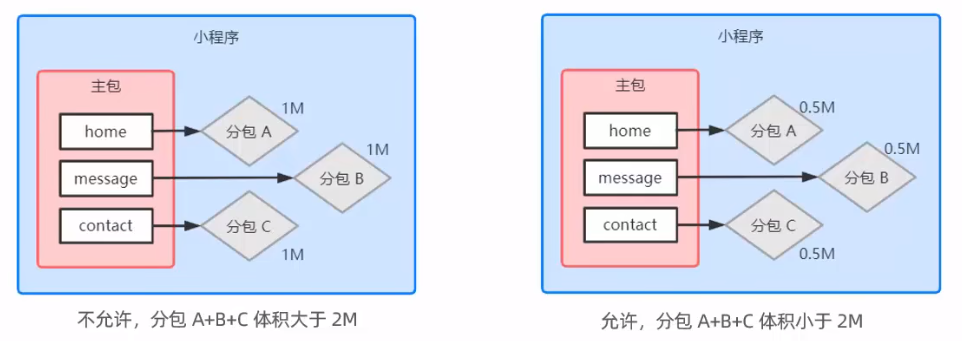