## 1 - 概述

Chrome DevTools 是一组直接内置在 Google Chrome 浏览器中的网页开发工具。DevTools 可以帮助您实时编辑页面并快速诊断问题，最终帮助您更快地构建更好的网站

### 1.1 - 打开 Devtool

- 目标 DOM 或 CSS 
    - `右键`网页，选择`检查`
    - 或者使用快捷键：`Ctrl+Shift+C`（Windows，Linux，ChromeOS）或 `Command+Option+C`（Mac）
- 目标 查看日志消息 或  运行  JavaScript  
    - 快捷键：`Ctrl+Shift+J`（Windows，Linux，ChromeOS）或 `Command+Option+J`（Mac）
- 打开上次打开的面板
    - 快捷键：`Ctrl+Shift+I` 或  `Command+Option+I` (Mac) 
- 从 Chrome 的主菜单打开 DevTools
    - 单击 Customize and control Google Chrome，然后选择 More Tools > Developer Tools
- 在每个新标签页上自动打开 DevTools
    - 从命令行打开 Chrome 并输入 `--auto-open-devtools-for-tabs`

### 1.2 - 探索 Devtool

> 在 DevTools 文档中，顶级选项卡（top-level tabs）称为面板（panels）

### 1.3 - 命令行与快捷键

#### 1.3.1 - 在命令菜单运行命令

- **打开命令菜单** 
    - `Control+Shift+P` or `Command+Shift+P` (Mac)
    - 点击右上角 自定义和控制 DevTools ，选择 运行命令 
- **查看其他可用操作**
    - 在命令菜单文本框前添加 `>` 字符
    - 在命令菜单文本框前添加 `?` 字符，查看命令菜单中其他可用操作

#### 1.3.2 - 禁用 JavaScript 

- 禁用 JavaScript 
    - 在命令菜单输入 `JavaScript` ，选择 Disable JavaScript ，按 `Enter` 运行命令
- 重新启用 JavaScript 
    - 在命令菜单输入 `JavaScript` ，选择 Enable JavaScript ，按 `Enter` 运行命令

#### 1.3.3 - 键盘快捷键

|       命令       |    Windows / Linux     |                  Mac                  |
| :--------------: | :--------------------: | :-----------------------------------: |
| 打开最后使用面板 | F12 or Control+Shift+I |           Command+Option+I            |
|  打开控制台面板  |    Control+Shift+J     |           Command+Option+J            |
|   打开元素面板   |    Control+Shift+C     | Command+Shift+C Command+Option+C |

## 2 - 设备模式（Device Mode）

使用设备模式可以近似地显示页面在移动设备上的外观和执行情况，实际上不会在移动设备上运行代码，即可模拟移动用户体验

- 模拟移动视窗
- 调节网络
- 节流CPU
- 模拟地理定位
- 设置方向

> 限制：由于移动设备 CPU 的体系机构与笔记本或台式CPU不同，无法模拟移动设备的某些方面
>
> ------
>
> 使用远程调试（Remote Debugging）可以在页面实际运行于移动设备时从笔记本电脑或桌面查看、更改、调试和分析页面代码

### 1 - 模拟移动视窗

 **1 - 响应式视窗模式** 

- 单击“切换设备工具栏”以打开允许您模拟移动视口的 UI

    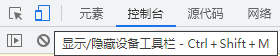

> 快捷键 Ctrl+Shift+M

- 默认情况下，设备工具栏以响应视窗模式打开

- 可通过多种方法调整视窗尺寸

    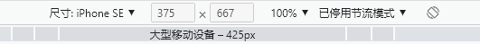

    - 选择移动设备型号
    - 手动输入尺寸
    - 点击下方分段灰条

 **1.1 - 显示媒体查询** 

- 若要在视窗上方显示媒体查询断点，单击“其他选项”，然后选择 "显示媒体查询"

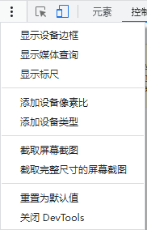

- 单击一个断点可以更改视区的宽度，以便触发该断点

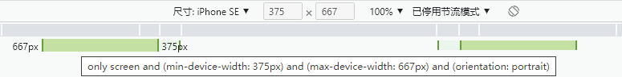

**1.2 - 设置设备类型** 

使用“设备类型”列表模拟移动设备或桌面设备

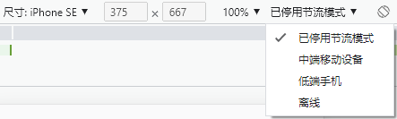

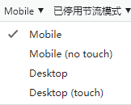

**选项说明**

- 渲染方法：Chorme 以 移动端口或桌面端口形式渲染页面
- 光标图标：鼠标悬停在页面上时看到的光标类型
- 事件触发：与页面交互时触发触摸事件还是单机事件

|       选项        | 渲染方式 | 光标图标 | 事件触发 |
| :---------------: | :------: | :------: | :------: |
|      Mobile       |  Mobile  |  Circle  |  touch   |
| Mobile (no touch) |  Mobile  |  Normal  |  click   |
|      Desktop      | Desktop  |  Normal  |  click   |
|  Desktop (touch)  | Desktop  |  Circle  |  touch   |

 **2 - 移动设备视窗模式** 

模拟特定移动设备的尺寸，可从“设备”列表中选择该设备

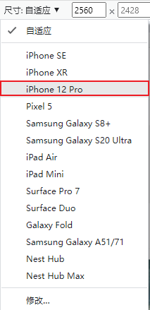

 **2.1 - 横向旋转视窗** 

单击“旋转”将视图旋转到横向方向

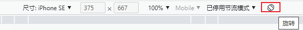

> 如果设备工具栏较窄，旋转按钮将消失

 **2.2 - 显示设备框架** 

打开“更多选项”，然后选择“显示设备框架”以显示视窗周围的物理设备框架

> 如果您没有看到特定设备的设备框架，这可能意味着 DevTools 没有针对该特定选项的艺术

 **2.3 - 添加自定义移动设备** 

单击“设备”列表，然后选择“修改”，单击“添加自定义设备”，输入设备的名称、宽度和高度。

设备像素比率、用户代理字符串和设备类型字段是可选的。设备类型字段是默认设置为 Mobile 的列表

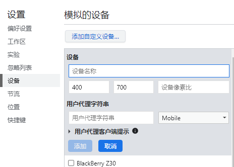

 **3 - 显示标尺** 

单击“其他选项”，然后选择“显示标尺以查看视图上方和左侧的标尺”。

尺子的尺寸单位是像素

 **4 - 放大视窗** 

使用缩放列表放大或缩小

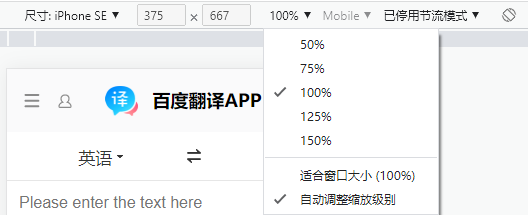

### 2 - 网络和CPU节流

> 节流是相对于您的笔记本电脑或台式机的正常功能

从“节流”列表中选择“中间层移动设备”或“低端移动设备”，以节流网络和 CPU

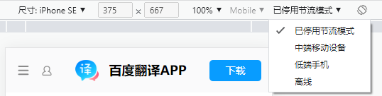

- 中端移动模拟快速3G， 且 CPU 速度是正常的 1/4
- 中端移动模拟快速3G ，且 CPU 速度时正常的 1/6

> 如果设备工具栏较窄，则节流列表将被隐藏

 **2.1 - 仅节流 CPU** 

若仅限制 CPU 而不限制网络，转到 Performance 面板，单击 Capture Settings，然后从 CPU 列表中选择4倍减速或6倍减速

 **2.2 - 仅节流 网络** 

若仅限制网络而不限制 CPU，

- 去网络面板，并从节流列表选择快速3G 或慢3G 
- 或从 Performance 面板设置网络节流，从“网络”列表中选择“快速3G”或“慢速3G”
- 或打开 Command 菜单（Ctrl+Shift+P），键入3G，选择 Enable fast 3G 限流或者 Enable slow 3G 限流

### 3 - 覆盖地理定位

要打开覆盖地理位置的 UI，

- 打开传感器
    - 请单击 Customize and control DevTools，然后选择 `更多工具` > `传感器`（ **Sensors**）
    - 或打开 Command 菜单（Ctrl+Shift+P），键入传感器，选择显示传感器
- 从 Location 列表中选择一个预设置，或选择 Other... 以输入您自己的坐标，或选择 Location not 以测试当地理定位处于错误状态时页面的行为

### 4 - 设定方向

要打开方向 UI，

- 打开传感器
- 从“方向”列表中选择一个预置，或选择“自定义方向”来设置自己的 alpha、 beta 和 γ 值

## 3 - 元素面板

***

- HTML 和 DOM 的区别
    - HTML 表示初始页面内容，DOM 表示当前页面内容（可使用 js 动态改变）

***

### 1 - 查看 DOM 节点

 **1 - 检查节点** 

- 网页中选中文本 -> 右键`检查`
- 打开元素面板 -> 左上角箭头图标 -> 点击网页元素

 **2 - 使用键盘浏览 DOM 树** 

一旦在 DOM 树中选择了一个节点，就可以使用键盘在 DOM 树中导航

 **3 - 滚动至视图** 

查看 DOM 树时，可通过选择元素 -> 右键 -> 滚动至视图范围内 定位到选定的元素（当它不在视窗内）

 **4 - 显示标尺** 

使用视窗上方和左侧的标尺，可以在“元素”面板中将鼠标悬停在某个元素上时测量该元素的宽度和高度

**启用标尺的方式**：

- 按 Control + Shift + P 或 Command + Shift + P (Mac)打开“命令”菜单，键入 `Show rulers on hover` ，然后按 Enter
- 设置 > 首选项 > 元素 > 在鼠标指针悬停时显示尺子

 **5 - 搜索节点** 

可通过 字符串 、  CSS 选择器 或  XPath  选择器搜索 DOM 树

- 将光标集中在“元素”面板上
- 按 Control + F 或 Command + F (Mac)。搜索栏在 DOM 树的底部打开
- 输入查询

### 2 - 编辑 DOM

 **1 - 编辑内容** 

双击 DOM 树中的文本内容，即可删除并重新编辑

 **2 - 编辑属性** 

双击选定元素，即可在后面添加属性

 **3 - 编辑节点类型** 

双击选定元素，删除原有元素类型，可重新编辑元素类型

 **4 - 重新排序 DOM 节点** 

拖动节点以重新排序它们

 **5 - 强制执行状态** 

通过`右键`选择`强制执行状态`，可以使 DOM 节点强制保持如下状态：

- `:active`
- `:hover`
- `:focus`
- `:visited`
- `:focus-within`
- `:focus-visible`

 **6 - 隐藏节点** 

按 `H` 隐藏节点

- 右键检查元素
- 按 `H` 隐藏节点
- 再次按 `H` ，可再次显示

 **7 - 删除节点** 

按 `Delete` 删除节点

- 右键检查元素
- 按 `Delete` 删除节点
- 按 `Control + Z` 或 Command + Z (Mac)，可撤销最后一个操作，节点重新出现

### 3 - 控制台访问节点

DevTools 提供了一些从控制台访问 DOM 节点或获取对它们的 JavaScript 引用的快捷方式

 **1 - 使用 $0引用当前选定的节点** 

检查一个节点时，节点旁边的 = = $0文本意味着您可以使用变量 $0在控制台中引用这个节点

- 右键检查元素
- 按 `Escape` 键打开控制台抽屉
- 键入 `$0` 并按 Enter 键，即可引用该节点
- 将鼠标悬停在结果上。该节点在 视窗 中突出显示

 **2 - 存储在全局变量** 

如需多次引用某个节点，可将其存储为全局变量

- 右键检查元素
- 右键选择`存储为全局变量` 
- 在控制台中键入 temp1，然后按 Enter。表达式的结果显示变量计算结果为节点

 **3 - 复制 JS 路径** 

 **7 - 删除节点** 

 **7 - 删除节点** 

### 4 - 中断 DOM 的改变

DevTools 允许在 JavaScript 修改 DOM 时使用 `DOM 更新断点` 暂停页面的 JavaScript

设置DOM 更新断点

- 单击“元素”选项卡
- 转到要在其上设置断点的元素
- 右键单击元素
- 悬停在“中断”上，然后选择子树修改、属性修改或删除节点