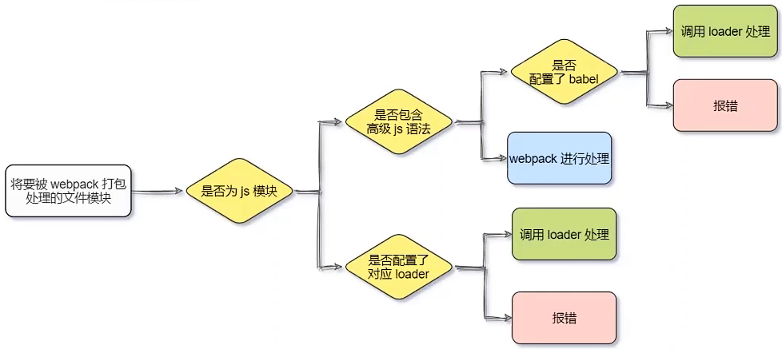

## 前端工程化与 webpack

### 1 - 前端工程化

#### 1.1 - 实际的前端开发

-  <span style="color: #e3371e">模块化</span> ：js 的模块化、css 的模块化、 资源的模块化
-  <span style="color: #e3371e">组件化</span> ：复用现有的 UI 结构、样式、行为
-  <span style="color: #e3371e">规范化</span> ：目录结构的划分、编码结构化、接口规范化、文档规范化、git 分支管理
-  <span style="color: #e3371e">自动化</span> ：自动化构建、自动部署、自动化测试

#### 1.2 - 前端工程化

在 <span style="color: #e3371e">企业级的前端项目开发</span> 中，把前端开发所需的 <span style="color: #e3371e">工具、技术、流程、经验</span> 等进行 <span style="color: #0099dd">规范化、标准化</span> 

企业级的 Vue 项目和 React 项目，都是基于 <span style="color: #e3371e">工程化的方式</span> 进行开发的

前端开发 <span style="color: #e3371e">自成体系</span> ，有一套 <span style="color: #e3371e">标准的开发方案和流程</span> 

#### 1.3 - 前端工程化的解决方案

##### 1.3.1 - 早期前端工程化方案

-  <span style="color: #e3371e">[grunt](https://www.gruntjs.net/)</span> 
-  <span style="color: #e3371e">[gulp](https://www.gulpjs.com.cn/)</span>

##### 1.3.2 - 目前主流前端工程化方案

-  <span style="color: #e3371e">[webpack](https://www.webpackjs.com/)</span> 
-  <span style="color: #e3371e">[parcel](https://zh.parceljs.org/)</span> 

### 2 - webpack 的基本使用

概念：webpack 是 <span style="color: #e3371e">前端项目工程化的具体解决方案</span> 

好处：把 <span style="color: #e3371e">工作重心</span> 放到具体功能的实现上，提高前端 <span style="color: #e3371e">开发效率</span> 和项目的 <span style="color: #e3371e">可维护性</span> 

主要功能：

- 友好的 <span style="color: #e3371e">前端模块化开发支持</span> 
-  <span style="color: #e3371e">代码压缩混淆</span> 
-  <span style="color: #e3371e">处理浏览器端  JavaScript  的兼容性</span> 
-  <span style="color: #e3371e">性能优化</span> 
- ……

#### 2.1 - 项目中安装 webpack

```sh
cnpm i webpack webpack-cli -D
```

- -S ：--save 的简写，运行依赖
- -D ：--save-dev 的简写，开发依赖
- webpack：打包工具的核心代码
- webpacl-cli：命令行工具，可使用命令行使用webpack

#### 2.2 - 项目中配置 webpack

- 项目根目录中，创建名为 `webpack.config.js` 的 webpack 配置文件，并初始化如下的基本配置

    - 开发时选 development ，打包速度快
    - 发布上线改成 production ，体积小

    ```javascript
    // 使用 node.js 中的导出语法，向外导出一个 webpack 的配置对象
    module.exports = {
        mode: 'development'     // mode 用来指定构建模式，可选值： development  和 production
    }
    ```

- 在 package.json 的 scripts 节点下。新增 `dev 脚本` 如下

    ```json
    "scripts": {
        "dev": "webpack"  // script 节点下的脚本，可通过 npm run 执行，例如 npm run dev
      },
    ```

- 在终端中运行 `npm run dev` 命令，启动 webpack 进行项目的打包构建

#### 2.3 - webpack 中的默认约定

在 webpack 4.x 和 5.x 的版本中， <span style="color: #e3371e">默认约定</span> ：

- 默认的打包入口文件为  <span style="color: #0099dd">src -> index.js</span> 
- 默认的输出文件路径为 <span style="color: #0099dd">dist -> main.js</span> 

注意：可以在  <span style="color: #e3371e">webpack.config.js</span> 修改打包的默认约定

#### 2.4 - 自定义打包入口与出口

在 webpack.config.js 配置文件中，通过  <span style="color: #e3371e">entry 节点</span> 指定 <span style="color: #e3371e">打包的入口</span> ，通过 <span style="color: #e3371e">output 节点</span> 指定 <span style="color: #e3371e">打包的出口</span> 

```javascript
// 导入 node.js 中专门操作路径的模块
const path = require('path')

module.exports = {
    mode: 'development',
    // 设置打包入口文件的路径
    // ** __dirname 指此文件当前存放路径名
    entry: path.join(__dirname, './src/index1.js'),
    output: {
        // 设置输出文件存放路径
        path: path.join(__dirname, './dist'),
        // 设置输出文件名称
        filename: 'bundle.js'
    }
}
```

### 3 - webpack 中的插件

#### 3.1 - webpack 插件的作用

安装配置第三方插件，可 <span style="color: #e3371e">拓展 webpack 的能力</span> ，从而使 webpack  <span style="color: #e3371e">使用更方便</span> 

最常用的两个插件：

-  <span style="color: #e3371e">webpack-dev-server</span> 
    -  <span style="color: #0099dd">源代码修改</span> ，webpack 会 <span style="color: #0099dd">自动</span> 进行项目的 <span style="color: #0099dd">打包与构建</span> 
    - 类似于 node.js 阶段用到的 nodemon 工具
-  <span style="color: #e3371e">html-webpack-plugin</span> 
    - 可通过此插件 <span style="color: #0099dd">自定制 index.html</span> 页面的内容
    - webpack 中的 HTML 插件（类似于一个模版引擎插件）
    -  <span style="color: #e3371e">插件特性</span> ：
        - 通过 HTML 插件复制到项目根目录中的 index.html  <span style="color: #0099dd">也被放到了内存中</span> 
        - HTML 插件在生成的 index.html  <span style="color: #0099dd">页面</span> ， <span style="color: #0099dd">自动注入</span> 了打包的 bundle.js 文件

#### 3.2 - webpack-dev-server

-  <span style="color: #e3371e">安装插件</span> 

    ```sh
    npm install webpack-dev-server -D
    ```

-  <span style="color: #e3371e">配置插件</span> 

    - 修改 `package.json` -> `script` 中的 <span style="color: #e3371e">dev</span> 命令

        ```json
        "scripts": {
          "test": "echo \"Error: no test specified\" && exit 1",
          "dev": "webpack serve" // script 节点下的脚本，可以通过 npm run 执行
        }
        ```

    - 再次运行 `npm run dev` 命令，重新进行项目的打包

        - 出现 `Cannot Get/`，在webpack.config.js下做如下修改
    
            ```javascript
            module.exports = {
            	mode: 'development', //mode用来指定构建模式，可选值有development和production
                //加入下面这段告知 webpack-dev-server，将 './' 目录下的文件 serve 到 localhost:8080 下(寄存到服务器下)
            	devServer: {
            		static: "./"
            	}
            }
            ```
    
    - 在浏览器访问 `http://localhost:8080` 地址，查看自动打包效果


注意：webpack-dev-server 会自动启动一个 <span style="color: #e3371e">实时打包的 http 服务器</span> 

#### 3.3 - html-webpack-plugin

- <span style="color: #e3371e">安装插件</span> 

    ```sh
    npm install html-webpack-plugin -D
    ```

- <span style="color: #e3371e">配置插件</span> 

    ```javascript
    // 导入 HTML 插件，得到一个构造函数
    const HtmlPlugin = require('html-webpack-plugin')
    
    // 创建 HTML 插件的实例对象
    const HtmlPlugin = new HtmlPlugin({
        template: './src/index.html',   //  指定原文件的存放路径
        filename: './index.html'   		// 指定生成文件的存放路径
    })
    
    module.exports = {
        mode: 'development',
        plugins: [htmlPlugin],  // 通过 plugins 节点，使 htmlPlugin 插件生效  
    }
    ```

#### 3.4 - 配置文件

- webpack.config.js

    ```javascript
    // 导入 node.js 中专门操作路径的模块
    const path = require('path')
    // 导入 HTML 插件，得到一个构造函数
    const HtmlPlugin = require('html-webpack-plugin')
    // 创建 HTML 插件的实例对象
    const htmlPlugin = new HtmlPlugin({
        template: './src/index.html', //  指定原文件的存放路径
        filename: './index.html', // 指定生成文件的存放路径
    })
    
    module.exports = {
        mode: 'development',
        devServer: {
            static: './',
        },
        // 设置打包入口文件的路径
        // ** __dirname 指此文件当前存放路径名
        entry: path.join(__dirname, './src/index.js'),
        output: {
            // 设置输出文件存放路径
            path: path.join(__dirname, './dist'),
            // 设置输出文件名称
            filename: 'bundle.js',
        },
        plugins: [htmlPlugin], // 通过 plugins 节点，使 htmlPlugin 插件生效
    }
    
    ```

- package.json

    ```json
    {
        "name": "01-change-rows-color",
        "version": "1.0.0",
        "description": "",
        "main": "index.js",
        "scripts": {
            "test": "echo \"Error: no test specified\" && exit 1",
            "dev": "webpack serve"
        },
        "keywords": [],
        "author": "",
        "license": "ISC",
        "dependencies": {
            "jquery": "^3.6.0"
        },
        "devDependencies": {
            "html-webpack-plugin": "^5.5.0",
            "webpack": "^5.72.1",
            "webpack-cli": "^4.9.2",
            "webpack-dev-server": "^4.9.1"
        }
    }
    ```

#### 3.5 - 配置文件中的 devServe 节点

在 webpack.config.js 配置文件中，可通过 <span style="color: #e3371e">devServe 节点</span> 对 webpack-dev-server 插件进行更多的配置

```javascript
devServer: {
	open: true,			// 初次打包完成后，自动打开浏览器
	host: '127.0.0.1',	// 实时打包所使用的主机地址
	port: 80,			// 实时打包所使用的端口号
}
```


注意：凡是修改了 webpack.config.js 配置文件，或修改了 package.json 配置文件， <span style="color: #e3371e">必须重启实时打包的服务器</span> ，否则最新的配置文件无法生效

### 4- webpack 中的 loader

实际开发中，webpack 默认只能打包处理以 <span style="color: #e3371e">.js</span> 结尾的模块， <span style="color: #e3371e">默认无法处理</span>  <span style="color: #e3371e">非 .js 后缀名结尾的模块</span> ，需要调用 <span style="color: #e3371e">loader 加载器</span> 才可以正常打包，否则会报错

loader 加载器的作用： <span style="color: #ab04d9">协助 webpack 打包处理特定的文件模块</span> 。比如：

- css-loader	- 可以打包处理 .css 相关文件
- less-loader	- 可以打包处理 .less 相关文件
- baber-loader	- 可以打包处理 webpack 无法处理的高级 js 语法

#### 4.1 - loader 加载其的调用过程



#### 4.2 - 打包处理 css 文件

- 安装处理 css 文件的 loader

    ```sh
    npm i style-loader css-loader -D
    ```

- 在 webpack.config.js 的 `module` -> `rules` 数组中，添加 loader 规则

    ```javascript
        module: {   // 所有第三方文件模块的匹配规则
            rules: [    // 文件后缀名的匹配规则
                {test:/\.css$/, use: ['style-loader', 'css-loader']}
            ]
        }
    ```

    其中， <span style="color: #e3371e">test</span> 表示匹配的 <span style="color: #e3371e">文件类型</span> ， <span style="color: #e3371e">use</span> 表示对应 <span style="color: #e3371e">要调用的 loader </span> 

    - 注意：
        - use 数组中指定的 loader  <span style="color: #e3371e">顺序是固定的</span> 
        - 多个 loader 的调用顺序时：<span style="color: #e3371e">从后往前调用</span> 

- 重新打包

    ```sh
    npm run dev
    ```

#### 4.3 - 打包处理 less 文件

- 安装处理 less 文件的 loader

    ```sh
    npm i less-loader less -D
    ```

- 在 webpack.config.js 的 `module` -> `rules` 数组中，添加 loader 规则

    ```
        module: {   // 所有第三方文件模块的匹配规则
            rules: [    // 文件后缀名的匹配规则
                {test:/\.css$/, use: ['style-loader', 'css-loader', 'less-loader']}
            ]
        }
    ```

- 重新打包

    ```sh
    npm run dev
    ```

#### 4.4 - 打包处理样式表中与 url 路径相关的文件

- 安装相关loader

    ```sh
    npm i url-loader file-loader -D
    ```

- 在 webpack.config.js 的 `module` -> `rules` 数组中，添加 loader 规则

    ```javascript
        module: {
            // 所有第三方文件模块的匹配规则
            rules: [
                // 调用的 loder 仅一个，可以只传一个字符串；多个 loader，则必须指定数组
                { test: /\.jpg|png|gif$/, use: ['url-loader?limit=22229'] },
            ],
        }
    ```

    其中 <span style="color: #e3371e">?</span> 之后的时 <span style="color: #e3371e">loader 的参数项</span> ：

    - limit 用来指定 <span style="color: #0099dd">图片的大小</span> ，单位时字节（byte）
    - 只有 <span style="color: #0099dd">≤</span> limit 大小的图片，才会被转为 base64 格式的图片

- 重新打包

#### 4.5 - 打包处理 js 文件中的高级语法（未成功）

webpack 只能打包处理 <span style="color: #e3371e">一部分</span> 高级的 JavaScript 语法。

对于无法处理的高级  JavaScript 语法，需借助 <span style="color: #e3371e">babel-loader</span> 进行打包处理

- 安装 babel-loader

    ```sh
    npm i babel-loader @babel/core @babel/plugin-proposal-decorators -D
    npm i babel-loader@8.2.2 @babel/core@7.14.6 @babel/plugin-proposal-decorators@7.14.5 -D
    ```

- 在 webpack.config.js 的 `module` -> `rules` 数组中，添加 loader 规则

    ```javascript
        module: {
            // 所有第三方文件模块的匹配规则
            rules: [
                // 使用 babel-loader 处理高级的 js 语法
                // 配置 babel-loader 时，排除第三方包
                { test: /\.js$/, use: 'babel-loader', exclude: /node_modules/ },
            ],
        }
    ```

- 在项目根目录下，创建名为 `babel.config.js` 的配置文件，定义 <span style="color: #e3371e">babel 的配置项</span> ：

    ```js
    module.exports = {
    	// 声明 babel 可用的插件
        // 将来，webpack 在调用 babel-loader 的时候，会先加载 plugins 插件来使用
    	plugins: [['@babel/plugin-proposal-decorators', { legacy: true }]]
    }
    ```

    [babel 中文官网](https://www.babeljs.cn/docs/)

- 重新打包

### 5 - 打包发布

#### 5.1 - 为什么要打包发布

 <span style="color: #e3371e">项目开发完成后</span> ，需要使用 webpack <span style="color: #e3371e">对项目进行打包发布</span> ，主要原因有以下两点：

- 开发环境下，打包生成的文件 <span style="color: #0099dd">存放于内存中</span> ，无法获取到最终打包生成的文件
- 开发环境下，打包生成的文件 <span style="color: #0099dd">不会进行代码压缩和性能能优化</span> 

 <span style="color: #e3371e">为使项目能够在生产环境中最高性能的运行</span> ，因此需要对项目进行打包发布

#### 5.2 - 配置 webpack 的打包发布

在 `package.json` 文件的 <span style="color: #e3371e">scripts 节点</span> 下，新增 <span style="color: #e3371e">build</span> 命令：

```json
    "scripts": {
        "test": "echo \"Error: no test specified\" && exit 1",
        "dev": "webpack serve",	// 开发环境中，运行 dev 命令
        "build": "webpack --mode production"	// 项目发布时，运行 build 命令
    },
```

-  <span style="color: #e3371e">--mode</span> 是一个参数项，用来指定 webpack 的 <span style="color: #e3371e">运行模式</span> 
    - production 代表生产环境，会对打包生成的文件进行 <span style="color: #0099dd">代码压缩</span> 和 <span style="color: #0099dd">性能优化</span> 
    - 通过 --mode 指定的参数项，会 <span style="color: #0099dd">覆盖</span> webpack.config.js 中的 model 选项

#### 5.3 - 把 JavaScript 文件统一生成到 js 目录中

在 <span style="color: #e3371e">webpack.config.js</span> 配置文件的 <span style="color: #e3371e">output 节点</span> 中，进行如下配置：

```js
    output: {
        // 设置输出文件存放路径
        path: path.join(__dirname, './dist'),
        // 设置输出文件名称
        filename: 'js/bundle.js',
    },
```

#### 5.4 - 把图片文件统一生成到 image 目录中

在 <span style="color: #e3371e">webpack.config.js</span> 配置文件的 <span style="color: #e3371e">url-loader 配置项</span> 中，新增 <span style="color: #e3371e">outputPath 选项</span> 即可指定图片文件的输出路径：

```js
{
    test: /\.jpg|png|gif$/,
    use: {
        loader: 'url-loader',
        options: {
            limit: 22228,
            // 明确指定把打包生成的图片文件，存储到 dist 目录下的 image 文件夹中
            outputPath: 'images',
        },
    },
},
```

或（更推荐↓）

```js
// 配置 url-loader 时，多个参数之间，使用 & 分隔
{ test: /\.jpg|png|gif$/, use: 'url-loader?limit=22228&outputPath=images' },
```

#### 5.5 - clean-webpack-plugin

为在每次打包发布时 <span style="color: #e3371e">自动清理 dist 目录下的旧文件</span> ，可安装配置 <span style="color: #e3371e">clean-webpack-plugin</span> 插件

- 安装插件

```sh
npm install clean-webpack-plugin --save-dev 
```

- 在 `webpack.config.js` 中导入插件

```js
// 导入 clean-webpack-plugin 插件
const { CleanWebpackPlugin } = require('clean-webpack-plugin')
const cleanPlugin = new CleanWebpackPlugin()
```

- 在 `module.exports` 的 `plugins 节点` 下

```js
plugins: [htmlPlugin, cleanPlugin], // 通过 plugins 节点，使 htmlPlugin 插件生效
```

### 6 - Source Map

 <span style="color: #e3371e">Source Map</span> 就是一个 <span style="color: #e3371e">信息文件</span> ，里面存储这 <span style="color: #e3371e">位置信息</span> 。存储着压缩混淆后的代码对应的 <span style="color: #e3371e">转换前的位置</span> 。

有了它，代码报错时，除错工具将 <span style="color: #e3371e">直接显示原始代码，而非转化后的代码</span> ，极大地方便后期调试。

#### 6.1 - 默认 Source Map 的问题

开发环境下默认生成的 Source Map，记录的时 <span style="color: #e3371e">生成后的代码位置</span> ，导致 <span style="color: #e3371e">运行时报错的行数</span> 与 <span style="color: #e3371e">源代码的行数</span> <span style="color: #ab04d9">不一致</span> 的问题

#### 6.2 - 解决默认 Source Map 的问题

开发环境中，在 `webpack.config.js` 中添加如下配置，可保证 <span style="color: #e3371e">运行时报错的行数</span> 与 <span style="color: #e3371e">源代码的行数</span> <span style="color: #ab04d9">一致</span> ：

```js
module.exports = {
    mode: 'development',
    // eval-soirce-map仅限在“开发模式”下使用，不建议在“生产模式”下使用
    // 此选项生成的 Source Map 能够保证“运行时报错的行数”与“源代码的行数”保持一致
    devtool: 'eval-source-map',
    // 其他配置项……
}    
```

- 开发调试阶段，建议将 devtool 的值设为： eval-source-map
-  <span style="color: #0099dd">生产环境</span> 下，建议 <span style="color: #0099dd">省略 devtool 选项</span> ，最终生成文件中不包含 Source Map，可 <span style="color: #0099dd">防止源代码</span> 通过 Source Map 的形式 <span style="color: #0099dd">暴露</span> 给别有所图之人
-  <span style="color: #0099dd">生成环境</span> 下，只想 <span style="color: #0099dd">定位报错的具体行数</span> ，且 <span style="color: #0099dd">不想暴露源码</span> 。可将 devtool 的值设为： nosources-source-map
-  <span style="color: #0099dd">生产环境</span> 下，想 <span style="color: #0099dd">定位报错行数的同时</span> ， <span style="color: #0099dd">展示具体报错的源码</span> 。可将 devtool 的值设为： source-map

#### 6.3 - 最佳实践

- 开发环境
    - devtool 的值设为 <span style="color: #e3371e">eval-source-map</span> 
    - 好处：可精确定位到具体错误行
- 生产环境
    -  <span style="color: #e3371e">关闭 Source Map</span>  <span style="color: #0099dd">或</span> 将 devtool 的值设为 <span style="color: #e3371e">nosources-source-map</span> 
    - 好处：防止源码泄露，提高网站的安全性

### 7 - 实际开发

- 无需自己配置 webpack
- 实际开发使用命令行工具（ <span style="color: #e3371e">CLI</span> ） <span style="color: #e3371e">一键生成</span> 所有 webpack 的项目
- 开箱即用，程序员只需知道 webpack 中的基本概念即可

### 拓展

#### 1 - webpack 中 @ 的原理和好处

表示文件路径时，建议使用 <span style="color: #e3371e">@</span> 代表  <span style="color: #0099dd">src 源代码目录</span> ，从外往里查找

```
​```
src
├ css
├ images
├ js
│ └ test
│	└ info.js
│ index.html
│ index.js
│ msg.js
└ another
​```
```

```js
// info.js 文件中
// import msg from '../../msg.js'
import msg form '@/msg.js'
```

##### 1.1 - 配置 @

在 `webpack.config.js` 中  <span style="color: #e3371e">resolve 节点</span> 

```js
resolve: {
	alias: {
        // 告诉 webpack，@ 符号代表 src 这一层目录
		'@': path.join(__dirname, './src/')
	}
}
```

